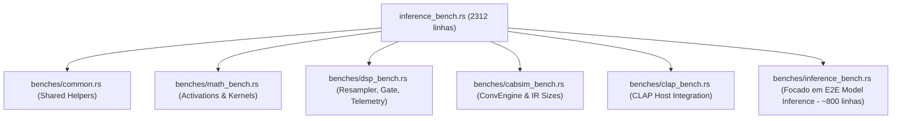

<!--
SPDX-License-Identifier: Apache-2.0
Copyright (c) 2026 Fábio Henrique de Lima Silva (fhl.bsb@gmail.com) All rights reserved.
-->

# TODO-findings: Auditoria e Refatoração Estrutural do Diretório `/benches`

Este documento apresenta uma análise criteriosa e detalhada da organização dos benchmarks do projeto `nam-rs`, com foco na modularização do monolito `benches/inference_bench.rs` e no alinhamento com a infraestrutura de testes (`utils/tests-quick.sh` e `utils/tests-long.sh`).

---

## 1. Diagnóstico Geral do Diretório `/benches`

Atualmente, o diretório `/benches` contém 8 arquivos. Eles se dividem conceitualmente em três categorias:

1. **Benchmarks de Regressão e Stress Periódicos (Ativos)**:
   - [regression_gate.rs](file:///home/fabio/nam-rs/benches/regression_gate.rs): Portão leve de regressão estatística em CI. Executado via `utils/tests-performance-regression.sh`.
   - [long_inference_bench.rs](file:///home/fabio/nam-rs/benches/long_inference_bench.rs): Teste de stress/thermal throttling de longa duração (35 segundos). Executado via `utils/tests-long.sh` sob a feature `long_bench`.
   - [dot_4x_bench.rs](file:///home/fabio/nam-rs/benches/dot_4x_bench.rs): Medições de throughput de kernels SIMD (`dot_4x` e variantes AVX2/AVX-512).
   - [kahan_conv1d_bench.rs](file:///home/fabio/nam-rs/benches/kahan_conv1d_bench.rs): Avalia o impacto da soma de Kahan no laço interno de convolução.

2. **Artefatos de Pesquisa (Históricos/Inativos em CI)**:
   - [fft_radix4_bench.rs](file:///home/fabio/nam-rs/benches/fft_radix4_bench.rs): Compara Radix-2 vs Radix-4 para justificar a escolha algorítmica do projeto.
   - [gemv_bench.rs](file:///home/fabio/nam-rs/benches/gemv_bench.rs): Compara GEMV genérico vs desenrolado.
   - [linear.rs](file:///home/fabio/nam-rs/benches/linear.rs): Valida o limiar de transição entre Convolução Direta e FFT (`FFT_AUTO_THRESHOLD = 256`).
   *Nota: Estes três arquivos são cruciais para a governança e reprodutibilidade científica do projeto. Eles estão corretamente excluídos dos scripts automáticos de CI/noite.*

3. **O Monolito Multifuncional**:
   - [inference_bench.rs](file:///home/fabio/nam-rs/benches/inference_bench.rs): Contém **2312 linhas** e agrupa medições de variados domínios de forma acoplada.

---

## 2. Análise Crítica de `benches/inference_bench.rs`

O arquivo [inference_bench.rs](file:///home/fabio/nam-rs/benches/inference_bench.rs) viola o princípio de atomicidade e modularidade definido nas diretrizes de refatoração do Rust (`refatora-rust`):

### Problemas Identificados

- **Acoplamento de Domínios**: Mistura ativações matemáticas puras (Tanh, Sigmoid em AVX2/AVX-512), infraestrutura DSP (Resampler, Gate FSM, histograma de telemetria), motores de convolução CabSim, testes de modelos fim-a-fim (WaveNet, LSTM, A2, ConvNet, Linear) e mocks de integração CLAP.
- **Sobrecarga de Compilação**: Como o arquivo importa quase todo o ecossistema do motor (`nam-rs::loader`, `nam-rs::models`, `nam-rs::math`, `clack-host`, etc.), qualquer mudança simples em qualquer parte da biblioteca força a recompilação desse gigantesco binário de benchmark.
- **Duplicação de Código (Helper Cruft)**: Funções auxiliares como `generate_sine_440hz` e inicializadores sintéticos de dados de modelo (ex: `make_lstm_data`) estão duplicadas entre `inference_bench.rs`, `regression_gate.rs` e `long_inference_bench.rs`.
- **Dificuldade de Manutenção**: Localizar regressões de performance específicas a um componente (como CabSim ou Gate FSM) torna-se difícil quando o benchmark está afogado em 2300 linhas de código misto.

---

## 3. Proposta de Fracionamento Lógico de `inference_bench.rs`

Para tornar a suite atômica, modular e legível, propõe-se fracionar o arquivo monolítico em componentes especializados, mantendo apenas a inferência de modelos fim-a-fim no arquivo original para compatibilidade de nomenclatura.

### Detalhamento das Novas Unidades Atômicas

1. **[NEW] `benches/common.rs` (Módulo de Utilitários Compartilhados)**:
   - Reunir `generate_sine_440hz`, `make_lstm_data`, `make_wavenet_dyn_data`, `make_wavenet_a2_dyn_data` e o resolvedor de caminhos de fixtures (`model_path`).
   - Evita a duplicação crônica em `inference_bench.rs`, `regression_gate.rs` e `long_inference_bench.rs`.

2. **[NEW] `benches/math_bench.rs` (Kernels Matemáticos)**:
   - Agrupar benchmarks de ativações: Tanh/Sigmoid (escalar, AVX2 e AVX-512) usando os esquemas Padé e polinomiais.
   - Incluir benchmarks de `dot_product` genéricos (AVX2 256/64).

3. **[NEW] `benches/dsp_bench.rs` (Blocos DSP Auxiliares)**:
   - Benchmarks do `NamResampler` (44.1k->48k, 96k->48k e bypass).
   - Benchmark do `Gate FSM` (detecção e atuação de envelope de ruído).
   - Benchmark da telemetria (`LatencyHistogram::record`).

4. **[NEW] `benches/cabsim_bench.rs` (Auditoria CabSim)**:
   - Convoluções de IR de diferentes tamanhos (Short, Medium, Long) e tamanhos de blocos (64 e 256 amostras).
   - Custo de alocação/construção offline do `ConvEngine`.

5. **[NEW] `benches/clap_bench.rs` (Mapeamento de Host de Áudio)**:
   - Contém `bench_clap_process_block_64samp`, isolado sob a feature `clap-plugin`.

6. **[MODIFY] `benches/inference_bench.rs` (Apenas Inferência E2E - Reduzido)**:
   - Focar estritamente nas arquiteturas de redes neurais completas: WaveNet (Standard, Dynamic, comparativos), LSTM (1x8, 2x16, 1x40, 2x24, Dynamic), A2 (Full, Lite, Head, comparativos), ConvNet e Linear.
   - Redução estimada: de **2312 linhas para ~800 linhas**.

---

## 4. Alinhamento com Scripts de QA (`tests-quick.sh` e `tests-long.sh`)

A execução dos benchmarks deve ser rigidamente integrada ao ciclo de vida de QA definido em `testing.md`:

- `tests-quick.sh`: Não executa nenhum benchmark (correto por design).
- `tests-performance-regression.sh`: Executa apenas `regression_gate.rs` contra baseline estatística (correto por design).
- `tests-long.sh`: Executa a suite completa em fase de auditoria pré-lançamento.
  - **Ação Obrigatória na Refatoração**: Adicionar os novos alvos de benchmark (`math_bench`, `dsp_bench`, `cabsim_bench` e `clap_bench`) na Fase 6 do script `utils/tests-long.sh`.

---

## 5. Proposta de Solução (Sprints / Épicos)

Abaixo estão definidos os Épicos sugeridos para realizar a transição segura e sem regressões na suite de benchmarks do projeto.

### Épico 1: Consolidação de Infraestrutura Compartilhada

- **Objetivo**: Eliminar código duplicado.
- **Passos**:
  - Criar um módulo interno compartilhado para os benchmarks (ex: `benches/common/mod.rs` ou `src/testing/bench_helpers.rs` se exposto via feature `testing`).
  - Migrar funções de geração de sinais sintéticos e carregamento de modelos para este módulo compartilhado.
  - Atualizar `regression_gate.rs` e `long_inference_bench.rs` para utilizar estas funções centralizadas.

### Épico 2: Desmembramento de Kernels Matemáticos e DSP

- **Objetivo**: Isolar micro-benchmarks do laço principal.
- **Passos**:
  - Criar `benches/math_bench.rs` e extrair todas as medições de ativação (Tanh, Sigmoid) de `inference_bench.rs`.
  - Criar `benches/dsp_bench.rs` e mover resampler, gate e histograma de telemetria.
  - Atualizar `Cargo.toml` adicionando os novos alvos `[[bench]]`.

### Épico 3: Separação de CabSim e CLAP

- **Objetivo**: Modularizar componentes de convolução e barramento.
- **Passos**:
  - Criar `benches/cabsim_bench.rs` e extrair as medições do motor CabSim.
  - Criar `benches/clap_bench.rs` para isolar a integração de host CLAP condicional à feature `clap-plugin`.
  - Declarar os alvos correspondentes em `Cargo.toml`.

### Épico 4: Higienização de `inference_bench.rs` e Atualização de QA

- **Objetivo**: Consolidar o arquivo de inferência e garantir execução no CI.
- **Passos**:
  - Remover do [inference_bench.rs](file:///home/fabio/nam-rs/benches/inference_bench.rs) os blocos já extraídos, reduzindo-o ao escopo exclusivo de inferência fim-a-fim.
  - Adaptar o script [utils/tests-long.sh](file:///home/fabio/nam-rs/utils/tests-long.sh) para chamar as novas suítes de benchmark criadas de forma isolada na Fase 6.
  - Validar a suite executando `cargo check --benches` e rodando medições pontuais para verificar conformidade.
