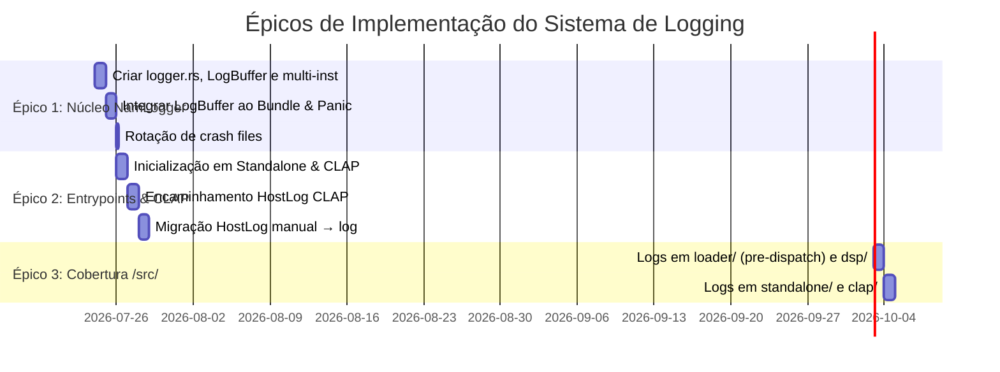

<!--
SPDX-License-Identifier: Apache-2.0
Copyright (c) 2026 Fábio Henrique de Lima Silva (fhl.bsb@gmail.com) All rights reserved.
-->

# TODO-findings.md — Auditoria e Modernização do Sistema de Logging (`nam-rs`)

Este documento consolida os achados técnicos, vulnerabilidades operacionais e propostas arquiteturais detalhadas para o subsistema de logging e diagnóstico do projeto `nam-rs`.

---

## 1. Visão Geral e Contexto Operacional

No ecossistema `nam-rs`, registros de log e relatórios de diagnóstico são a única ferramenta viável para triagem remota de bugs, xruns (glitches de áudio em tempo real), incompatibilidades de modelos neurais e falhas de integração com hosts DAWs.

Atualmente, o projeto possui três vias principais de diagnóstico:

1. **CLI Standalone Terminal (`main.rs`)**: Emite mensagens para stdout/stderr via `env_logger` e gera dumps estruturados via `nam-rs --diagnose`.
2. **Plugin CLAP (`src/clap/`)**: Exibe o botão `ℹ` na status bar para cópia/exportação do diagnóstico e utiliza a extensão `HostLog` do CLAP manualmente em ~30 locais. Já existe um módulo [`logging.rs`](file:///home/fabio/nam-rs/src/clap/plugin/main_thread/logging.rs) que consome 9 flags RT atômicas via `emit_pending_logs()` e as repassa ao host via `HostLog`.
3. **Persistência em Disco (`~/.cache/nam-rs/*`)**: Armazena relatórios de crash (`crash-*.txt`) e diagnósticos exportados (`diagnostic-*.txt`).

Embora essas vias existam, a auditoria identificou que elas operam de forma desconectada: a facade `log::*` não é registrada no modo CLAP (silenciando logs de módulos compartilhados), o logging manual via `HostLog` não alimenta um histórico centralizado, e os relatórios de crash carecem de um rastro cronológico de execução.

### Princípio Off-RT para Logging

> O código em hot-path RT (`process()`, audio thread) **nunca deve chamar `log::*`** diretamente — isso é proibido pelas regras de RT-safety. Transições de estado no audio thread são sinalizadas via flags atômicas (`RtStatusFlags`) e consumidas off-RT. Porém, **todas as funções construtoras, de configuração e de carregamento** (off-RT) devem aproveitar as oportunidades de logging para registrar informações de diagnóstico.

---

## 2. Detalhamento dos Achados (Findings)

### Finding 01: Facade `log::*` Desconectada no modo CLAP Plugin (P0 — Crítico)

- **Componentes Afetados**: [`src/lib.rs`](file:///home/fabio/nam-rs/src/lib.rs), [`src/clap/plugin/mod.rs`](file:///home/fabio/nam-rs/src/clap/plugin/mod.rs)

- **Prioridade**: P0 — Crítico

- **Situação Atual**:
  O inicializador de log (`env_logger`) só é executado no binário CLI (`main.rs`). Quando o `nam-rs` é compilado como `cdylib` para o formato CLAP e executado dentro de uma DAW (Reaper, Ardour, Bitwig, FL Studio, etc.), **nenhum logger backend para a facade `log::*` é registrado**. Como resultado, todas as macros `log::info!`, `log::warn!` e `log::error!` presentes em módulos compartilhados (`src/loader/`, `src/dsp/`, `src/math/`, `src/common/`) são descartadas em silêncio.

  **Nota**: O CLAP já possui um sistema de logging manual via `HostLog` que cobre eventos críticos do ciclo de vida do plugin (~30 chamadas diretas em [`state.rs`](file:///home/fabio/nam-rs/src/clap/extensions/state.rs), [`load.rs`](file:///home/fabio/nam-rs/src/clap/plugin/main_thread/load.rs), [`housekeeping.rs`](file:///home/fabio/nam-rs/src/clap/plugin/main_thread/housekeeping.rs), [`logging.rs`](file:///home/fabio/nam-rs/src/clap/plugin/main_thread/logging.rs), [`gui.rs`](file:///home/fabio/nam-rs/src/clap/extensions/gui.rs)). Porém, esse sistema é paralelo e desconectado da facade `log::*`, criando dois problemas: (a) logs de módulos compartilhados são perdidos, e (b) a introdução de `NamLogger` sem migração causará duplicação de mensagens.

- **Proposta de Solução**:
  Implementar um logger central unificado (`NamLogger`) em [`src/common/diagnostics/logger.rs`](file:///home/fabio/nam-rs/src/common/diagnostics/logger.rs) e registrar sua inicialização no factory do plugin CLAP (`NamClapPlugin::new_shared`). O logger irá capturar todas as chamadas `log::*` em um buffer em memória e repassar mensagens formatadas para a extensão `clack_extensions::log::HostLog` do CLAP quando suportada pela DAW hospedeira. Após a integração, migrar gradualmente as chamadas manuais `HostLog` → `log::*` nos módulos CLAP (ver Épico 02, Fase 3).

---

### Finding 02: Dumps de Diagnóstico e Crash Reports sem Rastro de Execução (P0 — Crítico)

- **Componentes Afetados**: [`src/common/diagnostics/bundle.rs`](file:///home/fabio/nam-rs/src/common/diagnostics/bundle.rs), [`src/common/panic_hook.rs`](file:///home/fabio/nam-rs/src/common/panic_hook.rs)

- **Prioridade**: P0 — Crítico

- **Situação Atual**:
  O método `DiagnosticBundle::render()` (utilizado pelo CLI `--diagnose`, pelo botão `ℹ` da interface CLAP e pelo hook de pânico ao salvar `~/.cache/nam-rs/crash-*.txt`) inclui apenas snapshots estáticos do sistema (`SystemSnapshot`) e telemetria pontual (`RuntimeSnapshot`). O rastro cronológico de logs de execução que antecedeu a falha ou o acionamento do diagnóstico é completamente perdido.

- **Proposta de Solução**:
  Adicionar a estrutura `LogBuffer` (um ring buffer thread-safe com capacidade para as últimas ~100 a 200 mensagens formatadas de log) dentro de `NamLogger`. Atualizar o método `DiagnosticBundle::render()` e a função `format_panic_report_to_buf()` do `panic_hook.rs` para anexar automaticamente a seção `──── Recent Log Trace ────` ao final de cada relatório gerado.

  **Restrição Importante — Buffer do Panic Hook**: O [`panic_hook.rs`](file:///home/fabio/nam-rs/src/common/panic_hook.rs) utiliza um buffer stack-allocated de `[u8; 4096]`. Com ~100 entradas de log formatadas (~80-120 bytes cada), o espaço é insuficiente (~10 KiB mínimo). A implementação deve:

  - Aumentar o `report_buf` para `[u8; 16384]` (16 KiB), **ou**
  - Limitar a seção de Log Trace no crash report às últimas ~20 entradas (priorizando recência), **ou**
  - Usar alocação heap condicional (aceitável no crash path, pois já é non-recoverable).

---

### Finding 03: Cobertura Parcial de Logs no Carregamento de Modelos e IRs (P2 — Médio)

- **Componentes Afetados**: [`src/loader/build.rs`](file:///home/fabio/nam-rs/src/loader/build.rs), [`src/loader/nam_json/parse.rs`](file:///home/fabio/nam-rs/src/loader/nam_json/parse.rs), [`src/loader/namb/parse.rs`](file:///home/fabio/nam-rs/src/loader/namb/parse.rs), [`src/dsp/cabsim/loader.rs`](file:///home/fabio/nam-rs/src/dsp/cabsim/loader.rs)

- **Prioridade**: P2 — Médio

- **Situação Atual**:
  Os dispatchers em [`src/loader/dispatcher/`](file:///home/fabio/nam-rs/src/loader/dispatcher/) **já possuem logs informativos de carregamento bem-sucedido** — todos os 7 módulos de dispatch (`wavenet/mod.rs`, `wavenet/standard.rs`, `wavenet/dynamic.rs`, `lstm/static_builder.rs`, `lstm/dynamic_builder.rs`, `convnet/mod.rs`, `linear/mod.rs`) importam e utilizam `log::info!` para registrar topologia, canais e contagem de pesos. Exemplos: `info!("[Dispatcher] WaveNet A2-Lite built — CH=3, layers=23, weights={}")`.

  Porém, os módulos **anteriores ao dispatch** não possuem logging:

  - [`build.rs`](file:///home/fabio/nam-rs/src/loader/build.rs): **ZERO `log::*`** — não registra formato do arquivo de entrada, tamanho em bytes, duração total de carregamento, nem a decisão de formato (`.nam` vs `.namb`).
  - [`nam_json/parse.rs`](file:///home/fabio/nam-rs/src/loader/nam_json/parse.rs) e [`namb/parse.rs`](file:///home/fabio/nam-rs/src/loader/namb/parse.rs): Não registram versão do formato, campos de metadados parsados, nem limites de segurança validados.
  - [`dsp/cabsim/loader.rs`](file:///home/fabio/nam-rs/src/dsp/cabsim/loader.rs): Não registra resultado de carregamento do WAV (taxa de amostragem original, quantidade de frames, normalização aplicada, necessidade de reamostragem).

- **Proposta de Solução**:
  Inserir chamadas `log::info!` e `log::warn!` nos módulos de pré-dispatch:

  1. Em `build.rs`: registrar caminho (basename), tamanho do arquivo, formato detectado (`.nam`/`.namb`), e duração total do carregamento.
  2. Em `parse.rs` (JSON e NAMB): registrar versão do formato, campo receptivo, e warnings de limites.
  3. Em `cabsim/loader.rs`: registrar taxa de amostragem original do WAV, quantidade de frames, status de normalização e se houve reamostragem.

---

### Finding 04: Ausência Total de Logging no Motor DSP (P1 — Alto)

- **Componentes Afetados**: [`src/dsp/resampler/mod.rs`](file:///home/fabio/nam-rs/src/dsp/resampler/mod.rs), [`src/dsp/oversample/mod.rs`](file:///home/fabio/nam-rs/src/dsp/oversample/mod.rs), [`src/dsp/pipeline/mod.rs`](file:///home/fabio/nam-rs/src/dsp/pipeline/mod.rs), [`src/dsp/cabsim/`](file:///home/fabio/nam-rs/src/dsp/cabsim/), [`src/dsp/noise_gate/`](file:///home/fabio/nam-rs/src/dsp/noise_gate/)

- **Prioridade**: P1 — Alto

- **Situação Atual**:
  **Todo o diretório `src/dsp/` possui literalmente ZERO chamadas `log::*`.** Os módulos de resampling, oversampling (`Off`, `2×`, `4×`), convolutor CabSim, noise gate e computação adaptativa operam sem emitir nenhuma mensagem de log — nem mesmo em suas funções construtoras e de configuração (off-RT).

  Esses módulos são a espinha dorsal do processamento de áudio, e a ausência de logs torna impossível diagnosticar problemas de qualidade, latência ou configuração incorreta remotamente.

  > **Nota**: Isso é by-design para o hot-path RT (sem `log::*` no audio thread!), mas as funções **construtoras e de configuração** desses módulos são off-RT e devem aproveitar essas oportunidades para logging.

- **Proposta de Solução**:
  Adicionar logs informativos **apenas em pontos off-RT** quando:

  1. Um novo resampler for instanciado (registrando razão de entrada/saída e modo de filtro).
  2. O fator de oversampling for alterado (registrando latência introduzida em amostras e milissegundos).
  3. O convolutor CabSim for inicializado ou o IR substituído (registrando tamanho do IR e partição).
  4. O noise gate for configurado ou alternar entre ativado/desativado.
  5. O adaptive compute alterar seu estado de economia.

---

### Finding 05: Gaps Pontuais em Eventos da Camada PipeWire (P3 — Baixo)

- **Componentes Afetados**: [`src/standalone/pw_host/run.rs`](file:///home/fabio/nam-rs/src/standalone/pw_host/run.rs)

- **Prioridade**: P3 — Baixo

- **Situação Atual**:
  A camada standalone **já possui cobertura substancial** de logging (26+ chamadas `log::*` em `src/standalone/rt_setup/`):

  - [`telemetry.rs`](file:///home/fabio/nam-rs/src/standalone/rt_setup/telemetry.rs): 17 chamadas cobrindo GC overflow, model reset, deadline exceeded, signal transitions.
  - [`pm_qos.rs`](file:///home/fabio/nam-rs/src/standalone/rt_setup/pm_qos.rs): Logs de sucesso/falha para PM QoS lock.
  - [`thread.rs`](file:///home/fabio/nam-rs/src/standalone/rt_setup/thread.rs): Logs de SCHED_FIFO, mlockall.
  - [`affinity.rs`](file:///home/fabio/nam-rs/src/standalone/rt_setup/affinity.rs): Warning de fallback de CPU affinity.

  Porém, há gaps pontuais:

  1. **Negotiação de quantum/buffer** do PipeWire: quando o host renegocia o quantum (e.g., de 256 para 128 samples), não há log registrando a mudança.
  2. **HugeTLB allocation details**: quando a alocação de páginas HugeTLB explícitas falha, o fallback para THP poderia ser mais detalhado.

  **Nota**: Esses logs **já funcionam no CLI Standalone** mas são **silenciados quando rodando como plugin CLAP** devido ao Finding 01 (facade desconectada). A resolução do Finding 01 resolverá automaticamente essa visibilidade para o modo CLAP.

- **Proposta de Solução**:

  1. Adicionar `log::info!` quando o quantum/buffer size for (re)negociado pelo PipeWire.
  2. Enriquecer fallback logs de HugeTLB com detalhes do motivo de falha.

---

### Finding 06: Cobertura Parcial de Eventos do Ciclo de Vida CLAP (P2 — Médio)

- **Componentes Afetados**: [`src/clap/plugin/main_thread/load.rs`](file:///home/fabio/nam-rs/src/clap/plugin/main_thread/load.rs), [`src/clap/extensions/state.rs`](file:///home/fabio/nam-rs/src/clap/extensions/state.rs), [`src/clap/extensions/render.rs`](file:///home/fabio/nam-rs/src/clap/extensions/render.rs)

- **Prioridade**: P2 — Médio

- **Situação Atual**:
  O módulo CLAP já utiliza `HostLog` diretamente em ~30 locais para eventos críticos (state save/load, model loading errors, GUI lifecycle). Porém, alguns eventos importantes não são logados:

  1. **Instanciação do plugin**: não registra nome da DAW hospedeira nem versão da API CLAP.
  2. **Transição de render mode**: [`render.rs`](file:///home/fabio/nam-rs/src/clap/extensions/render.rs) alterna entre `Realtime` e `Offline` sem emitir nenhum log — informação vital para diagnóstico de qualidade em exports.
  3. **Preset loading**: não registra o caminho/nome do preset carregado via `preset_load.rs`.

- **Proposta de Solução**:
  Adicionar mensagens de log estruturadas (via `log::*` — **não** via `HostLog` manual, para convergir com o `NamLogger`):

  1. Instanciação do plugin registrando nome da DAW e versão da API CLAP.
  2. Transição de modo de renderização (`Realtime` vs `Offline`), confirmando a ativação automática de oversampling HQ na exportação.
  3. Preset loaded com caminho/nome do preset.

---

### Finding 07: Risco de Multi-Instância CLAP com `log::set_logger()` Global (P1 — Alto)

- **Componentes Afetados**: [`src/common/diagnostics/logger.rs`](file:///home/fabio/nam-rs/src/common/diagnostics/logger.rs) (novo), [`src/clap/plugin/mod.rs`](file:///home/fabio/nam-rs/src/clap/plugin/mod.rs)

- **Prioridade**: P1 — Alto

- **Situação Atual**:
  A função `log::set_logger()` é global e pode ser chamada **uma única vez** por processo. Quando uma DAW instancia múltiplos plugins nam-rs (e.g., 3 instâncias na cadeia de efeitos), a segunda chamada falhará silenciosamente. O design do `NamLogger` deve endereçar:

  1. Como lidar com múltiplas instâncias CLAP no mesmo processo.
  2. Se o `LogBuffer` será por-instância ou global.
  3. Como cada instância encaminhará logs ao seu próprio `HostLog` handle (que é per-plugin).

- **Proposta de Solução**:

  - Usar `log::set_logger()` protegido por `OnceLock`/`call_once` — o `NamLogger` é registrado apenas na primeira instância.
  - `LogBuffer` global (compartilhado entre instâncias) — simples e adequado para diagnóstico.
  - Para encaminhamento `HostLog`: cada instância registra seu sink via uma lista thread-safe (e.g., `Mutex<Vec<Weak<HostLogSink>>>`) consultada pelo logger central ao emitir cada registro. Quando uma instância é destruída, o `Weak` expira automaticamente.

---

### Finding 08: Buffer de 4 KiB Insuficiente para Log Trace no Panic Hook (P2 — Médio)

- **Componentes Afetados**: [`src/common/panic_hook.rs`](file:///home/fabio/nam-rs/src/common/panic_hook.rs)

- **Prioridade**: P2 — Médio

- **Situação Atual**:
  O panic hook utiliza um buffer stack-allocated de `[u8; 4096]` para formatar o crash report. Com a adição da seção "Recent Log Trace" proposta no Finding 02, esse buffer será insuficiente (100 linhas × ~100 bytes = ~10 KiB).

- **Proposta de Solução**:
  Definida como parte do Finding 02 (ver opções de buffer lá). A decisão será tomada durante a implementação do Épico 01.

---

### Finding 09: Ausência de Rotação/Limpeza de Crash Files (P3 — Baixo)

- **Componentes Afetados**: [`src/common/panic_hook.rs`](file:///home/fabio/nam-rs/src/common/panic_hook.rs)

- **Prioridade**: P3 — Baixo

- **Situação Atual**:
  Os arquivos `crash-*.txt` em `~/.cache/nam-rs/` acumulam indefinidamente. Não há mecanismo de rotação ou TTL para limpar crash reports antigos. Embora improvável no uso normal, panic loops podem preencher disco.

- **Proposta de Solução**:
  Ao salvar um novo crash report, remover os mais antigos se houver mais de N (e.g., 10) arquivos `crash-*.txt` no diretório. Implementar como subtarefa do Épico 01.

---

## 3. Riscos e Restrições Arquiteturais

### 3.1 RT-Safety Absoluta

Qualquer `log::*` call no audio thread é **proibida**. O `NamLogger` deve considerar um mecanismo para detectar e descartar chamadas originadas do audio thread (e.g., verificar thread name via TLS ou flag `is_rt_thread`), emitindo no máximo um warning atômico de violação. Transições de estado RT continuam sendo sinalizadas via `RtStatusFlags` e consumidas off-RT pelo `poll_rt_status()` (Standalone) ou `emit_pending_logs()` (CLAP).

### 3.2 Multi-Instância CLAP

`log::set_logger()` é global — o design deve suportar N instâncias de plugin no mesmo processo sem panic, perda de logs ou race conditions (ver Finding 07).

### 3.3 Duplicação HostLog ↔ `log::*`

Após a integração do `NamLogger` como bridge `log::*` → `HostLog`, as ~30 chamadas manuais `HostLog` existentes nos módulos CLAP criarão duplicação. A migração gradual está planejada no Épico 02, Fase 3.

### 3.4 LogBuffer: Design de Concorrência

O `LogBuffer` deve ser acessível por múltiplas threads emissoras de `log::*` sem bloquear callers sensíveis à latência. Opções viáveis:

- **`Mutex<VecDeque<String>>` com `try_lock()`**: pragmático e simples; descarta silenciosamente em caso de contention. Adequado para o off-RT path onde contention é rara.
- **Ring buffer lock-free (MPSC)**: mais robusto, mas maior complexidade. Não justificado na v1 dado que todos os emissores são off-RT.

### 3.5 Log Levels e Compatibilidade

- **CLI Standalone**: manter compatibilidade com `RUST_LOG` (atualmente via `env_logger`). O `NamLogger` deve ler `RUST_LOG` para determinar o nível mínimo.
- **CLAP Plugin**: `RUST_LOG` geralmente não está disponível em ambiente DAW. O nível padrão deve ser `Info`, com possibilidade de override via `NAM_LOG_LEVEL` (env var interna).

---

## 4. Matriz de Priorização

| Prioridade | Finding                              | Gravidade | Justificativa                                    |
|:---------- |:------------------------------------ |:--------- |:------------------------------------------------ |
| **P0**     | F01 — Facade desconectada CLAP       | Crítica   | Perda de logs em produção dentro de DAWs         |
| **P0**     | F02 — Sem Log Trace em crashes       | Crítica   | Crash reports impossíveis de diagnosticar        |
| **P1**     | F04 — DSP sem logs (off-RT)          | Alta      | Espinha dorsal do processamento sem visibilidade |
| **P1**     | F07 — Multi-instância CLAP           | Alta      | Blocker arquitetural para o NamLogger            |
| **P2**     | F03 — Loader parcialmente coberto    | Média     | Gaps pontuais em pre-dispatch                    |
| **P2**     | F06 — Ciclo de vida CLAP parcial     | Média     | Parcialmente coberto por `HostLog` manual        |
| **P2**     | F08 — Buffer panic hook insuficiente | Média     | Dependência técnica do F02                       |
| **P3**     | F05 — RT setup (gaps pontuais)       | Baixa     | Já substancialmente coberto                      |
| **P3**     | F09 — Rotação de crash files         | Baixa     | Qualidade de vida, não funcional                 |

---

## 5. Épicos de Implementação

Para orientar a execução de forma estruturada e ágil, os achados acima foram organizados em 3 Épicos de Implementação:

### Épico 01: Núcleo do Engine `NamLogger` e Retenção de Histórico [DONE]

- **Objetivo**: Criar o motor centralizador de logging thread-safe, com suporte a multi-instância CLAP, e integrar a retenção de histórico nos relatórios de diagnóstico.
- **Achados Cobertos**: Finding 01 (parcial), Finding 02, Finding 07, Finding 08, Finding 09.
- **Entregáveis**:
  - `src/common/diagnostics/logger.rs` contendo `NamLogger`, `LogBuffer` e mecanismo multi-instância (`OnceLock` + sink list).
  - Atualização de `DiagnosticBundle::render()` e `panic_hook.rs` para incluir o rastro de logs (com buffer expandido ou Log Trace limitado).
  - Rotação de crash files em `~/.cache/nam-rs/` (máximo N arquivos).

### Épico 02: Conexão nos Entrypoints e Encaminhamento CLAP `HostLog` [DOING]

- **Objetivo**: Garantir que tanto o binário CLI quanto o plugin CLAP inicializem o `NamLogger`, repassem os logs para seus respectivos destinos, e migrem o código existente para a facade unificada.
- **Achados Cobertos**: Finding 01 (completo).
- **Entregáveis (3 fases)**:
  - **Fase 1**: Chamada de inicialização em `main.rs` (substituindo `env_logger`) e em `NamClapPlugin::new_shared()`. A facade `log::*` passa a funcionar dentro de DAWs.
  - **Fase 2**: Encaminhamento `NamLogger` → `HostLog` no CLAP (bridge automático).
  - **Fase 3**: Migração gradual das ~30 chamadas manuais `HostLog` → `log::*` nos módulos CLAP (`state.rs`, `load.rs`, `housekeeping.rs`, `gui/`, etc.), eliminando duplicação. Manter `emit_pending_logs()` apenas para flags atômicas RT (que não podem usar `log::*` por design).

### Épico 03: Auditoria e Cobertura Completa de Logs na Base de Código (`/src/`)

- **Objetivo**: Inserir registros de log informativos, defensivos e precisos em todos os módulos da biblioteca, aproveitando oportunidades off-RT.
- **Achados Cobertos**: Finding 03, Finding 04, Finding 05, Finding 06.
- **Entregáveis**:
  - Logs de carregamento (pre-dispatch) em `src/loader/build.rs`, `parse.rs` e `cabsim/loader.rs`.
  - Logs de estado de resampling, oversampling, noise gate e latência em `src/dsp/` (construtores e configuradores off-RT).
  - Logs de quantum/buffer PipeWire e enriquecimento de fallbacks HugeTLB em `src/standalone/`.
  - Logs de instanciação, render mode e preset loading em `src/clap/` (via `log::*`, não `HostLog` manual).
