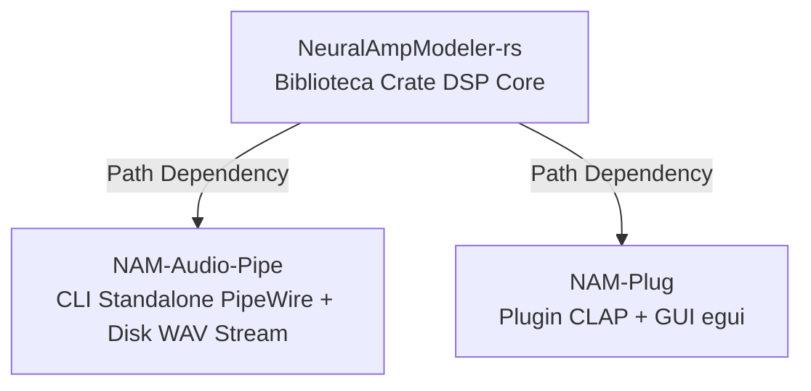

<!--
SPDX-License-Identifier: Apache-2.0
Copyright (c) 2026 Fábio Henrique de Lima Silva (fhl.bsb@gmail.com) All rights reserved.
-->

# Achado Técnico e Arquitetural: Monólito Triplo `nam-rs` & Plano de Desmembramento

**Data:** 28/07/2026
**Origem:** Solicitação de refatoração estrutural (Skill `refatora-rust` e `planejador-arquiteto`)

---

## 1. Diagnóstico do Problema e Motivação

O repositório `nam-rs` acumulou 3 funcionalidades/produtos distintos em uma única estrutura de código Cargo:

1. **Kernel DSP Shared Core (`NeuralAmpModeler-rs`):** Motor de inferência WaveNet/LSTM/ConvNet, FastMath SIMD (x86-64-v3), suporte a `.nam`/`.namb`, simulação de gabinete IR, resamling, noise gate, logger/diagnósticos e infraestrutura de testes/benchmarks DSP.
2. **Cliente Standalone PipeWire (`NAM-Audio-Pipe`):** CLI Standalone Linux integrado ao PipeWire, gerenciamento de SCHED_FIFO/afinidade, parser `lexopt`, visualizador de status no terminal e funcionalidade exclusiva de gravação do stream de áudio em formato **WAV** no disco.
3. **Plugin de Áudio CLAP (`NAM-Plug`):** Componente dinâmico `cdylib` CLAP com UI gráfica imediata via `egui`/`glow`/`baseview`, suporte a extensões CLAP, automação de parâmetros e harness de testes de plugin.

---

## 2. Diretrizes de Separação e Regras Operacionais

1. **Mapeamento de Transição em `target/transicao/`:**
   - `target/transicao/nam-rs`: Cópia funcional de staging a partir da qual os arquivos serão movidos (`mv`). A pasta raiz `./` **nunca** será alterada para evitar quebrar o ambiente da IA durante a transição.
   - `target/transicao/NeuralAmpModeler-rs`: Crate biblioteca Rust (`lib` `NeuralAmpModeler-rs`).
   - `target/transicao/NAM-Audio-Pipe`: CLI Standalone PipeWire (`bin` `nam-audio-pipe`).
   - `target/transicao/audiorip`: Espelho do git <https://github.com/fabiohl/audiorip>, que tem algumas funcionalidades úteis a serem incorporadas no `NAM-Audio-Pipe`.
   - `target/transicao/NAM-Plug`:

2. **Proibição de Commits em Staging e Raiz:**
   - É estritamente proibido realizar git commit na pasta raiz `./` ou em `target/transicao/nam-rs`. Commits serão feitos exclusivamente dentro dos repositórios finais (`NeuralAmpModeler-rs`, `NAM-Audio-Pipe`, `NAM-Plug`).

3. **Mínimo Absoluto de Código Repetido:**
   - Todo o motor DSP é de posse exclusiva do `NeuralAmpModeler-rs`.
   - `NAM-Audio-Pipe` e `NAM-Plug` consomem `NeuralAmpModeler-rs` via dependência de caminho Cargo local:

     ```toml
     [dependencies]
     NeuralAmpModeler-rs = { path = "../NeuralAmpModeler-rs" }
     ```

4. **Herança e Escopo de Testes, Benches, Docs e Utilitários:**
   - Cada repositório conterá **exclusivamente** os testes, benchmarks, documentações e utilitários (`utils/`) enxutos e adaptados ao seu propósito específico.

---

## 3. Detalhamento Estrutural dos 3 Repositórios Finais



### 3.1 `NeuralAmpModeler-rs` (Biblioteca Rust DSP)

- **Cargo.toml:** Name `NeuralAmpModeler-rs`, lib name `neural_amp_modeler_rs`. Zero dependências de PipeWire, CLAP ou GUI (`egui`).
- **`src/`:** `lib.rs`, `common/`, `dsp/`, `loader/`, `math/`, `models/`, `testing/`.
- **`tests/`:** Testes de unidade e integração do motor DSP (`models.rs`, `parity.rs`, `rt_constraints.rs`, `loom_tests.rs`, `perf_soak.rs`, `fixtures/`, `proptest-regressions/`).
- **`benches/`:** Benchmarks DSP completos (`cabsim_bench.rs`, `dot_4x_bench.rs`, `dsp_bench.rs`, `fft_radix4_bench.rs`, `gemv_bench.rs`, `head_gemv_bench.rs`, `inference_bench.rs`, `kahan_conv1d_bench.rs`, `linear.rs`, `long_inference_bench.rs`, `math_bench.rs`, `regression_gate.rs`, `common.rs`).
- **`docs/`:** `architecture.md`, `audio_fidelity_map.md`, `benchmarks.md`, `cpp_parity_map.md`, `fastmath-approximations.md`, `functional-tests.md`, `namb-spec.md`, `perceptual_validation.md`, `testing.md`, `quality-contract.txt`.
- **`utils/` (Enxutos/Adaptados):** `lints.sh`, `tests-quick.sh`, `quality-dashboard.sh`, `tests-long.sh`, `_lib.sh`, `check-model.py`, `tests-performance-regression.sh`.

---

### 3.2 `NAM-Audio-Pipe` (CLI Standalone PipeWire)

- **Cargo.toml:** Name `nam-audio-pipe`. Dependências: `NeuralAmpModeler-rs`, `pipewire`, `lexopt`, `anyhow`, `libc`, `log`, `env_logger`.
- **`src/`:** `main.rs`, `standalone/` (`cli.rs`, `colors.rs`, `pw_host/`, `rt_setup/`), `recording/` (**Gravação contínua de áudio lock-free exclusivamente em formato WAV**).
  > **Nota do PO:** O projeto <https://github.com/fabiohl/audiorip> contém muita funcionalidade aproveitável para `recording/` - especialmente no que se refere a fazer "trim" de silêncios.
- **`tests/`:** `cli_test.rs` e testes de ciclo de vida/integração do driver PipeWire.
- **`benches/`:** Benchmark de latência e quantum do driver PipeWire.
- **`docs/`:** Documentação do cliente Standalone PipeWire e guia de sintonia RT Linux.
- **`utils/` (Enxutos/Adaptados):** `run-standalone.sh`, `lints.sh`, `tests-quick.sh`, `build-release.sh`.

---

### 3.3 `NAM-Plug` (Plugin CLAP + GUI)

- **Cargo.toml:** Name `nam-plug` (`cdylib`). Dependências: `NeuralAmpModeler-rs`, `clack-plugin`, `clack-extensions`, `clack-host`, `egui`, `egui_glow`, `baseview`, `rfd`, `keyboard-types`, `arboard`.
- **`src/`:** `lib.rs` (`clap_entry`), `clap/` (`descriptor.rs`, `entry.rs`, `extensions/`, `factory/`, `gui/`, `plugin/`, `processor/`, `host_harness.rs`, `test_util.rs`), `bin/pgo_profiling_workload.rs`.
- **`tests/`:** Testes do plugin CLAP (`clap.rs`, `clap_e0_containment_test.rs`, `clap_e2_proptest.rs`).
- **`benches/`:** `clap_bench.rs`.
- **`docs/`:** `clap_integration.md`.
- **`utils/` (Enxutos/Adaptados):** `build-release.sh`, `lints.sh`, `tests-quick.sh`.
