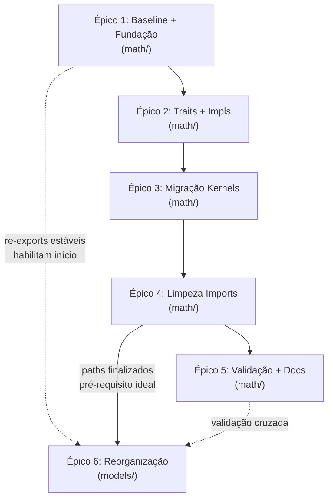

# Plano: Reorganização de `src/math/` e `src/models/`

## Diagnóstico da Situação Atual

### Estrutura atual

```text
src/math/
├── mod.rs               # 10 linhas: pub mod fastmath; pub mod simd;
├── fastmath.rs           # 1228 linhas — MONÓLITO
│                         #   GainLUT + tanh + sigmoid + relu + softsign + silu + prelu
│                         #   (cada uma em AVX2 + AVX-512, + dual + slice + fused)
├── fastmath_test.rs      # 719 linhas de testes de sweep
└── simd/
    ├── mod.rs            # dispatch_simd! macro, re-exports
    ├── dispatch.rs       # SimdMathConfig, detect_best_simd, v-table
    ├── traits.rs         # SimdMath trait (33 métodos)
    ├── avx2.rs           # ~2092 linhas: Avx2Math impl + funções standalone
    ├── avx512.rs         # ~2266 linhas: Avx512Math, Avx512VnniMath, Avx512VnniBf16Math
    ├── scalar_ref.rs     # 583 linhas: implementações escalares de referência
    ├── ops.rs            # Prefetch, DAZ/FTZ, f32_to_bf16, compute_energy, max_diff
    ├── aligned.rs        # AlignedVec<T>
    ├── utility.rs        # hsum_avx2, hsum_avx512
    ├── simd_test.rs      # 178 linhas
    ├── avx2_test.rs      # 49 linhas
    └── avx512_test.rs    # 26 linhas
```

**Total**: ~7.661 linhas de código matemático + 374 linhas em `models/activations.rs`.

### Estrutura atual de `src/models/`

```text
src/models/
├── mod.rs               # 322 linhas — NamModel trait + DynamicModel enum + NamModel impls
│                         #   + LstmLike trait + lstm_prewarm_common + WavenetA2Placeholder
│                         #   + type aliases (Lstm1x8..Lstm2x16)
├── activations.rs        # 373 linhas — ActivationType enum + ActivationFn trait + dispatch manual
├── film.rs               # 69 linhas  — FiLMConfig + FiLMLayer trait (A2 placeholder)
├── gating.rs             # 71 linhas  — GatingMode enum + GatingActivationConfig (A2 placeholder)
├── lstm.rs               # 637 linhas — LstmLayer + LstmModel1 + LstmModel2
│                         #   + 4 macros (define_lstm_process, define_lstm1/2_process,
│                         #     define_lstm2_pipelined) + 5 especializações SIMD × 3 modelos
├── lstm_dyn.rs           # 218 linhas — LstmDynLayer + LstmDynModel (fallback dinâmico)
├── lstm_test.rs          # 264 linhas
├── wavenet.rs            # 1305 linhas — Conv1d + DenseLayer + WaveNetModel (const generics)
│                         #   + ConvInput trait + 2 impls (f32/u16) + single/dual/bf16
├── wavenet_common.rs     # 1251 linhas — Conv1dDyn + DenseLayerDyn + WaveNetLayerDyn
│                         #   + WaveNetLayerState + WavenetProcessContext + WaveNetLayerArrayDyn
├── wavenet_dyn.rs        # 268 linhas — WaveNetLayerArrayDyn process + WaveNetDynModel
├── wavenet_params.rs     # 246 linhas — LayerParamsA2, LayerArrayParamsA2, HeadParams
├── wavenet_test.rs       # 617 linhas
└── wavenet_dyn_test.rs   # 251 linhas
```

**Total models**: 5.892 linhas (4.760 código + 1.132 testes).

### Problemas identificados em `src/models/`

1. **`mod.rs` é um catch-all sobrecarregado (322L)**: Mistura 5 responsabilidades — NamModel trait, DynamicModel enum (14 variantes com match manual), 6 blocos de `impl NamModel`, helpers LSTM (`LstmLike`, `lstm_prewarm_common`), e `WavenetA2Placeholder`.

2. **WaveNet fragmentado com nomes confusos (2.824L)**: `wavenet_common.rs` (1.251L) **não é "common"** — contém a implementação dinâmica inteira (`Conv1dDyn`, `DenseLayerDyn`, `WaveNetLayerDyn`). O nome induz ao erro.

3. **~800L de duplicação conceitual** entre `Conv1d<IN,OUT,K>` (estático, const generics) e `Conv1dDyn` (dinâmico, campos runtime). Mesma lógica de convolução causal dilatada, prefetch, bias/mixin, variantes bf16.

4. **60+ referências hardcoded a `math/`**: Especialmente na macro `define_lstm_process!` que recebe 13 parâmetros de paths absolutos (`crate::math::simd::gemv_4gate_avx2`, `crate::math::fastmath::simd_tanh`, etc.).

5. **`activations.rs` será redundante**: Sprint 3.1 do plano math criará dispatch unificado em `math::activations::tanh_slice()`, tornando o dispatch manual em `models/activations.rs` desnecessário.

6. **Stubs A2 dispersos sem namespace**: `film.rs` (69L), `gating.rs` (71L) e `wavenet_params.rs` (246L) são todos placeholders para A2, mas estão soltos na raiz de `models/`.

7. **`WavenetA2Placeholder` em `mod.rs`**: Código A2-específico misturado com infraestrutura geral.

### Problemas identificados

1. **`fastmath.rs` é um monólito de 1228 linhas** misturando GainLUT, 6 funções de ativação (AVX2+AVX-512), operações fundidas e processamento de slices.

2. **Separação `simd/` perdeu o sentido**: Com x86-64-v3 mandatório, **tudo é SIMD**. A subpasta é apenas aninhamento sem significado.

3. **Duplicação de dispatch**: `models/activations.rs` reimplementa dispatch manual (`match SIMD_MATH.instruction_set`) que duplica o `dispatch_simd!`.

4. **Referências cruzadas confusas**: `avx2.rs`/`avx512.rs` chamam funções em `fastmath.rs` e vice-versa.

5. **`Avx2VnniMath` é 100% delegação**: Confirmado — todos os 33 métodos delegam para `Avx2Math::method(...)`. AVX2-VNNI não traz benefício para operações FP. Deve ser eliminado.

6. **Dual dispatch**: Coexistem trait genérica (`SimdMath`) e v-table (`SimdMathConfig`) — dois mecanismos para o mesmo propósito.

7. **`ops.rs` é heterogêneo**: Mistura utilitários de CPU (DAZ/FTZ, prefetch) com operações DSP (energia, max_diff).

8. **Aliases desnecessários**: `simd_tanh()` e `simd_sigmoid()` em `fastmath.rs` L1214-1224 são apenas wrappers para as versões AVX2.

### O que cada modelo de inferência usa

| Categoria            | LSTM                                          | WaveNet                                                      | DSP/Resampler                               |
| -------------------- | --------------------------------------------- | ------------------------------------------------------------ | ------------------------------------------- |
| **Dot Products**     | dot_product, 4x_interleaved, bf16, dual_frame | 4x_interleaved, dual_frame                                   | -                                           |
| **GEMV/GEMM**        | gemv_overwrite, gemv_4gate, fused_add_gemv    | gemv_overwrite, fused_add_gemv, gemm_batch, gemm_residual    | -                                           |
| **Ativações**        | tanh, sigmoid                                 | tanh, sigmoid, relu, softsign, silu, prelu                   | -                                           |
| **Fused LSTM Gates** | fused_lstm_gates                              | -                                                            | -                                           |
| **WaveNet Head**     | -                                             | head_sum, accumulate_head, tanh_accumulate, gated_accumulate | -                                           |
| **Conv/Stereo**      | -                                             | convolve_stereo                                              | convolve_stereo                             |
| **Gain/Energy**      | -                                             | apply_gain, compute_energy_stereo                            | apply_gain, compute_energy_stereo, max_diff |
| **Common**           | AlignedVec, hsum, f32_to_bf16, DAZ/FTZ        | AlignedVec, hsum, f32_to_bf16                                | AlignedVec, DAZ/FTZ                         |

---

## Decisões de Design Consolidadas

| Decisão                            | Resolução                                                                             |
| ---------------------------------- | ------------------------------------------------------------------------------------- |
| Trait `SimdMath`                   | Manter monolítica (33 métodos). Decomposição em sub-traits é trabalho futuro          |
| `scalar_ref.rs`                    | Fica em `common/` — oráculo centralizado                                              |
| `Avx2VnniMath`                     | **Eliminar** — substituir por `type Avx2VnniMath = Avx2Math`                          |
| `Avx512VnniMath`                   | **Mantém** — tem `dot_product_bf16_avx512` nativo (real)                              |
| Dual dispatch                      | Documentar como design debt; unificar a longo prazo                                   |
| `simd_tanh`/`simd_sigmoid` aliases | Internalizar em `activations/`                                                        |
| `gemv_4gate`                       | Vai para `gemm/`, não `lstm/` (evita dep. circular `common → lstm`)                   |
| `compute_energy_*`, `max_diff_*`   | Saem de `ops.rs` → vão para `dsp/stereo.rs`                                           |
| `InstructionSet::Avx2Vnni`         | Manter no enum por ora (remoção seria breaking change separada)                       |
| `models/` reorganização            | Subpastas `lstm/`, `wavenet/`, `a2/` — **Épico 6, após Épico 5**                      |
| `wavenet_common.rs` renomeação     | Conteúdo genuinamente comum → `wavenet/common.rs`; dinâmico → `wavenet/conv1d_dyn.rs` |
| `activations.rs` localização       | Enum `ActivationType` → `models/a2/activations.rs`; dispatch → `math::activations::*` |

---

## Regra de Ouro: Preservação de Comentários

> **Todo código movido DEVE levar consigo seus comentários, docstrings e anotações `///`.**
> A base de código possui documentação didática extensa e cuidadosamente elaborada.
> Qualquer perda de comentário durante a migração é considerada um **defeito**.

### Diretrizes

1. **Mover, não reescrever**: Copiar bloco inteiro (docstring + corpo + testes) sem editar conteúdo técnico
2. **Adaptar caminhos nas docstrings**: Referências a `fastmath.rs` → novo caminho
3. **Docstrings de módulo**: Cada `mod.rs` novo deve ter `//!` explicando propósito e consumidores
4. **Verificação diff**: Ao final de cada Sprint, confirmar que o total de comentários não diminuiu

---

## Estrutura-Alvo Final

```text
src/math/
├── mod.rs                          # Re-exports estáveis (macro, traits, types)
├── constants.rs                    # Coeficientes Minimax, clamp limits, LUT params
│
├── common/                         # ═══ FUNDAÇÃO ═══
│   ├── mod.rs
│   ├── traits.rs                   # SimdMath trait (33 métodos)
│   ├── dispatch.rs                 # InstructionSet, SimdMathConfig, SIMD_MATH, dispatch_simd!
│   ├── avx2_impl.rs               # Avx2Math + (type Avx2VnniMath = Avx2Math)
│   ├── avx512_impl.rs             # Avx512Math, Avx512VnniMath, Avx512VnniBf16Math
│   ├── aligned.rs                  # AlignedVec<T>
│   ├── utility.rs                  # hsum_avx2, hsum_avx512, horizontal_sum_avx512
│   ├── scalar_ref.rs               # Oráculo escalar centralizado
│   ├── ops.rs                      # f32_to_bf16, set_daz_ftz, PrefetchFn, prefetch_*
│   └── tests.rs                    # (SEM compute_energy/max_diff — vão para dsp/)
│
├── activations/                    # ═══ ATIVAÇÕES NÃO-LINEARES ═══
│   ├── mod.rs                      # Re-exports + dispatch unificado (tanh_slice, etc.)
│   ├── tanh.rs                     # AVX2 + AVX-512 lado a lado
│   ├── sigmoid.rs
│   ├── relu.rs
│   ├── prelu.rs
│   ├── softsign.rs
│   ├── silu.rs
│   ├── fused.rs                    # tanh_sigmoid_dual (ILP interleaved)
│   └── tests.rs
│
├── gemm/                           # ═══ ÁLGEBRA LINEAR ═══
│   ├── mod.rs
│   ├── dot.rs
│   ├── dot_4x.rs
│   ├── gemv.rs
│   ├── gemm_batch.rs
│   ├── gemv_bf16.rs
│   ├── gemv_4gate.rs              # 4-gate LSTM projection (aqui, não em lstm/)
│   └── tests.rs
│
├── lstm/                           # ═══ LSTM-EXCLUSIVO ═══
│   ├── mod.rs
│   ├── gates.rs                    # fused_lstm_gates (ativações fundidas)
│   └── tests.rs
│
├── wavenet/                        # ═══ WAVENET-EXCLUSIVO ═══
│   ├── mod.rs
│   ├── head.rs
│   ├── accumulate.rs
│   └── tests.rs
│
└── dsp/                            # ═══ OPERAÇÕES DSP ═══
    ├── mod.rs
    ├── gain_lut.rs
    ├── gain.rs
    ├── stereo.rs                   # + compute_energy_*, compute_max_diff_*
    └── tests.rs
```

### Estrutura-Alvo de `src/models/` (Pós-Épico 6)

```text
src/models/
├── mod.rs                       # NamModel trait + DynamicModel enum + re-exports
│                                #   (~100 linhas — sem impls de modelo)
│
├── lstm/                        # ═══ LSTM ═══
│   ├── mod.rs                   # Re-exports: LstmLayer, LstmModel1, LstmModel2, LstmDynModel
│   │                            #   + type aliases (Lstm1x8..Lstm2x16)
│   │                            #   + NamModel impls para LSTM (1L, 2L, Dyn)
│   │                            #   + LstmLike trait + lstm_prewarm_common
│   ├── layer.rs                 # LstmLayer struct + macros define_lstm_process
│   │                            #   (637L → ~450L após mover impls NamModel)
│   ├── model_dyn.rs             # LstmDynLayer + LstmDynModel (218L)
│   └── tests.rs                 # Consolidação de lstm_test.rs (264L)
│
├── wavenet/                     # ═══ WAVENET ═══
│   ├── mod.rs                   # Re-exports + NamModel impls para WaveNet + WaveNetDyn
│   ├── conv1d.rs                # Conv1d<IN,OUT,K> + ConvInput trait + impls f32/u16
│   │                            #   (~580L, extraído de wavenet.rs)
│   ├── dense.rs                 # DenseLayer<IN,OUT> (~200L, extraído de wavenet.rs)
│   ├── model.rs                 # WaveNetModel<CH,K,HEAD> + WaveNetLayerArray
│   │                            #   (~520L, extraído de wavenet.rs)
│   ├── conv1d_dyn.rs            # Conv1dDyn + process_dual/single/bf16
│   │                            #   (~700L, extraído de wavenet_common.rs)
│   ├── common.rs                # WaveNetLayerState + WavenetProcessContext + constantes
│   │                            #   (~200L, o que é REALMENTE common)
│   ├── model_dyn.rs             # WaveNetLayerArrayDyn + WaveNetDynModel
│   │                            #   (~400L, fusão de wavenet_common.rs + wavenet_dyn.rs)
│   └── tests.rs                 # Consolidação: wavenet_test.rs + wavenet_dyn_test.rs (868L)
│
└── a2/                          # ═══ ARQUITETURA A2 (STAGING) ═══
    ├── mod.rs                   # Re-exports + WavenetA2Placeholder
    ├── activations.rs           # ActivationType enum + ActivationFn trait + dispatch
    ├── film.rs                  # FiLMConfig + FiLMLayer (69L)
    ├── gating.rs                # GatingMode + configs (71L)
    └── params.rs                # LayerParamsA2, LayerArrayParamsA2, HeadParams (246L)
```

### Alinhamento com a Trait `SimdMath`

Os `impl SimdMath` delegam para as funções nos módulos corretos:

```rust
// src/math/common/avx2_impl.rs
impl SimdMath for Avx2Math {
    fn tanh_slice(slice: &mut [f32]) {
        unsafe { crate::math::activations::tanh::tanh_slice_avx2(slice) }
    }
    fn dot_product(a: &[f32], b: &[u16]) -> f32 {
        unsafe { crate::math::gemm::dot::dot_product_avx2(a, b) }
    }
    // ...
}

/// AVX2-VNNI não traz benefício para operações FP (apenas inteiras).
pub type Avx2VnniMath = Avx2Math;
```

### Dispatch Unificado de Ativações

`activations/mod.rs` expõe funções com dispatch interno, eliminando a duplicação em `models/activations.rs`:

```rust
// src/math/activations/mod.rs
pub fn tanh_slice(data: &mut [f32]) {
    match SIMD_MATH.instruction_set {
        Avx512 | Avx512Vnni | Avx512VnniBf16 => unsafe { tanh::tanh_slice_avx512(data) },
        _ => unsafe { tanh::tanh_slice_avx2(data) },
    }
}
```

```rust
// src/models/activations.rs — DEPOIS (simplificado)
Self::Tanh => crate::math::activations::tanh_slice(data),
```

### O que NÃO muda

- A trait `SimdMath` permanece com 33 métodos (mesma interface)
- O macro `dispatch_simd!` permanece funcional
- `detect_best_simd()` permanece idêntico
- `AlignedVec<T>` permanece intacto
- Algoritmos e constantes polinomiais são preservados bit-identical

### Impacto nos Arquivos Consumidores

| Arquivo                  | Mudança principal                                          |
| ------------------------ | ---------------------------------------------------------- |
| `models/lstm.rs`         | `crate::math::activations::*`, `crate::math::gemm::*`      |
| `models/wavenet.rs`      | `crate::math::common::*`, `gemm::*`, `wavenet::*`          |
| `models/activations.rs`  | Substituir dispatch manual por `activations::tanh_slice()` |
| `dsp/pipeline.rs`        | `crate::math::dsp::stereo::*`                              |
| `dsp/gate.rs`            | `crate::math::common::SimdMath`                            |
| `dsp/resampler.rs`       | `crate::math::common::{AlignedVec, dispatch_simd}`         |
| `standalone/rt_setup.rs` | `crate::math::common::set_daz_ftz`                         |

#### Impacto Cruzado `math/` → `models/` (Épico 6)

| Ação em math (Épicos 1-5)                               | Impacto em models (Épico 6)                                               |
| ------------------------------------------------------- | ------------------------------------------------------------------------- |
| Sprint 1.3: Re-exports transitórios em `math/mod.rs`    | Habilita início do Épico 6 — paths antigos continuam funcionando          |
| Sprint 3.1: `activations/mod.rs` com dispatch unificado | `models/a2/activations.rs` pode substituir dispatch manual                |
| Sprint 4.1: Consumidores atualizados para novos paths   | Macro `define_lstm_process!` atualizada — Sprint 6.1 apenas move arquivos |
| Sprint 4.2: Remoção de re-exports transitórios          | **Pré-requisito**: Sprint 6.1 e 6.2 devem ter sido concluídos antes       |
| `standalone/pw_host.rs`                                 | `crate::math::dsp::get_gain_lut`                                          |
| `standalone/cli.rs`                                     | `crate::math::constants::*`                                               |
| `loader/dispatcher/lstm.rs`                             | `crate::math::common::f32_to_bf16`                                        |
| `loader/dispatcher/wavenet.rs`                          | `crate::math::common::{AlignedVec, f32_to_bf16}`                          |

---

## Riscos e Mitigações

| Risco                                                                | Severidade | Mitigação                                                             |
| -------------------------------------------------------------------- | ---------- | --------------------------------------------------------------------- |
| Macro `dispatch_simd!` com caminhos hardcoded `$crate::math::simd::` | Alta       | Re-exports em `math/mod.rs` raiz como ponte transitória               |
| Quebra de imports em 48+ callsites                                   | Alta       | Migração gradual com re-exports; atualizar consumidores só no Épico 4 |
| Regressão de performance                                             | Alta       | Baseline capturado no Sprint 1.1; `cargo bench` a cada Sprint         |
| Perda de comentários/docstrings                                      | Alta       | Regra de Ouro; verificação diff a cada Sprint                         |
| `#![allow(unsafe_op_in_unsafe_fn)]` é file-level em `fastmath.rs`    | Média      | Ao desmembrar, aplicar `#[allow(...)]` seletivamente                  |
| `Avx2VnniMath` eliminado mas `InstructionSet::Avx2Vnni` mantido      | Baixa      | Enum preservado; dispatch aponta para `Avx2Math`                      |
| A2 ainda é placeholder                                               | Info       | Deixar espaço para `src/math/a2/` quando necessário                   |
| Macro `define_lstm_process!` (13 params hardcoded)                   | Alta       | Atualizar paths no Sprint 4.1 (math) **antes** de mover em 6.1        |
| `wavenet.rs` monolítico (1305L)                                      | Média      | Desmembrar atomicamente em `conv1d.rs` + `dense.rs` + `model.rs`      |
| `ActivationType` usado por `gating.rs` e `wavenet_params.rs`         | Média      | Mover todos os consumidores para `a2/` simultaneamente                |
| `wavenet_common.rs` exporta tipos usados por `wavenet_dyn.rs`        | Média      | `common.rs` mantém apenas tipos compartilhados genuínos               |

---

## Plano de Execução — Épicos e Sprints

### Épico 1: Baseline e Fundação [CONCLUÍDO]

**Objetivo**: Capturar métricas de referência e criar `common/` sem alterar comportamento.

#### Tarefa 1.1 — Baseline de Performance e Testes [CONCLUÍDO]

Capturar snapshot completo antes de qualquer alteração:

- [x] `cargo bench --bench inference_bench -- --save-baseline pre-refactor`
- [x] `cargo test --release`
- [x] Documentar contagem de linhas (código + comentários) por arquivo

**Gate de saída**: Baseline salvo; zero falhas em testes. (Ver [Anexo: Baseline](#anexo-baseline-de-performance-tarefa-11))

#### Tarefa 1.2 — `constants.rs` [CONCLUÍDO]

Extrair constantes compartilhadas de `fastmath.rs` para `src/math/constants.rs`:

- [x] Clamp limits (TANH/SIGMOID)
- [x] Coeficientes Minimax/Padé
- [x] Parâmetros de LUT (GAIN_LUT_SIZE, GAIN_MIN_DB, GAIN_MAX_DB)

**Gate de saída**: `cargo check` + `cargo test` passam. Constantes usadas por ≥2 arquivos centralizadas.

#### Tarefa 1.3 — `common/` Foundation [CONCLUÍDO]

Mover módulos de infraestrutura de `simd/` para `common/`: [x]

- `traits.rs`, `dispatch.rs`, `aligned.rs`, `utility.rs` (+ `hsum_avx512`), `scalar_ref.rs` [x]
- `ops.rs` (sem `compute_energy_*` e `compute_max_diff_*` — esses vão para `dsp/` depois) [x]
- Criar `common/mod.rs` with re-exports [x]

**Regra crítica**: `src/math/mod.rs` mantém re-exports transitórios para preservar caminhos antigos (`crate::math::simd::*`). O macro `dispatch_simd!` é atualizado internamente para `$crate::math::common::`. [x]

**Gate de saída**: `cargo check` + `cargo test` passam. Imports antigos ainda funcionam via re-exports. [x]

---

### Épico 2: Estrutura de Trait e Implementações

**Objetivo**: Estabilizar structs de implementação em `common/` antes de mover kernels. Extrair
os blocos `impl SimdMath` dos dois arquivos monolíticos (`simd/avx2.rs`, `simd/avx512.rs`) para
arquivos dedicados em `common/`, mantendo as funções-kernel no local original. Simplificar
`Avx2VnniMath` (pura delegação sem ganho real) para um type alias.

> **Regra de Ouro**: Preservar integralmente todos os comentários e docstrings ao mover código.
> Adaptar apenas referências de caminhos nas docstrings.

---

#### Tarefa 2.1 — Criar `common/avx2_impl.rs` [CONCLUÍDO] [x]

##### 2.1.1 — Criar o arquivo `src/math/common/avx2_impl.rs` [x]

**Conteúdo**: Mover SOMENTE os blocos de struct e impl de `simd/avx2.rs`:

| De `simd/avx2.rs`                    | Linhas      | Conteúdo                                     |
| ------------------------------------ | ----------- | -------------------------------------------- |
| `pub struct Avx2Math;`               | L1017       | Struct unit                                  |
| `impl SimdMath for Avx2Math { ... }` | L1019–L1359 | Bloco de implementação completo (28 métodos) |
| `pub struct Avx2VnniMath;`           | L1367–L1667 | **SUBSTITUIR** pelo type alias (ver 2.1.2)   |

**NÃO mover**: As funções standalone (kernel) que ficam ANTES (L1–L1016) e DEPOIS (L1669–L2091)
dos blocos `impl SimdMath` em `simd/avx2.rs`. Essas permanecem no arquivo original para
serem movidas nos Épicos 3 e 4.

**Header do novo arquivo**:

```rust
// SPDX-License-Identifier: MIT OR Apache-2.0
// Copyright (c) 2026 Fábio Henrique de Lima Silva.

//! Implementações AVX2 da trait `SimdMath`.
//!
//! Este módulo contém as structs `Avx2Math` e `Avx2VnniMath` (type alias)
//! que implementam a trait `SimdMath` usando instruções AVX2/FMA.
//! Os métodos delegam para funções-kernel em `math::simd::avx2`.

use crate::math::common::traits::SimdMath;
use crate::math::common::scalar_ref::*;
use core::arch::x86_64::*;
```

##### 2.1.2 — Ajustar caminhos no bloco `impl SimdMath for Avx2Math` [x]

Cada método do impl chama funções-kernel que ainda vivem em `simd/avx2.rs`. Após a
movimentação para `common/avx2_impl.rs`, esses paths precisam do prefixo do módulo:

| Chamada original (em `simd/avx2.rs`)              | Chamada ajustada (em `common/avx2_impl.rs`)                                 |
| ------------------------------------------------- | --------------------------------------------------------------------------- |
| `dot_product_avx2(a, b)`                          | `super::super::simd::avx2::dot_product_avx2(a, b)`                          |
| `dot_product_bf16_fallback(a, b)`                 | `dot_product_bf16_fallback(a, b)` (já importado de `scalar_ref`)            |
| `dot_product_4x_interleaved_avx2(...)`            | `super::super::simd::avx2::dot_product_4x_interleaved_avx2(...)`            |
| `dot_product_4x_interleaved_dual_frame_avx2(...)` | `super::super::simd::avx2::dot_product_4x_interleaved_dual_frame_avx2(...)` |
| `dot_product_bf16_4x_fallback(...)`               | `dot_product_bf16_4x_fallback(...)` (já importado de `scalar_ref`)          |
| `fused_add_gemv_avx2(...)`                        | `super::super::simd::avx2::fused_add_gemv_avx2(...)`                        |
| `fused_add_gemm_batch_avx2(...)`                  | `super::super::simd::avx2::fused_add_gemm_batch_avx2(...)`                  |
| `fused_gemm_residual_batch_avx2(...)`             | `super::super::simd::avx2::fused_gemm_residual_batch_avx2(...)`             |
| `gemv_overwrite_avx2(...)`                        | `super::super::simd::avx2::gemv_overwrite_avx2(...)`                        |
| `gemv_overwrite_bf16_fallback(...)`               | `gemv_overwrite_bf16_fallback(...)` (scalar_ref)                            |
| `gemv_4gate_avx2(...)`                            | `super::super::simd::avx2::gemv_4gate_avx2(...)`                            |
| `gemv_4gate_bf16_fallback(...)`                   | `gemv_4gate_bf16_fallback(...)` (scalar_ref)                                |
| `accumulate_head_avx2(...)`                       | `super::super::simd::avx2::accumulate_head_avx2(...)`                       |
| `tanh_and_accumulate_block_avx2(...)`             | `super::super::simd::avx2::tanh_and_accumulate_block_avx2(...)`             |
| `gated_activation_and_accumulate_block_avx2(...)` | `super::super::simd::avx2::gated_activation_and_accumulate_block_avx2(...)` |
| `f32_to_bf16_fallback(...)`                       | `f32_to_bf16_fallback(...)` (scalar_ref)                                    |
| `crate::math::fastmath::tanh_slice_avx2(...)`     | Mantém (path absoluto)                                                      |
| `crate::math::fastmath::sigmoid_slice_avx2(...)`  | Mantém (path absoluto)                                                      |
| `horizontal_sum_avx2(...)`                        | `super::super::simd::avx2::horizontal_sum_avx2(...)`                        |
| `fused_lstm_gates_dyn_avx2(...)`                  | `super::super::simd::avx2::fused_lstm_gates_dyn_avx2(...)`                  |
| `compute_energy_stereo_avx2(...)`                 | `super::super::simd::avx2::compute_energy_stereo_avx2(...)`                 |
| `convolve_stereo_avx2(...)`                       | `super::super::simd::avx2::convolve_stereo_avx2(...)`                       |
| `apply_gain_and_detect_clipping_stereo_avx2(...)` | `super::super::simd::avx2::apply_gain_and_detect_clipping_stereo_avx2(...)` |
| `apply_gain_stereo_avx2(...)`                     | `super::super::simd::avx2::apply_gain_stereo_avx2(...)`                     |
| `apply_gain_avx2(...)`                            | `super::super::simd::avx2::apply_gain_avx2(...)`                            |
| `batch_wavenet_head_sum_avx2(...)`                | `super::super::simd::avx2::batch_wavenet_head_sum_avx2(...)`                |
| `apply_ramp_stereo_avx2(...)`                     | `super::super::simd::avx2::apply_ramp_stereo_avx2(...)`                     |

> **NÃO usar `use super::super::simd::avx2::*` no topo** — o uso de paths absolutos
> em cada chamada torna explícito de onde vêm os kernels, facilitando a migração futura
> (Épicos 3 e 4) onde esses paths serão novamente atualizados.

##### 2.1.3 — Substituir `Avx2VnniMath` por type alias [x]

O bloco `impl SimdMath for Avx2VnniMath` ocupa ~300 linhas (L1367–L1667) e é 100% delegação
para `Avx2Math::method(...)`. A instrução AVX2-VNNI (`VPDPBUSD`) opera apenas sobre inteiros
de 8 bits, sem benefício para operações float. Portanto:

**Substituir**:

```rust
/// Implementação especializada para processadores que suportam AVX2 e instruções VNNI.
///
/// VNNI (Vector Neural Network Instructions) é uma tecnologia que acelera drasticamente
/// o processamento de redes neurais. Esta estrutura funciona como uma ponte de alta
/// performance para CPUs modernas, garantindo que o NAM-rs utilize o caminho mais
/// curto e eficiente oferecido pelo hardware Intel de gerações recentes.
pub struct Avx2VnniMath;

impl SimdMath for Avx2VnniMath {
    type V = __m256;
    // ... ~300 linhas de delegação ...
}
```

**Por**:

```rust
/// AVX2 + VNNI: a instrução `VPDPBUSD` opera sobre inteiros de 8 bits,
/// sem benefício mensurável para kernels float do NAM-rs.
/// Delegação total para `Avx2Math` — type alias elimina ~300 linhas mortas.
///
/// Mantido como alias (não removido) para preservar compatibilidade com
/// `InstructionSet::Avx2Vnni` e o macro `dispatch_simd!`.
/// Futuro: remover também do enum quando a v-table for unificada.
pub type Avx2VnniMath = Avx2Math;
```

##### 2.1.4 — Atualizar `simd/avx2.rs` (remoção + re-export) [x]

**Remover** de `simd/avx2.rs`:

- L1017 (`pub struct Avx2Math;`)
- L1019–L1359 (`impl SimdMath for Avx2Math { ... }`)
- L1361–L1667 (`pub struct Avx2VnniMath;` + `impl SimdMath for Avx2VnniMath { ... }`)

**Adicionar** no topo de `simd/avx2.rs` (após os `#![allow]` e antes das funções kernel):

```rust
// Re-export das structs de implementação (movidas para common/)
pub use crate::math::common::avx2_impl::{Avx2Math, Avx2VnniMath};
```

Isto garante que `crate::math::simd::avx2::Avx2Math` continua funcionando,
mantendo compatibilidade com todos os `use` e caminhos existentes.

##### 2.1.5 — Verificação [x]

```bash
cargo check 2>&1    # Deve compilar sem erros
cargo test           # Todos os 150 testes devem passar
```

---

#### Tarefa 2.2 — Criar `common/avx512_impl.rs` [CONCLUÍDO] [x]

##### 2.2.1 — Criar o arquivo `src/math/common/avx512_impl.rs` [x]

**Conteúdo**: Mover SOMENTE os blocos de struct e impl de `simd/avx512.rs`:

| De `simd/avx512.rs`                            | Linhas      | Conteúdo                                                            |
| ---------------------------------------------- | ----------- | ------------------------------------------------------------------- |
| `pub struct Avx512Math;`                       | L609        | Struct unit                                                         |
| `impl SimdMath for Avx512Math { ... }`         | L611–L963   | Bloco completo (28 métodos)                                         |
| `pub struct Avx512VnniMath;`                   | L966        | Struct unit                                                         |
| `impl SimdMath for Avx512VnniMath { ... }`     | L968–L1270  | Bloco completo (28 métodos) — **MANTÉM** (tem implementações reais) |
| `pub struct Avx512VnniBf16Math;`               | L1273       | Struct unit                                                         |
| `impl SimdMath for Avx512VnniBf16Math { ... }` | L1275–L1572 | Bloco completo (28 métodos) — **MANTÉM**                            |

**NÃO mover**: Funções standalone (L1–L608 antes dos impls, L1574–L2265+ depois).

**Header**:

```rust
// SPDX-License-Identifier: MIT OR Apache-2.0
// Copyright (c) 2026 Fábio Henrique de Lima Silva.

//! Implementações AVX-512 da trait `SimdMath`.
//!
//! Contém `Avx512Math`, `Avx512VnniMath` e `Avx512VnniBf16Math`.
//! `Avx512VnniMath` tem implementações reais (BF16 dot product nativo via `_mm512_dpbf16_ps`).
//! Os métodos delegam para funções-kernel em `math::simd::avx512`.

use crate::math::common::traits::SimdMath;
use crate::math::common::scalar_ref::*;
use core::arch::x86_64::*;
```

##### 2.2.2 — Ajustar caminhos nas chamadas internas [x]

**Para `Avx512Math`**: Mesmo padrão da Tarefa 2.1.2 — prefixar chamadas com `super::super::simd::avx512::`.

| Chamada original (em `simd/avx512.rs`)                     | Chamada ajustada (em `common/avx512_impl.rs`)                                   |
| ---------------------------------------------------------- | ------------------------------------------------------------------------------- |
| `dot_product_avx512(...)`                                  | `super::super::simd::avx512::dot_product_avx512(...)`                           |
| `fused_add_gemv_avx512_small(...)`                         | `super::super::simd::avx512::fused_add_gemv_avx512_small(...)`                  |
| `fused_add_gemv_fallback(...)`                             | `fused_add_gemv_fallback(...)` (scalar_ref)                                     |
| `fused_add_gemm_batch_avx512(...)`                         | `super::super::simd::avx512::fused_add_gemm_batch_avx512(...)`                  |
| `fused_gemm_residual_batch_avx512(...)`                    | `super::super::simd::avx512::fused_gemm_residual_batch_avx512(...)`             |
| `gemv_overwrite_avx512_small(...)`                         | `super::super::simd::avx512::gemv_overwrite_avx512_small(...)`                  |
| `gemv_overwrite_fallback(...)`                             | `gemv_overwrite_fallback(...)` (scalar_ref)                                     |
| `gemv_overwrite_batch_avx512(...)`                         | `super::super::simd::avx512::gemv_overwrite_batch_avx512(...)`                  |
| `gemv_4gate_avx512(...)`                                   | `super::super::simd::avx512::gemv_4gate_avx512(...)`                            |
| `gemv_4gate_bf16_avx512(...)`                              | `super::super::simd::avx512::gemv_4gate_bf16_avx512(...)`                       |
| `gated_activation_and_accumulate_block_avx512(...)`        | `super::super::simd::avx512::gated_activation_and_accumulate_block_avx512(...)` |
| `f32_to_bf16_avx512(...)`                                  | `super::super::simd::avx512::f32_to_bf16_avx512(...)`                           |
| `crate::math::fastmath::tanh_slice_avx512(...)`            | Mantém (path absoluto)                                                          |
| `crate::math::fastmath::sigmoid_slice_avx512(...)`         | Mantém (path absoluto)                                                          |
| `horizontal_sum_avx512(...)`                               | `super::super::simd::avx512::horizontal_sum_avx512(...)`                        |
| `fused_lstm_gates_dyn_avx512(...)`                         | `super::super::simd::avx512::fused_lstm_gates_dyn_avx512(...)`                  |
| `compute_energy_stereo_avx512(...)`                        | `super::super::simd::avx512::compute_energy_stereo_avx512(...)`                 |
| `convolve_stereo_avx512(...)`                              | `super::super::simd::avx512::convolve_stereo_avx512(...)`                       |
| `apply_gain_and_detect_clipping_stereo_avx512(...)`        | `super::super::simd::avx512::apply_gain_and_detect_clipping_stereo_avx512(...)` |
| `apply_gain_stereo_avx512(...)`                            | `super::super::simd::avx512::apply_gain_stereo_avx512(...)`                     |
| `apply_gain_avx512(...)`                                   | `super::super::simd::avx512::apply_gain_avx512(...)`                            |
| `batch_wavenet_head_sum_avx512(...)`                       | `super::super::simd::avx512::batch_wavenet_head_sum_avx512(...)`                |
| `apply_ramp_stereo_avx512(...)`                            | `super::super::simd::avx512::apply_ramp_stereo_avx512(...)`                     |
| `dot_product_bf16_avx512(...)`                             | `super::super::simd::avx512::dot_product_bf16_avx512(...)`                      |
| `dot_product_4x_interleaved_avx512(...)`                   | `super::super::simd::avx512::dot_product_4x_interleaved_avx512(...)`            |
| `dot_product_4x_interleaved_dual_frame_avx512(...)`        | `super::super::simd::avx512::dot_product_4x_interleaved_dual_frame_avx512(...)` |
| `dot_product_bf16_4x_fallback(...)`                        | `dot_product_bf16_4x_fallback(...)` (scalar_ref)                                |
| `dot_product_4x_interleaved_fallback(...)`                 | `dot_product_4x_interleaved_fallback(...)` (scalar_ref)                         |
| `dot_product_4x_interleaved_bf16_fallback(...)`            | `dot_product_4x_interleaved_bf16_fallback(...)` (scalar_ref)                    |
| `dot_product_4x_interleaved_dual_frame_bf16_fallback(...)` | `dot_product_4x_interleaved_dual_frame_bf16_fallback(...)` (scalar_ref)         |

**Para `Avx512VnniMath`**: Métodos que delegam para `Avx512Math::method(...)` — prefixar com `self::Avx512Math::` (já que estão no mesmo arquivo). Métodos com implementações reais:

- `dot_product_bf16_avx512(...)` → `super::super::simd::avx512::dot_product_bf16_avx512(...)`
- `dot_product_bf16_4x` (L1014–L1028) → mantém a lógica inline (chama `gemv_4gate_bf16_avx512`)
  → `super::super::simd::avx512::gemv_4gate_bf16_avx512(...)`
- `apply_gain_avx512(...)` → `super::super::simd::avx512::apply_gain_avx512(...)`
- `horizontal_sum_avx512(...)` → `super::super::simd::avx512::horizontal_sum_avx512(...)`
- `batch_wavenet_head_sum_avx512(...)` → `super::super::simd::avx512::batch_wavenet_head_sum_avx512(...)`

**Para `Avx512VnniBf16Math`**: Análogo ao `Avx512VnniMath`. Métodos com implementações reais:

- `dot_product_bf16_avx512(...)` → `super::super::simd::avx512::dot_product_bf16_avx512(...)`
- `dot_product_4x_interleaved_dual_frame_avx512(...)` → `super::super::simd::avx512::dot_product_4x_interleaved_dual_frame_avx512(...)`
- `apply_gain_avx512(...)` → `super::super::simd::avx512::apply_gain_avx512(...)`
- `horizontal_sum_avx512(...)` → `super::super::simd::avx512::horizontal_sum_avx512(...)`
- `batch_wavenet_head_sum_avx512(...)` → `super::super::simd::avx512::batch_wavenet_head_sum_avx512(...)`

Métodos que chamam `Avx512Math::method(...)` → prefixar com `self::Avx512Math::`.

##### 2.2.3 — Atualizar `simd/avx512.rs` (remoção + re-export) [x]

**Remover** de `simd/avx512.rs`:

- L609–L963: `pub struct Avx512Math;` + `impl SimdMath for Avx512Math { ... }`
- L966–L1270: `pub struct Avx512VnniMath;` + `impl SimdMath for Avx512VnniMath { ... }`
- L1272–L1572: Comentário `/// Implementação estática...` + struct + `impl SimdMath for Avx512VnniBf16Math { ... }`

**Adicionar** no topo de `simd/avx512.rs` (após os `#![allow]`):

```rust
// Re-export das structs de implementação (movidas para common/)
pub use crate::math::common::avx512_impl::{Avx512Math, Avx512VnniMath, Avx512VnniBf16Math};
```

##### 2.2.4 — Verificação [x]

```bash
cargo check 2>&1    # Deve compilar sem erros
cargo test           # Todos os 150 testes devem passar
```

---

#### Tarefa 2.3 — Atualizar `common/mod.rs` with novos módulos [CONCLUÍDO] [x]

Adicionar ao `src/math/common/mod.rs`:

```rust
pub mod avx2_impl;
pub mod avx512_impl;
```

E atualizar o bloco de re-exports públicos para incluir:

```rust
pub use avx2_impl::{Avx2Math, Avx2VnniMath};
pub use avx512_impl::{Avx512Math, Avx512VnniMath, Avx512VnniBf16Math};
```

**Verificação**: `cargo check` — deve compilar. As structs agora estão acessíveis por ambos os paths:

- `crate::math::common::Avx2Math` (novo, canônico)
- `crate::math::simd::avx2::Avx2Math` (legado, via re-export)

---

#### Tarefa 2.4 — Documentar Design Debt do Dual Dispatch

Adicionar documentação ao `src/math/common/dispatch.rs` **antes** da definição de `SimdMathConfig`:

```rust
// ══════════════════════════════════════════════════════════════════════════════
// DESIGN DEBT: Coexistência de dois mecanismos de dispatch
// ══════════════════════════════════════════════════════════════════════════════
//
// O projeto NAM-rs usa DOIS mecanismos independentes para despacho SIMD:
//
// 1. Trait genérica `SimdMath` (definida em `common/traits.rs`)
//    - Despacho estático (monomorphization) via `dispatch_simd!` Modos 1 e 2
//    - Usado por: WaveNet (`wavenet.rs`, `wavenet_dyn.rs`), LSTM (`lstm_dyn.rs`),
//      DSP (`gate.rs`, `resampler.rs`)
//    - Exemplo: `self.process::<Avx2Math>(args)` → monomorphized em tempo de compilação
//    - Vantagem: zero overhead de v-table, inline agressivo
//    - Desvantagem: gera código duplicado para cada ISA (Avx2, Avx512, Avx512Vnni...)
//
// 2. V-table `SimdMathConfig` (esta struct)
//    - Despacho dinâmico via ponteiros de função
//    - Usado por: operações DSP no pipeline (`dsp/pipeline.rs`, `dsp/gain.rs`),
//      standalone host (`standalone/rt_setup.rs`), `dispatch_simd!` Modo 3
//    - Exemplo: `(SIMD_MATH.apply_gain)(data, gain)` → chamada indireta via ponteiro
//    - Vantagem: código único, sem duplicação
//    - Desvantagem: impede inline, custo de indireção (~1-2 ciclos)
//
// Consumidores por mecanismo:
//   Mecanismo 1 (trait):  wavenet.rs, wavenet_dyn.rs, lstm_dyn.rs, gate.rs, resampler.rs
//   Mecanismo 2 (v-table): pipeline.rs, rt_setup.rs, cli.rs, ops.rs (compute_energy_stereo)
//   Ambos (híbrido):      lstm.rs (usa dispatch_simd! Modo 2 para gemv_4gate,
//                          mas também chama simd_tanh/simd_sigmoid diretamente)
//
// Plano de unificação (futuro):
//   - Mover TODOS os consumidores para a trait `SimdMath` (Mecanismo 1)
//   - Substituir v-table `SimdMathConfig` por um único despacho baseado na trait
//   - Remover ponteiros de função da struct `SimdMathConfig`
//   - Manter `InstructionSet` para consultas de capabilities (ex: `is_avx512`)
//   - Isso eliminará ~50 linhas de boilerplate em `detect_best_simd()`
//
// Data do debt: 2026-05-12 (refatoração Épicos 1-5)
// Prioridade: Média (não afeta performance em caminh'os quentes,
//             que já usam Mecanismo 1 com monomorphization)
// ══════════════════════════════════════════════════════════════════════════════
```

Inserir este texto **antes** da linha `pub struct SimdMathConfig {` (atualmente L32 de `dispatch.rs`).

**Verificação**:

```bash
cargo check    # Compila sem warnings
cargo clippy   # Sem warnings novos
```

---

#### Gate de Saída do Épico 2

- [x] `cargo check` limpo — zero erros de compilação
- [x] `cargo test` — 150 passed, 0 failed
- [x] `cargo clippy` — sem warnings novos
- [x] `simd/avx2.rs` contém apenas funções-kernel + re-export (sem blocos `impl SimdMath`)
- [x] `simd/avx512.rs` contém apenas funções-kernel + re-export (sem blocos `impl SimdMath`)
- [x] `common/avx2_impl.rs` existe com `Avx2Math` + `Avx2VnniMath` (type alias)
- [x] `common/avx512_impl.rs` existe com `Avx512Math`, `Avx512VnniMath`, `Avx512VnniBf16Math`
- [x] `Avx2VnniMath` reduzido de ~300 linhas para 1 `type` alias + docstring
- [x] Design debt documentado em `common/dispatch.rs`

---

### Épico 3: Migração de Kernels por Domínio

**Objetivo**: Mover funções standalone para subpastas de domínio, uma categoria por Sprint.

> **Em cada Sprint deste Épico**: preservar integralmente todos os comentários, docstrings e anotações `///` de cada função movida. Adaptar apenas referências de caminhos nas docstrings. Executar `cargo check` após cada arquivo extraído.

#### Tarefa 3.1 — `activations/`

Desmembrar `fastmath.rs` (1229L) em arquivos por ativação:

| Destino       | Funções de `fastmath.rs`                                                                      |
| ------------- | --------------------------------------------------------------------------------------------- |
| `tanh.rs`     | `simd_tanh_avx2`, `simd_tanh_dual_avx2`, `simd_tanh_avx512`, `tanh_slice_*`, `tanh()` escalar |
| `sigmoid.rs`  | `simd_sigmoid_*`, `sigmoid_slice_*`, `sigmoid()` escalar                                      |
| `relu.rs`     | `simd_relu_*`, `relu_slice_*`                                                                 |
| `prelu.rs`    | `simd_prelu_*`, `prelu_slice_*`                                                               |
| `softsign.rs` | `simd_softsign_*`, `softsign_slice_*`                                                         |
| `silu.rs`     | `simd_silu_*`, `silu_slice_*`                                                                 |
| `fused.rs`    | `simd_tanh_sigmoid_dual_*`, `simd_sigmoid_dual_*`                                             |

**Internalização**: Aliases `simd_tanh()` e `simd_sigmoid()` absorvidos — chamadores usam path direto.

**Dispatch unificado**: `activations/mod.rs` expõe `tanh_slice(data)` com dispatch interno, eliminando duplicação manual em `models/activations.rs`.

**Testes**: `fastmath_test.rs` (719L) → `activations/tests.rs`.

**Gate de saída**: `fastmath.rs` deixa de existir. `cargo test` passa.

#### Tarefa 3.2 — `gemm/`

Extrair kernels de álgebra linear de `avx2.rs`/`avx512.rs`:

| Destino         | Funções                                                 |
| --------------- | ------------------------------------------------------- |
| `dot.rs`        | `dot_product_avx2/avx512`                               |
| `dot_4x.rs`     | `dot_product_4x_*`, `dual_frame_*`, `batch_4x_*`        |
| `gemv.rs`       | `gemv_overwrite_*`, `fused_add_gemv_*` (incl. `_small`) |
| `gemm_batch.rs` | `fused_add_gemm_batch_*`, `fused_gemm_residual_batch_*` |
| `gemv_bf16.rs`  | `gemv_overwrite_bf16_*`                                 |
| `gemv_4gate.rs` | `gemv_4gate_avx2/avx512`, `gemv_4gate_bf16_*`           |

**Gate de saída**: `cargo bench` sem regressão.

#### Tarefa 3.3 — `lstm/`

| Destino    | Funções                                                |
| ---------- | ------------------------------------------------------ |
| `gates.rs` | `fused_lstm_gates_avx2/avx512`, `fused_lstm_gates_dyn` |

**Gate de saída**: `cargo test` passa.

#### Tarefa 3.4 — `wavenet/`

| Destino         | Funções                                                                                       |
| --------------- | --------------------------------------------------------------------------------------------- |
| `head.rs`       | `batch_wavenet_head_sum_avx2/avx512` (const generic + dyn)                                    |
| `accumulate.rs` | `accumulate_head_*`, `tanh_and_accumulate_block_*`, `gated_activation_and_accumulate_block_*` |

**Gate de saída**: `cargo test` passa.

#### Tarefa 3.5 — `dsp/`

| Destino       | Funções                                                                                                    |
| ------------- | ---------------------------------------------------------------------------------------------------------- |
| `gain_lut.rs` | `GainLUT`, `GAIN_LUT`, `get_gain_lut()`                                                                    |
| `gain.rs`     | `apply_gain_*`, `apply_gain_and_detect_clipping_stereo_*`, `apply_ramp_stereo_*`                           |
| `stereo.rs`   | `compute_energy_avx2` (de `ops.rs`), `compute_energy_stereo`, `compute_max_diff_avx2`, `convolve_stereo_*` |

**Gate de saída**: `cargo test` + `cargo bench` passam.

---

### Épico 4: Limpeza e Unificação de Imports

**Objetivo**: Eliminar código morto, atualizar consumidores, remover re-exports transitórios.

#### Tarefa 4.1 — Atualizar Consumidores

Atualizar todos os `use crate::math::` nos arquivos consumidores (ver tabela de impacto acima). Substituir dispatch manual em `models/activations.rs` por chamadas unificadas.

**Gate de saída**: `cargo check` sem warnings de imports.

#### Tarefa 4.2 — Remoção de Código Morto

- Remover `src/math/simd/` (já vazio)
- Remover `src/math/fastmath.rs` (já desmembrado)
- Remover re-exports transitórios de `math/mod.rs`
- Confirmar eliminação do `impl SimdMath for Avx2VnniMath` (~300L)

**Gate de saída**: `cargo check` + `cargo clippy` limpos. Zero dead code.

---

### Épico 5: Validação Final e Documentação

**Objetivo**: Garantir paridade total com baseline e atualizar docs.

#### Tarefa 5.1 — Validação de Paridade

- `cargo test` — todos os testes passam (incluindo sweeps de erro máximo)
- `cargo bench` — comparar com baseline (threshold: <2% regressão)
- `utils/lints.sh` — limpo
- Verificar contagem de comentários vs baseline (sem perda)

**Gate de saída**: Paridade total confirmada.

#### Tarefa 5.2 — Documentação Arquitetural

- Atualizar `docs/architecture.md` seção de matemática
- Docstrings `//!` em cada `mod.rs` novo
- Registrar decisões (eliminação `Avx2VnniMath`, design debt dual dispatch)

**Gate de saída**: Documentação sincronizada com implementação.

---

### Épico 6: Reorganização de `src/models/`

**Objetivo**: Reorganizar `src/models/` em subpastas por domínio de modelo (`lstm/`, `wavenet/`, `a2/`), extraindo lógica dispersa da raiz e isolando os stubs A2.

**Pré-requisito obrigatório**: Re-exports estáveis em `math/mod.rs` (Sprint 1.3) devem estar no lugar. Idealmente, Épicos 1-5 concluídos, pois os paths de math já estarão finalizados — evitando retrabalho de imports durante a reorganização de models.

> **Em cada Sprint deste Épico**: preservar integralmente todos os comentários, docstrings e anotações `///` de cada arquivo movido. Executar `cargo check` após cada movimentação. Utilizar re-exports transitórios em `models/mod.rs` quando necessário para evitar quebras intermediárias.

#### Tarefa 6.1 — Criar `models/lstm/`

Mover a implementação LSTM para subpasta auto-contida:

| Origem                | Destino             | Ação                                                                                                           |
| --------------------- | ------------------- | -------------------------------------------------------------------------------------------------------------- |
| `lstm.rs` (637L)      | `lstm/layer.rs`     | Mover struct `LstmLayer` + macros + especializações SIMD                                                       |
| `lstm_dyn.rs` (218L)  | `lstm/model_dyn.rs` | Mover `LstmDynLayer` + `LstmDynModel` integralmente                                                            |
| `lstm_test.rs` (264L) | `lstm/tests.rs`     | Mover e ajustar imports                                                                                        |
| `mod.rs` (parcial)    | `lstm/mod.rs`       | Extrair: type aliases (Lstm1x8..Lstm2x16), impls `NamModel` para LSTM, `LstmLike` trait, `lstm_prewarm_common` |

Criar `lstm/mod.rs` com:

- Re-exports públicos de todas as structs/traits
- Docstring `//!` explicando o módulo LSTM

**Gate de saída**: `cargo check` + `cargo test` passam. `models/mod.rs` reduzido em ~150 linhas.

#### Tarefa 6.2 — Criar `models/wavenet/`

Desmembrar o monolítico WaveNet em módulos coesos:

| Origem                                | Destino                         | Ação                                                                                                          |
| ------------------------------------- | ------------------------------- | ------------------------------------------------------------------------------------------------------------- |
| `wavenet.rs` L1-112                   | `wavenet/conv1d.rs` (~580L)     | Extrair `Conv1d<IN,OUT,K>` + trait `ConvInput` + impls f32/u16                                                |
| `wavenet.rs` L644-800+                | `wavenet/dense.rs` (~200L)      | Extrair `DenseLayer<IN,OUT>`                                                                                  |
| `wavenet.rs` (restante)               | `wavenet/model.rs` (~520L)      | Manter `WaveNetModel<CH,K,HEAD>` + `WaveNetLayerArray`                                                        |
| `wavenet_common.rs` L1-463            | `wavenet/conv1d_dyn.rs` (~700L) | Extrair `Conv1dDyn` + todos os métodos process                                                                |
| `wavenet_common.rs` (types/constants) | `wavenet/common.rs` (~200L)     | Extrair `WaveNetLayerState`, `WavenetProcessContext`, `WAVENET_MAX_NUM_FRAMES`, `LAYER_ARRAY_BUFFER_PADDING`  |
| `wavenet_common.rs` (restante)        | `wavenet/model_dyn.rs` (~400L)  | Fundir com `wavenet_dyn.rs`: `WaveNetLayerArrayDyn` + `WaveNetDynModel` + `DenseLayerDyn` + `WaveNetLayerDyn` |
| `wavenet_test.rs` (617L)              | `wavenet/tests.rs`              | Consolidar com `wavenet_dyn_test.rs` (251L)                                                                   |

Criar `wavenet/mod.rs` com:

- Re-exports públicos
- Impls `NamModel` para `WaveNetModel` e `WaveNetDynModel`
- Docstring `//!` explicando o módulo WaveNet

**Gate de saída**: `cargo check` + `cargo test` + `cargo bench` (< 2% regressão) passam. `wavenet_common.rs` eliminado.

#### Tarefa 6.3 — Criar `models/a2/` + Limpar `mod.rs`

Isolar stubs e placeholders da arquitetura A2:

| Origem                     | Destino             | Ação                                                          |
| -------------------------- | ------------------- | ------------------------------------------------------------- |
| `activations.rs` (373L)    | `a2/activations.rs` | Mover `ActivationType` enum + `ActivationFn` trait + dispatch |
| `film.rs` (69L)            | `a2/film.rs`        | Mover `FiLMConfig` + `FiLMLayer`                              |
| `gating.rs` (71L)          | `a2/gating.rs`      | Mover `GatingMode` + configs                                  |
| `wavenet_params.rs` (246L) | `a2/params.rs`      | Mover `LayerParamsA2`, `LayerArrayParamsA2`, `HeadParams`     |
| `mod.rs` (parcial)         | `a2/mod.rs`         | Extrair `WavenetA2Placeholder`                                |

Limpar `models/mod.rs` resultante:

- Deve conter apenas `NamModel` trait + `DynamicModel` enum + `pub mod lstm`, `pub mod wavenet`, `pub mod a2`
- Meta: ≤ 100 linhas

**Gate de saída**: `cargo check` + `cargo clippy` limpos. `models/mod.rs` ≤ 100L. Zero arquivos soltos na raiz de `models/` (exceto `mod.rs`).

---

### Dependência entre Épicos `math/` e `models/`



> **Nota de sequenciamento**: O Épico 6 pode tecnicamente começar após o Sprint 1.3 (re-exports transitórios), mas **recomenda-se aguardar o Épico 4** para evitar retrabalho de imports. A exceção é o Sprint 6.3 (A2 stubs), que não tem dependência de paths de math e pode ser executado a qualquer momento.

---

### O que NÃO muda no Épico 6

- A trait `NamModel` permanece intacta (mesma interface pública)
- O enum `DynamicModel` permanece com as mesmas 14 variantes
- O macro `dispatch_simd!` continua sendo usado para despacho em modelos
- Nenhuma alteração de algoritmo, layout de memória ou performance
- Todos os comentários e docstrings migram integralmente (Regra de Ouro)
- Zero mudanças na API pública para o host DSP

---

## Resumo

| Épico                       | Sprints | Risco | Complexidade                       |
| --------------------------- | ------- | ----- | ---------------------------------- |
| **1. Baseline e Fundação**  | 3       | Baixo | Moderada (macro paths)             |
| **2. Traits e Impls**       | 2       | Médio | Moderada (Avx2VnniMath)            |
| **3. Migração de Kernels**  | 5       | Alto  | Alta (7.661L, preservação de docs) |
| **4. Limpeza de Imports**   | 2       | Médio | Moderada (48+ callsites)           |
| **5. Validação e Docs**     | 2       | Baixo | Baixa                              |
| **6. Reorganização Models** | 3       | Médio | Moderada (5.892L, subpastas)       |
| **Total**                   | **17**  |       | ~13.553 linhas reorganizadas       |

> **Sprint de maior risco**: 3.1 (activations/) — desmembra `fastmath.rs` que é o ponto de convergência entre `avx2.rs`, `avx512.rs` e `models/activations.rs`. Recomendação: execução atômica com `cargo check` após cada arquivo extraído.
> **Sprint de maior impacto visual**: 6.2 (wavenet/) — desmembra 2.824L de WaveNet em 7 arquivos coesos.
> **Invariante de qualidade**: Nenhum Sprint fecha sem `cargo check` + `cargo test` passando. Nenhum Sprint dos Épicos 3 e 6 fecha sem verificação explícita de preservação de comentários.

---

## Anexo: Baseline de Performance (Tarefa 1.1)

> [!NOTE]
> Este anexo contém o snapshot de performance e métricas de código capturados em 2026-05-12.

### Baseline de Performance e Métricas (Pré-Refatoração)

Este documento registra o estado do projeto NAM-rs antes do início do Épico 1 de refatoração, conforme exigido na **Tarefa 1.1**.

#### 1. Métricas de Código (LoC)

| Arquivo               | Total Linhas | Código    | Comentários |
|:--------------------- |:------------:|:---------:|:-----------:|
| **src/math/**         |              |           |             |
| `mod.rs`              | 10           | 4         | 6           |
| `fastmath.rs`         | 1228         | 936       | 292         |
| `fastmath_test.rs`    | 719          | 622       | 97          |
| **src/math/simd/**    |              |           |             |
| `mod.rs`              | 93           | 73        | 20          |
| `dispatch.rs`         | 184          | 151       | 33          |
| `traits.rs`           | 358          | 184       | 174         |
| `avx2.rs`             | 2091         | 1903      | 188         |
| `avx512.rs`           | 2265         | 2111      | 154         |
| `scalar_ref.rs`       | 583          | 472       | 111         |
| `ops.rs`              | 254          | 183       | 71          |
| `aligned.rs`          | 186          | 135       | 51          |
| `utility.rs`          | 36           | 26        | 10          |
| `simd_test.rs`        | 178          | 157       | 21          |
| `avx2_test.rs`        | 49           | 43        | 6           |
| `avx512_test.rs`      | 26           | 22        | 4           |
| **src/models/**       |              |           |             |
| `mod.rs`              | 321          | 222       | 99          |
| `activations.rs`      | 373          | 327       | 46          |
| `film.rs`             | 68           | 47        | 21          |
| `gating.rs`           | 70           | 45        | 25          |
| `lstm.rs`             | 636          | 549       | 87          |
| `lstm_dyn.rs`         | 217          | 145       | 72          |
| `lstm_test.rs`        | 264          | 235       | 29          |
| `wavenet.rs`          | 1305         | 1006      | 299         |
| `wavenet_common.rs`   | 1251         | 1020      | 231         |
| `wavenet_dyn.rs`      | 268          | 213       | 55          |
| `wavenet_params.rs`   | 246          | 165       | 81          |
| `wavenet_test.rs`     | 617          | 439       | 178         |
| `wavenet_dyn_test.rs` | 251          | 193       | 58          |
| **TOTAL**             | **14147**    | **11648** | **2499**    |

### 2. Status dos Testes

Executado via `cargo test --release`:

- **Resultado**: `ok. 150 passed; 0 failed; 0 ignored; 0 measured; 0 filtered out`
- **Data**: 2026-05-12

### 3. Baseline de Performance (Criterion)

Baseline capturado via `cargo bench --bench inference_bench -- --save-baseline pre-refactor`.

> [!NOTE]
> Os resultados detalhados do benchmark estão salvos no diretório `target/criterion/`. As métricas principais de latência de processamento por bloco foram capturadas para modelos WaveNet e LSTM em diversas configurações.

#### Amostra de Resultados (WaveNet Standard CH16)

- **64 samples**: ~107.83 µs
- **32 samples**: ~54.82 µs
- **128 samples**: ~216.40 µs
- **256 samples**: ~432.96 µs

#### Amostra de Resultados (LSTM 2x16)

- **64 samples**: ~14.13 µs
- **32 samples**: ~7.10 µs
- **128 samples**: ~28.40 µs
- **256 samples**: ~56.58 µs

*Este baseline servirá como referência para garantir que a refatoração não introduza regressões de performance superior a 2%.*
