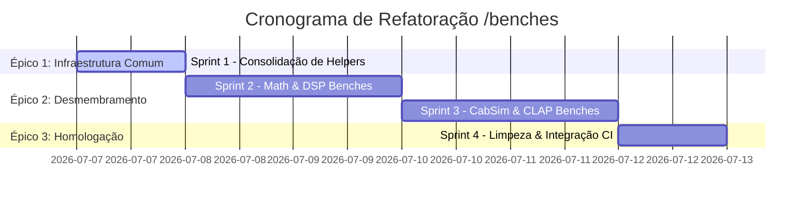

<!--
SPDX-License-Identifier: Apache-2.0
Copyright (c) 2026 Fábio Henrique de Lima Silva (fhl.bsb@gmail.com) All rights reserved.
-->

# TODO-sprints: Planejamento Ágil para a Refatoração do Diretório `/benches`

Este cronograma detalha a decomposição das tarefas para refatoração e modularização da suíte de benchmarks, mitigando riscos e garantindo a integridade dos testes de regressão.

---

## 1. Visão Geral do Plano de Execução

A refatoração está dividida em **3 Épicos** e **4 Sprints** consecutivos, projetados para manter o código compilável a cada etapa.

---

## 2. Detalhamento dos Sprints e Tarefas Técnicas

### Épico 1: Consolidação da Infraestrutura Compartilhada

*Foco em remover duplicações e criar as bases comuns.*

#### Sprint 1: Criação do Módulo Comum e Higienização de Helpers

- **[X] Tarefa 1.1**: Criar o arquivo `benches/common.rs` que servirá de módulo de utilitários compartilhados para toda a suíte.
  - Implementar os geradores de dados sintéticos: `generate_sine_440hz` e builders de dados de modelo (`make_lstm_data`, `make_wavenet_dyn_data`, `make_wavenet_a2_dyn_data`).
  - Implementar os resolvedores de caminho de arquivo de modelo (`model_path`) e rotinas de warmup (`load_and_prewarm`).
  - *Referência*: [TODO-findings.md §3.1].
- **[ ] Tarefa 1.2**: Ajustar `benches/regression_gate.rs` para importar os utilitários de `benches/common.rs` e remover as definições locais duplicadas.
- **[ ] Tarefa 1.3**: Ajustar `benches/long_inference_bench.rs` para reutilizar as definições de `benches/common.rs` e remover código redundante.
- **Risco/Complexidade**: **Baixo**.
  > [IMPORTANT]
  > Como `regression_gate.rs` é o portão de performance principal da CI, esta etapa deve ser validada garantindo que a compilação do gate permanece intacta.

---

### Épico 2: Desmembramento de inference_bench.rs

*Foco na separação dos benchmarks em arquivos focados e atômicos.*

#### Sprint 2: Criação de `math_bench.rs` e `dsp_bench.rs`

- **[ ] Tarefa 2.1**: Criar o arquivo `benches/math_bench.rs` e mover:
  - Micro-benchmarks de funções de ativação (Tanh e Sigmoid) para AVX2 e AVX-512.
  - Micro-benchmarks de dot product isolados (`bench_dot_product_avx2_256`, etc.).
  - Declarar o alvo correspondente no `Cargo.toml`.
  - *Referência*: [TODO-findings.md §3.2].
- **[ ] Tarefa 2.2**: Criar o arquivo `benches/dsp_bench.rs` e mover:
  - Medições do `NamResampler` (bypass e resample com diferentes taxas).
  - Medições do `Gate FSM`.
  - Medições do tempo de gravação na telemetria (`LatencyHistogram`).
  - Declarar o alvo correspondente no `Cargo.toml`.
  - *Referência*: [TODO-findings.md §3.3].
- **Risco/Complexidade**: **Médio**. Requer atenção ao configurar as diretivas condicionais para instruções AVX-512 de forma a não quebrar o build em computadores que não possuem essa extensão de instrução.

#### Sprint 3: Criação de `cabsim_bench.rs` e `clap_bench.rs`

- **[ ] Tarefa 3.1**: Criar o arquivo `benches/cabsim_bench.rs` e extrair:
  - Benchmarks de convolução (Short, Medium, Long IR).
  - Benchmarks do tempo de construção/alocação do motor CabSim (`ConvEngine`).
  - Declarar o alvo correspondente no `Cargo.toml`.
  - *Referência*: [TODO-findings.md §3.4].
- **[ ] Tarefa 3.2**: Criar o arquivo `benches/clap_bench.rs` e mover:
  - O benchmark de processamento do bloco CLAP (`bench_clap_process_block_64samp`).
  - Mapear sob a feature condicional `#[cfg(feature = "clap-plugin")]`.
  - Declarar o alvo correspondente no `Cargo.toml`.
  - *Referência*: [TODO-findings.md §3.5].
- **Risco/Complexidade**: **Médio**.
  > [WARNING]
  > O arquivo `clap_bench.rs` deve lidar graciosamente com o mock da API de host CLAP quando a feature `clap-plugin` não estiver ativa no teste/bench, evitando falhas de importação de crates dependentes.

---

### Épico 3: Higienização e Homologação da Suite

*Foco na consolidação final e integração com a esteira automatizada.*

#### Sprint 4: Redução de `inference_bench.rs` e Integração de QA

- **[ ] Tarefa 4.1**: Limpar o arquivo principal `benches/inference_bench.rs`, mantendo estritamente benchmarks de inferência fim-a-fim de modelos neurais e comparativos (WaveNet, LSTM, A2, ConvNet, Linear, NonDist).
  - *Referência*: [TODO-findings.md §3.6].
- **[ ] Tarefa 4.2**: Atualizar o script de QA noturno [utils/tests-long.sh](file:///home/fabio/nam-rs/utils/tests-long.sh) na Fase 6 para executar as novas suítes criadas:
  - `cargo bench --features long_bench --bench math_bench`
  - `cargo bench --features long_bench --bench dsp_bench`
  - `cargo bench --features long_bench --bench cabsim_bench`
  - `cargo bench --features long_bench --bench clap_bench`
- **[ ] Tarefa 4.3**: Executar compilação sanitária (`cargo check --benches --all-features`) para homologar toda a suíte de medição.
- **Risco/Complexidade**: **Alto**.
  > [CAUTION]
  > A suíte noturna `tests-long.sh` não pode quebrar sob nenhuma circunstância. Todas as chamadas adicionadas devem ser robustas a falhas de arquivos de golden/fixtures ausentes.
