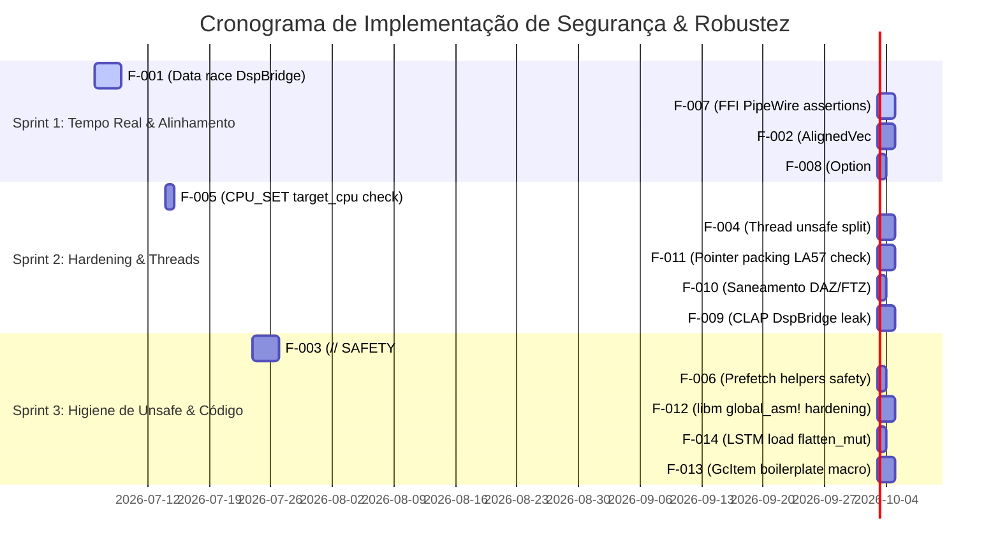

<!--
SPDX-License-Identifier: Apache-2.0
Copyright (c) 2026 Fábio Henrique de Lima Silva (fhl.bsb@gmail.com) All rights reserved.
-->

# TODO-sprints.md — Planejamento Ágil de Resiliência & Robustez

> Origem: Skill `planejador-arquiteto`
> Escopo: Organização dos achados de `TODO-findings.md` em Sprints e Tarefas Técnicas atômicas e estruturadas para mitigação sistemática e segura de riscos no NAM-rs.

Este documento planeja a execução das melhorias de resiliência e robustez detalhadas no [TODO-findings.md](file:///home/fabio/nam-rs/TODO-findings.md). As tarefas são divididas em três Sprints de acordo com a criticidade técnica, riscos associados e facilidade de verificação.

---

## Matriz de Sprints e Prioridades

---

## Sprint 1: Tempo Real Crítico & Segurança de Memória (Real-Time & Memory Safety)

**Objetivo:** Neutralizar potenciais causas de comportamento indefinido (UB), vazamento de memória do alinhador ou pânicos no thread de áudio de alta prioridade.

### T-101 (F-001) — Mitigação de Data Race no DspBridge entre Captura e Reprodução [DONE]

* **Criticidade:** Crítica / Risco Altíssimo (Pode corromper buffers de áudio por jitter de agendamento de streams PipeWire concorrentes).
* **Arquivos Afetados:**
  * [bridge.rs](file:///home/fabio/nam-rs/src/dsp/pipeline/bridge.rs) (Métodos `write_block`, `read_block`, estrutura `DspBridge`).
* **Abordagem Recomendada (Mitigação 2 & 4):**
  1. **Skip-on-overflow no Writer:** Modificar `write_block` para que, se `current_gen > consumed_gen` (quando o leitor atrasar significativamente por jitter), o bloco de áudio atual não seja gravado sobre o buffer ativo de leitura. Incrementar o contador de `dropped_frames` e retornar imediatamente. Isso previne o sobre-escrita do buffer do leitor ativo, convertendo UB em dropouts perfeitamente mensuráveis e seguros.
  2. **Refinamento de Orderings Atômicos (Mitigação 4):** Alterar o carregamento e armazenamento de `active_read_idx` de `Ordering::Relaxed` para `Ordering::Acquire` (no Reader) e `Ordering::Release` (no Writer) de forma a sincronizar a seleção de buffer sem dependência transitiva do contador de geração.
* **Plano de Verificação:**
  * Implementar teste de estresse em `tests/pipeline_soak.rs` que execute o Writer a 3× a taxa do Reader.
  * Verificar comportamento livre de concorrência indevida.
  * Executar via ThreadSanitizer se disponível (`RUSTFLAGS="-Zsanitizer=thread" cargo test --test pipeline_soak`).

### T-102 (F-007) — Validação de Contrato FFI no Caminho de Tempo Real (PipeWire Callback) [DONE]

* **Criticidade:** Alta / Risco Médio-Alto (Possível acesso desalinhado no casting para `&mut [f32]` em builds de release).
* **Arquivos Afetados:**
  * [process.rs](file:///home/fabio/nam-rs/src/standalone/pw_host/rt_callback/process.rs) (Substituição de `debug_assert!`).
* **Abordagem Recomendada:**
  1. Converter os quatro `debug_assert!` em verificações dinâmicas de tempo de execução (`if offset_l % 4 != 0 { ... }`).
  2. Caso ocorra uma violação do contrato de alinhamento ou limites fornecido pelo PipeWire, marcar uma flag de status de tempo real (`RT_STATUS_HOST_CONTRACT_VIOLATION`), escrever silêncio e abortar suavemente o ciclo atual sem pânico e sem dereferenciar ponteiros desalinhados.
* **Plano de Verificação:**
  * Criar teste unitário injetando pointers desalinhados no callback e garantir que o processamento rejeita de forma segura e não gera abort por desalinhamento SIMD.

### T-103 (F-002) — Correção Estrutural de Alocação e Desalocação no AlignedVec [DONE]

> **Conclusão (2026-07-06 T-103):**
>
> 1. **Campo `cap: usize`** adicionado à struct `AlignedVec` — armazena a capacidade real da alocação, não mais inferida de `len`.
> 2. **Overflow check** em `with_capacity`: multiplicação `capacity * size_of::<T>()` agora usa `checked_mul`, redirecionando para `handle_alloc_error` em caso de overflow (consistente com o comportamento existente para falha de alocação).
> 3. **`Drop` corrigido:** layout de desalocação calculado com `self.cap` em vez de `self.len`, eliminando o vazamento silencioso quando `with_capacity` era usado com `len=0` e o UB de layout incorreto quando `len < cap`.
> 4. **Accessor `cap()`** público adicionado para inspeção da capacidade alocada.
> 5. **8 novos testes unitários** cobrindo: `with_capacity` (cap set, zero case), `drop` com capacidade excedente, construtores (`new`, `clone`, `resize`, `from_vec`) com verificação `len==cap`, e alinhamento de 64 bytes. 11 testes totais no módulo, todos passam.
> 6. **Sem regressões:** 1089+ testes do projeto passam; lints (fmt, SPDX, check×4, clippy×4) limpos.
>
> * **Criticidade:** Alta / Risco Médio (Pode causar leaks silenciosos ou dealloc com Layout incorreto quando `len != capacity`).
> * **Arquivos Afetados:**
>   * [aligned.rs](file:///home/fabio/nam-rs/src/math/common/aligned.rs) (Campos e drop de `AlignedVec`).
> * **Abordagem Recomendada:**
>   1. Introduzir o campo `cap: usize` na struct `AlignedVec`.
>   2. Atualizar todos os construtores (`new`, `with_capacity`, `from_vec`, `clone`, `resize`) para preencher `cap`.
>   3. Modificar a implementação de `Drop` para computar o layout de desalocação utilizando `self.cap` em vez de `self.len`.
>   4. Tratar potenciais overflows de multiplicação em `with_capacity` retornando um erro controlado ou acionando `handle_alloc_error`.
> * **Plano de Verificação:**
>   * Criar teste unitário em `aligned.rs` que aloca `AlignedVec` com capacidade excedente, altera o comprimento (len), dropa o vetor e verifica se a memória de capacidade inteira foi desalocada adequadamente (ex: mock ou instrumentação de alloc).

### T-104 (F-008) — Eliminação de unwrap() no Caminho de Tempo Real (Oversampling & Cascades) [DONE]

> **Conclusão (2026-07-06 T-104):**
>
> 1. **`oversample.rs`:** Campos `stage1: Option<X2Stage>` e `stage2: Option<X2Stage>` substituídos pelo enum tipado `OsStages { Off, X2 { stage1 }, X4 { stage1, stage2 } }`. O `match &mut self.stages` em `upsample()` e `downsample()` elimina 6 `unwrap()`s — o discriminante do enum é garantia em tempo de compilação de que os estágios (quando presentes) são sempre válidos.
> 2. **`cascade.rs`:** Padrão `is_some()` + `unwrap()` unificado em `if let Some(cond_dsp) = self.condition_dsp.as_mut()`.
> 3. **`process.rs`:** Idem — `if let Some(cond_dsp) = self.condition_dsp.as_mut()`; a flag booleana `use_cond_dsp` é mantida separadamente via `self.condition_dsp.is_some()` para uso em `layer_forward_dispatch`.
> 4. **Verificação:** `cargo check` limpo; `rg unwrap\(\)` confirma zero chamadas `unwrap()` nos três arquivos; 12 testes de oversampling + 1 teste de cascade GC passam; full suite de 1089 testes da lib sem regressões.

* **Criticidade:** Média / Risco Baixo-Médio (Prevenção de pânico destrutivo no thread de áudio).
* **Arquivos Afetados:**
  * [oversample.rs](file:///home/fabio/nam-rs/src/dsp/oversample.rs) (Chamadas `unwrap()`).
  * [cascade.rs](file:///home/fabio/nam-rs/src/models/a2/model/cascade.rs)
  * [process.rs](file:///home/fabio/nam-rs/src/models/a2/model/dynamic/process.rs)
* **Abordagem Recomendada:**
  1. No oversampling, reestruturar as etapas por meio de um Enum tipado (ex. `OsStages { Off, X2 { stage1: Stage }, X4 { stage1: Stage, stage2: Stage } }`) para eliminar a necessidade de `Option::unwrap` no loop de processamento.
  2. Onde a refatoração por Enum for complexa a curto prazo, substituir o `unwrap()` por correspondência segura (`if let Some(s) = ...`) com fallback para silêncio e report de erro.
  3. Em `cascade.rs` e `process.rs`, unificar a checagem `is_some()` e a desestruturação em um único `if let Some(...)`.
* **Plano de Verificação:**
  * `cargo check` e garantir a ausência de chamadas unwraps nos arquivos modificados usando `rg unwrap`.

---

## Sprint 2: Hardening de Plataforma & Configurações de Threads (Hardening & Threads)

**Objetivo:** Aprimorar as barreiras defensivas do sistema operacional, tratamento de afinidade de CPU e alocação do DspBridge de acordo com o ambiente (standalone vs plugin).

### T-201 (F-005) — Validação de Limites de CPU para CPU_SET no rt_setup [DONE]

* **Criticidade:** Média / Risco Médio (Evita corrupção de memória por estouro de pilha na chamada FFI de macro `CPU_SET`).
* **Arquivos Afetados:**
  * [thread.rs](file:///home/fabio/nam-rs/src/standalone/rt_setup/thread.rs).
* **Abordagem Recomendada:**
  1. Obter o limite de CPUs do sistema usando `sysconf` ou consultar `libc::CPU_SETSIZE`.
  2. Adicionar uma validação explícita para garantir que `target_cpu < CPU_SETSIZE`.
  3. Se a validação falhar, emitir log estruturado com código de erro `E2301` e falhar silenciosamente para ausência de afinidade, sem executar `CPU_SET` fora de limites.
* **Plano de Verificação:**
  * Adicionar teste unitário que simula a configuração de um `target_cpu` inválido (ex: 2048) e assegurar que o setup não pânica e cai de volta na configuração padrão.

### T-202 (F-004) — Redução do Escopo de unsafe em configure_realtime_thread

* **Criticidade:** Média / Risco Baixo (Higiene e legibilidade do código).
* **Arquivos Afetados:**
  * [thread.rs](file:///home/fabio/nam-rs/src/standalone/rt_setup/thread.rs).
* **Abordagem Recomendada:**
  1. Reduzir o grande bloco `unsafe` que envolve toda a inicialização da thread tempo real.
  2. Criar blocos `unsafe` ultra específicos ao redor de cada chamada direta de libc (ex. `pthread_setaffinity_np`, `pthread_setschedparam`).
  3. Manter o fluxo de controle de erros, logs (`log::info!`) e leitura de variáveis atômicas em código estritamente seguro.
* **Plano de Verificação:**
  * Validar que o código continua compilando e aplicando as prioridades normalmente.

### T-203 (F-011) — Validação da Assunção de Ponteiros de 56 bits para o Garbage Collector

* **Criticidade:** Baixa-Média / Risco Baixo-Médio (Defesa contra arquiteturas futuras ou modos de paginação que utilizem o bit 56).
* **Arquivos Afetados:**
  * [gc.rs](file:///home/fabio/nam-rs/src/common/spsc/gc.rs).
* **Abordagem Recomendada:**
  1. Adicionar um `debug_assert!` em `into_packed` verificando que `(ptr as u64) < (1u64 << 56)`.
  2. Documentar de forma clara nos comentários de `into_packed` e `from_packed` a limitação de paginação e dependência da arquitetura LA57 do Linux.
* **Plano de Verificação:**
  * Executar suite de testes do GC com asserts ativos.

### T-204 (F-010) — Otimização e Saneamento da Configuração DAZ/FTZ

* **Criticidade:** Baixa / Risco Baixo (Evitar chamadas redundantes e poluição de unsafe no loop de tempo real).
* **Arquivos Afetados:**
  * [process.rs](file:///home/fabio/nam-rs/src/standalone/pw_host/rt_callback/process.rs).
* **Abordagem Recomendada:**
  1. Como DAZ/FTZ são configurados na inicialização do thread de processamento tempo real, remover a reconfiguração redundante periódica (`frame_count & 0x3FF == 0`).
  2. Alternativamente, manter a verificação apenas como uma asserção de diagnóstico de depuração e remover a modificação ativa do registrador MXCSR no loop de processamento de áudio se desnecessária.
* **Plano de Verificação:**
  * Executar testes de regressão de performance e verificar o perfil do processamento de áudio.

### T-205 (F-009) — Saneamento do Box::leak do DspBridge no Ciclo de Vida do CLAP

* **Criticidade:** Baixa / Risco Baixo (Evitar acumulação de vazamentos ao carregar/recarregar a instância de plugin CLAP na DAW).
* **Arquivos Afetados:**
  * [bridge.rs](file:///home/fabio/nam-rs/src/standalone/pw_host/bridge.rs)
  * Integração do CLAP.
* **Abordagem Recomendada:**
  1. Garantir que a alocação persistente com `Box::leak` de `DspBridge` ocorra estritamente no executável standalone (onde o tempo de vida é idêntico ao processo).
  2. Para a versão CLAP, gerenciar o tempo de vida do `DspBridge` associado à instância do plugin, liberando-o (`Box::from_raw`) adequadamente na destruição (`plugin_destroy`) para evitar vazamentos recorrentes em DAW.
* **Plano de Verificação:**
  * Verificar criação e destruição repetitiva da instância CLAP sob rastreamento de leaks (valgrind/heap-audit).

---

## Sprint 3: Higiene de Unsafe, Manutenibilidade e Limpeza (Unsafe Hygiene & Refactoring)

**Objetivo:** Garantir qualidade de engenharia de software de longo prazo, adequar comentários à política de conformidade de segurança e reduzir uso de unsafe redundante.

### T-301 (F-003) — Limpeza Geral de Comentários // SAFETY: Vazios ou Genéricos

* **Criticidade:** Média / Risco Baixo (Preencher requisitos de auditoria e clareza de unsafe).
* **Arquivos Afetados:**
  * Multi-arquivo (foco inicial em [aligned.rs](file:///home/fabio/nam-rs/src/math/common/aligned.rs), [ops.rs](file:///home/fabio/nam-rs/src/math/common/ops.rs), [bridge.rs](file:///home/fabio/nam-rs/src/dsp/pipeline/bridge.rs), [weights.rs](file:///home/fabio/nam-rs/src/loader/dispatcher/lstm/weights.rs)).
* **Abordagem Recomendada:**
  1. Executar varredura localizando os comentários genéricos e obsoletos.
  2. Substituir cada ocorrência por explicações semânticas detalhadas sobre alinhamento, limites de fatias, não-sobreposição, ciclo de vida e concorrência que garantem a segurança do bloco.
* **Plano de Verificação:**
  * Acionar a skill `documentador` para atestar a conformidade e integridade dos comentários gerados.

### T-302 (F-006) — Saneamento de Helpers de Prefetch Seguros

* **Criticidade:** Baixa / Risco Baixo (Facilidade de manutenção, remoção de contaminação de unsafe).
* **Arquivos Afetados:**
  * [ops.rs](file:///home/fabio/nam-rs/src/math/common/ops.rs).
* **Abordagem Recomendada:**
  1. Transformar `prefetch_t0`, `prefetch_t1`, `prefetch_strategy_simple` e `prefetch_strategy_2stage` em funções públicas seguras (`pub fn`).
  2. Encapsular as chamadas internas de intrinsics de CPU (`_mm_prefetch`) que requerem `unsafe` dentro da implementação do corpo, preservando o alinhamento e assinaturas externas seguras.
* **Plano de Verificação:**
  * Assegurar que os testes e código consumidor continuam compilando normalmente.

### T-303 (F-012) — Hardening do Redirecionamento global_asm! do libm

* **Criticidade:** Baixa / Risco Baixo (Garantir estabilidade de compilação cruzada ou linkagem dinâmica em sistemas não-GNU).
* **Arquivos Afetados:**
  * [lib.rs](file:///home/fabio/nam-rs/src/lib.rs).
* **Abordagem Recomendada:**
  1. Condicionar o bloco de redirecionamento `global_asm!` a `#[cfg(all(target_os = "linux", target_env = "gnu"))]`.
  2. Adicionar tratamento em `build.rs` para atestar a compatibilidade do linker e, caso o compilador utilize musl libc, desativar automaticamente o redirecionamento para evitar erros de compilação.
* **Plano de Verificação:**
  * Compilar o projeto com o target musl e gnu de forma isolada, validando a ausência de linker errors.

### T-304 (F-014) — Uso de Flatten Seguro na Leitura de Camada LSTM

* **Criticidade:** Baixa / Risco Baixo (Melhorar legibilidade e remover unsafe onde a biblioteca padrão Rust oferece suporte seguro).
* **Arquivos Afetados:**
  * [weights.rs](file:///home/fabio/nam-rs/src/loader/dispatcher/lstm/weights.rs).
* **Abordagem Recomendada:**
  1. Substituir a inicialização via `from_raw_parts_mut` pelo método nativo e seguro `.as_flattened_mut()` (ou equivalentemente via slices seguras se a API estiver disponível para a MSRV do projeto).
* **Plano de Verificação:**
  * Garantir que o parser de modelos continue lendo e carregando os pesos perfeitamente.

### T-305 (F-013) — Otimização e Simplificação do GcItem Boilerplate

* **Criticidade:** Baixa / Risco Baixo (Melhorar a manutenibilidade para o suporte a novas mensagens do GC).
* **Arquivos Afetados:**
  * [gc.rs](file:///home/fabio/nam-rs/src/common/spsc/gc.rs).
* **Abordagem Recomendada:**
  1. Criar uma macro ou trait unificado que minimize o acoplamento estrutural em múltiplos matches ao adicionar novos itens no garbage collector.
* **Plano de Verificação:**
  * Executar a suite de testes existente de spsc gc.
