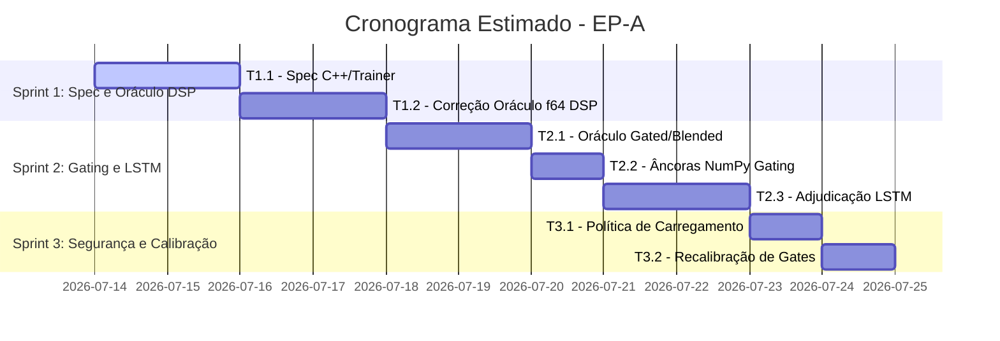

<!--
SPDX-License-Identifier: Apache-2.0
Copyright (c) 2026 Fábio Henrique de Lima Silva (fhl.bsb@gmail.com) All rights reserved.
-->

# TODO-sprints.md — Planejamento de Sprints & Tarefas Técnicas (EP-A)

Este documento detalha o planejamento ágil para a execução do **EP-A — Veredito do `condition_dsp` (F1 + F4)**, classificado como o núcleo desta rodada de auditoria de compliance e paridade.

Todas as referências de findings apontam para o arquivo [TODO-findings.md](file:///home/fabio/nam-rs/TODO-findings.md).

---

## Visão Geral do Épico EP-A

* **Objetivo:** Resolver a semântica sem árbitro confiável do sub-modelo `condition_dsp` (caso WaveNet e LSTM) e corrigir as discrepâncias do oráculo f64 nos modos de gating (Gated/Blended).
* **Risco:** **Médio-Alto**. Mexer no oráculo f64 altera o pilar de medição e validação do projeto. A principal mitigação é usar os fixtures golden-validados existentes como critério objetivo de aceitação, garantindo que a produção nunca seja alterada para "concordar" com um oráculo potencialmente incorreto.
* **Critério de Fechamento:**
  1. Dashboard de qualidade sem nenhum valor "vs Ideal" maior que `1e-6` para as famílias avaliadas.
  2. Sub-modelo `condition_lstm` com veredito definitivo documentado e gate real calibrado.

---

## Detalhamento das Sprints e Tarefas Técnicas

### Sprint 1: Especificação & Alinhamento do Oráculo DSP

**Foco:** Estabelecer a verdade matemática e corrigir o oráculo f64 para o caso `condition_dsp` padrão.

#### [DONE] Tarefa T1.1 — Especificação da Semântica de `condition_dsp`

* **Referência:** [F1.1](file:///home/fabio/nam-rs/TODO-findings.md#L67)
* **Responsável:** Engenheiro de DSP / Cientista
* **Complexidade:** Média
* **Descrição:**
  Analisar o código upstream em [model.cpp](file:///home/fabio/nam-rs/tests/fixtures/NeuralAmpModelerCore/NAM/wavenet/model.cpp#L700-L729) para mapear o dimensionamento e consumo do output de `condition_dsp` pela matriz de condicionamento.
  * Verificar o comportamento quando `out_channels > 1` (caso do WaveNet padrão com 3 canais) e quando o número de canais de saída é menor que `condition_size` (ex: LSTM retornando 1 canal enquanto o WaveNet espera `condition_size = 3`).
  * Investigar a semântica adotada no trainer Python oficial (`neural-amp-modeler`) para entender a intenção de treino nos casos de LSTM.
  * Documentar as descobertas detalhadamente em [docs/cpp_parity_map.md](file:///home/fabio/nam-rs/docs/cpp_parity_map.md).
* **Critério de Aceite:** Especificação formalizada e documentada com referências de arquivo e linha (file:line) do C++ e Python.

#### [DONE] Tarefa T1.2 — Correção do Oráculo f64 para `wavenet_condition_dsp`

* **Referência:** [F1.2](file:///home/fabio/nam-rs/TODO-findings.md#L76)
* **Responsável:** Engenheiro de Paridade
* **Complexidade:** Alta
* **Descrição:**
  Corrigir a lógica de processamento do `condition_dsp` e o respectivo broadcast no oráculo f64 em [wavenet.rs](file:///home/fabio/nam-rs/src/testing/reference_oracle/wavenet.rs#L32) e [a2.rs](file:///home/fabio/nam-rs/src/testing/reference_oracle/a2.rs#L289).
  * Ajustar a âncora em Python em `validate_oracle_f64.py` para refletir a mesma semântica corrigida.
  * Validar contra o fixture golden-validado [golden_wavenet_condition_dsp.bin](file:///home/fabio/nam-rs/tests/fixtures/golden_wavenet_condition_dsp.bin).
* **Critério de Aceite:** ESR do par produção × oráculo f64 cair de `4.21e+01` para o patamar aceitável de paridade de ruído f64/f32 ($\le 1\times10^{-11}$).

---

### Sprint 2: Modos de Gating & Adjudicação do LSTM

**Foco:** Estender a correção do oráculo f64 para gating dinâmico e determinar se a produção diverge no caso LSTM.

#### [DONE] Tarefa T2.1 — Correção do Oráculo f64 para Gating (Gated / Blended)

* **Referência:** [F4](file:///home/fabio/nam-rs/TODO-findings.md#L136)
* **Responsável:** Engenheiro de DSP
* **Complexidade:** Média-Alta
* **Descrição:**
  Corrigir as rotas de Gating (`GatingModeOracle::{Gated, Blended}`) no oráculo f64 [a2.rs](file:///home/fabio/nam-rs/src/testing/reference_oracle/a2.rs#L364-L415).
  * O oráculo atual para o modelo `a2_dynamic_blended_ch3` diverge em ESR `2.53e-1` e `a2_dynamic_gated_ch8` em `7.07e-7`, enquanto a produção atinge paridade quase perfeita com o C++ ($\le 5\times10^{-11}$).
  * Ajustar a lógica matemática de interpolação e soma do gating no oráculo para convergir com o motor de produção e o golden.
* **Critério de Aceite:**
  * Blended vs Golden C++ no oráculo: $\le 1\times10^{-12}$.
  * Gated vs Golden C++ no oráculo: $\le 1\times10^{-10}$.
* **Conclusão (2026-07-14):** Três bugs corrigidos no oráculo A2:
  1. **Mixin truncado em gating/blending:** o laço de mixin usava `z_out_ch.min(bottleneck)`, aplicando-se apenas aos primeiros `bottleneck` canais em vez dos `z_out_ch = 2*bottleneck` canais. Canais de gate/blend não recebiam contribuição do mixin. Corrigido em `a2.rs:753`.
  2. **Blending fórmula errada:** a fórmula antiga usava o valor bruto do canal de gate (`z_scratch[half + i]`) como "original" na interpolação — mas esse é o canal de gate, não o valor original da primeira metade. Corrigido para `original + alpha * (activated - original)`, que mantém o input original e interpola com alpha derivado da ativação correta (Tanh).
  3. **Secondary activation ausente:** o oráculo não lia `secondary_activation` do JSON, hardcodando sigmoid para gate (quando o modelo blended usa Tanh). Adicionada função `a2_read_secondary_activation` com fallback Sigmoid para entradas nulas.
  Resultados: Gated `7.07e-7 → 1.00e-10` (-100 dB) ✓, Blended `2.53e-1 → 2.65e-14` (-136 dB) ✓. Ambos dentro dos critérios de aceite.

#### [NEW] Tarefa T2.2 — Criação de Âncoras NumPy para Gating

* **Referência:** [F4.2](file:///home/fabio/nam-rs/TODO-findings.md#L149)
* **Responsável:** Engenheiro de Testes
* **Complexidade:** Baixa-Média
* **Descrição:**
  Criar scripts e arquivos de âncora NumPy equivalentes para os modos Gated e Blended (que hoje não possuem cobertura de âncora no pipeline do oráculo).
* **Critério de Aceite:** Âncoras NumPy executadas e integradas ao pipeline de verificação automatizada de oráculo com ESR $\le 1\times10^{-15}$ contra o oráculo Rust corrigido.

#### [NEW] Tarefa T2.3 — Re-adjudicação de `condition_lstm`

* **Referência:** [F1.3](file:///home/fabio/nam-rs/TODO-findings.md#L80)
* **Responsável:** Engenheiro de Paridade
* **Complexidade:** Alta (Risco Técnico Elevado)
* **Descrição:**
  Com o oráculo f64 corrigido e validado matematicamente na Sprint 1, executar o teste [test_decomposition_wavenet_condition_lstm](file:///home/fabio/nam-rs/tests/parity/reference_oracle_f64.rs#L1026).
  * Analisar a ESR resultante:
    * **Cenário A (Divergência desaparece):** O antigo "dispatcher bug" reportado era apenas um artefato decorrente das falhas do oráculo. Ação: remover o `#[ignore]` e documentar o resultado.
    * **Cenário B (Divergência persiste):** Existe de fato um bug de processamento em produção (ex: no dispatcher/broadcast in-place do LSTM em [model_dyn.rs](file:///home/fabio/nam-rs/src/models/wavenet/model_dyn.rs#L240-L247)). Ação: Corrigir o código de inferência em produção para alinhar com o oráculo e os pesos corretos.
* **Critério de Aceite:** Teste reativado e passando com o veredito lógico documentado.

---

### Sprint 3: Políticas de Proteção & Recalibração de Gates

**Foco:** Garantir a robustez de segurança contra regressões e calibrar thresholds de produção reais.

#### [NEW] Tarefa T3.1 — Política de Carregamento de Modelos LSTM `condition_dsp`

* **Referência:** [F1.4](file:///home/fabio/nam-rs/TODO-findings.md#L83)
* **Responsável:** Arquiteto / Engenheiro de Sistemas
* **Complexidade:** Baixa
* **Descrição:**
  Implementar decisão de produto em relação aos modelos com LSTM `condition_dsp`.
  * Se o suporte do upstream (C++) for julgado permanentemente quebrado/incompatível, avaliar a rejeição desses modelos `.nam` no carregamento (fail-closed) com uma mensagem informativa clara.
  * Alternativamente, emitir um `Warning` de carregamento (advisory) e marcar o modelo como "sob investigação" na malha e dashboard de qualidade.
* **Critério de Aceite:** Código de carregamento validado com o comportamento escolhido coberto por testes unitários de erro.

#### [NEW] Tarefa T3.2 — Recalibração de Gates de Qualidade do LSTM e Contrato

* **Referência:** [F1.5](file:///home/fabio/nam-rs/TODO-findings.md#L87)
* **Responsável:** Engenheiro de Qualidade
* **Complexidade:** Média
* **Descrição:**
  Calibrar novamente os thresholds do modelo `wavenet_condition_lstm` em [tests/common/validation.rs](file:///home/fabio/nam-rs/tests/common/validation.rs#L701).
  * Eliminar os gates placebo vigentes (SNR $\ge$ 5 dB e MR-STFT < 0.80) e gravá-los com pisos reais medidos pós-veredito estável.
  * Regravar o contrato de qualidade atualizado em `docs/quality-contract.txt`.
* **Critério de Aceite:** Execução limpa do script `./utils/tests-quick.sh` com o contrato verificado e gates reais validados.
