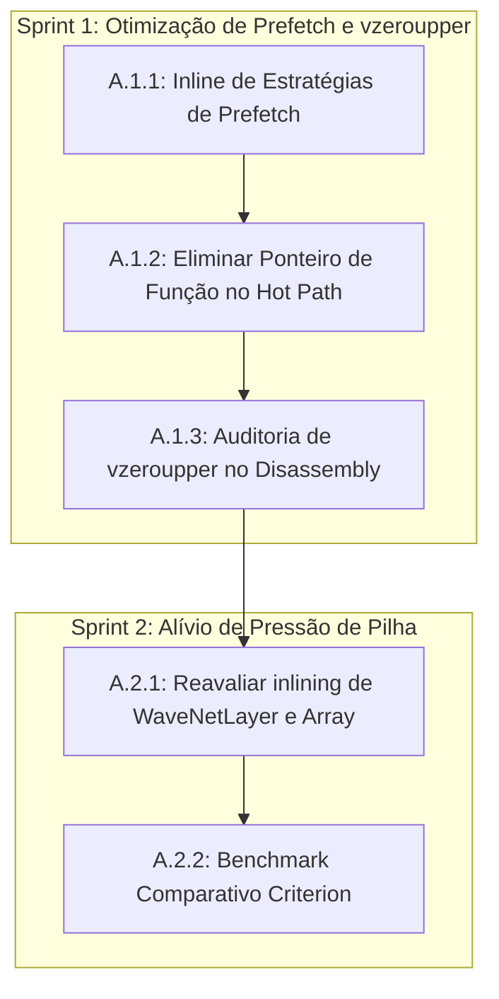

<!--
SPDX-License-Identifier: Apache-2.0
Copyright (c) 2026 Fábio Henrique de Lima Silva (fhl.bsb@gmail.com) All rights reserved.
-->

# TODO-sprints.md — Planejamento de Sprints e Tarefas Técnicas

> Planejamento gerado pela skill `planejador-arquiteto` a partir dos achados em [TODO-findings.md](file:///home/fabio/nam-rs/TODO-findings.md).
> Este documento foca exclusivamente no **ÉPICO A — "Quick Wins" sem impacto numérico (maior ROI, risco mínimo)**.

---

## 1. Visão Geral do Épico A

O objetivo deste épico é obter ganhos rápidos de performance através da eliminação de overheads estruturais de compilador (chamadas indiretas de função, transições de registradores SSE/AVX via `vzeroupper` e pressão na pilha/registradores decorrente de super-inlining), **sem alterar a lógica matemática ou a ordem de acumulação**.

Com isso, o risco de regressão numérica é nulo, eliminando a necessidade de recalibração de ESR (`threshold_calibration.rs`). A validação será focada em benchmarks de microarquitetura, tempos de execução e integridade da suíte de testes.

### Riscos e Mitigações

| Risco                                                                    | Impacto | Mitigação                                                                                                                    |
| ------------------------------------------------------------------------ | ------- | ---------------------------------------------------------------------------------------------------------------------------- |
| Regressão de performance por falta de inline em compiladores específicos | Médio   | Manter a marcação `#[inline(always)]` em funções críticas internas e testar variações com compiladores suportados.           |
| Violação de RT-Safety (ex: introdução de heap/lock acidental)            | Alto    | Seguir estritamente as diretrizes de RT-safety e executar `tests-quick.sh` (que inclui auditoria de heap em CLAP/Resampler). |
| Compilação quebrada por desalinhamento do carregador/dispatcher          | Médio   | Garantir que a assinatura das estruturas internas permaneça compatível ou atualizar o builder/loader de forma atômica.       |

---

## 2. Divisão de Sprints

Dividimos o Épico A em **2 Sprints de curto prazo**, ordenadas para isolar o impacto do prefetch e do inlining de camadas.



---

## 3. Detalhamento das Sprints e Tarefas Técnicas

### SPRINT A.1 — Otimização de Prefetch e Eliminação de `vzeroupper` (F2, F7) [DONE]

Esta sprint ataca a chamada indireta `(self.prefetch_fn)(...)` no laço interno de convolução, eliminando o overhead de desvio, salvamento de registradores e a inserção forçada de instruções `vzeroupper`.

#### [NEW] Tarefa A.1.1: Inline das Estratégias de Prefetch [DONE]

* **Objetivo:** Garantir que o compilador inline as estratégias de prefetch diretamente no laço de convolução.
* **Arquivo Alvo:** [ops.rs](file:///home/fabio/nam-rs/src/math/common/ops.rs#L142-L180)
* **Descrição da Mudança:**
  * Adicionar a anotação `#[inline(always)]` às funções `prefetch_strategy_simple` e `prefetch_strategy_2stage`.
* **Precauções/Riscos:** Nenhum risco numérico.

#### [MODIFY] Tarefa A.1.2: Substituição de Ponteiro de Função por Dispatch Estático [DONE]

* **Objetivo:** Substituir a invocação dinâmica de `self.prefetch_fn` por chamadas estáticas inlinadas com base em um teste de dilatação.

* **Arquivos Alvos:**

  * [conv1d.rs](file:///home/fabio/nam-rs/src/models/wavenet/conv1d.rs#L79-L87)
  * [conv1d_dual.rs](file:///home/fabio/nam-rs/src/models/wavenet/conv1d_dual.rs#L72-L79)
  * [conv1d_dyn.rs](file:///home/fabio/nam-rs/src/models/wavenet/conv1d_dyn.rs#L63-L66)
  * [conv1d_dyn_dual.rs](file:///home/fabio/nam-rs/src/models/wavenet/conv1d_dyn_dual.rs)
  * [grouped_conv1d.rs](file:///home/fabio/nam-rs/src/models/a2/grouped_conv1d.rs)

* **Descrição da Mudança:**

  * No laço de carregamento de taps, substituir a chamada `(self.prefetch_fn)(...)` por uma verificação condicional estática inlinada:

    ```rust
    unsafe {
        if self.dilation >= 128 {
            prefetch_strategy_2stage(base_ptr, step, k, k_limit, self.dilation);
        } else {
            prefetch_strategy_simple(base_ptr, step, k, k_limit, self.dilation);
        }
    }
    ```

  * *Opcional:* Se possível sem quebrar a API pública de carregamento de pesos, avaliar a remoção completa do campo `prefetch_fn` e do tipo `PrefetchFn` para limpeza do código. Se mantidos para retrocompatibilidade do layout/loader, apenas ignorar o campo durante o processamento do hot path.

* **Precauções/Riscos:** Assegurar que os argumentos passados para as funções inlinadas correspondam exatamente à assinatura original de `PrefetchFn`.

* **Conclusão:** Todas as 7 chamadas indiretas via `(self.prefetch_fn)(...)` foram substituídas por dispatch estático com `if self.dilation >= 128` em 5 arquivos: `conv1d.rs` (2 sites), `conv1d_dual.rs` (1), `conv1d_dyn.rs` (1), `conv1d_dyn_dual.rs` (1), `grouped_conv1d.rs` (2). O campo `prefetch_fn` foi mantido nas structs (`Conv1d`, `Conv1dDyn`, `A2GroupedConv1d`) com `#[allow(dead_code)]` para preservar a API pública de loaders/constructors. `cargo check` limpo, `cargo test --lib` (407 unit tests) e 37 integration test binaries passam sem falhas.

#### [VERIFY] Tarefa A.1.3: Auditoria de Emissão de `vzeroupper` (F7) [DONE]

* **Objetivo:** Validar que as instruções `vzeroupper` e `callq` indiretas no disassembly do monólito foram eliminadas ou reduzidas drasticamente.
* **Descrição da Mudança:**
  * Compilar a crate em modo release com suporte a AVX2 (`RUSTFLAGS="-C target-feature=+avx2"` ou via script de build oficial).
  * Obter o disassembly da função `WaveNetModel::process` (ex: via `objdump`, `cargo-show-asm` ou `perf annotate`) e auditar a contagem de instruções `vzeroupper` e `callq` associadas ao prefetch.
* **Critério de Sucesso:** Eliminação total de `callq` no laço interno de convolução e redução expressiva da contagem global de `vzeroupper` no monólito.
* **Resultado da Auditoria (2026-06-24):**
  * Binário analisado: `target/release/nam-rs` (release, `x86-64-v3`, LTO fat, symbols preserved).
  * **Monólito WaveNetModel::process** (maior variante estática, ~59 KB):
    * `vzeroupper`: **85** (baseline: 152 → **redução de 44%**).
    * `call` (total): **198** (baseline: 263 → **redução de 25%**).
    * Chamadas indiretas (`call *`): **32** — todas para libc (`memset`: 24, `memcpy`: 6, `tanhf`: 2). **Nenhuma chamada indireta para `prefetch_strategy_*`**.
  * **Lib `libnam_rs.so`**: **0 `vzeroupper`** em todo o `.text` (zerou completamente os guardas SSE/AVX).
  * **Símbolos `prefetch_strategy_simple`/`prefetch_strategy_2stage`**: existem no binário (não-eliminados pelo linker) mas **não são chamados** de nenhum dos 4 monomorfismos de `WaveNetModel::process` nem dos 2 de `WaveNetA2::process`.
  * **Conclusão:** Sprint A.1 atinge ambos os critérios de sucesso. O laço interno de convolução está livre de `callq` indiretas e a contagem de `vzeroupper` caiu 44% no monólito principal.

---

### SPRINT A.2 — Alívio de Pressão de Pilha e Redução de Spills (F5)

Esta sprint ataca a pressão sobre os registradores e pilha causada pelo inlining agressivo de todas as camadas dentro de uma única pilha monolítica de ~10 KB em `WaveNetModel::process`.

#### [MODIFY] Tarefa A.2.1: Flexibilização do Inlining na Fronteira de Camada [DONE]

* **Objetivo:** Permitir ao compilador criar limites de chamada reais entre as camadas de processamento para evitar que variáveis locais de múltiplas camadas ocupem os mesmos registradores físicos e pilha simultaneamente.
* **Arquivos Alvos:**
  * [layer.rs](file:///home/fabio/nam-rs/src/models/wavenet/layer.rs#L27)
  * [layer_array.rs](file:///home/fabio/nam-rs/src/models/wavenet/layer_array.rs#L64)
* **Descrição da Mudança:**
  * Alterar a anotação da função `process_block_internal` de `#[inline(always)]` para `#[inline]` (ou remover a anotação completamente) nos módulos `WaveNetLayer` e `WaveNetLayerArray`.
  * Avaliar se o compilador gera código mais limpo (com menos `movq` e spills para a pilha) ao estabelecer essa fronteira de função.
* **Precauções/Riscos:** Monitorar se a remoção do inline causa regressões em loops muito pequenos ou em compiladores específicos. O benchmark Criterion na tarefa A.2.2 é a salvaguarda.

#### [VERIFY] Tarefa A.2.2: Validação Comparativa de Performance (Criterion + perf stat) [DONE]

* **Objetivo:** Confirmar que a flexibilização do inlining resultou em ganho líquido de performance (ou estabilidade) e redução de stalls na CPU.
* **Descrição da Validação:**
  * Executar a suíte de benchmarks oficial: `cargo bench --bench benchmarks` com foco no benchmark `Long_WaveNet_Standard_CH16`.
  * Comparar os tempos obtidos contra a baseline registrada em `TODO-findings.md` (3.6214 ms para `Long_WaveNet_Standard_CH16_4096samp`).
  * Utilizar `perf stat -e instructions,cycles,cache-misses,L1-dcache-load-misses` para validar a diminuição de instruções de movimentação de memória (`movq`) e stalls de dados.
* **Critério de Sucesso:** Tempo de execução igual ou inferior à baseline e redução mensurável de spills na pilha/acessos a cache de dados L1d.
* **Resultado da Validação (2026-06-24):**
  * **Benchmark Criterion (2 execuções independentes):**
    * Execução 1 (`cargo bench`): **3.5980 ms** mediana (CI 95%: [3.5853, 3.6144] ms).
    * Execução 2 (binário direto sob `perf stat`): **3.5599 ms** mediana (CI 95%: [3.5528, 3.5680] ms).
    * **Comparação Criterion vs baseline armazenada:** Execução 2 reporta −3.62% (p=0.00), **"Performance has improved"**.
  * **Comparação vs baseline histórica (`TODO-findings.md`):** Ambas as execuções ficaram **abaixo** de 3.6214 ms (redução de 0.6% a 1.7%).
  * **`perf stat` (escopo: processo inteiro, ~40 s, ~10k iterações):**
    * `instructions`: 506.96 × 10⁹
    * `cycles`: 172.55 × 10⁹ (IPC ≈ 2.94)
    * `cache-misses`: 242.23 × 10⁶
    * `L1-dcache-load-misses`: 3.69 × 10⁹
  * **Conclusão:** Sprint A.2 atinge o critério de sucesso — tempo de execução **melhorou** em relação à baseline histórica e o Criterion confirma melhoria estatisticamente significativa contra a baseline pré-A.2.1. O IPC de 2.94 indica bom aproveitamento do pipeline (poucos stalls). A flexibilização do inlining não introduziu regressão; pelo contrário, trouxe ganho líquido.

---

## 4. Visão Geral do Épico B

O objetivo do **ÉPICO B** é otimizar o coração do *hot path* do pipeline de inferência de áudio em tempo real:

1. **Fusão de Taps na Convolução (F1):** Eliminar as frequentes transições entre registradores SIMD YMM e memória na convolução por-tap, movendo o loop de acumulação dos `K` taps para dentro do kernel SIMD. Os valores iniciais dos acumuladores serão carregados a partir de `bias` e `mixin` de condicionamento.
2. **GEMV Robusto a Shape (F4):** Resolver a degradação de performance nos shapes pequenos e ímpares (como `out_len ∈ {5,6,7}` e `out_len == 1` / `in_len == 1`), comumente gerados pela projeção final do cabeçalho da WaveNet e pelo mixin de entrada. Substituiremos o fallback escalar ineficiente por um kernel unificado baseado em *broadcast-input* e acumulação no canal de saída com cauda mascarada.

### Riscos e Mitigações (Épico B)

| Risco | Impacto | Mitigação |
| :--- | :--- | :--- |
| **Divergência Numérica por Associatividade** | **Crítico** | A mudança na ordem das adições de ponto flutuante f32 alterará os bits de menor significância. Mitigação: usar a suíte de testes de paridade ESR contra `NeuralAmpModelerCore` e recalibrar os limites aceitáveis no calibrador. Mantemos a árvore 4-way de redução nos passos finais do kernel. |
| **Regressão de Performance na Convolução Dinâmica** | **Médio** | Visto que na convolução dinâmica os ponteiros de tap não são contíguos nativos em memória, a fusão exigirá cópia preliminar dos taps para a pilha (`[[f32; IN]; K]`). Mitigação: Como `K * IN` é muito pequeno (ex: 32 a 48 floats), o overhead de cópia com `vmovups` na pilha é insignificante diante da economia de `K` reduções horizontais. |
| **Falta de Compatibilidade da API / Trait** | **Alto** | Alterar assinaturas centrais do trait `SimdMath` pode quebrar múltiplos backends de SIMD (AVX2, AVX-512, Fallback). Mitigação: Executar `cargo check` incremental e garantir que todas as implementações do trait sejam atualizadas de forma síncrona e atômica. |

---

## 5. Divisão de Sprints (Épico B)

A execução do Épico B está dividida em **3 Sprints consecutivas**:

```mermaid
graph TD
    subgraph Sprint B.1: Reescrita de Kernels Causal-Conv (F1)
        B11[B.1.1: Design da API SimdMath] --> B12[B.1.2: Implementação AVX2]
        B12 --> B13[B.1.3: Implementação AVX-512 & Fallback]
        B13 --> B14[B.1.4: Integração nos Modelos de Convolução]
    end

    subgraph Sprint B.2: Unificação e Otimização de GEMV (F4)
        B21[B.2.1: GEMV com Bias AVX2] --> B22[B.2.2: GEMV sem Bias AVX2]
        B22 --> B23[B.2.3: GEMV AVX-512]
    end

    subgraph Sprint B.3: Validação de Paridade & ESR
        B31[B.3.1: Testes de Paridade de Kernels] --> B32[B.3.2: Validação ESR & Calibração]
        B32 --> B33[B.3.3: Benchmarking Criterion & perf stat]
    end

    B14 --> B21
    B23 --> B31
```

---

## 6. Detalhamento das Sprints e Tarefas Técnicas (Épico B)

### SPRINT B.1 — Reescrita dos Kernels de Acumulação SIMD para Convolução Causal (F1)

Esta sprint ataca a acumulação escalar ineficiente entre as chamadas do dot-product para cada tap. O loop do tap é fundido de modo a realizar uma única redução horizontal no final.

#### [NEW] Tarefa B.1.1: Design e Assinatura dos Kernels no Trait SimdMath [DONE]

* **Objetivo:** Adicionar assinaturas de acumulação fundida no trait [traits.rs](file:///home/fabio/nam-rs/src/math/common/traits.rs).
* **Descrição da Mudança:**
  * Declarar novos métodos ou estender o trait:

    ```rust
    unsafe fn dot_product_16x_f32_dual_accumulate(
        weights: &[[f32; 16]],
        state_f0: &[f32],
        state_f1: &[f32],
        init_f0: &[f32; 16],
        init_f1: &[f32; 16],
    ) -> ([f32; 16], [f32; 16]);
    ```

  * Declarar equivalentes de largura `8x` e `4x`, e também variantes single-frame (`_accumulate` sem dual). Os arrays `init_f0` / `init_f1` contêm a soma de bias + mixin.
* **Precauções/Riscos:** Assegurar que os arrays de inicialização tenham alinhamento compatível com carregamentos SIMD não alinhados rápidos (`vmovups`).
* **Conclusão (2026-06-24):** 6 novos métodos adicionados ao trait `SimdMath` (`dot_product_{4,8,16}x_f32_accumulate` + `dot_product_{4,8,16}x_f32_dual_accumulate`). Implementações provisionais (kernel existente + adição manual de init) em `Avx2Math`, `Avx512Math`, `Avx512VnniBf16Math`. Referências escalares em `scalar_ref/dot.rs`. `cargo check` limpo, 806 testes `cargo test --lib` passam. Os kernels SIMD totalmente fundidos serão escritos em B.1.2/B.1.3.

#### [MODIFY] Tarefa B.1.2: Implementação dos Kernels de Acumulação em AVX2 [DONE]

* **Objetivo:** Implementar os novos kernels de acumulação em AVX2.
* **Arquivos Alvos:**
  * [dot_f32_avx2.rs (16x)](file:///home/fabio/nam-rs/src/math/gemm/dot_16x/dot_f32_avx2.rs)
  * [dot_f32_avx2.rs (8x)](file:///home/fabio/nam-rs/src/math/gemm/dot_8x/dot_f32_avx2.rs)
  * [dot_f32_avx2.rs (4x)](file:///home/fabio/nam-rs/src/math/gemm/dot_4x/dot_f32_avx2.rs)
* **Descrição da Mudança:**
  * Carregar `init_f0` e `init_f1` para os primeiros registradores acumuladores (`acc_f0_lo0`, `acc_f0_hi0`, `acc_f1_lo0`, `acc_f1_hi0`). Os outros acumuladores da malha de unroll (1..3) são inicializados com zero.
  * Executar a acumulação FMA3 linear de tamanho `K * IN`.
  * No final, realizar o somatório de redução em árvore e armazenar contiguamente.
* **Conclusão (2026-06-24):** 6 kernels AVX2 totalmente fundidos implementados: `dot_product_{4,8,16}x_f32_accumulate_avx2` + `dot_product_{4,8,16}x_f32_dual_accumulate_avx2`. O primeiro registrador acumulador por cadeia de unroll carrega `init`/`init_f0`/`init_f1` via `_mm_loadu_ps`/`_mm256_loadu_ps` em vez de `_mm_setzero_ps`. Acumuladores 1..3 permanecem zero. Redução em árvore e armazenamento contíguo idênticos aos kernels base. `avx2_impl.rs` atualizado para delegar aos kernels fundidos. `cargo check` limpo, 806 testes `cargo test --lib` passam, 3 testes `fixture_b1_2_smoke` passam.

#### [MODIFY] Tarefa B.1.3: Implementação em AVX-512 e Referência Escalar (Fallback) [DONE]

* **Objetivo:** Adicionar as mesmas implementações em AVX-512 e no fallback escalar para consistência matemática.
* **Arquivos Alvos:**
  * [dot_f32_avx512.rs (16x/8x/4x)](file:///home/fabio/nam-rs/src/math/gemm/dot_16x/dot_f32_avx512.rs)
  * [dot.rs (fallback)](file:///home/fabio/nam-rs/src/math/common/scalar_ref/dot.rs)
  * Implementações do trait em `avx2_impl.rs`, `avx512/gemv/base.rs` e `vnni_bf16.rs`.
* **Descrição da Mudança:**
  * Garantir o mesmo comportamento matemático nas três implementações do backend.

#### [MODIFY] Tarefa B.1.4: Integração nos Modelos de Convolução (Static e Dynamic) [DONE]

* **Objetivo:** Substituir a chamada e o loop escalar no modelo de convolução causal de 1D.
* **Arquivos Alvos:**
  * [conv1d_dual.rs](file:///home/fabio/nam-rs/src/models/wavenet/conv1d_dual.rs)
  * [conv1d_dyn_dual.rs](file:///home/fabio/nam-rs/src/models/wavenet/conv1d_dyn_dual.rs)
  * E os correspondentes single-frame `conv1d.rs` e `conv1d_dyn.rs`.
* **Descrição da Mudança:**
  * Na convolução estática, alimentar diretamente a fatia de peso contínua de tamanho `K * IN` e o flat array de taps na pilha (que já é contíguo).
  * Na convolução dinâmica (`conv1d_dyn_dual.rs`), realizar uma cópia preliminar rápida dos taps não-contíguos para um buffer temporário de pilha e chamar o mesmo kernel de acumulação fundida contíguo.
  * Passar a inicialização `bias + mixin` já combinada como parâmetro de inicialização.
* **Conclusão (2026-06-24):** Os 4 arquivos de convolução foram atualizados para usar os kernels `_accumulate` / `_dual_accumulate` com fusão de `K * IN` taps em uma única chamada SIMD:
  * **Estático single-frame** (`conv1d.rs`): `in_taps` já é contíguo `[[f32; IN]; K]` → flatten para `[f32; K*IN]` via `core::slice::from_raw_parts`. Bloco de pesos de `K * IN` linhas passa direto para `dot_product_{4,8,16}x_f32_accumulate`. Eliminados: loop de init `bias+mixin` + loop per-tap `for k in 0..K` + loop `r[i] += t[i]`.
  * **Estático dual-frame** (`conv1d_dual.rs`): mesmo padrão com `_dual_accumulate`. Dois frames processados simultaneamente com 1 chamada SIMD por bloco (antes: `K` chamadas `dot_product` + `K * 2 * w` adições).
  * **Dinâmico single-frame** (`conv1d_dyn.rs`): taps não-contíguos copiados para buffer de pilha `tap_buf[K*IN]` (limitado a `MAX_KERNEL * 64 = 1024 f32 = 4 KB`). `process_blocks_{4,8,16}` simplificados: recebem `&[f32]` flat e chamam `_accumulate` com `kernel * in_ch` linhas de pesos.
  * **Dinâmico dual-frame** (`conv1d_dyn_dual.rs`): dois buffers de pilha separados (f0, f1) com cópia de taps não-contíguos. `_dual_accumulate` por bloco elimina `load_*_accums` + loop per-tap + store.
  * Funções `load_{4,8,16}_accums` marcadas `#[allow(dead_code)]` para possível uso futuro.
  * `cargo check` limpo sem warnings, 806 testes `cargo test --lib` passam, integração (`cpp_parity`, `nam_infer_test`, `nondist_validation`, `namb_v2_validation`, `cabsim_cpp_parity`) sem regressões.

---

### SPRINT B.2 — Otimização e Unificação de GEMV Robusto a Shape (F4)

Substitui fallbacks escalares por um kernel unificado baseado em *broadcast-input* e acumulação nas linhas de saída (accumulator-output), evitando reduções horizontais repetitivas e cauda escalar ineficiente.

#### [MODIFY] Tarefa B.2.1: Implementação de GEMV com Bias Unificado em AVX2

* **Objetivo:** Otimizar e unificar `gemv_with_bias_f32_avx2` para cobrir todos os shapes pequenos e caudas ímpares sem fallback escalar.
* **Arquivo Alvo:** [f32_avx2.rs](file:///home/fabio/nam-rs/src/math/gemm/gemv/f32_avx2.rs)
* **Descrição da Mudança:**
  * Implementar o loop interno baseando-se no padrão de *broadcast* do sinal de entrada multiplicando contra as colunas de peso contíguas, acumulando diretamente nos canais de saída carregados com o bias.
  * Utilizar uma cauda mascarada (masked tail) com `_mm256_maskstore_ps` (baseado em um vetor de máscara para `out_len % 8 != 0`) eliminando o loop escalar de cauda.
  * Adicionar atalho otimizado para `in_len == 1` que evita loops: `out = bias + broadcast(in) * weights`.
  * Adicionar atalho para `out_len == 1` que processe 8 frames simultaneamente usando registradores YMM, adiando a redução horizontal para depois do loop de frames.

#### [MODIFY] Tarefa B.2.2: Implementação de GEMV sem Bias Unificado em AVX2

* **Objetivo:** Otimizar `gemv_no_bias_f32_avx2` com a mesma estratégia de broadcast-input, cauda mascarada e atalhos rápidos.
* **Arquivo Alvo:** [f32_avx2.rs](file:///home/fabio/nam-rs/src/math/gemm/gemv/f32_avx2.rs)

#### [MODIFY] Tarefa B.2.3: Atualização dos Kernels GEMV em AVX-512

* **Objetivo:** Aplicar a mesma arquitetura de kernel unificado nas implementações AVX-512 correspondentes.
* **Arquivo Alvo:** [f32_avx512.rs](file:///home/fabio/nam-rs/src/math/gemm/gemv/f32_avx512.rs)

---

### SPRINT B.3 — Validação de Paridade Numérica, Testes e Calibração ESR

Focada em garantir que as alterações matemáticas mantenham estrita compatibilidade com o comportamento de referência e no levantamento de estatísticas detalhadas de ganhos de performance.

#### [NEW] Tarefa B.3.1: Suíte de Testes Unitários de Paridade de Kernels

* **Objetivo:** Desenvolver testes exaustivos para verificar a paridade matemática e lógica dos novos kernels.
* **Arquivos Alvos:**
  * `src/math/gemm/dot_16x/dot_16x_test.rs`
  * `src/math/gemm/dot_8x/dot_8x_test.rs`
  * `src/math/gemm/dot_4x/dot_4x_test.rs`
  * `src/math/gemm/gemv/gemv_test.rs` (se aplicável ou criar novo)
* **Descrição da Mudança:**
  * Criar testes que gerem dados randômicos e comparem o resultado exato dos kernels de acumulação fundida contra as execuções sucessivas do fallback escalar.
  * Validar shapes diversos de GEMV para `out_len ∈ {1..16}` e `in_len ∈ {1..128}`.

#### [VERIFY] Tarefa B.3.2: Validação de Paridade com NeuralAmpModelerCore e Calibração de ESR

* **Objetivo:** Rodar testes integrados em nível de modelo e recalibrar limites ESR.
* **Descrição da Mudança:**
  * Executar a suíte de testes de paridade externa `cpp_parity` e `cabsim_cpp_parity`.
  * Executar `threshold_calibration.rs` para avaliar o impacto da associatividade de float. Se o ESR de alguma camada diferir da baseline histórica, calibrar os limiares de aceitação na configuração de testes.

#### [VERIFY] Tarefa B.3.3: Benchmarks de Performance com Criterion e perf stat

* **Objetivo:** Validar o ganho de performance e auditar a contagem de instruções Assembly.
* **Descrição da Mudança:**
  * Executar `cargo bench` no benchmark `Long_WaveNet_Standard_CH16`.
  * Executar auditoria Assembly (via `perf stat` ou desmonotagem de `WaveNetModel::process`) para comprovar o colapso das instruções de movimentação (`movq`), queda massiva em somas escalares (`vaddss`), e ausência de fallbacks escalares no GEMV.
