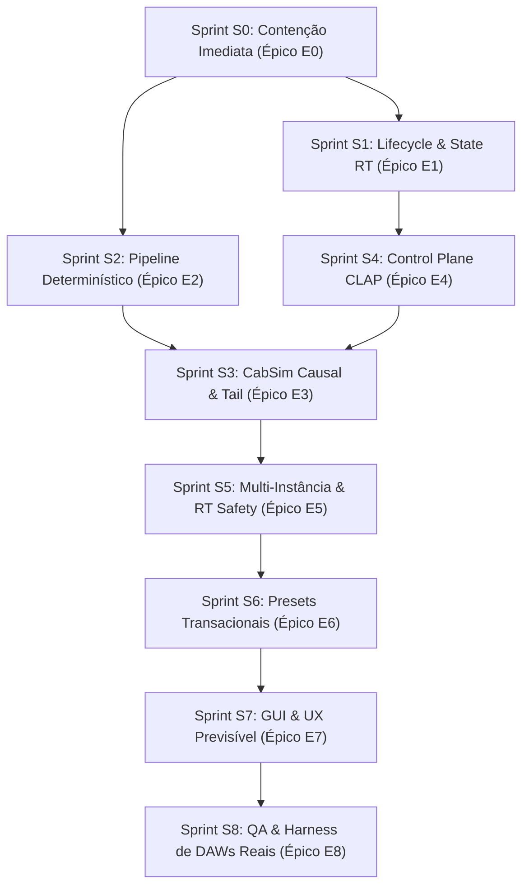

<!--
SPDX-License-Identifier: Apache-2.0
Copyright (c) 2026 Fábio Henrique de Lima Silva (fhl.bsb@gmail.com) All rights reserved.
-->

# TODO-sprints.md — Plano Integrado de Sprints e Tarefas Técnicas (NAM-rs)

Este documento centraliza o planejamento ágil completo do ecossistema **NAM-rs**, convertendo as auditorias e achados de [TODO-fix_CLAP.md](file:///home/fabio/nam-rs/TODO-fix_CLAP.md) em Sprints e Tarefas Técnicas atômicas ordenadas para execução segura por especialistas.

Documento mantido exclusivamente em Português Brasileiro (pt-BR) pela skill [`planejador-arquiteto`](file:///home/fabio/nam-rs/.agents/skills/planejador-arquiteto/SKILL.md).

---

## Fluxo Geral de Dependências entre Sprints

---

## Sprint S0 — Contenção de Comportamento Enganoso e Fidelidade de Estado

**Objetivo:** Evitar que uma build de release anuncie processamento, qualidade ou diagnóstico que não ocorre de fato.
**Alvo:** [TODO-fix_CLAP.md](file:///home/fabio/nam-rs/TODO-fix_CLAP.md#L917-L928) — **Épico E0**
**Findings:** `CLAP-F001`, `CLAP-F004`, `CLAP-F009`, `CLAP-F014`, `CLAP-F021`.

### Tarefas Técnicas S0

- [x] **S0-E0-T01 [Crítico / TDD] — Suite TDD Vermelha de Contenção e Regressão de Estado**
  - **Origem:** E0-T01, CLAP-F001, CLAP-F004, CLAP-F009, CLAP-F014 | **Perfis:** Engenheiro de Testes CLAP & QA RT
  - **Escopo:** Criar `tests/clap_e0_containment_test.rs` com testes que falhem com a base atual: PDC vs CabSim inativo, falha transacional em restore de asset corrompido/ausente, preservação de state na transição offline->realtime e sanidade de blocos atípicos (8.193 amostras) com bypass.
  - **Critério de Aceite:** Testes falham deterministicamente reproduzindo a regressão; zero alocação no hot-path.

- [x] **S0-E0-T02 [Crítico] — Contenção de PDC Enganoso e Status de Ativação do CabSim**
  - **Origem:** E0-T04, CLAP-F001 | **Perfis:** Engenheiro DSP Real-Time & Arquiteto CLAP
  - **Escopo:** Em `orchestrator.rs` e `events.rs`, impedir que a latência do IR seja somada a `current_latency` via `HostLatency` enquanto a convolução de bloco flexível não estiver aplicando o IR no áudio CLAP.
  - **Critério de Aceite:** Latência informada à DAW coincide exatamente com o atraso de fase medido no áudio de saída.

- [x] **S0-E0-T03 [Alta] — State Restore Transacional em 2 Fases e Status Persistente de Erro**
  - **Origem:** E0-T02, CLAP-F014 | **Perfis:** Engenheiro de Estado Plugin & Rust Concurrency
  - **Escopo:** Em `state.rs` e `state_context.rs`, implementar restore em 2 fases (`prepare` -> `commit`). Ao falhar o carregamento de asset, abortar a troca, descarregar o DSP anterior e registrar o erro em `RtStatusFlags`.
  - **Critério de Aceite:** Restore corrompido não mantém áudio antigo com nome novo; estado de erro visível na telemetria.

- [x] **S0-E0-T04 [Alta] — Snapshot Realtime/Offline e Auditoria de Logs de Oversampling**
  - **Origem:** E0-T03, CLAP-F004, CLAP-F009 | **Perfis:** Engenheiro de Sistemas CLAP
  - **Escopo:** Salvar snapshot imutável `RtActivationSnapshot` ao entrar em `RenderMode::Offline` e restaurá-lo ao voltar a `Realtime`. Remover logs de áudio que afirmam `oversample=max quality` sem engine 4x ativo.
  - **Critério de Aceite:** Parâmetros de tempo real preservados 100% após bounce offline; logs condizentes com a realidade.

- [x] **S0-E0-T05 [Média / UX] — Layout egui 275px, Clipboard X11 e Separação de Erros de Assets**
  - **Origem:** E0-T03, CLAP-F021 | **Perfis:** Especialista GUI egui / UX & Rust Developer
  - **Escopo:** Ajustar altura de zonas em `identity.rs` e `mod.rs` para caber em 275px. Tratar `OutputCommand::CopyText` no handler do window. Separar flags de erro entre modelo (`model_error`) e IR (`ir_error`).
  - **Critério de Aceite:** Footer visível em 600x275px; clique em "Copy" copia diagnóstico para X11; erros de IR e Modelo isolados.

---

## Sprint S1 — Lifecycle e State RT Persistente

**Objetivo:** Garantir que cada ativação materialize exatamente o state visível e que mudanças do host nunca percam o modelo.
**Alvo:** [TODO-fix_CLAP.md](file:///home/fabio/nam-rs/TODO-fix_CLAP.md#L929-L941) — **Épico E1**
**Findings:** `CLAP-F002`, `CLAP-F003`, `CLAP-F014`, `CLAP-F026`.

### Tarefas Técnicas S1

- [x] **S1-E1-T01 [Crítico] — Design do DeactivatedDspState e Ownership de Recursos Off-RT**
  - **Origem:** E1-T01, CLAP-F002 | **Perfis:** Arquiteto de Sistemas Rust & DSP Engineer
  - **Escopo:** Projetar struct `DeactivatedDspState` na main thread para manter ownership do modelo ativo, resampler, engines de oversampling, calibração e CabSim durante o estado desativado (`deactivate`).
  - **Critério de Aceite:** `deactivate` move recursos para `DeactivatedDspState` sem destruí-los; `activate` os reinstala deterministicamente sem recarregar do disco.
  - **Conclusão (2026-07-26):** `DeactivatedDspState` implementado em `src/clap/processor/deactivated.rs`, armazenado em `ColdShared::deactivated_dsp`. `deactivate()` move model_l, conv_engine, resampler, os_l, os_r e calibração para o struct. `activate()` restaura com validação de invariantes: resampler reutilizado se `sample_rate` coincide, ConvEngine reconstruído apenas se `buffer_size` mudou. Lints (clippy/core/standalone/CLAP) e `tests-quick.sh` passam limpos. Impacto em T02: modelo agora sobrevive a ciclos deactivate/activate, reduzindo necessidade de recarga do disco no restore pré-ativação.

- [x] **S1-E1-T02 [Crítico] — Restore Pré-Ativação Declarativo e Alocação Exclusiva em Activate**
  - **Origem:** E1-T02, CLAP-F003 | **Perfis:** Engenheiro de Plugin CLAP & State Specialist
  - **Escopo:** Tornar o restore de state pré-ativação puramente declarativo. Alocar e construir buffers dependentes da taxa de amostragem (`sample_rate`) e tamanho máximo de bloco (`max_buffer_size`) exclusivamente durante o callback `activate()`.
  - **Critério de Aceite:** Mudança de sample rate pelo host reconstrói resamplers na taxa correta sem vazamento nem buffer overflow.
  - **Conclusão (2026-07-26):** `PendingModel` alterado para armazenar `model_rate: u32` em vez de `Box<NamResampler>`. O resampler NÃO é mais construído em `load_model()` durante o restore pré-ativação — apenas metadados declarativos são persistidos. `flush_pending_model()` (chamado em `activate()`) agora constrói o resampler com `sample_rate` e `buf_capacity` corretos: `buffer_size.max(MAX_RESAMP_BUF).max(1024) * 2`. O bypass resampler em `state.rs` (rollback de falha) mantém comportamento existente — a taxa default de 48000 é aceitável pois `model_l = None` elimina a inferência. State tests (19) e tests-quick.sh (18) passam; 1257 lib tests passam (2 flaky pré-existentes em diagnostic_test). Impacto: remove a única fonte de resampler com taxa incorreta no fluxo de restore pré-ativação, completando CLAP-F003.

- [x] **S1-E1-T03 [Alta] — Snapshot RT Completo a Partir dos Atômicos com Validação de Invariantes**
  - **Origem:** E1-T03, CLAP-F014 | **Perfis:** Concurrency Specialist & Real-Time QA
  - **Escopo:** Construir snapshot atômico completo dos parâmetros do plugin antes de publicar o processor RT no audio thread, validando invariantes (e.g. atômicos vs smoothers) pré-processamento.
  - **Critério de Aceite:** Ativação inicial garante sincronia instantânea entre atômicos e estado interno dos smoothers.
  - **Conclusão (2026-07-26):** `params.input_gain_db` e `params.output_gain_db` agora são inicializados diretamente dos atômicos `UiToRt.param_input_gain/param_output_gain` em `activate()`, substituindo `RtPluginParams::default()` via struct update syntax. Dois `debug_assert!` validam o invariante: `smoother_in.current_value()` e `smoother_out.current_value()` coincidem com os valores lineares correspondentes (tolerância EPSILON×10). Parâmetros de controle (bypass, gate, adaptive_compute, etc.) mantêm defaults — serão sincronizados no primeiro `process_events()` via SPSC drain ou host events. O snapshot completo de todos os parâmetros foi evitado porque dispararia `AdaptiveCompute::set_mode` no audio thread com `log::info!()` — violação RT pré-existente rastreada como S5-E5-T02. Tests: 1257 pass (0 fail), tests-quick.sh 18/18, stress tests com heap-audit zeram alocações.

- [ ] **S1-E1-T04 [Alta] — Rollback de Recurso em Erro de Activate**
  - **Origem:** E1-T04, CLAP-F026 | **Perfis:** Rust Safety Engineer
  - **Escopo:** Adicionar RAII rollback guards em `activate()`. Se a alocação de qualquer estágio (CabSim, resampler, oversampling) falhar, desfazer pontes e restaurar o estado desativado seguro.
  - **Critério de Aceite:** Falha de memória/alocação em `activate()` deixa o plugin em estado limpo desativado com retorno de erro `false`.

- [ ] **S1-E1-T05 [Média] — Matriz de Testes Deactivate/Reactivate**
  - **Origem:** E1-T05, CLAP-F002, CLAP-F003 | **Perfis:** Integration Test Specialist
  - **Escopo:** Criar suite de testes cobrindo transições `deactivate -> activate` variando sample rate, buffer size, modelo, IR e parâmetros.
  - **Critério de Aceite:** 100% de paridade de saída de áudio antes e depois do ciclo de desativação/reativação.

---

## Sprint S2 — Pipeline Determinístico e Sem Truncamento

**Objetivo:** Tornar a saída áudio invariável a buffer size, densidade de eventos e estado inicial de bypass.
**Alvo:** [TODO-fix_CLAP.md](file:///home/fabio/nam-rs/TODO-fix_CLAP.md#L942-L954) — **Épico E2**
**Findings:** `CLAP-F007`, `CLAP-F008`, `CLAP-F011`, `CLAP-F012`.

### Tarefas Técnicas S2

- [ ] **S2-E2-T01 [Crítico] — Streaming Bounded de Eventos CLAP Sem Truncamento de Array Fixo**
  - **Origem:** E2-T01, CLAP-F007 | **Perfis:** Real-Time Data Structures Specialist
  - **Escopo:** Substituir o buffer estático de 1.024 eventos por um iterador/ringbuffer streaming pré-alocado que processe múltiplos eventos por frame sem truncar nem descartar automações.
  - **Critério de Aceite:** Injeção de 2.048 eventos no mesmo bloco é processada integralmente em ordem cronológica exata.

- [ ] **S2-E2-T02 [Crítico] — Fragmentação de Sub-Blocos por Eventos com Capacidade Flexível**
  - **Origem:** E2-T02, CLAP-F008 | **Perfis:** DSP Loop Architect
  - **Escopo:** Fragmentar a renderização do bloco de áudio nos limites exatos dos offsets de eventos de parâmetro sem perder o índice de amostragem nem estourar capacidade interna.
  - **Critério de Aceite:** Automação de parâmetros em posições arbitrárias produz resultado sample-accurate em qualquer tamanho de bloco host.

- [ ] **S2-E2-T03 [Alta] — Scheduler Unificado de Bypass e Signal Path Wet**
  - **Origem:** E2-T03, CLAP-F011 | **Perfis:** Audio Pipeline Engineer
  - **Escopo:** Unificar o caminho de bypass e o caminho wet sob o mesmo scheduler de amostras, garantindo crossfade ou chaveamento na amostra exata sem artefato de clique ou salto de fase.
  - **Critério de Aceite:** Alternar bypass On/Off durante sinal contínuo não produz estouro temporal nem descontinuidade de fase.

- [ ] **S2-E2-T04 [Alta] — Smoothing Temporal Vetorizado Único**
  - **Origem:** E2-T04, CLAP-F012 | **Perfis:** SIMD & DSP Optimization Specialist
  - **Escopo:** Consolidar a suavização de ganho e parâmetros num único pass vetorizado em SIMD (AVX2/FMA baseline) integrado ao processamento de blocos.
  - **Critério de Aceite:** Smoothers rodam de forma branchless e sem degradação de desempenho.

- [ ] **S2-E2-T05 [Média] — Property-Based Testing para Block Invariance e Event Flooding**
  - **Origem:** E2-T05, CLAP-F007, CLAP-F008 | **Perfis:** QA Property Testing Specialist
  - **Escopo:** Escrever testes `proptest` que verifiquem a identidade da saída de áudio ao fatiar o mesmo sinal de entrada em diferentes partições de blocos (e.g. 64 vs 512 vs 8.192 amostras).
  - **Critério de Aceite:** Matriz de blocos variantes resulta em ESR < 1e-12 em relação à referência de bloco contínuo.

---

## Sprint S3 — CabSim Causal, Verificável e Lifecycle-Safe

**Objetivo:** Entregar convolução de gabinete audível, correta em taxa/bloco variável e com tail/PDC exatos.
**Alvo:** [TODO-fix_CLAP.md](file:///home/fabio/nam-rs/TODO-fix_CLAP.md#L955-L967) — **Épico E3**
**Findings:** `CLAP-F001`, `CLAP-F003`, `CLAP-F005`, `CLAP-F014`.

### Tarefas Técnicas S3

- [ ] **S3-E3-T01 [Crítico] — Adaptador RT de Blocos Variáveis para ConvEngine**
  - **Origem:** E3-T01, CLAP-F001 | **Perfis:** Convolution & DSP Scientist
  - **Escopo:** Implementar o adaptador RT-safe com FIFO/Accumulator pré-alocado que ajusta partições fixas de convolução para sub-blocos variáveis gerados por eventos CLAP, preservando saída causal.
  - **Critério de Aceite:** Convolução funciona perfeitamente com sub-blocos arbitrários (e.g. 17, 63, 128 amostras); latência fixa mensurável.

- [ ] **S3-E3-T02 [Crítico] — Integração Monofônica Estrita do CabSim no Pipeline CLAP**
  - **Origem:** E3-T02, CLAP-F001 | **Perfis:** Audio Engine Specialist
  - **Escopo:** Inserir o CabSim no orquestrador CLAP após a inferência neural e antes da etapa final de ganho. Processar canal mono único e duplicar para L/R em topologias mono-to-stereo.
  - **Critério de Aceite:** Resposta ao impulso pelo plugin CLAP coincide com o oráculo de convolução direta; zero contaminação cruzada.

- [ ] **S3-E3-T03 [Alta] — Processamento Causal de Cauda (Tail) e Drain durante Silêncio**
  - **Origem:** E3-T03, CLAP-F003, CLAP-F005 | **Perfis:** Real-Time DSP Engineer
  - **Escopo:** Continuar drenando a cauda do `ConvEngine` e dos smoothers após a cessação do sinal de entrada até a cauda zerar completamente. Anunciar a duração exata da cauda ao host.
  - **Critério de Aceite:** A cauda da resposta ao impulso é renderizada até o fim em silêncio sem truncamento; `tail_get()` reporta extensão exata em frames.

- [ ] **S3-E3-T04 [Alta] — Reconstrução de IR em Mudanças de Sample Rate e Buffer**
  - **Origem:** E3-T04, CLAP-F014 | **Perfis:** Audio Resampling & Asset Specialist
  - **Escopo:** Resamblar o arquivo de IR para a taxa nativa da sessão durante o carregamento/ativação e reajustar partições do engine quando `max_buffer_size` mudar.
  - **Critério de Aceite:** IR carregado em 44.1 kHz resambla perfeitamente ao operar em sessão de 96 kHz sem alteração de tom ou espectro.

- [ ] **S3-E3-T05 [Média] — Validação contra Oráculo C++ e Direct Convolution**
  - **Origem:** E3-T05, CLAP-F001 | **Perfis:** DSP QA Scientist
  - **Escopo:** Criar teste de paridade comparando a saída do `ConvEngine` CLAP contra convolução direta em `f64` e oráculo NAMcore para todos os tamanhos de IR suportados (até 4.096 taps).
  - **Critério de Aceite:** ESR < 1e-10 em relação ao oráculo de convolução direta.

---

## Sprint S4 — Control Plane e Conformidade CLAP

**Objetivo:** Fazer toda mudança estrutural e notificação ocorrer na thread e fase permitidas pelo protocolo CLAP.
**Alvo:** [TODO-fix_CLAP.md](file:///home/fabio/nam-rs/TODO-fix_CLAP.md#L968-L980) — **Épico E4**
**Findings:** `CLAP-F004`, `CLAP-F005`, `CLAP-F013`, `CLAP-F016`, `CLAP-F017`.

### Tarefas Técnicas S4

- [ ] **S4-E4-T01 [Crítico] — Scheduler/Handshake de Comandos Main↔Audio com Ack e Coalescing**
  - **Origem:** E4-T01, CLAP-F004 | **Perfis:** Concurrency Architect & CLAP Protocol Specialist
  - **Escopo:** Projetar canal de controle thread-safe com confirmação (acknowledgment) e aglutinação (coalescing) de mensagens, evitando saturação de SPSC em automações rápidas.
  - **Critério de Aceite:** Rajada de 10.000 comandos de parâmetro é processada de forma ordenada sem perda de mensagens nem travamento.

- [ ] **S4-E4-T02 [Crítico] — Política de Latência Fixa vs Restart para Rebuilds Estruturais**
  - **Origem:** E4-T02, CLAP-F004 | **Perfis:** CLAP Compliance Engineer
  - **Escopo:** Aplicar a política de latência CLAP: enquanto o plugin estiver ativo, alterações em oversampling/CabSim que alterem a latência solicitam `host.request_restart()` e postergam o rebuild para o próximo `activate()`.
  - **Critério de Aceite:** Mudança de oversampling ativa solicita restart ao host mock; latência anunciada nunca muda abruptamente durante `process()`.

- [ ] **S4-E4-T03 [Alta] — Notificação de Tail Exclusiva do Audio Thread**
  - **Origem:** E4-T03, CLAP-F005 | **Perfis:** CLAP Systems Engineer
  - **Escopo:** Mover a chamada de `clap_host_tail.changed()` estritamente para o audio thread. Eliminar a conversão `unsafe` de ponteiros de main-thread handle para audio-thread handle em `housekeeping.rs`.
  - **Critério de Aceite:** `HostTail::changed()` é invocado exclusivamente a partir de contextos audio-thread autorizados; zero avisos em validators estritos.

- [ ] **S4-E4-T04 [Alta] — Eventos de Parâmetros GUI Completos e Retryable**
  - **Origem:** E4-T04, CLAP-F016 | **Perfis:** GUI/Plugin Integration Specialist
  - **Escopo:** Envolver edições de parâmetros da GUI no ciclo oficial `begin_edit` -> `value` -> `end_edit` via `host.request_callback()` / `in_flight` queue.
  - **Critério de Aceite:** Automações iniciadas pela GUI gravam envelopes corretos na DAW sem perder o fim do gesto (`end_edit`).

- [ ] **S4-E4-T05 [Média] — Suporte à Extensão HostPresetLoad**
  - **Origem:** E4-T05, CLAP-F017 | **Perfis:** Plugin Extension Specialist
  - **Escopo:** Implementar callbacks da extensão `clap_plugin_preset_load`, suportando carregamento síncrono e assíncrono com respostas adequadas de `loaded` ou `on_error`.
  - **Critério de Aceite:** Carregamento de presets via host nativo funciona sem erros e reporta falhas apropriadamente.

---

## Sprint S5 — Isolamento Multi-Instância e RT-Safety

**Objetivo:** Eliminar estado de processamento global e qualquer alocação/lock em callbacks de áudio.
**Alvo:** [TODO-fix_CLAP.md](file:///home/fabio/nam-rs/TODO-fix_CLAP.md#L981-L992) — **Épico E5**
**Findings:** `CLAP-F006`, `CLAP-F010`, `CLAP-F024`.

### Tarefas Técnicas S5

- [ ] **S5-E5-T01 [Crítico] — Remoção de Estado Global de ActivationPrecision e TLS Security Guard**
  - **Origem:** E5-T01, CLAP-F006 | **Perfis:** Systems Architect & Rust Core Engineer
  - **Escopo:** Remover a variável global/estática de `ActivationPrecision`. Mover a precisão de ativação para dentro do contexto de cada instância de plugin ou exigir guard TLS com cleanup automático.
  - **Critério de Aceite:** Duas instâncias ativas do plugin operando em modos de precisão opostos (`Fast` vs `Standard`) mantêm seus modos isolados sem interferência cruzada.

- [ ] **S5-E5-T02 [Crítico] — Remoção de Logs Bloqueantes e Alocação de String no Audio Thread**
  - **Origem:** E5-T02, CLAP-F010 | **Perfis:** Real-Time Safety Engineer
  - **Escopo:** Auditar e remover qualquer chamada a `log::*`, `format!`, `String` ou alocador global dentro de `events.rs`, `params.rs` e `adaptive.rs`. Mover telemetria para `RtStatusFlags` e SPSC ringbuffers.
  - **Critério de Aceite:** Ferramentas de auditoria de heap (`heap-audit`) confirmam 0 alocações de heap e 0 chamadas a rotinas bloqueantes durante o processamento de áudio.

- [ ] **S5-E5-T03 [Alta] — Panic Hook Consciente de Múltiplas Instâncias**
  - **Origem:** E5-T03, CLAP-F024 | **Perfis:** Fault Tolerance Specialist
  - **Escopo:** Atualizar `panic_hook.rs` para rastrear a contagem ativa de instâncias do plugin, garantindo que o relatório de pânico de uma instância desfaça seus recursos sem derrubar o processo do host ou outras instâncias ativas.
  - **Critério de Aceite:** Um pânico injetado na instância A é isolado, grava log de diagnóstico e permite que a instância B continue processando áudio.

- [ ] **S5-E5-T04 [Média] — Testes de Estresse Multi-Instância e Heap Audit Automated**
  - **Origem:** E5-T04, CLAP-F006, CLAP-F010 | **Perfis:** QA Performance Engineer
  - **Escopo:** Criar suite de testes instanciando 64 plugins em paralelo em threads distintas, com audit de heap ativado (`#[cfg(feature = "heap-audit")]`).
  - **Critério de Aceite:** 64 instâncias rodam sem concorrência de memória, vazamento de recursos ou violação de RT safety.

---

## Sprint S6 — Estado e Presets Transacionais e Portáveis

**Objetivo:** Restaurar exatamente o mesmo som em qualquer máquina ou falhar de forma atômica e explicável.
**Alvo:** [TODO-fix_CLAP.md](file:///home/fabio/nam-rs/TODO-fix_CLAP.md#L993-L1005) — **Épico E6**
**Findings:** `CLAP-F014`, `CLAP-F015`, `CLAP-F017`, `CLAP-F018`.

### Tarefas Técnicas S6

- [ ] **S6-E6-T01 [Crítico] — Centralização de Pipeline Transacional (Prepare/Validate/Commit)**
  - **Origem:** E6-T01, CLAP-F014 | **Perfis:** State Architecture Specialist
  - **Escopo:** Centralizar a lógica de restauração de `state` e `state-context` num pipeline único de 3 passos: ler/deserializar, validar/instanciar recursos off-RT e realizar commit síncrono.
  - **Critério de Aceite:** Restauração falha limpa em qualquer etapa de validação sem alterar o estado do DSP ativo.

- [ ] **S6-E6-T02 [Crítico] — Identidade Portável de Assets e Resolução Canônica de Paths**
  - **Origem:** E6-T02, CLAP-F015 | **Perfis:** Cross-Platform Systems Engineer
  - **Escopo:** Substituir paths absolutos locais gravados em presets por hashes de conteúdo (SHA256) e basenames portáveis. Implementar busca canônica em diretórios do usuário/projeto.
  - **Critério de Aceite:** Preset salvo no Linux restaura perfeitamente no macOS/Windows se o asset estiver na pasta de busca canônica.

- [ ] **S6-E6-T03 [Alta] — Equivalência Oficial entre Save/Load State e State-Context**
  - **Origem:** E6-T03, CLAP-F015 | **Perfis:** State Compliance Specialist
  - **Escopo:** Garantir que o resultado de `state_context.save(ForPreset)` recarregado em `state.load()` produza um plugin com estado idêntico ao original.
  - **Critério de Aceite:** Teste de roundtrip `save_context -> load_state` resulta em 100% de equivalência de parâmetros e DSP.

- [ ] **S6-E6-T04 [Alta] — Parser Bounded de Metadata com Suporte a Unicode e Formato NAMB**
  - **Origem:** E6-T04, CLAP-F018 | **Perfis:** Data Parsing Specialist
  - **Escopo:** Substituir o parser manual de cabeçalho por um parser com limite estrito de memória (bounded parser) capaz de ler metadata em UTF-8 com suporte ao formato container NAMB.
  - **Critério de Aceite:** Nomes de modelo contendo caracteres Unicode (e.g. acentos, kanji) e arquivos corrompidos são lidos sem pânico ou estouro de buffer.

- [ ] **S6-E6-T05 [Média] — Suite de Simulação Cross-Machine e Assets Corrompidos**
  - **Origem:** E6-T05, CLAP-F014, CLAP-F015 | **Perfis:** QA Integration Engineer
  - **Escopo:** Escrever testes de integração simulando ambientes com estruturas de diretório alteradas, arquivos truncated de 0 bytes e payloads malformatados.
  - **Critério de Aceite:** 100% das simulações de erro resultam em rejeição graciosa com status de erro informativo na telemetria.

---

## Sprint S7 — GUI Previsível, Econômica e Acessível

**Objetivo:** Fazer a janela obedecer ao host, nunca bloquear a DAW e apresentar feedback verdadeiro em desktop e HiDPI.
**Alvo:** [TODO-fix_CLAP.md](file:///home/fabio/nam-rs/TODO-fix_CLAP.md#L1006-L1020) — **Épico E7**
**Findings:** `CLAP-F019`, `CLAP-F020`, `CLAP-F021`, `CLAP-F022`, `CLAP-F023`.

### Tarefas Técnicas S7

- [ ] **S7-E7-T01 [Crítico] — State Machine Completa do Lifecycle da GUI**
  - **Origem:** E7-T01, CLAP-F019 | **Perfis:** GUI Systems Architect
  - **Escopo:** Implementar máquina de estados finita formal para a janela egui: `Hidden` -> `ShowRequested` -> `Active` -> `HideRequested` -> `Destroyed`.
  - **Critério de Aceite:** Fechar e reabrir a interface repetidamente no Bitwig/REAPER não causa congelamento, vazamento de janela nem deadlock.

- [ ] **S7-E7-T02 [Crítico] — Remoção de Ponteiros Raw e Teardown Bounded Sem Detached Thread**
  - **Origem:** E7-T02, CLAP-F020 | **Perfis:** Rust Concurrency & GUI Safety Engineer
  - **Escopo:** Substituir pontes de ponteiros raw por handles encapsulados seguros em Rust (`Arc`/`Weak`). Garantir destruição síncrona/bounded da janela sem threads soltas (detached).
  - **Critério de Aceite:** Destruir a GUI aguarda o término do loop de renderização da janela com timeout estrito de segurança; zero Use-After-Free.

- [ ] **S7-E7-T03 [Alta] — File Picker Assíncrono com Cancelamento Único**
  - **Origem:** E7-T03, CLAP-F019 | **Perfis:** UX & Async Rust Specialist
  - **Escopo:** Reescrever a chamada de caixa de diálogo de arquivos para operar de forma totalmente assíncrona, com token de cancelamento para impedir acúmulo de janelas abertas.
  - **Critério de Aceite:** Abrir a janela de diálogo não bloqueia o redesenho da GUI nem a reprodução da DAW; abrir nova caixa cancela a anterior.

- [ ] **S7-E7-T04 [Alta] — Resolução de Layout HiDPI e Consumo de Output de Clipboard**
  - **Origem:** E7-T04, CLAP-F021, CLAP-F023 | **Perfis:** GUI Layout & Desktop Integration Specialist
  - **Escopo:** Corrigir os cálculos de escala física/lógica em monitores 4K/HiDPI. Consumir comandos de cursor e clipboard gerados pelo egui e enviar ao gerenciador de janelas do SO.
  - **Critério de Aceite:** Plugin renderiza sem borramento em escala 200%; copiar texto grava o conteúdo no clipboard do sistema.

- [ ] **S7-E7-T05 [Média] — Repaint Driver Orientado a Atividade (Idle-Skip Real)**
  - **Origem:** E7-T05, CLAP-F022 | **Perfis:** Graphics Performance Engineer
  - **Escopo:** Refatorar o loop de renderização para solicitar repaints apenas quando houver animações ativas ou interação do usuário, caindo para modo de espera (idle: 1 Hz / sob demanda) quando estático.
  - **Critério de Aceite:** Consumo de CPU da GUI cai para ~0% quando a janela está aberta sem interação do usuário.

- [ ] **S7-E7-T06 [Média] — Semântica de Foco, Acessibilidade e Teclado**
  - **Origem:** E7-T06, CLAP-F023 | **Perfis:** Accessibility & UX Specialist
  - **Escopo:** Implementar navegação via tecla Tab, indicação visual de foco em botões e suporte a leitores de tela na interface egui.
  - **Critério de Aceite:** É possível operar os controles principais do plugin exclusivamente via teclado.

---

## Sprint S8 — QA que Reproduz DAWs Reais

**Objetivo:** Transformar cada garantia documental em oráculo automatizado capaz de falhar em CI.
**Alvo:** [TODO-fix_CLAP.md](file:///home/fabio/nam-rs/TODO-fix_CLAP.md#L1021-L1034) — **Épico E8**
**Findings:** `CLAP-F025` e todos os findings da auditoria.

### Tarefas Técnicas S8

- [ ] **S8-E8-T01 [Crítico] — Harness de Teste de Host CLAP Completo**
  - **Origem:** E8-T01, CLAP-F025 | **Perfis:** Test Framework Architect
  - **Escopo:** Construir um host CLAP simulado em Rust que execute validações de contrato: callbacks de thread, requisições de restart, verificações de thread estritas e filas de eventos limitadas.
  - **Critério de Aceite:** Harness detecta automaticamente qualquer violação do protocolo CLAP e falha a suite de testes.

- [ ] **S8-E8-T02 [Crítico] — Validação do Artefato Compilado `.so` por Path e Hash**
  - **Origem:** E8-T02 | **Perfis:** CI/CD & Build Engineer
  - **Escopo:** Fazer os testes de integração carregarem dinamicamente o arquivo `.so` recém-construído na pasta `target/release/`, registrando o SHA256 do binário testado nos logs.
  - **Critério de Aceite:** Testes rodam obrigatoriamente contra o artefato compilado final, eliminando falsos positivos de compilação estática.

- [ ] **S8-E8-T03 [Alta] — Meta-Testes de Inventário de Documentação e Scripts**
  - **Origem:** E8-T03 | **Perfis:** Documentation & Compliance Engineer
  - **Escopo:** Criar meta-teste que escaneie os documentos em `docs/` e scripts em `utils/`, garantindo que todos os exemplos de comandos e parâmetros estejam atualizados.
  - **Critério de Aceite:** Qualquer divergência entre comandos documentados e a implementação resulta em falha do meta-teste.

- [ ] **S8-E8-T04 [Alta] — Paridade CLAP End-to-End contra NAMcore em Múltiplas Taxas**
  - **Origem:** E8-T04 | **Perfis:** Audio Quality & DSP Scientist
  - **Escopo:** Implementar teste de paridade fim-a-fim rodando o plugin CLAP em 44.1, 48 e 96 kHz com buffers irregulares e comparando o áudio renderizado contra o oráculo C++ NAMcore.
  - **Critério de Aceite:** ESR < 1e-11 e SNR > 110 dB em todas as taxas suportadas.

- [ ] **S8-E8-T05 [Média] — Testes Headless/Xvfb de Lifecycle GUI e Clipboard**
  - **Origem:** E8-T05 | **Perfis:** Automation & Test Engineer
  - **Escopo:** Configurar suíte de testes GUI com servidor X virtual (`Xvfb`), validando a abertura da janela, disparo de eventos, clipboard e fechamento em ambiente sem tela física.
  - **Critério de Aceite:** Testes de GUI rodam e passam com 100% de sucesso em ambiente headless de CI.

- [ ] **S8-E8-T06 [Média] — Sincronização Final da Documentação Oficial**
  - **Origem:** E8-T06 | **Perfis:** Technical Writer / Documentador
  - **Escopo:** Atualizar `docs/clap_integration.md`, `docs/testing.md`, `docs/functional-tests.md`, `README.md` e `docs/architecture.md` após comprovação completa dos contratos corrigidos.
  - **Critério de Aceite:** Toda a documentação pública reflete a implementação real verificada.

---

## Matriz de Riscos e Atribuição Global de Especialistas

| Sprint | Escopo Principal | Nível de Risco | Especialista Lider |
| :--- | :--- | :--- | :--- |
| **Sprint S0** | Contenção Imediata de Comportamento Enganoso | 🚨 Crítico | Engenheiro DSP Real-Time & Arquiteto CLAP |
| **Sprint S1** | Lifecycle e State RT Persistente | 🚨 Crítico | Arquiteto de Sistemas Rust & State Specialist |
| **Sprint S2** | Pipeline Determinístico e Sem Truncamento | 🚨 Crítico | Real-Time Data Structures & DSP Loop Architect |
| **Sprint S3** | CabSim Causal, Verificável e Lifecycle-Safe | 🚨 Crítico | Convolution & DSP Scientist |
| **Sprint S4** | Control Plane e Conformidade CLAP | 🔶 Alto | Concurrency Architect & CLAP Protocol Specialist |
| **Sprint S5** | Isolamento Multi-Instância e RT-Safety | 🚨 Crítico | Systems Architect & Real-Time Safety Engineer |
| **Sprint S6** | Estado e Presets Transacionais/Portáveis | 🔶 Alto | State Architecture Specialist |
| **Sprint S7** | GUI Previsível, Econômica e Acessível | 🔶 Alto | GUI Systems Architect & UX Specialist |
| **Sprint S8** | QA que Reproduz DAWs Reais | 🚨 Crítico | Test Framework Architect & DSP Scientist |

---

## Regras Obrigatórias de Operação

1. **Ordem Sequencial de Scripts (Regra `.agents/rules/testing.md`):**
   - `utils/lints.sh` — Análise estática, licenças e clippy.
   - `utils/tests-quick.sh` — Primeira linha de testes. Permitido **uma única vez** por tarefa como validação final.
   - `utils/quality-dashboard.sh --check docs/quality-contract.txt` — Dashboard de qualidade.
   - `utils/tests-long.sh` — **NUNCA executar dentro da sessão de IA**. Exclusivo do operador humano.

2. **Condição de Encerramento de Finding:**
   Um finding só pode ser marcado como resolvido quando houver teste automatizado reproduzindo a falha, correção aprovada no modo release, auditoria RT/heap quando aplicável e aprovação no host harness.
