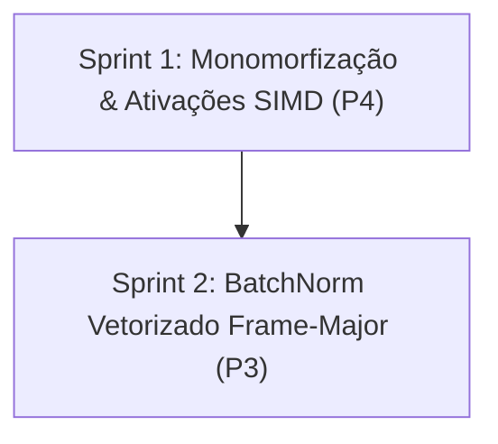

<!--
SPDX-License-Identifier: Apache-2.0
Copyright (c) 2026 Fábio Henrique de Lima Silva (fhl.bsb@gmail.com) All rights reserved.
-->

# TODO-sprints — Dispatch monomorfizado de ponta a ponta (Épico B)

Este documento define o planejamento de sprints e tarefas técnicas para a execução do **Épico B — "Dispatch monomorfizado de ponta a ponta"**, agrupando e detalhando os achados **P3** e **P4** descritos no arquivo [TODO-findings.md](file:///home/fabio/nam-rs/TODO-findings.md).

O objetivo deste épico é eliminar o re-despacho redundante (matches em tempo de execução via `LazyLock` de `SIMD_MATH`) nos caminhos de processamento das camadas A2, blocos ConvNet e gating/ativações, além de otimizar a camada BatchNorm. Unificando o padrão `<M: SimdMath>` em todo o pipeline, o compilador pode realizar otimizações como eliminação de código morto (DCE) em tempo de compilação, além de eliminar o gargalo do gather/scatter strided do BatchNorm.

---

## Estrutura de Sprints



---

## Sprint 1: Monomorfização & Ativações SIMD (P4)

Foco em prover a infraestrutura no trait `SimdMath` para determinar a ISA em tempo de compilação e migrar os blocos de ativação e de despacho de convolução A2 para usarem caminhos 100% monomorfizados, livrando-se de reads dinâmicos de `SIMD_MATH` no loop interno.

### Tarefa B1 (P4a) — Identificação Estática de ISA em SimdMath [DONE]

* **Prioridade:** Alta
* **Complexidade/Esforço:** Baixo
* **Risco:** Mínimo
* **Arquivos Afetados:**
  * [traits.rs](file:///home/fabio/nam-rs/src/math/common/traits.rs)
  * [avx2_impl.rs](file:///home/fabio/nam-rs/src/math/common/avx2_impl.rs)
  * [mod.rs (AVX-512)](file:///home/fabio/nam-rs/src/math/common/avx512/mod.rs)
  * [process.rs](file:///home/fabio/nam-rs/src/models/a2/model/static/process.rs)
* **Descrição:**
  1. Adicionar uma constante associada `const ISA: InstructionSet;` ao trait `SimdMath`.
  2. Implementar a constante associada nos três backends de SIMD:
     * `Avx2Math`: `const ISA: InstructionSet = InstructionSet::Avx2;`
     * `Avx512Math`: `const ISA: InstructionSet = InstructionSet::Avx512;`
     * `Avx512VnniBf16Math`: `const ISA: InstructionSet = InstructionSet::Avx512VnniBf16;`
  3. No processamento estático do A2 ([process.rs](file:///home/fabio/nam-rs/src/models/a2/model/static/process.rs)), dentro de `layer_forward_dispatch::<M>`, substituir a leitura dinâmica `let isa = crate::math::common::SIMD_MATH.instruction_set;` por `match M::ISA`.
  4. Passar o tipo genérico `M` correspondente à ramificação para o método `layer_forward_ch8_block_simdmath::<M>(...)`, ao invés do hardcoded `<Avx512Math>`.
* **Estratégia de Validação:**
  * `cargo check` e `cargo test` para certificar que compila e preserva toda a corretude matemática do A2.
  * Inspecionar o assembly de `layer_forward_dispatch` em build de release para validar que a condicional `match M::ISA` foi eliminada via otimização de tempo de compilação (DCE).

### Tarefa B2 (P4b) — Ativações Monomorfizadas e Remoção do Re-despacho no Gating [DONE]

* **Prioridade:** Alta
* **Complexidade/Esforço:** Médio
* **Risco:** Baixo
* **Arquivos Afetados:**
  * [activations.rs](file:///home/fabio/nam-rs/src/models/a2/activations.rs)
  * [gating.rs](file:///home/fabio/nam-rs/src/models/a2/gating.rs)
  * [block.rs](file:///home/fabio/nam-rs/src/models/convnet/block.rs)
  * [process.rs (Dynamic A2)](file:///home/fabio/nam-rs/src/models/a2/model/dynamic/process.rs)
  * [post_stack_head.rs](file:///home/fabio/nam-rs/src/models/wavenet/post_stack_head.rs)
* **Descrição:**
  1. Em [activations.rs](file:///home/fabio/nam-rs/src/models/a2/activations.rs), adicionar o método `pub unsafe fn apply_simd<M: SimdMath>(&self, data: &mut [f32])` ao enum `ActivationType`. Esse método deve chamar diretamente as funções associadas do trait `M`, por exemplo, `M::tanh_slice(data)`, `M::relu_slice(data)`, etc., em vez de usar as free functions que invocam `dispatch_simd!` em runtime.
  2. Em [gating.rs](file:///home/fabio/nam-rs/src/models/a2/gating.rs), introduzir os métodos equivalentes genéricos sob `M: SimdMath`:
     * `apply_gating_simd::<M: SimdMath>(&self, buf: &mut [f32])`
     * `apply_blending_simd::<M: SimdMath>(&mut self, buf: &mut [f32])`
     Substituir as chamadas de `.apply()` internas por `.apply_simd::<M>()`.
  3. Atualizar o bloco ConvNet ([block.rs](file:///home/fabio/nam-rs/src/models/convnet/block.rs)) substituindo `self.activation.apply(scratch_slice)` por `self.activation.apply_simd::<M>(scratch_slice)` dentro de `process_block_internal<M: SimdMath>`.
  4. Fazer o mesmo no loop de processamento do WaveNet A2 Dinâmico ([process.rs](file:///home/fabio/nam-rs/src/models/a2/model/dynamic/process.rs)) e no [post_stack_head.rs](file:///home/fabio/nam-rs/src/models/wavenet/post_stack_head.rs).
* **Estratégia de Validação:**
  * `cargo test` em todas as suítes de testes de ativações e modelos A2/ConvNet/WaveNet.
  * Verificar via benchmark se a remoção das chamadas repetidas a `dispatch_simd!` nas ativações reduz o consumo de CPU em blocos com muitas camadas/frames.

---

## Sprint 2: BatchNorm Vetorizado Frame-Major (P3)

Foco em reescrever o kernel do BatchNorm para eliminar a transposição ineficiente via pilha (gather/scatter escalar) e unificar o despacho do BatchNorm com o pipeline monomorfizado.

### Tarefa B3 (P3 - Kernels) — Nova Abstração e Implementação de BatchNorm no Trait SimdMath

* **Prioridade:** Alta
* **Complexidade/Esforço:** Médio-Alto
* **Risco:** Médio (Paridade numérica é mandatória)
* **Arquivos Afetados:**
  * [traits.rs](file:///home/fabio/nam-rs/src/math/common/traits.rs)
  * [utility.rs (Scalar Fallback)](file:///home/fabio/nam-rs/src/math/common/scalar_ref/utility.rs)
  * [avx2_impl.rs](file:///home/fabio/nam-rs/src/math/common/avx2_impl.rs)
  * [mod.rs (AVX-512)](file:///home/fabio/nam-rs/src/math/common/avx512/mod.rs)
* **Descrição:**
  1. Estender o trait `SimdMath` com o método de batch normalization:

     ```rust
     unsafe fn batch_norm_process(
         data: &mut [f32],
         scale: &[f32],
         offset: &[f32],
         n_ch: usize,
         num_frames: usize,
     );
     ```

  2. Em [utility.rs](file:///home/fabio/nam-rs/src/math/common/scalar_ref/utility.rs), implementar a referência escalar contígua (processamento frame-major) `batch_norm_process_fallback`.
  3. No backend `Avx2Math`, implementar a otimização contígua frame-major em chunks de 8 elementos (adequado para canais múltiplos de 8 ou processamento geral). No caso especial de canais contíguos de áudio, carregar `scale` e `offset` e computar `FMA` sem transposição na pilha. Tratar as sobras do fim do frame com aritmética escalar.
  4. No backend `Avx512Math`/`Avx512VnniBf16Math`, implementar a mesma lógica, mas com largura de 16 elementos por registrador.
* **Estratégia de Validação:**
  * Adicionar testes unitários de paridade comparando os novos kernels vetorizados contra a referência escalar sob diferentes dimensões de canais (ex.: 8, 16, 24, e tamanhos ímpares ou não-alinhados) e número de frames.

### Tarefa B4 (P3 - Integração) — Integração e Despacho no BatchNorm1D

* **Prioridade:** Alta
* **Complexidade/Esforço:** Médio
* **Risco:** Baixo
* **Arquivos Afetados:**
  * [batch_norm.rs](file:///home/fabio/nam-rs/src/models/convnet/batch_norm.rs)
  * [block.rs](file:///home/fabio/nam-rs/src/models/convnet/block.rs)
* **Descrição:**
  1. Remover o atributo `#[inline(never)]` do processamento do BatchNorm em [batch_norm.rs](file:///home/fabio/nam-rs/src/models/convnet/batch_norm.rs).
  2. Implementar `pub unsafe fn process_simd<M: SimdMath>(&self, data: &mut [f32], num_frames: usize)` em `BatchNorm1D`, que delega diretamente a chamada a `M::batch_norm_process`.
  3. Atualizar o método `process` legado em `BatchNorm1D` para usar o despacho SIMD geral por razões de compatibilidade externa.
  4. Integrar em [block.rs](file:///home/fabio/nam-rs/src/models/convnet/block.rs): substituir a chamada `self.bn.process(scratch_slice, num_frames)` em `process_block_internal<M>` por `self.bn.process_simd::<M>(scratch_slice, num_frames)`.
* **Estratégia de Validação:**
  * `cargo test` para verificar se os testes existentes de block ConvNet e BatchNorm continuam passando com a nova infraestrutura.
  * Executar benchmarks comparativos do motor ConvNet para demonstrar a diminuição na latência.

---

## Critério de Pronto Geral (Definition of Done)

Para considerar o Épico B concluído com êxito, os seguintes requisitos devem ser atendidos:

1. **Compilação Limpa:** Sem erros ou warnings do compilador via `cargo check` e `cargo clippy`.
2. **Paridade Matemática Exata:** O sinal processado com os dispatchs monomorfizados e o novo BatchNorm frame-major contíguo deve ser idêntico ao obtido pela lógica escalar de referência.
3. **Ausência de Re-despacho em Hot-Path:** A leitura da ISA e a indireção do `Once` em `SIMD_MATH` devem desaparecer dos laços mais internos das camadas neuronais de inferência.
4. **RT-Safety Garantida:** Sem alocações ou syscalls no hot path de processamento de blocos.
5. **Políticas de Código:** Garantir a presença do cabeçalho SPDX e aviso de direito autoral em qualquer arquivo novo ou modificado.
