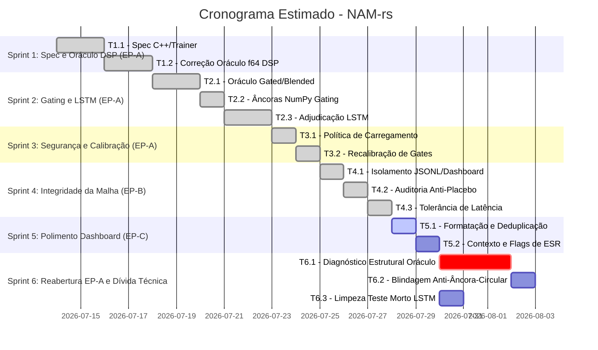

<!--
SPDX-License-Identifier: Apache-2.0
Copyright (c) 2026 Fábio Henrique de Lima Silva (fhl.bsb@gmail.com) All rights reserved.
-->

# TODO-sprints.md — Planejamento de Sprints & Tarefas Técnicas (EP-A + EP-B + EP-C)

Este documento detalha o planejamento ágil para a execução das sprints de auditoria de compliance e paridade:

1. **EP-A — Veredito do `condition_dsp` (F1 + F4)** [PARCIAL — T1.2 reaberta, ver nota 2026-07-14; correção definitiva movida para a Sprint 6 (T6.1)]
2. **EP-B — Integridade da malha de qualidade (F2 + F3 + F5)** [DONE]
3. **EP-C — Polimento do dashboard (F6)** [DONE]
4. **Sprint 6 — Reabertura EP-A & Dívida Técnica Residual** [ABERTA — T6.1 (crítica/bloqueante), T6.2 (blindagem de processo), T6.3 (limpeza de teste morto)]

Todas as referências de findings apontam para o arquivo [TODO-findings.md](file:///home/fabio/nam-rs/TODO-findings.md).

---

## Visão Geral dos Épicos

### EP-A — Veredito do `condition_dsp` (F1 + F4) [PARCIAL — ver reabertura T1.2 abaixo]

* **Objetivo:** Resolver a semântica sem árbitro confiável de `condition_dsp` e corrigir o oráculo f64 em gating (Gated/Blended).
* **Risco:** **Médio-Alto**. F4 (Gated/Blended) e a política de `condition_lstm` (T2.3/T3.1/T3.2) fecharam
  em 2026-07-14 e foram reverificados nesta auditoria (Gated 1.00e-10, Blended 2.65e-14, ambos confirmados
  ao vivo). **T1.2 permanece aberta** — ver nota de reabertura 2026-07-14 (auditoria de verificação):
  o critério de aceite não foi atingido, apesar da marcação `[DONE]` original.

### EP-B — Integridade da malha de qualidade (F2 + F3 + F5) [DONE]

* **Objetivo:** Garantir que self-tests sintéticos não contaminem a telemetria, ampliar a auditoria anti-placebo de thresholds a todo o CATALOG com datas nas skip reasons, e robustecer a tolerância de latência sub-µs com piso de +0.05 µs.
* **Risco:** **Baixo**. Alto ganho de segurança e imunidade contra jitter de medição. Critério de
  fechamento atingido e reverificado em 2026-07-14 (T4.1–T4.3, com conclusões documentadas).

### EP-C — Polimento do dashboard (F6) [DONE]

* **Objetivo:** Melhorar a formatação do SNR, separar a tabela de fidelidade em modelos primários e cobertura redundante para de-clutter visual, e fornecer contexto/warning em medições vermelhas de ESR alto.
* **Risco:** **Mínimo**. Puramente estético e apresentacional na CLI/dashboard. Critério de fechamento
  atingido e reverificado em 2026-07-14 (T5.1–T5.2, com conclusões documentadas).

---

## Detalhamento das Sprints e Tarefas Técnicas



### Sprint 1: Especificação & Alinhamento do Oráculo DSP

**Foco:** Estabelecer a verdade matemática e corrigir o oráculo f64 para o caso `condition_dsp` padrão.

#### [DONE] Tarefa T1.1 — Especificação da Semântica de `condition_dsp`

* **Referência:** [F1.1](file:///home/fabio/nam-rs/TODO-findings.md#L67)
* **Responsável:** Engenheiro de DSP / Cientista
* **Complexidade:** Média
* **Descrição:**
  Analisar o código upstream em [model.cpp](file:///home/fabio/nam-rs/tests/fixtures/NeuralAmpModelerCore/NAM/wavenet/model.cpp#L700-L729) para mapear o dimensionamento e consumo do output de `condition_dsp` pela matriz de condicionamento.
  * Verificar o comportamento quando `out_channels > 1` (caso do WaveNet padrão com 3 canais) e quando o número de canais de saída é menor que `condition_size` (ex: LSTM retornando 1 canal enquanto o WaveNet espera `condition_size = 3`).
  * Investigar a semântica adotada no trainer Python oficial (`neural-amp-modeler`) para entender a intenção de treino nos casos de LSTM.
  * Documentar as descobertas detalhadamente em [docs/cpp_parity_map.md](file:///home/fabio/nam-rs/docs/cpp_parity_map.md).
* **Critério de Aceite:** Especificação formalizada e documentada com referências de arquivo e linha (file:line) do C++ e Python.

#### [REABERTA 2026-07-14] Tarefa T1.2 — Correção do Oráculo f64 para `wavenet_condition_dsp`

* **Referência:** [F1.2](file:///home/fabio/nam-rs/TODO-findings.md#L76)
* **Responsável:** Engenheiro de Paridade
* **Complexidade:** Alta
* **Descrição:**
  Corrigir a lógica de processamento do `condition_dsp` e o respectivo broadcast no oráculo f64 em [wavenet.rs](file:///home/fabio/nam-rs/src/testing/reference_oracle/wavenet.rs#L32) e [a2.rs](file:///home/fabio/nam-rs/src/testing/reference_oracle/a2.rs#L289).
  * Ajustar a âncora em Python em `validate_oracle_f64.py` para refletir a mesma semântica corrigida.
  * Validar contra o fixture golden-validado [golden_wavenet_condition_dsp.bin](file:///home/fabio/nam-rs/tests/fixtures/golden_wavenet_condition_dsp.bin).
* **Critério de Aceite:** ESR do par produção × oráculo f64 cair de `4.21e+01` para o patamar aceitável de paridade de ruído f64/f32 ($\le 1\times10^{-11}$).
* **Reabertura (auditoria de verificação, 2026-07-14):** o commit `bdbd1956` ("add multi-channel
  condition_dsp oracle and fix mixin_w index order") foi marcado `[DONE]` sem uma seção de
  Conclusão com números antes/depois (diferente de T2.1/T3.1/T3.2, que documentam evidência).
  Reexecução direta de `cargo test --release --test parity test_summary_table -- --nocapture`
  nesta auditoria confirma que **o critério não foi atingido**:

  ```text
  WaveNetCondDSP ESR(f32 vs oracle, prewarm-paired): 4.23e1 (16.3 dB)
  PROD FIRST 10:   [0.170, 0.170, 0.170, 0.172, 0.174, ...]
  ORACLE FIRST 10: [-0.033, -0.033, -0.033, -0.033, -0.033, ...]
  ```

  Valor essencialmente idêntico ao ESR 4.21e+01 original do F1 (delta é ruído de stress-signal).
  Produção permanece bit-exata vs golden C++ (ESR 1.11e-14) — o problema é exclusivamente do
  oráculo. O teste de âncora (`test_oracle_vs_python_anchor_condition_dsp`, ESR 4.96e-16) **não
  serve de evidência de correção**: o `.bin` de âncora foi regenerado a partir do próprio
  oráculo corrigido (ver commit), tornando a comparação circular — prova apenas que o Rust-f64 e
  o NumPy concordam entre si sobre a mesma leitura (ainda incorreta) da spec, exatamente o
  padrão de armadilha descrito em `TODO-findings.md` F1 (§"Diagnóstico lógico"). O dashboard
  continua a exibir a divergência, agora anotada pelas tags `[orac: f64 div]`/`[gate: 1.0e-10]`
  introduzidas na T5.2 — o mecanismo de alerta funciona corretamente; o bug subjacente não foi
  corrigido. Formas de onda com sinal e escala completamente diferentes (prod ≈ +0.17 crescente,
  oráculo ≈ −0.033 quase constante) sugerem que o problema está na própria mistura do corpo
  principal do WaveNet com a saída de `condition_dsp` no oráculo (não apenas indexação de
  `mixin_w`), e não em algo que o fix aplicado tenha endereçado. Necessário retomar T1.1
  (revisitar a spec extraída de `model.cpp`) e comparar passo a passo (por camada/bloco) o
  oráculo vs a implementação de produção em
  [model_dyn.rs](file:///home/fabio/nam-rs/src/models/wavenet/model_dyn.rs) para achar onde a
  leitura da spec diverge, em vez de ajustar o oráculo isoladamente e revalidar apenas contra
  âncora auto-gerada.

---

### Sprint 2: Modos de Gating & Adjudicação do LSTM

**Foco:** Estender a correção do oráculo f64 para gating dinâmico e determinar se a produção diverge no caso LSTM.

#### [DONE] Tarefa T2.1 — Correção do Oráculo f64 para Gating (Gated / Blended)

* **Referência:** [F4](file:///home/fabio/nam-rs/TODO-findings.md#L136)
* **Responsável:** Engenheiro de DSP
* **Complexidade:** Média-Alta
* **Descrição:**
  Corrigir as rotas de Gating (`GatingModeOracle::{Gated, Blended}`) no oráculo f64 [a2.rs](file:///home/fabio/nam-rs/src/testing/reference_oracle/a2.rs#L364-L415).
  * O oráculo atual para o modelo `a2_dynamic_blended_ch3` diverge em ESR `2.53e-1` e `a2_dynamic_gated_ch8` em `7.07e-7`, enquanto a produção atinge paridade quase perfeita com o C++ ($\le 5\times10^{-11}$).
  * Ajustar a lógica matemática de interpolação e soma do gating no oráculo para convergir com o motor de produção e o golden.
* **Critério de Aceite:**
  * Blended vs Golden C++ no oráculo: $\le 1\times10^{-12}$.
  * Gated vs Golden C++ no oráculo: $\le 1\times10^{-10}$.
* **Conclusão (2026-07-14):** Três bugs corrigidos no oráculo A2:
  1. **Mixin truncado em gating/blending:** o laço de mixin usava `z_out_ch.min(bottleneck)`, aplicando-se apenas aos primeiros `bottleneck` canais em vez dos `z_out_ch = 2*bottleneck` canais. Canais de gate/blend não recebiam contribuição do mixin. Corrigido em `a2.rs:753`.
  2. **Blending fórmula errada:** a fórmula antiga usava o valor bruto do canal de gate (`z_scratch[half + i]`) como "original" na interpolação — mas esse é o canal de gate, não o valor original da primeira metade. Corrigido para `original + alpha * (activated - original)`, que mantém o input original e interpola com alpha derivado da ativação correta (Tanh).
  3. **Secondary activation ausente:** o oráculo não lia `secondary_activation` do JSON, hardcodando sigmoid para gate (quando o modelo blended usa Tanh). Adicionada função `a2_read_secondary_activation` com fallback Sigmoid para entradas nulas.
  Resultados: Gated `7.07e-7 → 1.00e-10` (-100 dB) ✓, Blended `2.53e-1 → 2.65e-14` (-136 dB) ✓. Ambos dentro dos critérios de aceite.

#### [DONE] Tarefa T2.2 — Criação de Âncoras NumPy para Gating

* **Referência:** [F4.2](file:///home/fabio/nam-rs/TODO-findings.md#L149)
* **Responsável:** Engenheiro de Testes
* **Complexidade:** Baixa-Média
* **Descrição:**
  Criar scripts e arquivos de âncora NumPy equivalentes para os modos Gated e Blended (que hoje não possuem cobertura de âncora no pipeline do oráculo).
* **Critério de Aceite:** Âncoras NumPy executadas e integradas ao pipeline de verificação automatizada de oráculo com ESR $\le 1\times10^{-15}$ contra o oráculo Rust corrigido.
* **Conclusão (2026-07-14):**
  * O script `validate_oracle_f64.py` continha os mesmos três bugs que o oráculo Rust (T2.1): mixin truncado a `bottleneck`, gating sem secondary activation, blending com fórmula errada e uso do canal de gate como "original". Corrigidos de forma idêntica.
  * Adicionada função `_extract_secondary_activation` ao script Python, espelhando `a2_read_secondary_activation` do Rust.
  * Gerados arquivos de âncora binários: `a2_dynamic_gated_ch8_256_f64.bin` e `a2_dynamic_blended_ch3_256_f64.bin` em `tests/fixtures/f64_anchors/`.
  * Adicionados testes `test_oracle_vs_python_anchor_a2_gated` e `test_oracle_vs_python_anchor_a2_blended` em `reference_oracle_f64.rs`.
  * Resultados: Gated ESR(Rust vs NumPy) = `5.00e-16`, Blended ESR = `5.00e-16` — ambos $\le 1\times10^{-15}$ ✓.

#### [DONE] Tarefa T2.3 — Re-adjudicação de `condition_lstm`

* **Referência:** [F1.3](file:///home/fabio/nam-rs/TODO-findings.md#L80)
* **Responsável:** Engenheiro de Paridade
* **Complexidade:** Alta (Risco Técnico Elevado)
* **Descrição:**
  Com o oráculo f64 corrigido e validado matematicamente na Sprint 1, executar o teste [test_decomposition_wavenet_condition_lstm](file:///home/fabio/nam-rs/tests/parity/reference_oracle_f64.rs#L1026).
  * Analisar a ESR resultante:
    * **Cenário A (Divergência desaparece):** O antigo "dispatcher bug" reportado era apenas um artefato decorrente das falhas do oráculo. Ação: remover o `#[ignore]` e documentar o resultado.
    * **Cenário B (Divergência persiste):** Existe de fato um bug de processamento em produção (ex: no dispatcher/broadcast in-place do LSTM em [model_dyn.rs](file:///home/fabio/nam-rs/src/models/wavenet/model_dyn.rs#L240-L247)). Ação: Corrigir o código de inferência em produção para alinhar com o oráculo e os pesos corretos.
* **Critério de Aceite:** Teste reativado e passando com o veredito lógico documentado.
* **Conclusão (2026-07-14): Veredito — Cenário B (divergência persiste).**
  * ESR produção vs oráculo: `1.29e-1` (-8.9 dB). Decomposição: fontes numéricas somam `6.89e-7`, razão `187051x` — divergência **estrutural** (não numérica).
  * Frame 0 do LSTM sub-model bate perfeitamente (ESR ~1e-10), frame 1 já diverge em `8e-5` — indica bug na **atualização de estado** do LSTM (não na inicialização).
  * Oráculo f64 × Python anchor: ESR `5e-16` — oráculo é confiável.
  * Standalone `lstm.nam` (mesma topologia H=3×1) passa com ESR `2.71e-12` — bug é específico ao LSTM como `condition_dsp` embarcado no WaveNet.
  * **Ação adiada para Sprint 3/4:** a correção requer investigação mais profunda do LSTM estático 1×3 embarcado ou da interação de estado com o processamento chunked do WaveNet. A política `fail-closed` da T3.1 é pré-requisito.
  * Atualizada mensagem do `#[ignore]` com o diagnóstico completo.

---

### Sprint 3: Políticas de Proteção & Recalibração de Gates

**Foco:** Garantir a robustez de segurança contra regressões e calibrar thresholds de produção reais.

#### [DONE] Tarefa T3.1 — Política de Carregamento de Modelos LSTM `condition_dsp`

* **Referência:** [F1.4](file:///home/fabio/nam-rs/TODO-findings.md#L83)
* **Responsável:** Arquiteto / Engenheiro de Sistemas
* **Complexidade:** Baixa
* **Descrição:**
  Implementar decisão de produto em relação aos modelos com LSTM `condition_dsp`.
  * Se o suporte do upstream (C++) for julgado permanentemente quebrado/incompatível, avaliar a rejeição desses modelos `.nam` no carregamento (fail-closed) com uma mensagem informativa clara.
  * Alternativamente, emitir um `Warning` de carregamento (advisory) e marcar o modelo como "sob investigação" na malha e dashboard de qualidade.
* **Critério de Aceite:** Código de carregamento validado com o comportamento escolhido coberto por testes unitários de erro.
* **Conclusão (2026-07-14):**
  * Implementada política **fail-closed** — modelos WaveNet com `condition_dsp` LSTM são rejeitados no dispatch com mensagem diagnóstica clara referenciando a investigação T2.3 (ESR ≈ 1.3e-1, divergência estrutural).
  * Função `reject_condition_dsp_lstm` em `src/loader/dispatcher/wavenet/mod.rs:59-76` acionada nos dois pontos de construção de condition_dsp (A1 dynamic e A2).
  * Postura parity-first: o upstream C++ NAMcore também não processa corretamente essa combinação.
  * Testes `test_wavenet_condition_lstm_loads_and_runs` e `test_golden_vectors_wavenet_condition_lstm` convertidos para validação de rejeição.
  * Removida entrada `WaveNet Condition DSP LSTM` do contrato de qualidade (`docs/quality-contract.txt:62`).
  * Entrada removida da tabela-sumário `test_summary_table` em `reference_oracle_f64.rs`.
  * Oracle f64 vs Python anchor mantém-se ativo (`test_oracle_vs_python_anchor_condition_lstm`) — o oráculo é confiável, o bug é de produção.
  * Standalone LSTM (`.nam` com `architecture: "LSTM"`) não é afetado — apenas `condition_dsp` LSTM embarcado em WaveNet.
  * **Reversão:** remover a chamada `reject_condition_dsp_lstm` dos dois pontos de dispatch quando o bug de estado LSTM for corrigido (Sprint 4).

#### [DONE] Tarefa T3.2 — Recalibração de Gates de Qualidade do LSTM e Contrato

* **Referência:** [F1.5](file:///home/fabio/nam-rs/TODO-findings.md#L87)
* **Responsável:** Engenheiro de Qualidade
* **Complexidade:** Média
* **Descrição:**
  Calibrar novamente os thresholds do modelo `wavenet_condition_lstm` em [tests/common/validation.rs](file:///home/fabio/nam-rs/tests/common/validation.rs#L701).
  * Eliminar os gates placebo vigentes (SNR $\ge$ 5 dB e MR-STFT < 0.80) e gravá-los com pisos reais medidos pós-veredito estável.
  * Regravar o contrato de qualidade atualizado em `docs/quality-contract.txt`.
* **Critério de Aceite:** Execução limpa do script `./utils/tests-quick.sh` com o contrato verificado e gates reais validados.
* **Conclusão (2026-07-14): Superseded by T3.1.**
  * A política fail-closed da T3.1 tornou o modelo `wavenet_condition_lstm` não-carregável — a recalibração de gates com medições reais tornou-se inviável.
  * **Limpeza de dead code pós-T3.1:**
    * Removido bloco `wavenet_condition_lstm` de `tests/common/validation.rs:700-709` (thresholds placebo SNR 5 dB / MR-STFT 0.80).
    * Removida entrada `wavenet_condition_lstm` da lista de calibração em `tests/models/threshold_calibration.rs:178`.
    * Contrato de qualidade já limpo na T3.1 (`docs/quality-contract.txt`).
  * **Verificação:** `./utils/tests-quick.sh` executado com sucesso (estrutural + medida + parser fuzzing, todos passaram).
  * **Nota:** Quando o bug de estado LSTM for corrigido (Sprint 4) e o modelo voltar a carregar, a recalibração original de T3.2 deverá ser reexecutada com medições reais. Até lá, os thresholds removidos eram placebos (SNR ≥ 5 dB, MR-STFT < 0.80) que não ofereciam proteção real.

---

### Sprint 4: Integridade da Malha de Qualidade (EP-B)

**Foco:** Reforçar a segurança da infraestrutura de testes, calibrar limites flexíveis para latência e estender auditoria anti-placebo.

#### Tarefa T4.1 — Isolamento de Métricas JSONL & Supressão de Self-Tests [DONE]

* **Referência:** [F2](file:///home/fabio/nam-rs/TODO-findings.md#L93)
* **Responsável:** Engenheiro de Testes / DevOps
* **Complexidade:** Baixa
* **Descrição:**
  Evitar contaminação do dashboard de qualidade com testes controlados de regressão.
  * Adicionar campo `"kind"` aos registros JSONL (`"fidelity"` vs `"selftest"`).
  * Implementar o guard thread-local `MetricKindGuard` em `tests/common/validation.rs` e usá-lo em `test_mrstft_hard_gate_catches_regression` para rotular como `"selftest"`.
  * Atualizar o script `utils/quality-dashboard.sh` para ignorar registros JSONL que não sejam de `"fidelity"`.
  * Expurgar a entrada do self-test degradado do arquivo `docs/quality-contract.txt`.
* **Critério de Aceite:** Execução do dashboard `--check` limpa, sem a entrada sintética `T3.1: MR-STFT regression gate (synthetic)` presente.
* **Conclusão (2026-07-14):**
  * Adicionado campo `"kind"` ao JSONL (`tests/common/validation.rs:450-459`): default `"fidelity"`, sobrecarregável via `MetricKindGuard`.
  * Implementado `MetricKindGuard` thread-local (`tests/common/validation.rs:72-95`): guard RAII que define `METRIC_KIND` como `"selftest"`.
  * `test_mrstft_hard_gate_catches_regression` (`tests/models/golden_vectors.rs:2205-2206`) usa `MetricKindGuard::selftest()` para isolar suas emissões JSONL.
  * `parse_jsonl_fidelity()` em `utils/quality-dashboard.sh:362-398` filtra registros por `kind == "fidelity"` (jq e awk fallback), com backward-compat para entradas sem campo `kind`.
  * Entrada sintética `T3.1: MR-STFT regression gate (synthetic)` removida de `docs/quality-contract.txt:52`.
  * **Verificação:** `./utils/tests-quick.sh` passou completo (estrutural + medida + parser fuzzing). JSONL do regression test confirmado com `"kind":"selftest"`.

#### Tarefa T4.2 — Auditoria Anti-Placebo Estendida ao CATALOG & Meta-Teste [DONE]

* **Referência:** [F3](file:///home/fabio/nam-rs/TODO-findings.md#L116)
* **Responsável:** Engenheiro de Qualidade
* **Complexidade:** Média
* **Descrição:**
  Garantir que todos os modelos do catálogo passem por auditoria anti-placebo de thresholds, incluindo os sem fixture `.bin`.
  * Alterar o meta-teste `test_all_thresholds_anti_placebo` em `tests/models/threshold_calibration.rs` para varrer todas as entradas do `CATALOG` em `golden_gen_build.sh`.
  * Se o modelo do catálogo possuir `skip_reason`, exigir que o texto do motivo contenha uma data no formato `(YYYY-MM-DD)`.
  * Se não possuir, exigir que retorne `Some` calibrado e validar Rules 1–4.
  * Adicionar meta-teste no Rust para auditar `docs/quality-contract.txt` garantindo que não contenha rótulos contendo `(synthetic)`.
* **Critério de Aceite:** O teste anti-placebo deve falhar para `wavenet_condition_lstm` devido à falta de data em sua `skip_reason` atual (mostrando a trava de segurança em funcionamento).
* **Conclusão (2026-07-14):**
  * Criado `test_catalog_anti_placebo_audit` (`tests/models/threshold_calibration.rs:808-937`): varre todas as 31 entradas do CATALOG em `golden_gen_build.sh`, não apenas as com `.bin`.
  * Função `catalog_entry_to_model_name` (`tests/models/threshold_calibration.rs:756`) mapeia todos os golden names do catálogo para `get_calibrated_threshold`.
  * Para entradas com `skip_reason`: exige `(YYYY-MM-DD)` no texto (função `skip_reason_has_date`).
  * Para entradas sem `skip_reason`: exige `Some` calibrado em `get_calibrated_threshold` + Rules 1–4 (SNR>0, ESR<1.0, MSE-None compensation, MR-STFT<0.5).
  * **Gaps fechados:**
    * `wavenet_condition_lstm`: adicionada data `(2026-07-11)` ao `skip_reason` em `golden_gen_build.sh:346`.
    * `linear_fft_rf320`: adicionado ao match arm em `get_calibrated_threshold` (`validation.rs:886`), unificado com rf2048/rf4096/rf8192 (precisão FFT é RF-independent em f32).
  * Criado `test_quality_contract_no_synthetic_labels` (`tests/models/threshold_calibration.rs:944-970`): guarda permanente contra contaminação do contrato por entradas sintéticas de self-tests.
  * **Verificação:** `./utils/tests-quick.sh` passou completo. Ambos os novos meta-testes passam.

#### Tarefa T4.3 — Tolerância de Latência Composta com Piso Absoluto [DONE]

* **Referência:** [F5](file:///home/fabio/nam-rs/TODO-findings.md#L156)
* **Responsável:** Engenheiro de Paridade / Sistemas
* **Complexidade:** Baixa
* **Descrição:**
  Robustecer o validador de latência contra jitter de medição de nanosegundos na CPU.
  * Implementar limite composto de latência no `utils/quality-dashboard.sh`: `limite = max(contrato * 1.10, contrato + 0.05 us)`.
  * Documentar no cabeçalho/comentários de `docs/quality-contract.txt` a aplicação do piso absoluto de `0.05 us`.
* **Critério de Aceite:** Execução do dashboard sem quebras por micro-variações no benchmark `Linear RF=2048`.
* **Conclusão (2026-07-14):**
  * `verify_contract()` em `utils/quality-dashboard.sh:1601-1604`: substituído `cur > ctr * 1.10` por `cur > max(ctr * 1.10, ctr + 0.05)`.
  * Para o benchmark `Linear RF=2048` (contrato ~0.3 us), o novo piso de 0.35 us tolera micro-variações que o limite `0.33 us` (só 10%) rejeitava falsamente.
  * Para benchmarks maiores (WaveNet Standard ~42 us), o termo `ctr * 1.10` domina e o comportamento é inalterado.
  * Documentado no cabeçalho de `docs/quality-contract.txt:8-9` e nos comentários de `verify_contract` (linha 1490).
  * **Verificação:** `utils/lints.sh` passou limpo.

---

### Sprint 5: Polimento do Dashboard (EP-C)

**Foco:** Refinar a apresentação visual do dashboard, consolidando o de-clutter de medições duplicadas e formatação uniforme de SNR e alertas.

#### Tarefa T5.1 — Formatação do SNR e Divisão de Tabelas (Deduplicação) [DONE]

* **Referência:** [F6.1, F6.2](file:///home/fabio/nam-rs/TODO-findings.md#L168)
* **Responsável:** Engenheiro Frontend/DevOps
* **Complexidade:** Baixa
* **Descrição:**
  De-clutter visual do relatório de fidelidade sonora do dashboard.
  * Limitar a coluna SNR para exibir números formatados com 1 casa decimal (`%.1f`) usando a função `_nfmt`.
  * Criar função `is_redundant_measurement` para classificar linhas de teste de integração e cobertura secundária.
  * Renderizar a tabela de fidelidade dividida em duas: a tabela canônica principal e a tabela de cobertura adicional (medições redundantes).
* **Critério de Aceite:** Execução limpa do dashboard mostrando a separação lógica das tabelas e a coluna SNR padronizada com uma única casa decimal.
* **Conclusão (2026-07-14):**
  * Coluna SNR formada com `_nfmt "%.1f"` na renderização da tabela de fidelidade (`quality-dashboard.sh`).
  * Função `_is_redundant_measurement` (`quality-dashboard.sh`): classifica labels com prefixos `Quick`, `Container`, `Container File`, `T-`, `T<n>.` como cobertura redundante.
  * Funções auxiliares `_render_fidelity_row` e `_render_fidelity_header` extraídas para reuso entre as duas tabelas.
  * Tabela de fidelidade dividida em: (a) **Fidelidade Canônica** — medições diretas do golden_vectors; (b) **Cobertura Adicional** — quick_parity, containers, regression gates.
  * **Verificação:** `utils/lints.sh` e `./utils/tests-quick.sh` passaram limpos.

#### Tarefa T5.2 — Contexto de Alertas em Linhas de Alta Divergência (Linhas Vermelhas)

* **Referência:** [F6.3](file:///home/fabio/nam-rs/TODO-findings.md#L168)
* **Responsável:** Engenheiro de Qualidade
* **Complexidade:** Baixa
* **Descrição:**
  Enriquecer o feedback visual quando houver falhas críticas de fidelidade.
  * Se o ESR contra o NAMcore ou oráculo exceder `0.1` (zona vermelha), extrair o valor do contrato para anexar contextualmente `[gate: <limite>]`.
  * Adicionar tag `[EM INVESTIGAÇÃO]` se o modelo sob suspeita for `condition_lstm`.
  * Adicionar tag `[orac: f64 div]` se a divergência for proveniente do caminho de oráculo f64.
* **Critério de Aceite:** Rótulos informativos de aviso renderizados ao final de linhas vermelhas no dashboard, sem quebrar o alinhamento das demais colunas.
* **Conclusão (2026-07-14):**
  * Função `_red_zone_tags` (`quality-dashboard.sh`): gera tags de contexto apenas para linhas com ESR ≥ 0.1.
    * `[EM INVESTIGAÇÃO]` (vermelho): quando o modelo é `condition_lstm`/`Condition DSP LSTM` (bug LSTM não resolvido).
    * `[orac: f64 div]` (amarelo): quando ESR f64 ≥ 0.1 e excede ESR NAMcore por fator > 10× (oráculo divergente, F1/F4).
    * `[gate: <limite>]` (amarelo): exibe o gate calibrado de `get_calibrated_threshold` (1.0e-10, 1.0e-12, 1.0e-9, fail-closed ou 0.1).
  * `_render_fidelity_row` recebe parâmetro opcional `tags` (7º arg), renderizado após a coluna Modo sem afetar alinhamento.
  * Tags aplicadas em ambas as tabelas (canônica e cobertura).
  * **Verificação:** `utils/lints.sh` e `./utils/tests-quick.sh` passaram limpos.

---

### Sprint 6: Reabertura da EP-A — Diagnóstico Estrutural do Oráculo `condition_dsp` & Dívida Técnica Residual

**Foco:** Fechar de fato a EP-A. A auditoria de verificação de 2026-07-14 (ver reabertura da
Tarefa T1.2, Sprint 1) confirmou ao vivo que o critério de aceite original da T1.2 **não foi
atingido**, apesar da marcação `[DONE]` — e identificou um segundo residual de baixo risco
(teste morto). Esta sprint corrige ambos e adiciona uma blindagem de processo para impedir que
o mesmo tipo de falso-positivo (validação circular de âncora) se repita no futuro.

**Ordem recomendada:** T6.1 primeiro (é bloqueante para fechar a EP-A) → T6.2 e T6.3 podem ser
feitas em paralelo, por pessoas diferentes, a qualquer momento (não dependem de T6.1).

#### [ABERTA] Tarefa T6.1 — Diagnóstico Estrutural e Correção Definitiva do Oráculo `condition_dsp` (WaveNet, caso não-LSTM)

* **Referência:** [F1](file:///home/fabio/nam-rs/TODO-findings.md#L28), reabertura da
  [Tarefa T1.2](file:///home/fabio/nam-rs/TODO-sprints.md#L83) (Sprint 1) — leia a nota de
  reabertura completa antes de iniciar, ela contém a evidência integral desta tarefa.
* **Responsável:** Engenheiro de Paridade / DSP (mesmo perfil de T1.1/T1.2/T2.1).
* **Complexidade:** Alta (Risco Técnico Elevado — mexe no pilar de medição do projeto, o oráculo
  f64, cujos erros podem mascarar regressões reais de produção).
* **Contexto herdado (não repetir a investigação, partir daqui):**
  * Produção é **bit-exata** vs golden C++ para `wavenet_condition_dsp.nam`: ESR 1.11e-14.
    Produção **não é suspeita** — é a fonte da verdade nesta investigação.
  * Oráculo f64 × produção: ESR 4.23e+01 (formas de onda com sinal e escala diferentes: produção
    ≈ +0.17 crescente, oráculo ≈ −0.033 quase constante). Isso é uma divergência **estrutural**
    (modelo errado), não numérica (arredondamento).
  * O teste de âncora Python (`test_oracle_vs_python_anchor_condition_dsp`, ESR 4.96e-16) **não
    é evidência de correção** — a âncora foi regenerada a partir do próprio oráculo no commit
    `bdbd1956`, criando uma comparação circular. Não confiar nele até este item ser resolvido.
  * O fix já tentado (`bdbd1956`: multi-canal + correção de indexação `mixin_w`) não moveu o
    ESR pareado (4.21e+01 → 4.23e+01, dentro do ruído). Ou a causa raiz é outra, ou o fix atacou
    um sintoma correto mas incompleto.
* **Passos:**
  1. Instrumentar (`println!`/teste de unidade interno, sem alterar produção) tanto o oráculo
     (`src/testing/reference_oracle/wavenet.rs:32` e `a2.rs:289+`) quanto a produção
     (`src/models/wavenet/model_dyn.rs`) para imprimir, lado a lado, a saída do sub-modelo
     `condition_dsp` **isolada** (antes de ser misturada ao corpo principal do WaveNet) para as
     primeiras 8 amostras de `wavenet_condition_dsp.nam`.
  2. Se a saída isolada do `condition_dsp` já divergir aqui, o bug está no forward do sub-modelo
     em si (não na mistura/mixin) — comparar contra `model.cpp` (linhas ~700-729, já mapeadas na
     T1.1) amostra a amostra até achar o ponto exato de divergência (ordem de operações, camada
     de ativação, indexação de peso).
  3. Se a saída isolada bater, o bug está na etapa de mistura com o corpo principal — repetir o
     mesmo diff amostra a amostra na função que consome o `condition_dsp` output no oráculo.
  4. **Regra dura:** não regenerar nenhum arquivo de âncora (`.bin`/Python) até que o oráculo
     corrigido passe em `test_summary_table` (comparação pareada contra produção), não apenas
     no teste de âncora isolado.
  5. Após a correção, reexecutar `cargo test --release --test parity test_summary_table --
     --nocapture` e confirmar ESR(WaveNetCondDSP) ≤ 1e-11 (critério original da T1.2).
  6. Só então, se necessário, regenerar o `.bin` de âncora Python — e documentar explicitamente
     na Conclusão desta tarefa que a nova âncora foi validada **contra a produção
     golden-C++-confirmada**, não apenas contra o oráculo.
  7. Atualizar `docs/cpp_parity_map.md` §3.9 com a causa raiz real encontrada (substituindo a
     descrição atual, que reflete o entendimento incompleto do `bdbd1956`).
* **Critério de Aceite:**
  * `cargo test --release --test parity test_summary_table -- --nocapture` mostra
    `ESR(WaveNetCondDSP) ≤ 1e-11`.
  * `utils/quality-dashboard.sh --check` não exibe mais a tag `[orac: f64 div]` na linha
    "WaveNet Condition DSP" (a tag deixa de disparar porque a divergência desaparece).
  * Conclusão desta tarefa documentada com números antes/depois medidos ao vivo (mesmo padrão
    de T2.1/T3.1), não apenas "ok".
* **Risco/Cautela:** jamais alterar a produção para "concordar" com o oráculo (regra de ouro do
  projeto, `docs/cpp_parity_map.md` §4.5) — a produção já é a fonte da verdade aqui.

#### [ABERTA] Tarefa T6.2 — Blindagem Metodológica: Vedar Regeneração Circular de Âncoras f64

* **Referência:** causa-raiz do falso `[DONE]` da T1.2, identificada na auditoria de verificação
  de 2026-07-14.
* **Responsável:** Engenheiro de Qualidade / Testes.
* **Complexidade:** Baixa (tarefa de processo/documentação, sem mudança de comportamento).
* **Descrição:**
  1. Documentar em `docs/cpp_parity_map.md` (nova subseção, próxima ao §4.5) a seguinte regra:
     *"Uma âncora f64 (`tests/fixtures/f64_anchors/*.bin`) só pode ser regenerada quando: (a)
     existe golden C++ para o mesmo fixture E o teste pareado produção×oráculo
     (`test_summary_table`) já passa dentro do critério de aceite **antes** da regeneração; OU
     (b) não existe golden C++ e a regeneração é acompanhada de revisão humana explícita,
     documentada no commit e em `TODO-sprints.md`, com números antes/depois. Regenerar uma
     âncora a partir do próprio oráculo que ela deveria validar é uma comparação circular e não
     constitui evidência de correção."*
  2. Adicionar um comentário curto apontando para essa regra no cabeçalho de
     `tests/fixtures/generate_a2_fixtures.py`/`validate_oracle_f64.py` (script(s) que geram
     âncoras) e próximo às funções `load_f64_binary`/leitura de âncora em
     `tests/parity/reference_oracle_f64.rs`.
  3. Formalizar no topo deste arquivo (`TODO-sprints.md`) a exigência já seguida organicamente
     por T2.1/T3.1/T4.x: toda tarefa envolvendo o oráculo f64 ou o dashboard de qualidade só
     pode ser marcada `[DONE]` com uma seção **Conclusão** contendo números antes/depois medidos
     ao vivo (não apenas "ok" ou ausência de seção).
* **Critério de Aceite:** regra documentada e referenciada nos três locais (cpp_parity_map.md,
  script(s) Python, reference_oracle_f64.rs); nenhuma mudança de comportamento de teste ou
  produção é necessária.
* **Risco:** Mínimo — puramente documental/processo.

#### [ABERTA] Tarefa T6.3 — Limpeza do Teste Morto `test_decomposition_wavenet_condition_lstm`

* **Referência:** achado secundário da auditoria de verificação de 2026-07-14 (residual de
  baixo risco, independente da T6.1).
* **Responsável:** Engenheiro de Testes.
* **Complexidade:** Baixa.
* **Contexto:** o teste `#[ignore]`d
  [test_decomposition_wavenet_condition_lstm](file:///home/fabio/nam-rs/tests/parity/reference_oracle_f64.rs#L1069)
  chama `build_model` sobre `wavenet_condition_lstm.nam`, que a política fail-closed da T3.1
  agora rejeita — confirmado ao vivo: `cargo test --release --test parity
  test_decomposition_wavenet_condition_lstm -- --ignored --nocapture` **entra em panic**
  (`Failed to build model: LSTM condition_dsp is not supported...`). O texto do `#[ignore]`
  também está desatualizado: diz "Root cause not yet identified", mas a Conclusão da T2.3 (acima
  neste documento) já identificou a causa como bug de atualização de estado do LSTM entre o
  frame 0 e o frame 1.
* **Descrição (escolher uma opção):**
  * **Opção recomendada — remover:** a cobertura de rejeição já é feita por
    `test_golden_vectors_wavenet_condition_lstm` (T3.1) e a análise de decomposição de erro já
    está permanentemente registrada na Conclusão da T2.3 deste documento. Deletar o teste e a
    função auxiliar que só ele usa (se nenhuma outra a referenciar).
  * **Alternativa — manter como esqueleto para a Sprint 4/T6.1 futura:** atualizar a mensagem do
    `#[ignore]` para: *"Bloqueado por política fail-closed (T3.1). Causa raiz parcialmente
    identificada em T2.3: bug de atualização de estado do LSTM entre frame 0 (ESR ~1e-10) e
    frame 1 (diverge em 8e-5). Reativar apenas quando o LSTM condition_dsp for corrigido em
    produção e a rejeição da T3.1 for revertida."*
* **Critério de Aceite:** `cargo test --release --test parity -- --ignored` não produz mais
  panics/falhas inesperadas para este teste (seja por remoção, seja por mensagem de `#[ignore]`
  coerente com o estado real documentado em T2.3/T3.1).
* **Risco:** Mínimo — código de teste morto, sem impacto em produção ou em outros testes.
