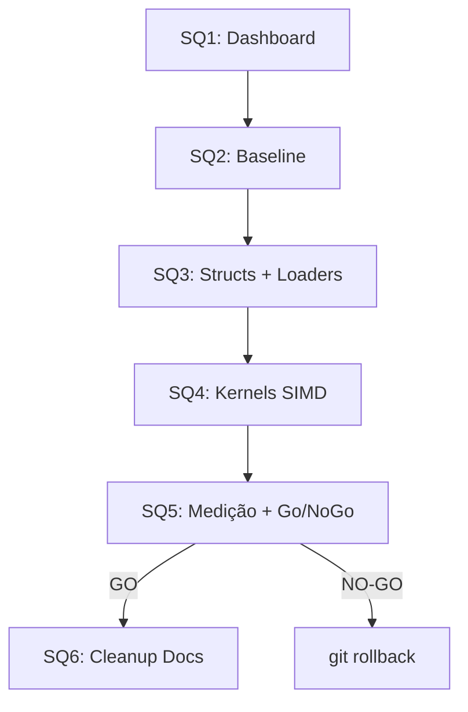

<!--
SPDX-License-Identifier: Apache-2.0
Copyright (c) 2026 Fábio Henrique de Lima Silva (fhl.bsb@gmail.com) All rights reserved.
-->

# TODO-sprints — Épico EQ: Remoção da Quantização de Pesos

> **Ref**: [TODO-findings.md](TODO-findings.md) — Findings F-Q1, F-Q2, F-Q3
> **Decisão arquitetural**: Remoção completa e definitiva da compressão f32→u16 (F16C/BF16). Git rollback se o impacto em performance for inaceitável.
> **Correção de premissa (2026-07-05, segunda auditoria)**: não existe conflito "Fidelidade vs.
> Paridade NAMCore" a resolver aqui. Verificado contra o C++ vendorizado
> (`tests/fixtures/NeuralAmpModelerCore/NAM/`): o NAMCore nunca quantizou seus pesos (tudo é
> `Eigen::MatrixXf`/`VectorXf`, f32 nativo). Só o nam-rs quantiza. Remover a quantização
> **converge** com o NAMCore, não diverge. O único eixo de trade-off real é **performance**
> (memória de pesos dobra, mais pressão em cache L1).
> **Objetivo declarado (Fábio)**: recuperar precisão sonora. Uma perda leve/moderada de
> performance é esperada e aceitável como contrapartida. O que **não** é aceitável é uma perda de
> performance péssima, que comprometa a reprodução em tempo real. Entre esses extremos, a decisão
> final de Go/NoGo (Sprint SQ5.4) é **humana**, informada pelos dados medidos — não um limiar
> numérico único e automático.
> **ISA foco**: x86-64-v3 (AVX2) e AVX-512. Apenas f32. O tier `Avx512VnniBf16` **permanece** —
> tem consumidores fora do LSTM (resampler, cabsim, linear_fft, capture/input/output stages);
> apenas o dispatch de quantização de pesos ligado a ele é removido.
>
> ⓘ **Nota**: O Sprint SQ1 (Quality Dashboard) é uma **entrega independente de uso geral** do nam-rs. Cobre todas as 6 famílias de arquitetura, todos os 31 modelos fixture, todos os modos de qualidade (Live/HQ), todas as ISAs (AVX2/AVX-512/VNNI-BF16), e permanece no projeto mesmo que a PoC fracasse e seja revertida.

---

## Sprint SQ1 — Dashboard de Qualidade (ferramenta permanente)

> **Objetivo**: Criar o instrumento de medição permanente e de uso geral do nam-rs. Cobre **todas** as arquiteturas, modelos, modos de qualidade e ISAs. Independente da PoC de quantização — permanece no projeto em qualquer cenário.
> **Risco**: 🟢 Baixo — não modifica código de produção.
> **Estimativa**: ~3-4h
> **Ref**: Finding F-Q2

### Tarefa SQ1.1 — Criar `utils/quality-dashboard.sh` [DONE]

**Descrição**: Script bash que roda **todas** as suítes de fidelidade e benchmarks de performance existentes, captura seus outputs, e gera um relatório humano-friendly cobrindo o universo completo do nam-rs.

**Cobertura obrigatória — TODOS os modelos disponíveis** (31 fixtures):

| Família                      | Modelos                                                                                                                                                                                         | Quant u16?                                                                                               |
|:---------------------------- |:----------------------------------------------------------------------------------------------------------------------------------------------------------------------------------------------- |:-------------------------------------------------------------------------------------------------------- |
| **WaveNet A1** (6)           | `BossWN-standard.nam`, `BossWN-feather.nam`, `BossWN-lite.nam`, `BossWN-nano.nam`, `wavenet_a1_standard.nam`, `wavenet_official.nam`                                                            | ❌ (f32 nativo)                                                                                          |
| **WaveNet A2** (4)           | `wavenet_a2_full.nam`, `wavenet_a2_lite.nam`, `wavenet_a2_max.nam`, `wavenet_a2_container.nam`                                                                                                  | 🔶 apenas `rechannel_w`, só no caminho estático (conv já é f32; A2 dinâmico não quantiza — código morto) |
| **A2 FiLM** (2)              | `wavenet_a2_film_lite.nam`, `wavenet_a2_film_full.nam`                                                                                                                                          | ✅                                                                                                       |
| **A2/WaveNet Dynamic** (4+3) | `wavenet_dyn_free.nam`, `wavenet_condition_dsp.nam`, `a2_dynamic_gated_ch8.nam`, `a2_dynamic_blended_ch3.nam` + Slimmable: `slimmable_container.nam`, `slimmable_wavenet.nam`, `a2_example.nam` | Misto                                                                                                    |
| **LSTM** (4)                 | `BossLSTM-1x16.nam`, `BossLSTM-2x8.nam`, `lstm.nam`, `lstm_dyn_test.nam`                                                                                                                        | ✅ (backbone + head)                                                                                     |
| **ConvNet/Linear** (6)       | `convnet_test.nam`, `linear_test.nam`, `linear_fft_rf320.nam`, `linear_fft_rf2048.nam`, `linear_fft_rf4096.nam`, `linear_fft_rf8192.nam`                                                        | ❌ (f32 nativo)                                                                                          |

**Suítes de teste a executar** (todas em `--release`):

| Suite                  | Comando                                                                  | Dados extraídos                                                                       | Cobertura                                                                               |
|:---------------------- |:------------------------------------------------------------------------ |:------------------------------------------------------------------------------------- |:--------------------------------------------------------------------------------------- |
| Golden vectors (v1+v2) | `cargo test --release --test golden_vectors -- --nocapture`              | ESR, SNR, MSE, MR-STFT vs C++ NAMCore por modelo e por sample rate                    | Todos com `.golden.bin`                                                                 |
| F64 Oracle             | `cargo test --release --test reference_oracle_f64 -- --nocapture`        | ESR vs f64 ideal + decomposição de fontes de erro (quantização, ativação, acumulação) | WaveNet, LSTM, A2, A2-FiLM, ConvNet, A2-Generic                                         |
| ISA Parity             | `cargo test --release --test isa_parity -- --test-threads=1 --nocapture` | Paridade bitwise AVX2 vs AVX-512 vs VNNI-BF16                                         | Todos                                                                                   |
| Spectral Fidelity      | `cargo test --release --test spectral_fidelity -- --nocapture`           | ASR (aliasing spectral ratio), harmonic analysis                                      | Todos que tenham spectral tests                                                         |
| Activation Precision   | `cargo test --release --test lstm_activation_precision -- --nocapture`   | Impacto Standard (Padé) vs HighFidelity (stdlib)                                      | LSTM (mais sensível a ativações)                                                        |
| Regression Gate        | `cargo bench --bench regression_gate 2>&1`                               | Latência mediana por bloco (64 samp, 48kHz, Criterion stats)                          | 10 modelos: WaveNet Std/Feather/Lite/Nano, A2 Full/Lite, LSTM 1×16/2×8, Linear, ConvNet |

**Formato do output aprovado**:

```text
╔══════════════════════════════════════════════════════════════════╗
║              nam-rs Quality Dashboard                           ║
║              ──────────────────────────────────────              ║
║              Medido em: 2026-07-05 09:10:42 -03:00              ║
║              ISA: AVX2 (x86-64-v3) │ CPU: ...                  ║
╚══════════════════════════════════════════════════════════════════╝

🎯 RESUMO RÁPIDO (para não-cientistas)
═══════════════════════════════════════

  🎸 WaveNet Standard (A1, CH16)
     vs NAMcore:  ...  │  vs Ideal (f64):  ...  │  ⚡ CPU: 12.3% do budget

  🎸 LSTM 1×16 (BossLSTM)
     vs NAMcore:  ...  │  vs Ideal (f64):  ...  │  ⚡ CPU: 8.1% do budget

  🎸 A2 Full (CH8)
     vs NAMcore:  ...  │  vs Ideal (f64):  ...  │  ⚡ CPU: ...

  🎸 ConvNet
     vs NAMcore:  ...  │  vs Ideal (f64):  ...  │  ⚡ CPU: ...

  🎸 Linear (RF=2048)
     vs NAMcore:  ...  │  vs Ideal (f64):  ...  │  ⚡ CPU: ...

  ... (todos os modelos disponíveis)

📊 FIDELIDADE SONORA — Detalhes Técnicos
═════════════════════════════════════════
  Modelo                  │ ESR (vs NAMcore) │ ESR (vs f64) │ SNR dB │ MR-STFT │ Modo
  ─────────────────────── │ ──────────────── │ ──────────── │ ────── │ ─────── │ ────
  WaveNet Std CH16 @48k   │ 4.8e-14          │ 6.1e-14      │ 132 dB │ 0.0003  │ Live
  WaveNet Std CH16 @96k   │ ...              │ ...          │ ...    │ ...     │ Live
  LSTM 1×16 @48k          │ 2.61e-2          │ 3.57e-3~     │ ...    │ ...     │ Live
  ...                     │                  │              │        │         │

  (o "~" no ESR vs f64 do LSTM 1×16 indica valor de família — medido em `lstm.nam` H=3, não no
  próprio BossLSTM-1×16; ver correção de proveniência no cabeçalho deste documento e em
  `_lookup_esr_f64`/`ESR_F64_FAMILY_FIXTURE` em `utils/quality-dashboard.sh`)

⚡ PERFORMANCE — Latência por Bloco (64 amostras @ 48kHz)
══════════════════════════════════════════════════════════
  Deadline RT: 1333 µs (1.33 ms)

  Modelo                  │ Latência Mediana │ % do Budget │ Folga
  ─────────────────────── │ ──────────────── │ ─────────── │ ─────────
  WaveNet Standard CH16   │    164 µs        │  12.3%      │ 87.7% ✅
  WaveNet Feather CH8     │     48 µs        │   3.6%      │ 96.4% ✅
  ...

  ⓘ Folga > 50%:  Pode usar oversampling 2× sem xruns
  ⓘ Folga > 75%:  Pode usar oversampling 4× sem xruns
  ⓘ Folga < 25%:  ⚠ Risco de xruns com buffer de 64 amostras

🔬 ISA PARITY
═════════════
  AVX2 vs AVX-512: bitwise identical ✅ / divergent ⚠

🎹 ACTIVATION PRECISION
════════════════════════
  LSTM Standard (Padé) vs HighFidelity (stdlib): ESR diff = ...
```

**Regras de parseamento**:

- Capturar linhas contendo `ESR`, `SNR`, `MSE`, `MR-STFT`, `LUFS` do stdout dos testes
- Identificar o modelo pela label entre `[` e `]` no output de `report_dsp_fidelity`
- Capturar `time:` do Criterion para extrair latência mediana
- Calcular `% budget RT = (latência / 1333µs) × 100`
- Traduzir ESR → veredicto humano:
  - ESR < 1e-10: "IDÊNTICO — erro abaixo do chão numérico"
  - ESR < 1e-5: "IMPERCEPTÍVEL — perfeito para qualquer uso"
  - ESR < 1e-2: "AUDÍVEL APENAS COM A/B CIENTÍFICO"
  - ESR < 1e-1: "AUDÍVEL EM COMPARAÇÃO DIRETA"
  - ESR ≥ 1e-1: "⚠ AUDÍVEL — necessita investigação"

**Features do script**:

- `--save <filename>`: Além de exibir na tela, também salva (como output limpo sem ANSI) em arquivo para comparação A/B
- `--fidelity-only`: pular benchmarks Criterion (roda apenas testes de fidelidade, ~2 min)
- `--bench-only`: pular testes de fidelidade (roda apenas benchmarks, ~3 min)
- Graceful-skip para componentes ausentes (modelo não encontrado, golden não gerado, C++ render indisponível)
- Exit code 0 com testes skipped (informacional), ≠0 apenas em erros de infraestrutura
- Informações de sistema no header: ISA detectada, CPU model, data/hora, rustc version

**Arquivos a criar/modificar**:

- `[NEW]` `utils/quality-dashboard.sh`

---

## Sprint SQ2 — Captura do Baseline

> **Objetivo**: Registrar todas as métricas atuais (com quantização) para comparação A/B posterior.
> **Risco**: 🟢 Baixo — apenas roda testes e salva output.
> **Estimativa**: ~30min
> **Ref**: Finding F-Q2
> **Pré-requisito**: SQ1 completo.

### Tarefa SQ2.1 — Executar o dashboard e salvar baseline [DONE]

**Descrição**: Rodar `utils/quality-dashboard.sh` e salvar o output como `docs/baseline-with-quantization.log` (commitado, para referência futura).

### Tarefa SQ2.2 — Salvar baseline do regression_gate [DONE]

**Descrição**: Executar `utils/tests-performance-regression.sh --save` para persistir o baseline Criterion. Este será o ponto de comparação estatístico para a performance pós-remoção.

### Tarefa SQ2.3 — Medir o piso f64 real de BossLSTM-1×16/2×8 (nova, decorrente da auditoria de 2026-07-05)

**Descrição**: O único número de "piso absoluto vs f64" disponível para a família LSTM
(`3.57e-3`) é medido em `lstm.nam` (H=3, oficial, `test_oracle_lstm()`), não em
`BossLSTM-1x16.nam`/`BossLSTM-2x8.nam` — os modelos que de fato exibem o drift severo (2.61e-2 →
1.42e-1 vs. NAMCore). Sem uma medição própria desses modelos, na duração de produção, não há como
saber quanto do drift é atribuível ao f16c vs. outras fontes, nem calibrar a expectativa de
melhoria pós-remoção.

**Ação**: rodar explicitamente (uma vez, com `--ignored`, é custoso):

```bash
cargo test --release --test reference_oracle_f64 \
  t33_diagnostic_recurrent_drift_lstm_1x16 -- --ignored --nocapture \
  > docs/baseline-lstm-1x16-f64-floor-with-quantization.log
```

Se o tempo permitir, adaptar/duplicar o mesmo diagnóstico para `BossLSTM-2x8.nam` (o teste atual
está hardcoded para `BossLSTM-1x16.nam` — ver `tests/reference_oracle_f64.rs:796`).

**Critério de aceite**:

- [ ] Log salvo com o piso f64 real do BossLSTM-1×16 em função da duração (512 → 240.000 amostras), medido antes da remoção
- [ ] Resultado documentado como a referência correta a usar em SQ5 (substituindo a suposição a priori "~7.6e-4, 34×" de `TODO-findings.md`)

---

## Sprint SQ3 — Remoção da Quantização: Structs e Loaders

> **Objetivo**: Converter todos os campos de pesos de `u16` para `f32` e ajustar os loaders para não quantizar.
> **Risco**: 🔴 Alto — modifica tipos fundamentais que afetam toda a cadeia de compilação.
> **Estimativa**: ~4h
> **Ref**: Finding F-Q1
> **Pré-requisito**: SQ2 completo. Nenhuma mudança em kernels SIMD neste sprint (o código não compilará até SQ4).

### Tarefa SQ3.1 — Converter structs LSTM de `u16` → `f32` [DONE]

**Descrição**: Alterar os tipos de armazenamento de pesos em todas as structs LSTM.

**Arquivos a modificar**:

| Arquivo                           | Mudança                                                                                   |
|:--------------------------------- |:----------------------------------------------------------------------------------------- |
| `src/models/lstm/layer.rs:11`     | `input_hidden_weights: Aligned64<[[[u16; H]; IH]; 4]>` → `Aligned64<[[[f32; H]; IH]; 4]>` |
| `src/models/lstm/layer.rs:17`     | Remover `state_bf16: Aligned64<[u16; IH]>` (mirror BF16 — não mais necessário)            |
| `src/models/lstm/layer.rs:28`     | Ajustar `new()` — inicializar com `0.0f32` em vez de `0u16`                               |
| `src/models/lstm/layer_dyn.rs:21` | `input_hidden_weights: AlignedVec<u16>` → `AlignedVec<f32>`                               |
| `src/models/lstm/layer_dyn.rs:29` | Remover `state_bf16: AlignedVec<u16>`                                                     |
| `src/models/lstm/layer_dyn.rs:46` | Ajustar `new()` — `AlignedVec::new(weights_len, 0.0f32)`                                  |
| `src/models/lstm/model1.rs:46`    | `head_weights: [u16; H]` → `[f32; H]`                                                     |
| `src/models/lstm/model2.rs:76`    | `head_weights: [u16; H]` → `[f32; H]`                                                     |
| `src/models/lstm/model_dyn.rs:33` | `head_weights: AlignedVec<u16>` → `AlignedVec<f32>`                                       |

**Atenção**: Ao remover `state_bf16`, todas as referências a `get_hidden_state_bf16()` precisam ser removidas ou adaptadas. Buscar com `grep -rn "state_bf16\|get_hidden_state_bf16" src/`.

**Critério de aceite**:

- [ ] Todas as structs LSTM armazenam pesos em `f32`
- [ ] Campo `state_bf16` removido de `layer.rs` e `layer_dyn.rs`
- [ ] `cargo check` não passa ainda (kernels SIMD esperam u16) — esperado

### Tarefa SQ3.2 — Converter structs A2 de `u16` → `f32` [DONE]

**Descrição**: Alterar os campos de pesos quantizados no A2. **Correção (auditoria 2026-07-05)**:
o único campo A2 realmente quantizado é `rechannel_w`, e apenas no caminho **estático**. Os pesos
de convolução do A2 já são `AlignedVec<f32>` nativo (`set_weights.rs:84-110`,
`transpose_conv1d_interleaved_4wide`) — nunca passaram por `quantize_weight()`; o comentário
antigo em `set_weights.rs:37` ("quantized to u16") está desatualizado e deve ser corrigido/removido
nesta tarefa. O `rechannel_w` do A2 **dinâmico** (`dynamic/mod.rs:56`) é código morto — verificado
em `dynamic/build.rs:79-80`: os pesos reais são carregados em `rechannel_w_f32` e o campo `u16`
nunca é populado (fica zerado). Ou seja: nesta tarefa, o A2 dinâmico não precisa de "conversão" de
dado nenhum — o campo `rechannel_w: AlignedVec<u16>` deve simplesmente ser **removido** (e
qualquer leitor dele redirecionado para `rechannel_w_f32`, se ainda não for o caso).

**Arquivos a modificar**:

| Arquivo                                 | Mudança                                                                                                       |
|:--------------------------------------- |:------------------------------------------------------------------------------------------------------------- |
| `src/models/a2/model/static/mod.rs:54`  | `rechannel_w: AlignedVec<u16>` → `AlignedVec<f32>`                                                            |
| `src/models/a2/model/dynamic/mod.rs:56` | Remover o campo `rechannel_w: AlignedVec<u16>` (código morto — nunca populado; usar apenas `rechannel_w_f32`) |
| `src/models/a2/model/set_weights.rs:37` | Corrigir/remover comentário obsoleto que descreve conv weights como quantizados a u16                         |

**Critério de aceite**:

- [ ] `static/mod.rs` armazena `rechannel_w` em `f32`
- [ ] `dynamic/mod.rs` não tem mais um campo `rechannel_w: AlignedVec<u16>` morto
- [ ] Nenhum comentário no código afirma que os pesos de convolução do A2 são quantizados (eles nunca foram)
- [ ] `cargo check` não passa ainda — esperado

### Tarefa SQ3.3 — Remover a quantização dos loaders [DONE]

**Descrição**: Os loaders chamam `quantize_weight(f, is_bf16)` para converter f32→u16 durante o carregamento. Agora devem guardar o f32 diretamente.

**Arquivos a modificar**:

| Arquivo                                              | Mudança                                                      |
|:---------------------------------------------------- |:------------------------------------------------------------ |
| `src/loader/dispatcher/lstm/weights.rs:30,38`        | Remover chamadas a `quantize_weight()`, guardar `f32` direto |
| `src/loader/dispatcher/lstm/static_builder.rs:40,92` | Idem para head weights                                       |
| `src/loader/dispatcher/lstm/dynamic_builder.rs:49`   | Idem                                                         |
| `src/models/a2/model/set_weights.rs:57`              | Remover `quantize_weight()`, guardar `f32`                   |

**Atenção**: A variável `is_bf16` e a decisão de quantização de pesos ligada a ela podem ser
removidas. **Não remover o tier de ISA `Avx512VnniBf16` em si** — `InstructionSet::Avx512VnniBf16`
e a struct `Avx512VnniBf16Math` são usados por `dsp/resampler.rs`, `dsp/pipeline/capture.rs`,
`input.rs`/`output.rs`, `dsp/cabsim/conv.rs` e `models/linear_fft.rs`, sem relação com pesos LSTM.
A detecção de ISA (`SimdMathConfig::get().instruction_set`) permanece para dispatch AVX2 vs
AVX-512 vs VNNI dos kernels de inferência em geral; morre **apenas** o branch BF16-específico para
pesos (a decisão `is_bf16` no carregamento e os kernels `gemv_4gate_bf16_avx512`,
`dot_product_bf16_avx512`, `gemv_overwrite_bf16` quando exclusivos de pesos LSTM).

**Critério de aceite**:

- [ ] Nenhum loader chama `quantize_weight()` para pesos de backbone
- [ ] Pesos são carregados como `f32` nativo
- [ ] `quantize_weight()` pode ser marcada `#[deprecated]` ou removida (verificar se algum uso externo sobrevive, como no oráculo f64)

### Tarefa SQ3.4 — Remover `use_f32_head` flag do LSTM [DONE]

**Descrição**: O flag `use_f32_head: bool` nos modelos LSTM controlava se o head projection usava pesos f32 nativos ou u16 quantizados. Com todos os pesos agora em f32, este flag é redundante (sempre `true`).

**Arquivos a modificar**:

| Arquivo                                             | Mudança                                            |
|:--------------------------------------------------- |:-------------------------------------------------- |
| `src/models/lstm/model1.rs:52,67,118`               | Remover campo `use_f32_head`, simplificar branches |
| `src/models/lstm/model2.rs:82,100,153`              | Idem                                               |
| `src/models/lstm/model_dyn.rs:39,64,84,135,186,272` | Idem                                               |
| `src/models/lstm/head_projection.rs`                | Simplificar — sempre usa path f32                  |
| Builders em `src/loader/dispatcher/lstm/`           | Remover atribuições `use_f32_head: true`           |

**Critério de aceite**:

- [ ] Campo `use_f32_head` removido de todas as structs LSTM
- [ ] Sempre usa o caminho f32 do head projection
- [ ] Nenhum branch morto relacionado a `use_f32_head`

---

## Sprint SQ4 — Remoção da Quantização: Kernels SIMD

> **Objetivo**: Adaptar todos os kernels SIMD de inferência para operar com pesos `f32` em vez de `u16`.
> **Risco**: 🔴 Alto — é o sprint mais complexo e delicado. Cada kernel SIMD que fazia `_mm256_cvtph_ps` para descomprimir pesos u16 precisa mudar para `_mm256_loadu_ps` carregando pesos f32 diretamente. Erro aqui causa output silenciosamente errado.
> **Estimativa**: ~6-8h
> **Ref**: Finding F-Q1
> **Pré-requisito**: SQ3 completo.
> **Estratégia**: Atacar por camada de abstração — GEMV primeiro (LSTM), depois batch-GEMM (A2/WaveNet), depois dot (head).

### Tarefa SQ4.1 — Adaptar kernels GEMV 4-gate do LSTM (AVX2) [DONE]

**Descrição**: O LSTM GEMV 4-gate AVX2 (`src/math/gemm/gemv_4gate/avx2.rs`) faz operação matricial com 4 gates (I, F, G, O) em paralelo. Atualmente carrega pesos u16 com `_mm_loadu_si128` + `_mm256_cvtph_ps` (8 pesos de 16-bit → 8 f32). Precisa mudar para `_mm256_loadu_ps` (8 pesos f32 diretos).

**Pontos de atenção**:

- Os ponteiros de peso agora apontam para `f32` (4 bytes cada) em vez de `u16` (2 bytes). Os strides e offsets de ponteiro mudam.
- O loop de 16 elementos antes carregava 16×u16 = 32 bytes (2× `_mm_loadu_si128`). Agora carrega 16×f32 = 64 bytes (2× `_mm256_loadu_ps`). **O throughput de memória dobra.**
- As macros de pointer arithmetic precisam ser revisadas cuidadosamente.

**Arquivos a modificar**:

- `src/math/gemm/gemv_4gate/avx2.rs` (~12 chamadas a `_mm256_cvtph_ps`)

**Critério de aceite**:

- [ ] Kernel AVX2 4-gate compila sem erros
- [ ] Sem `_mm256_cvtph_ps` no arquivo
- [ ] Pointer arithmetic correta para stride de f32 (4 bytes em vez de 2)

### Tarefa SQ4.2 — Adaptar kernels GEMV 4-gate do LSTM (AVX-512) [DONE]

**Descrição**: Análogo ao SQ4.1, mas para `src/math/gemm/gemv_4gate/avx512.rs`. Usa `_mm512_cvtph_ps` (16 u16 → 16 f32). Muda para `_mm512_loadu_ps`.

**Arquivos a modificar**:

- `src/math/gemm/gemv_4gate/avx512.rs` (~4 chamadas a `_mm512_cvtph_ps`)

**Critério de aceite**:

- [ ] Kernel AVX-512 4-gate compila sem erros
- [ ] Sem `_mm512_cvtph_ps` para pesos no arquivo

### Tarefa SQ4.3 — Adaptar kernels GEMV genéricos f16 (AVX2 + AVX-512) [DONE]

**Descrição**: Os kernels GEMV em `src/math/gemm/gemv/f16_avx2.rs`, `f16_avx2_specialized.rs`, e `f16_avx512.rs` servem o path genérico de GEMV com pesos u16. Estes precisam ser convertidos para carregar `f32` ou substituídos por versões f32 nativas.

**Decisão arquitetural**: Estes arquivos podem ser **renomeados/fundidos** com versões f32. Se já existirem variantes f32 dos GEMVs (para o head projection, por exemplo), considerar unificar.

**Arquivos a modificar/remover**:

- `src/math/gemm/gemv/f16_avx2.rs` — converter ou remover
- `src/math/gemm/gemv/f16_avx2_specialized.rs` — converter ou remover
- `src/math/gemm/gemv/f16_avx512.rs` — converter ou remover

**Critério de aceite**:

- [ ] Nenhum GEMV carrega pesos como u16
- [ ] Testes unitários de GEMV em `gemv_test.rs` adaptados para f32

### Tarefa SQ4.4 — Adaptar batch-GEMM e dot product [DONE]

**Descrição**: Os batch-GEMM em `src/math/gemm/gemm_batch/` e o dot product em `src/math/gemm/dot.rs` também fazem conversão f16→f32 de pesos. Adaptar para f32.

**Arquivos a modificar**:

- `src/math/gemm/dot.rs` — ~6 chamadas `_mm256_cvtph_ps` + ~1 `_mm512_cvtph_ps`
- `src/math/gemm/gemm_batch/fused_add_gemm_batch.rs` — ~3 chamadas
- `src/math/gemm/gemm_batch/fused_residual_batch.rs` — ~4 chamadas
- `src/math/gemm/gemm_batch/avx512.rs` — ~3 chamadas

**Critério de aceite**:

- [x] Nenhum kernel em `src/math/gemm/` faz conversão f16→f32 de pesos
- [ ] `cargo check` passa (bloqueado por erros pré-existentes de SQ4.3 e SQ4.5)

**Conclusão (2026-07-05)**: Kernels adaptados — `dot_product_avx2`, `dot_product_avx512`, `fused_add_gemm_batch_avx2`, `fused_gemm_residual_batch_avx2`, `fused_add_gemm_batch_avx512`, `fused_gemm_residual_batch_avx512`. Todos agora recebem `weights: &[f32]` e usam `_mm256_loadu_ps` / `_mm512_loadu_ps` diretamente. Trait `SimdMath` atualizado (`dot_product`, `fused_add_gemm_batch`, `fused_gemm_residual_batch`). Dispatchers (avx2_impl, avx512/gemv/base, vnni_bf16) adaptados. Testes e benchmarks do dot product corrigidos. `dot_product_bf16_avx512` preservado (BF16 é caso separado). Conversões remanescentes em `dot_4x/`, `dot_8x/`, `dot_16x/` são paths interleaved/separados fora do escopo. `cargo check` bloqueado por: (a) dispatchers GEMV (`fused_add_gemv`, `gemv_overwrite`, `gemv_overwrite_batch`) ainda com `&[u16]` na trait (SQ4.3), (b) `state_bf16` removido mas referenciado em `layer_kernels.rs`/`layer_dyn_kernels.rs` (SQ4.5).

### Tarefa SQ4.5 — Adaptar layer_kernels do LSTM [DONE]

**Descrição**: `src/models/lstm/layer_kernels.rs` é o arquivo que orquestra o dispatch dos kernels GEMV para o LSTM. Contém lógica de VNNI/BF16 **de pesos** que precisa ser simplificada.

**Atenção (correção, auditoria 2026-07-05)**: simplificar **apenas** o branch BF16-específico de
pesos (a escolha `is_bf16`/quantização removida em SQ3.3, e os kernels
`gemv_4gate_bf16_avx512`/`dot_product_bf16_avx512`/`gemv_overwrite_bf16` quando exclusivos de
pesos LSTM). **Não remover** o `InstructionSet::Avx512VnniBf16` nem a `Avx512VnniBf16Math` do
dispatch geral de ISA — eles têm consumidores fora do LSTM (`dsp/resampler.rs`,
`dsp/pipeline/capture.rs`, `input.rs`/`output.rs`, `dsp/cabsim/conv.rs`, `models/linear_fft.rs`) e
devem continuar disponíveis para AVX2/AVX-512/VNNI em geral.

**Arquivos a modificar**:

- `src/models/lstm/layer_kernels.rs` — simplificar dispatch, remover apenas os branches BF16/VNNI ligados a pesos LSTM

**Critério de aceite**:

- [x] Dispatch de pesos LSTM simplificado (AVX2 vs AVX-512 apenas, sem branch BF16 de pesos)
- [x] Não referencia `state_bf16` (removido em SQ3.1)
- [x] `InstructionSet::Avx512VnniBf16` e `Avx512VnniBf16Math` permanecem intactos para seus outros usos (resampler, cabsim, linear_fft, capture/input/output)

**Conclusão (2026-07-05)**: Macro `define_lstm_process!` simplificada — removidos parâmetros `$simd_math`, `$gemv_4gate_bf16`, `$is_bf16` e todos os branches BF16 (f32→bf16, GEMV bf16, store_bf16, tail bf16). Variante `process_sample_avx512_vnni_bf16` removida de `layer_kernels.rs`, `layer_dyn_kernels.rs`, `model1.rs`, `model2.rs` e `model_dyn.rs`. Dispatch em todos os modelos agora mapeia `Avx512VnniBf16 → process_avx512` (o ISA tier e a `Avx512VnniBf16Math` permanecem intactos no `dispatch_simd!` global para consumidores não-LSTM). `process_sample_scalar` perdeu o parâmetro `_is_bf16` (já não usado). `cargo check` limpo de erros LSTM; 6 erros remanescentes são pré-existentes de SQ4.3 (dispatchers GEMV com `&[u16]`).

### Tarefa SQ4.6 — Adaptar process kernels do A2 [DONE]

**Descrição**: O A2 `process.rs` (estático) usa o `rechannel_w` quantizado a u16. Adaptar para ler
f32. **Correção**: os pesos de convolução do A2 já são `f32` nativo (nunca foram quantizados —
ver SQ3.2); esta tarefa não precisa tocar neles. No A2 dinâmico, `rechannel_w` é código morto
(nunca populado) — a tarefa aqui é apenas remover o campo, não "adaptar" um dado que nunca existiu.

**Arquivos a modificar**:

- `src/models/a2/model/static/process.rs` — ler `rechannel_w` como `f32`
- `src/models/a2/model/dynamic/` — remover qualquer referência ao campo `rechannel_w: AlignedVec<u16>` morto (usar só `rechannel_w_f32`, já existente)

**Critério de aceite**:

- [x] A2 estático compila e roda com `rechannel_w` em f32
- [x] A2 dinâmico não referencia mais um campo `rechannel_w` u16 morto
- [x] Sem referência a u16 em pesos de A2 (estático ou dinâmico)

**Conclusão (2026-07-05)**: `WaveNetA2<CH>` tinha dois campos `rechannel_w` e `rechannel_w_f32`, ambos `AlignedVec<f32>` — o `process.rs` já usava só `rechannel_w_f32`, então `rechannel_w` era um campo redundante (resquício da migração f16→f32). Removido o campo `rechannel_w` da struct, da inicialização em `new()` e da atribuição em `set_weights()`. Testes de modelo (`model_test.rs:147`, `dynamic_test.rs:51`) atualizados para referenciar `rechannel_w_f32`. Zero novas referências a `u16` em pesos A2. `cargo check` sem novos erros (6 erros pré-existentes de SQ4.3).

### Tarefa SQ4.7 — Compilação verde + testes unitários

**Descrição**: Após SQ4.1–SQ4.6, o projeto deve compilar. Rodar `cargo check`, depois `cargo test --lib` para validar testes unitários.

**Critério de aceite**:

- [ ] `cargo check` passa sem erros
- [ ] `cargo clippy` passa sem warnings novos
- [ ] `cargo test --lib` — todos os testes unitários passam
- [ ] Testes unitários de GEMV/dot/GEMM em `src/math/` passam com pesos f32

---

## Sprint SQ5 — Medição Pós-Remoção + Decisão Go/NoGo

> **Objetivo**: Medir o impacto real e comparar com o baseline. Decisão: commit ou rollback.
> **Risco**: 🟡 Médio — os testes podem falhar por thresholds desatualizados (os gates foram calibrados para o regime quantizado).
> **Estimativa**: ~2h
> **Ref**: Findings F-Q1, F-Q2
> **Pré-requisito**: SQ4 completo (compilação verde).
> **Premissa desta sprint (corrigida)**: o objetivo é recuperar precisão sonora. Uma perda
> leve/moderada de performance é esperada e aceitável. Só uma perda **péssima** (que comprometa
> o tempo real) justifica NoGo. A decisão final (SQ5.4) é humana, não um limiar automático único.

### Tarefa SQ5.1 — Rodar testes de integração em release

**Descrição**: Rodar os testes de fidelidade. **Esperar que alguns falhem** por thresholds calibrados para o regime quantizado (os ESRs agora devem ser muito menores).

```bash
cargo test --release --test golden_vectors -- --nocapture
cargo test --release --test reference_oracle_f64 -- --nocapture
cargo test --release --test spectral_fidelity -- --nocapture
cargo test --release --test isa_parity -- --test-threads=1 --nocapture
cargo test --release --test reference_oracle_f64 \
  t33_diagnostic_recurrent_drift_lstm_1x16 -- --ignored --nocapture
```

**Atenção (corrigida — auditoria 2026-07-05):**

- `golden_vectors` compara vs NAMCore. **Correção**: o NAMCore nunca quantizou os próprios pesos
  (verificado no C++ vendorizado, `NAM/lstm.h:38-39` etc. — `Eigen::MatrixXf` nativo, zero
  ocorrências de half-precision em `NAM/`). Portanto, ao contrário do que esta seção afirmava
  antes, o ESR de LSTM vs. golden **deve melhorar** (convergência com NAMCore), não piorar. **Se o
  ESR vs. golden piorar ou ficar igual para qualquer modelo LSTM, isso é um sinal de bug na
  implementação de SQ3/SQ4 (ex.: pointer arithmetic errado, stride trocado) — investigar antes de
  prosseguir, não descartar como resultado esperado.**
- `reference_oracle_f64` ESRs devem **melhorar** para LSTM, mas a magnitude exata só é conhecida
  após comparar com o baseline de SQ2.3 (medição própria de BossLSTM-1×16/2×8, não o valor
  genérico de família de `lstm.nam` H=3). Rodar o diagnóstico `t33_*` de novo agora e comparar
  diretamente com o log salvo em SQ2.3 — esta é a comparação que realmente informa a decisão de
  SQ5.4, não os testes de família genéricos.
- Os thresholds em `tests/common/constants.rs` precisarão ser recalibrados na SQ5.5.

**Critério de aceite**:

- [ ] Testes rodaram (mesmo com falhas por thresholds)
- [ ] Output completo capturado para análise, incluindo o diagnóstico `t33_*` pós-remoção
- [ ] ESR vs. golden (NAMCore) para BossLSTM-1×16/2×8 comparado explicitamente antes/depois — documentado se melhorou (esperado) ou não (investigar)

### Tarefa SQ5.2 — Rodar dashboard e comparar com baseline

**Descrição**: Executar `utils/quality-dashboard.sh` e comparar o relatório lado-a-lado com `docs/baseline-with-quantization.log`.

**Critério de aceite**:

- [ ] Relatório pós-remoção salvo como `docs/measurement-without-quantization.log`
- [ ] Comparação documentada: quais métricas melhoraram, pioraram, ou ficaram iguais
- [ ] Comparar especificamente o log do diagnóstico `t33_*` (SQ2.3 vs. pós-remoção) para BossLSTM-1×16/2×8 — não apenas os valores de família do dashboard

### Tarefa SQ5.3 — Rodar performance regression gate

**Descrição**: Executar `utils/tests-performance-regression.sh --check` para verificar impacto em latência.

**Critério de aceite**:

- [ ] Resultado documentado: regressão sim/não, magnitude, por modelo
- [ ] Regressão classificada por faixa para informar SQ5.4: **leve** (≤15%), **moderada** (15-40%), **severa** (>40%) — ver critérios de decisão em SQ5.4 (não há mais uma zona cinzenta sem critério definido)

### Tarefa SQ5.4 — Decisão Go/NoGo (decisão humana, informada pelos dados)

**Descrição**: Com base nos dados coletados em SQ5.1–SQ5.3, uma pessoa (não um script) toma a
decisão final. **Objetivo da PoC**: recuperar precisão sonora. Uma perda leve ou moderada de
performance é esperada e aceitável como contrapartida — não é, por si só, motivo de rollback. O
único resultado que justifica NoGo é uma perda de performance **péssima**, que comprometa a
reprodução em tempo real. Os critérios abaixo estruturam a decisão, mas não a substituem:

**Sinais favoráveis a GO:**

- ESR vs. f64 oracle melhora para BossLSTM-1×16/2×8 (comparando SQ2.3 com a medição pós-remoção — não o valor de família genérico)
- ESR vs. golden (NAMCore) melhora ou permanece estável para todos os modelos (conforme esperado pela correção de premissa — NAMCore nunca quantizou)
- Regressão de performance **leve ou moderada** (até ~40%, ver SQ5.3) em modelos que ainda mantêm folga suficiente para o deadline de tempo real (1.33 ms @ 64 amostras/48 kHz) em hardware de referência
- Nenhum modelo produz áudio corrompido (ESR vs. golden < 1.0 para todos)

**Sinais que pesam fortemente para NO-GO:**

- Regressão de performance **severa** o suficiente para colocar qualquer modelo de referência sem folga real para tempo real (ex.: > 90% do budget de 1.33 ms em blocos de 64 amostras) — isto é a definição operacional de "performance péssima"
- Algum modelo produz áudio corrompido (ESR > 1.0 vs. golden) sem explicação identificada em SQ3/SQ4
- ESR vs. golden piora para LSTM sem explicação (ver alerta de bug em SQ5.1) — investigar antes de decidir; uma piora inexplicada não deve ser aceita como custo do trade-off, porque a premissa corrigida prevê melhora, não piora

**Não há uma zona cinzenta sem critério**: entre "leve/moderada e com folga real" e "severa e sem
folga", a decisão cabe à pessoa responsável, ponderando o hardware de referência do projeto, a
folga medida por modelo (não apenas a média) e se a perda de fidelidade recuperada compensa o
custo — exatamente o julgamento que este épico reserva para decisão humana, não automática.

**Se GO**: Prosseguir para SQ5.5 e SQ6.
**Se NO-GO**: `git checkout -- src/` e registrar a descoberta (incluindo os números medidos e o
raciocínio da decisão) como lição aprendida em `docs/`.

### Tarefa SQ5.5 — Recalibrar thresholds de teste (apenas se GO)

**Descrição**: Atualizar `tests/common/constants.rs` com os novos pisos de precisão medidos. Os ESR limits devem refletir o novo regime f32 (mais preciso que f16c).

**Arquivos a modificar**:

- `tests/common/constants.rs` — novos ESR limits baseados em medições
- `tests/golden_vectors.rs` — ajustar thresholds se necessário
- `tests/cpp_parity.rs` — os caps de interop LSTM mudam (drift diferente)

**Critério de aceite**:

- [ ] Todos os testes em `utils/tests-quick.sh` passam com os novos thresholds
- [ ] Novos thresholds documentados com comentários de medição (`// Measured: ...`)

### Tarefa SQ5.6 — Salvar novo baseline de performance (apenas se GO)

**Descrição**: Executar `utils/tests-performance-regression.sh --save` para persistir o novo baseline pós-remoção.

**Critério de aceite**:

- [ ] Novo baseline Criterion salvo
- [ ] `utils/tests-performance-regression.sh --check` passa

---

## Sprint SQ6 — Cleanup de Documentação (apenas se GO)

> **Objetivo**: Atualizar toda a documentação para refletir que a quantização foi removida.
> **Risco**: 🟢 Baixo — apenas edição de docs.
> **Estimativa**: ~2h
> **Ref**: Finding F-Q3
> **Pré-requisito**: SQ5 com decisão GO.

### Tarefa SQ6.1 — Atualizar `docs/audio_fidelity_map.md`

**Mudanças**:

- §1 (Weight Compression): mover para seção "Histórico" com o veredicto **real** medido em SQ5,
  não uma frase genérica pré-escrita — ex.: "Removido — medição PoC (SQ5) confirmou ganho de
  fidelidade [X]; impacto em performance foi [leve/moderado, Y%], considerado aceitável pela
  decisão humana em SQ5.4." Não reafirmar a antiga alegação de que o NAMCore também quantizava —
  isso já foi corrigido nesta auditoria (2026-07-05) e não deve ser reintroduzido.
- §3 (LSTM Recurrent Drift): atualizar com os números reais de BossLSTM-1×16/2×8 medidos em SQ2.3
  e no pós-remoção (não os números de família de `lstm.nam` H=3 usados por engano antes desta
  auditoria). Se o drift foi eliminado ou substancialmente reduzido, reduzir a seção para nota
  histórica; se não foi (ou foi só parcialmente), documentar o resultado real, mesmo que módico.
- Tabela Quick Reference: atualizar status de "🔶 PoC in progress" (já ajustado nesta auditoria) para "Removed" ou "Reverted", conforme a decisão real de SQ5.4.

### Tarefa SQ6.2 — Atualizar `docs/lstm_recurrent_drift.md`

**Mudanças**:

- Adicionar seção "§8 — Resolução: Remoção da Quantização" com os resultados da PoC
- Preservar o resto como registro histórico de aprendizado (não deletar)
- Atualizar a conclusão: o drift foi eliminado na raiz, não apenas mitigado

### Tarefa SQ6.3 — Atualizar `docs/cpp_parity_map.md`

**Mudanças**:

- §1.1 e §2.5 (Precision divergence): **já corrigidas nesta auditoria** (2026-07-05) — o NAMCore
  nunca quantizou; a formulação errada "both engines use f16c/bf16-quantized weights" foi
  retratada. Após a remoção, atualizar para o pretérito: nam-rs **agora é f32 nativo, convergindo**
  com o NAMCore (não "divergindo" — essa era a premissa errada da versão original desta tarefa).
- §2.7 (Measured interop drift): os números vão mudar — atualizar com as novas medições de
  BossLSTM-1×16/2×8 (golden vectors e/ou `t33_*`), citando explicitamente o valor antes (SQ2.3) e
  depois (SQ5.1) da remoção.
- §7.2 (Known tradeoffs): remover o item de quantização LSTM como tradeoff aceito (deixou de
  existir); se alguma quantização residual permanecer em outro componente, documentar
  especificamente qual.

### Tarefa SQ6.4 — Limpeza de código morto

**Descrição**: Remover código que só existia por causa da quantização.

**Candidatos a remoção**:

- `src/math/common/ops.rs` — `quantize_weight()`, `f32_to_bf16()`, `f32_to_bf16_avx512()`
- `src/math/common/half.rs` — se nenhum outro uso sobrevive (verificar com `grep`)
- Kernels GEMV f16 originais se foram substituídos por versões f32
- `state_bf16` mirror no LSTM (já removido em SQ3.1)
- **Apenas** o branch BF16-específico de pesos em `layer_kernels.rs` (já simplificado em SQ4.5).
  **Não remover** `InstructionSet::Avx512VnniBf16` nem `Avx512VnniBf16Math` — permanecem em uso
  por `dsp/resampler.rs`, `dsp/pipeline/capture.rs`, `input.rs`/`output.rs`, `dsp/cabsim/conv.rs`
  e `models/linear_fft.rs`, sem relação com pesos LSTM.

**Atenção**: O `half.rs` pode ser usado pelo NAMB binary format ou por testes. Verificar com `grep -rn "half::" src/ tests/ benches/` antes de remover.

**Critério de aceite**:

- [ ] `cargo clippy` não reporta dead code
- [ ] Todos os `#[allow(dead_code)]` relacionados a quantização removidos
- [ ] `utils/tests-quick.sh` 100% verde

### Tarefa SQ6.5 — Commit final e registro

**Descrição**: Fazer commit com mensagem descritiva e atualizar o `TODO-findings.md` marcando F-Q1, F-Q2, F-Q3 como resolvidos.

**Critério de aceite**:

- [ ] Commit limpo com mensagem descritiva
- [ ] `utils/lints.sh` passa
- [ ] `utils/tests-quick.sh` passa
- [ ] `TODO-findings.md` atualizado com status de resolução

---

## Resumo de Dependências



## Estimativa Total

| Sprint    | Estimativa                                      | Risco |
|:--------- |:----------------------------------------------- |:----- |
| SQ1       | ~2h                                             | 🟢    |
| SQ2       | ~1h (inclui SQ2.3, diagnóstico `t33_*` custoso) | 🟢    |
| SQ3       | ~4h                                             | 🔴    |
| SQ4       | ~6-8h                                           | 🔴    |
| SQ5       | ~2h                                             | 🟡    |
| SQ6       | ~2h                                             | 🟢    |
| **Total** | **~16-18h**                                     |       |

> **Nota**: Os sprints SQ3 e SQ4 são os mais arriscados e devem ser atacados com máxima atenção. Cada tarefa SIMD deve ser verificada com cargo test antes de prosseguir para a seguinte. Erros de pointer arithmetic em SIMD geram output silenciosamente errado (sem crash) — os testes de paridade são a única defesa.
