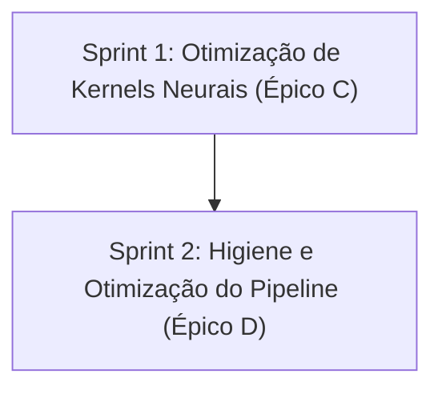

<!--
SPDX-License-Identifier: Apache-2.0
Copyright (c) 2026 Fábio Henrique de Lima Silva (fhl.bsb@gmail.com) All rights reserved.
-->

# TODO-sprints — Kernels GEMV/LSTM Afinados e Higiene (Épicos C e D)

Este documento define o planejamento de sprints e tarefas técnicas para a execução do **Épico C — "Kernels GEMV/LSTM afinados"** e **Épico D — "Higiene de pipeline e build"**, agrupando e detalhando os achados **P5**, **P6**, **P7** e **P8** descritos no arquivo [TODO-findings.md](file:///home/fabio/nam-rs/TODO-findings.md).

O objetivo é realizar micro-otimizações de alta precisão em kernels neurais e no pipeline DSP, seguidas pelo polimento no sistema de compilação/distribuição.

---

## Estrutura de Sprints

---

## Sprint 1: Otimização de Kernels Neurais (Épico C)

Foco na otimização fina dos kernels neurais do LSTM e do DenseLayer (GEMV), eliminando branches em loops por amostra e minimizando store-to-load forwarding stalls na pilha.

### Tarefa C1 (P6) — Loop-Unswitching do Head LSTM ✅ [DONE]

* **Prioridade:** Alta
* **Complexidade/Esforço:** Baixo
* **Risco:** Baixo
* **Arquivos Afetados:**
  * [head_projection.rs](file:///home/fabio/nam-rs/src/models/lstm/head_projection.rs)
  * [model1.rs](file:///home/fabio/nam-rs/src/models/lstm/model1.rs)
  * [model2.rs](file:///home/fabio/nam-rs/src/models/lstm/model2.rs)
  * [model_dyn.rs](file:///home/fabio/nam-rs/src/models/lstm/model_dyn.rs)
* **Descrição:**
  1. Modificar os laços de amostras (`for (i, &val) in input.iter().enumerate()`) nos métodos das especializações SIMD de `LstmModel1`, `LstmModel2` e `LstmModelDyn` para que o teste `if self.use_f32_head` seja feito apenas uma vez por bloco, antes do laço.
  2. Implementar os dois caminhos separados (laço com dot product F32 nativo contra laço quantizado/bf16).
  3. Ajustar/remover o uso do macro `compute_lstm_head_simd!` se necessário, movendo a lógica para inlines especializados de forma a maximizar o hoist de branches e permitir melhor pipelining do LLVM.
* **Estratégia de Validação:**
  * `cargo test` para certificar a paridade matemática bit-a-bit dos modelos LSTM modificados.
  * Comparação em microbenchmarks (`cargo bench -- lstm`) para avaliar o ganho de ciclos no processamento sequencial.
* **Conclusão:** Branch `use_f32_head` hoisted para fora do laço per-sample em todos os 3 modelos (define_lstm1_process!, define_lstm2_process_pipelined!, e 3 kernels inline do LstmModelDyn). Macro `compute_lstm_head_simd!` removida; dot product inlined diretamente nos dois caminhos. 22 testes LSTM + todos os integration tests passam. Benchmarks estáveis (sem regressão significativa). Clippy limpo.

### Tarefa C2 (P5) — GEMV `out_len == 1` sem Transposição na Pilha ✅ [DONE]

* **Prioridade:** Média
* **Complexidade/Esforço:** Médio
* **Risco:** Médio
* **Arquivos Afetados:**
  * [f32_avx2.rs](file:///home/fabio/nam-rs/src/math/gemm/gemv/f32_avx2.rs)
  * [f32_avx512.rs](file:///home/fabio/nam-rs/src/math/gemm/gemv/f32_avx512.rs)
* **Descrição:**
  1. Substituir a indexação e transposição escalar baseada em pilha (`buf0..buf7` no AVX2 / `buf0..buf15` no AVX-512) por transposição baseada em registradores usando shuffles/unpacks.
  2. Para `in_len` pequenos, testar se um desvio direto para processamento contíguo por frame (evitando totalmente transposições de qualquer tipo) é mais rápido e adotar esse limite via calibração baseada em benchmarks.
* **Estratégia de Validação:**
  * `cargo test -- math::gemm::gemv` para validar todas as variantes de GEMV contra a referência escalar fallback.
  * Executar benchmarks Criterion dedicados ao GEMV e medir flutuações de performance conforme `in_len`.
* **Conclusão:** Stack buffers eliminados nos 4 paths (gemv_with_bias_f32 / gemv_no_bias_f32, AVX2 + AVX-512). AVX2 usa transpose 8×8 totalmente em registradores via `_mm256_loadu_ps` + 8× `_mm256_unpacklo/hi_ps` + 8× `_mm256_shuffle_ps` + 8× `_mm256_permute2f128_ps`. AVX-512 usa 2× transpose 8×8 independentes (frames 0-7 e 8-15) com `_mm256_loadu_ps` e depois combina via `_mm512_insertf32x8`. Threshold `SMALL_IN_LEN_THRESHOLD = 4` definido via benchmark: para `in_len ≤ 4`, o batch loop é bypassado em favor do processamento per-frame (onde a sobrecarga de transpose não compensa). Benchmarks Criterion (`head_rechannel_fp32`): DenseLayer_8x1_64f_AVX2: -52% (77.7ns), DenseLayer_16x1_64f_AVX2: -41% (113.5ns). 8 testes GEMV passam (bit-a-bit contra fallback escalar). Todos integration tests (golden_vectors, linear_golden, cpp_parity, lstm_*, self_consistency, nam_infer) passam. Clippy limpo.

---

## Sprint 2: Higiene e Otimização do Pipeline (Épico D)

Foco em reduzir passagens repetidas sobre buffers na thread de tempo real, remover cópias mono supérfluas, eliminar escritas atômicas espúrias em loops quentes e adotar o perfil de build `panic = "abort"` para distribuição.

### Tarefa D1 (P8) — Otimização do Pipeline DSP (Input Stage & Mono & Atoms)

* **Prioridade:** Média
* **Complexidade/Esforço:** Médio
* **Risco:** Baixo
* **Arquivos Afetados:**
  * [traits.rs](file:///home/fabio/nam-rs/src/math/common/traits.rs)
  * [utility.rs](file:///home/fabio/nam-rs/src/math/common/scalar_ref/utility.rs)
  * [avx2_impl.rs](file:///home/fabio/nam-rs/src/math/common/avx2_impl.rs)
  * [base.rs (AVX-512)](file:///home/fabio/nam-rs/src/math/common/avx512/dsp/base.rs)
  * [vnni_bf16.rs (AVX-512 BF16)](file:///home/fabio/nam-rs/src/math/common/avx512/dsp/vnni_bf16.rs)
  * [input.rs](file:///home/fabio/nam-rs/src/dsp/pipeline/stages/input.rs)
  * [output.rs](file:///home/fabio/nam-rs/src/dsp/pipeline/stages/output.rs)
  * [bridge.rs](file:///home/fabio/nam-rs/src/dsp/pipeline/bridge.rs)
  * [peaks.rs](file:///home/fabio/nam-rs/src/clap/processor/dsp/peaks.rs)
  * [channels.rs](file:///home/fabio/nam-rs/src/clap/processor/dsp/channels.rs)
  * [orchestrator.rs](file:///home/fabio/nam-rs/src/clap/processor/dsp/orchestrator.rs)
  * [process.rs (PipeWire)](file:///home/fabio/nam-rs/src/standalone/pw_host/rt_callback/process.rs)
* **Descrição:**
  1. **Fusão de Passos (Input Stage)**: Adicionar o método `apply_gain_then_dither` no trait `SimdMath` e implementá-lo no fallback escalar, AVX2 e AVX-512. Utilizar esta chamada unificada no estágio de entrada sempre que o ganho e dither precisarem ser aplicados, reduzindo de duas passagens de buffer para apenas uma.
  2. **Remoção de Memcpy Mono Intermediário**: Remover o memcpy `copy_nonoverlapping` L->R no estágio de saída. Estender `write_block` (no DspBridgeWriter) para copiar o canal esquerdo para ambas as saídas em modo mono. Estender `compute_output_peaks` no plugin CLAP para realizar a cópia similar.
  3. **Evitar Escritas Atômicas Redundantes**: Modificar as escritas atômicas de `active_channel_count` e `last_n_samples` em loops de processamento para ocorrerem apenas quando o novo valor diferir do valor já armazenado.
* **Estratégia de Validação:**
  * `cargo test` em toda a suíte do pipeline DSP para garantir que o processamento estéreo e mono permaneça idêntico.
  * Teste manual e análise estática das escritas atômicas.

### Tarefa D2 (P7) — Perfil de Distribuição com Panic = Abort

* **Prioridade:** Média
* **Complexidade/Esforço:** Baixo
* **Risco:** Baixo
* **Arquivos Afetados:**
  * [Cargo.toml](file:///home/fabio/nam-rs/Cargo.toml)
  * [build-release.sh](file:///home/fabio/nam-rs/utils/build-release.sh)
* **Descrição:**
  1. Configurar o perfil customizado `[profile.dist]` herdando de `release` com `panic = "abort"`.
  2. Assegurar que `[profile.test]` e `[profile.bench]` possuam `panic = "unwind"` para manter conformidade com harnesses.
  3. Ajustar `build-release.sh` to compile usando `--profile dist` e atualizar as validações de caminhos de arquivos construídos para apontarem para o diretório `target/dist`.
* **Estratégia de Validação:**
  * Executar `./utils/build-release.sh` completo e verificar se todos os binários (standalone e CLAP) são compilados com sucesso.
  * Comparar tamanho em bytes dos binários gerados.
  * Carregar o plugin gerado em hosts CLAP e realizar smoke test básico.

---

## Critério de Pronto Geral (Definition of Done)

Para considerar os Épicos C e D concluídos:

1. **Compilação Limpa:** Sem erros ou warnings via `cargo check` e `cargo clippy`.
2. **Corretude Matemática:** Fidelidade bit-a-bit contra as referências escalares em todas as redes neurais e transformações DSP.
3. **Estabilidade em Tempo Real (RT-Safety):** Sem panics, alocações de memória ou chamadas de sistema (syscalls) introduzidas nos caminhos RT quentes.
4. **Higiene e Conformidade de Build:** Presença de cabeçalhos de copyright e licenças SPDX corretos em todos os arquivos modificados.
