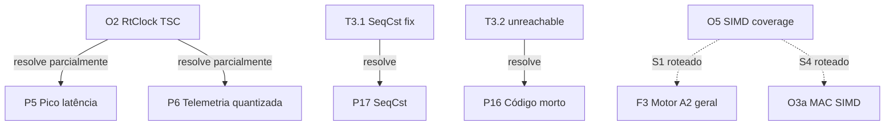

<!--
SPDX-License-Identifier: Apache-2.0
Copyright (c) 2026 Fábio Henrique de Lima Silva (fhl.bsb@gmail.com) All rights reserved.
-->

# TODO-sprints.md — Plano de Execução O2 + O5 + Micro-Fixes

> **Épico**: Enxugamento de dependências e formalização SIMD
> **Backlogs fonte**: `TODO-optimize.md` (O2, O4, O5) + `TODO-problemas.md` (P5, P6, P16, P17)
> **Data de criação**: 2026-06-18
> **Última atualização**: 2026-06-18

---

## Visão Geral das Sprints

| Sprint | Nome                                         | Risco    | Estimativa | Dependência |
| ------ | -------------------------------------------- |:--------:|:----------:| ----------- |
| **S1** | O2 — Internalizar `minstant` → `RtClock` TSC | 🟡 Médio | ~2h        | —           |
| **S2** | O5 — Formalizar SIMD DONE + Cancelar O4      | 🟢 Baixo | ~15 min    | —           |
| **S3** | Micro-fixes P16 + P17                        | 🟢 Baixo | ~15 min    | —           |
| **S4** | P5 + P6 — Telemetria Latência e Denormais    | 🟢 Baixo | ~45 min    | S1 (O2)     |
| **S5** | P18 — Alinhamento SIMD Cabsim (Prep O3a)     | 🟢 Baixo | ~20 min    | —           |

**Ordem de execução**: S1 → S4 → S2 → S3 → S5 (S4 exige S1; demais são independentes).

---

## Sprint 1 — O2: Internalizar `minstant` → `RtClock` TSC Unificado

> ⚠️ **Sprint crítica**: toca o hot-path do CLAP processor e remove uma dependência
> com cadeia `ctor` + `syn` v1. Verificação incremental a cada tarefa.

### T1.1 — Mover `tsc.rs` para `src/common/tsc.rs` [DONE]

**Objetivo**: Tornar o clock TSC acessível tanto ao standalone quanto ao CLAP.

**Detalhes**:

- [ ] Copiar `src/standalone/rt_setup/tsc.rs` → `src/common/tsc.rs`
- [ ] Envolver o módulo com `#[cfg(target_arch = "x86_64")]` (consistente com o projeto)
- [ ] Adicionar probe CPUID invariant-TSC: `CPUID(0x80000007).EDX bit 8`
  - Se presente: log info "Invariant TSC confirmed"
  - Se ausente: log warning "Non-invariant TSC detected — timing may drift under CPU scaling"
  - A calibração continua funcionando em ambos os casos (não bloqueia)
- [ ] Registrar `pub mod tsc;` em `src/common/mod.rs`
- [ ] Substituir o módulo original em `src/standalone/rt_setup/` por re-export:

  ```rust
  // src/standalone/rt_setup/tsc.rs → se torna:
  pub use crate::common::tsc::*;
  ```

  - **Alternativa preferida**: remover `tsc.rs` do `rt_setup/` e re-exportar de `mod.rs`
- [ ] `cargo check`

**Arquivos**:

- [NEW] `src/common/tsc.rs`
- [MODIFY] `src/common/mod.rs`
- [MODIFY] `src/standalone/rt_setup/mod.rs`
- [DELETE ou MODIFY] `src/standalone/rt_setup/tsc.rs`

**Critério de aceite**: `rdtsc_nanos()` compilável e acessível como `crate::common::tsc::rdtsc_nanos()`.

---

### T1.2 — Migrar CLAP processor de `minstant::Instant` → `rdtsc_nanos()` [DONE]

**Objetivo**: Eliminar `minstant::Instant` no hot-path CLAP.

**Detalhes**:

- [ ] Em `src/clap/processor/mod.rs`:
  - Trocar `use minstant::Instant` por `use crate::common::tsc::rdtsc_nanos`
  - Mudar `start_time: Option<Instant>` → `start_nanos: u64` (0 = não medir)
  - Substituir `Some(Instant::now())` → `rdtsc_nanos()`
  - Substituir `None` → `0`
- [ ] Em `src/clap/processor/dsp/orchestrator.rs`:
  - Remover `use minstant::Instant`
  - Mudar assinatura `start_time: Option<Instant>` → `start_nanos: u64`
- [ ] Em `src/clap/processor/dsp/telemetry.rs`:
  - Remover `use minstant::Instant`
  - Trocar `fn process_telemetry(&mut self, start_time: Option<Instant>)` →
    `fn process_telemetry(&mut self, start_nanos: u64)`
  - Trocar `if let Some(start_time) = start_time { start_time.elapsed().as_nanos() as u64 }`
    → `if start_nanos > 0 { rdtsc_nanos().wrapping_sub(start_nanos) }`
- [ ] `cargo check --features clap-plugin`

**Arquivos**:

- [MODIFY] `src/clap/processor/mod.rs`
- [MODIFY] `src/clap/processor/dsp/orchestrator.rs`
- [MODIFY] `src/clap/processor/dsp/telemetry.rs`

**Critério de aceite**: Zero `minstant::Instant` no código; CLAP compila sem warning.

---

### T1.3 — Eliminar `minstant::Anchor` (parâmetro morto do standalone) [DONE]

**Objetivo**: O `Anchor` é passado por toda a cadeia standalone mas nunca usado
(`_tsc_anchor` com underscore em `telemetry.rs:28`). Remover.

**Detalhes**:

- [ ] Em `src/standalone/rt_setup/telemetry.rs`:
  - Remover `use minstant::Anchor`
  - Remover parâmetro `_tsc_anchor: &Anchor` de `poll_rt_status()`
- [ ] Em `src/dsp/pipeline/output_pw.rs`:
  - Remover `use minstant::Anchor`
  - Remover campo `pub tsc_anchor: Anchor` de `PipewireHostConfig`
- [ ] Em `src/standalone/pw_host/run.rs`:
  - Remover `tsc_anchor` do destructure de `PipewireHostConfig` (L53)
  - Remover `&tsc_anchor` da chamada `poll_rt_status()` (L228)
- [ ] Em `src/main.rs`:
  - Remover `let tsc_anchor = minstant::Anchor::new()` (L179)
  - Remover `tsc_anchor,` do `PipewireHostConfig {}` (L198)
- [ ] `cargo check --features standalone`

**Arquivos**:

- [MODIFY] `src/standalone/rt_setup/telemetry.rs`
- [MODIFY] `src/dsp/pipeline/output_pw.rs`
- [MODIFY] `src/standalone/pw_host/run.rs`
- [MODIFY] `src/main.rs`

**Critério de aceite**: Zero `minstant::Anchor` no código; standalone compila sem warning.

---

### T1.4 — Remover `minstant` do `Cargo.toml` [DONE]

**Objetivo**: Eliminar a dependência e confirmar build limpo.

**Detalhes**:

- [x] Remover `minstant = "0.1.7"` da seção `[dependencies]` do `Cargo.toml`
- [x] `cargo check` (todos os features)
- [x] `cargo build --features standalone`
- [x] `cargo build --features clap-plugin`
- [x] Verificar: `grep -r minstant src/` → **zero matches**
- [x] Verificar: `cargo tree | grep minstant` → **nenhum resultado**

**Arquivos**:

- [MODIFY] `Cargo.toml`

**Critério de aceite**: Build limpo sem `minstant` no grafo de dependências. `ctor` e
`syn` v1 desaparecem se eram trazidos exclusivamente por `minstant`.

---

### T1.5 — Testes e verificação de calibração [DONE]

**Objetivo**: Garantir que o TSC funciona corretamente no novo path.

**Detalhes**:

- [x] Verificar que `rt_setup_test::test_rdtsc_nanos_monotonic` passa
- [x] Verificar que `rt_setup_test::test_rdtsc_nanos_significant` passa
- [x] `cargo test` (suíte completa) — 456 passed, 0 failed
- [x] Verificar zero warnings em toda a build

**Critério de aceite**: `cargo test` verde sem warnings.

---

## Sprint 2 — O5: Formalizar SIMD DONE + Cancelar O4

### T2.1 — Atualizar `TODO-optimize.md` [DONE]

- [x] Mover O5 para seção histórico (DONE) com nota:
  - S2 ✅, S3 ✅, Limpeza ✅ (verificados no código)
  - S1 → F3 (roteado), S4 → O3a (roteado)
  - Guard-rail ativo: regra documentada
- [x] Mover O4 para seção "Cancelado" com justificativa:
  - `rtrb` é zero-dep, minúsculo, bem testado
  - Custo de re-implementar > benefício marginal
  - Reconsiderar apenas se profiling apontar false sharing

**Critério de aceite**: `TODO-optimize.md` reflete estado real do código.

---

## Sprint 3 — Micro-Fixes P16 + P17

### T3.1 — P17: Corrigir `SeqCst` → `Acquire/Release` no shutdown flag

**Detalhes**:

- [ ] Em `src/main.rs:76`: `Ordering::SeqCst` → `Ordering::Acquire` (load)
- [ ] Em `src/main.rs:79`: `Ordering::SeqCst` → `Ordering::Release` (store)
- [ ] `cargo check`

**Critério de aceite**: Zero `SeqCst` em `main.rs`.

---

### T3.2 — P16: Marcar fallback escalar A2 como `unreachable!()`

**Detalhes**:

- [ ] Em `src/models/a2/model/mod.rs:393-444`:
  - Substituir o bloco escalar por `unreachable!()` com mensagem explicativa
  - Usar `unreachable!()` safe (não `unreachable_unchecked()`) — custo zero pois
    o branch nunca é tomado; segurança preservada contra bug futuro em `set_weights`
- [ ] `cargo check`
- [ ] `cargo test` — confirmar que nenhum teste usa o fallback escalar

**Critério de aceite**: Compilação limpa; testes verdes; invariante documentada.

---

## Sprint 4 — Estabilidade e Telemetria (P5 + P6)

> Depende da **S1 (O2)** concluída para ter acesso a `rdtsc_nanos()`.

### T4.1 — P6: Telemetria exata via lock-free max

**Detalhes**:

- [ ] Em `src/dsp/telemetry.rs`, adicionar `exact_max: std::sync::atomic::AtomicU64` no `LatencyHistogram`.
- [ ] Atualizar o método `new()` e `reset()` para zerar `exact_max`.
- [ ] Em `record()`, usar `self.exact_max.fetch_max(duration_ns, Ordering::Relaxed)`.
- [ ] Adicionar método `pub fn get_exact_max(&self) -> u64` retornando o `.load()`.
- [ ] Em `src/standalone/rt_setup/telemetry.rs:171`, ler o exato (`let exact = ... / 1000`) em vez de logar o `get_max()` log2. Exibir `p50`, `p99`, e `exact`.

### T4.2 — P5: Proteção anti-denormal e percentis

**Detalhes**:

- [ ] Em `src/standalone/pw_host/rt_callback/process.rs`, reassertear o DAZ/FTZ: `if (*frame_count & 0x3FF) == 0 { unsafe { crate::math::common::set_daz_ftz(); } }` antes de despachar o pipeline.
- [ ] Em `tests/nam_infer_test.rs:496`, testar usando P99/histogramas em vez de `Instant::now()` se for viável, focar nas invariantes matemáticas de que o modelo não degenerou, tolerando pequenas variações de SO na medição _wall-clock_ para evitar _flakiness_.

---

## Sprint 5 — Prep O3a: Cabsim SIMD Alignment (P18)

### T5.1 — Alinhamento de buffers no `ConvEngine`

**Detalhes**:

- [ ] Em `src/dsp/cabsim/conv.rs`, modificar as propriedades internas:
  - `h_fdl: AlignedVec<f32>`
  - `fdl: AlignedVec<f32>`
  - `input_buf: AlignedVec<f32>`
  - `acc: AlignedVec<Complex<f32>>` (opcional, ou manter dependente de rustfft).
- [ ] Atualizar o método `new()` de `vec![0.0; N]` para `AlignedVec::from_vec(...)`.

---

## Conexões com Outros Backlogs



---

## Pós-execução

Ao concluir todas as sprints:

- [ ] `cargo test` (verde)
- [ ] `cargo check` (zero warnings)
- [ ] Atualizar `TODO-optimize.md` e `TODO-problemas.md` com status DONE
- [ ] Limpar este `TODO-sprints.md` (marcar tarefas concluídas)
