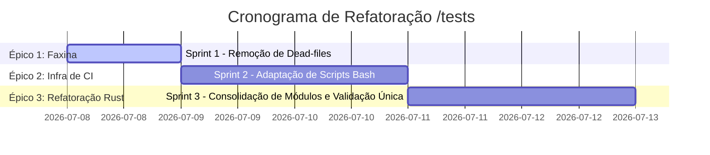

<!--
SPDX-License-Identifier: Apache-2.0
Copyright (c) 2026 Fábio Henrique de Lima Silva (fhl.bsb@gmail.com) All rights reserved.
-->

# TODO-sprints: Planejamento Ágil para a Refatoração do Diretório `/tests`

Este cronograma detalha a decomposição das tarefas técnicas para resolver o anti-pattern do Cargo na pasta `tests/` e remover arquivos lixo, mitigando riscos e, em especial, **otimizando o tempo gasto na rodada de QA**, evitando invocações desnecessárias dos scripts bash, em especial o demorado `tests-long.sh`.

---

## 1. Visão Geral do Plano de Execução

A refatoração está dividida em **3 Épicos** independentes. Para otimizar o tempo e não sobrecarregar as máquinas, apenas *cargo check* será rodado durante a construção, com uma **única bateria completa do `tests-long.sh` deixada estritamente para o último passo do último Sprint**, consolidando e validando todas as mudanças num único ciclo.

---

## 2. Detalhamento dos Sprints e Tarefas Técnicas

### Épico 1: Faxina de Repositório

*Foco na eliminação segura e imediata do peso morto, reduzindo distrações para os próximos passos.*

#### Sprint 1: Purgação dos Fixtures Órfãos

- **Risco/Complexidade**: **Baixíssimo**. Os arquivos comprovadamente não são invocados por nenhum código Rust ou Bash.

- **[x] Tarefa 1.1**: Remover via `git rm` os arquivos inutilizados em `tests/fixtures/`:
  - `stress_signal_v1.wav` e `stress_signal_v2_*.wav`
  - `resampler_input_*.f32` e `resampler_ref_*.f32`
  - Vetores v2 não consumidos (`golden_lstm_*_v2_*.bin`, `golden_wavenet_*_v2_*.bin`, etc.)
  - `CMakeLists_render_ir.txt`
  > [!NOTE]
  > **Concluído 2026-07-08.** 39 arquivos rastreados (`git rm`) + 4 stress v2 wavs não rastreados + ~34 v2 `.temp_golden/` wavs removidos. **Exceções identificadas que NÃO foram removidas (estão em uso):** `resampler_input_*.f32`/`resampler_ref_*.f32` são consumidos por `resampler_test.rs`; `stress_signal_v2_48000.wav` é carregado por `pgo_profiling_workload.rs:37`. **Impacto colateral:** `tests-quick.sh:169` usava `golden_wavenet_standard_v2_48000.bin` como flag de gate — golden_vectors + isa_parity agora serão pulados graciosamente; ajustar no Sprint 2.

---

### Épico 2: Desacoplamento da Infraestrutura de CI

*Foco na orquestração paralela: preparar os bash scripts para a futura arquitetura ANTES que os binários efetivamente mudem.*

#### Sprint 2: Atualização semântica do `tests-quick.sh` e `tests-long.sh`

- **Risco/Complexidade**: **Alto**. A mudança na string de comando do Bash é propensa a erros sintáticos.
  > [!TIP]
  > Para evitar gastar horas depurando erros bash, teste o output (apenas em `echo`) de formação de strings dentro dos scripts antes de avançar para o Sprint 3.

- **[ ] Tarefa 2.1**: Em `utils/tests-quick.sh`, localizar o vetor `STRUCTURAL_TESTS` e modificar a forma como o Cargo é invocado.
  - *Detalhe Técnico*: Atualmente utiliza expansão bash `--test=...`. Precisará ser atualizado para invocar explicitamente os arquivos de entrada (ex: `--test models models::a2_loader`, ou repassar o filtro de forma suportada pelo `cargo test`).
- **[ ] Tarefa 2.2**: Em `utils/tests-long.sh`, substituir invocações lineares (ex: `--test a2_heap_audit`) para as respectivas chaves (ex: `--test rt_constraints rt_constraints::a2_heap_audit`).

---

### Épico 3: Refatoração Estrutural e Homologação Otimizada

*Foco na união dos testes. Como o `tests-long.sh` demanda 1h, nós vamos aplicar toda a reestruturação topológica do código Rust de uma só vez, rodando apenas checagens de sintaxe rápidas ao longo do percurso.*

#### Sprint 3: Criação de Entradas Centrais, Submódulos e Homologação

- **Risco/Complexidade**: **Médio**.
  > [!IMPORTANT]
  > Centralizar a validação massiva no `tests-long.sh` como evento final do projeto economiza dezenas de horas de computação, respeitando a diretriz de otimização estrita do usuário. Só se submete ao script demorado após esgotar o linter, o cargo check e os testes-rápidos.
- Rodar repetitivamente apenas `cargo check --tests` durante todo o refactor para atestar que os caminhos e arquivos estão publicamente visíveis (leva 1 segundo). **Não execute a suíte longa ainda.**

- **[ ] Tarefa 3.1**: Criar 5 arquivos de testes principais (os "Entry-points"): `tests/models.rs`, `tests/clap.rs`, `tests/perf_soak.rs`, `tests/rt_constraints.rs`, `tests/parity.rs`.
- **[ ] Tarefa 3.2**: Mover os 50 testes órfãos para subdiretórios correspondentes aos nomes dos Entry-points (ex: o que ia para `tests/a2_loader.rs` vai para `tests/models/a2_loader.rs`).
- **[ ] Tarefa 3.3**: No cabeçalho de cada arquivo entry-point criado (Tarefa 3.1), adicionar os declaradores de módulo `mod ...;` (ex: em `tests/models.rs`, adicionar `mod a2_loader;`).

- **[ ] Tarefa Final**: Homologação Final Integrada. Estando a sintaxe Rust perfeita (`utils/lints.sh`), é a hora de rodar as suítes de validação de forma otimizada, apenas uma vez:
  1. Primeiro execute `utils/tests-quick.sh` (leva de 1 a 2 min). Se falhar, corrija sem queimar etapas demoradas.
  2. Apenas com o passe-verde da suíte rápida, proceda para a validação real (o portão final): `utils/tests-long.sh`.
  3. Aproveitar para salvar a saida do terminal em `testes.log` para reaproveitamento na próxima atividade.
