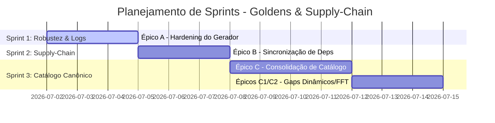

<!--
SPDX-License-Identifier: Apache-2.0
Copyright (c) 2026 Fábio Henrique de Lima Silva (fhl.bsb@gmail.com) All rights reserved.
-->

# TODO-sprints.md — Planejamento de Sprints e Backlog de Tarefas

> Gerado pela skill `planejador-arquiteto`, com base nos achados críticos de supply-chain e robustez documentados em [TODO-findings.md](file:///home/fabio/nam-rs/TODO-findings.md).

Este documento organiza a execução do hardening, a resolução dos gaps de supply-chain e a consolidação do catálogo de goldens mapeados nos **Épicos A, B e C** de [TODO-findings.md](file:///home/fabio/nam-rs/TODO-findings.md).

---

## 🏃 Visão Geral das Sprints

---

## 🔴 Épico A — Hardening do Fluxo de Erro do Gerador de Goldens (Alto Risco)

**Objetivo:** Tornar o script [golden_gen_build.sh](file:///home/fabio/nam-rs/tests/fixtures/golden_gen_build.sh) tolerante a falhas individuais de renderização, enriquecer a observabilidade com logs persistentes e manter a numeração de fases consistente.

### 🏃 Sprint A.1: Hardening & Observabilidade (Duração: Est. 3 dias)

#### 📝 Tarefa A.1.1: Correção do Tratamento de Erros e Controle de Fluxo [DONE]

- **Prioridade:** 🔴 Crítica
- **Risco:** Alto (pode quebrar a execução do script se o fluxo de loop for corrompido)
- **Achado Associado:** F1 de [TODO-findings.md](file:///home/fabio/nam-rs/TODO-findings.md#L58-L136)
- **Arquivo Alvo:** [golden_gen_build.sh](file:///home/fabio/nam-rs/tests/fixtures/golden_gen_build.sh)
- **Descrição:**
  - Desativar temporariamente o `pipefail` (ou capturar o código de saída explicitamente) no render do loop v1 (linha 273).
  - Garantir que erros individuais de renderização não causem a parada abrupta do script devido ao `set -e` global.
  - Implementar verificação explícita do status de saída do comando de renderização.
  - Permitir que o loop continue para os modelos restantes usando `continue`.
  - ✅ **CONCLUÍDO 2026-07-02**: Padrão adotado: `set +o pipefail` local + captura explícita de `$?` + restauração de `pipefail`, seguindo a abordagem "mais robusta e sem subshell" proposta em F1. O loop v2 (linha 370) já usava subshell como workaround; o loop v1 agora usa o mesmo tratamento de erro explícito. Nenhuma outra chamada de pipeline em loop com `continue` foi encontrada — todas as demais estão fora de loops e abortar via `set -e` é o comportamento correto.

#### 📝 Tarefa A.1.2: Persistência de Logs Completos por Fase [DONE]

- **Prioridade:** 🟠 Alta
- **Risco:** Baixo
- **Achado Associado:** F8 de [TODO-findings.md](file:///home/fabio/nam-rs/TODO-findings.md#L497-L527)
- **Arquivo Alvo:** [golden_gen_build.sh](file:///home/fabio/nam-rs/tests/fixtures/golden_gen_build.sh)
- **Descrição:**
  - Criar o diretório de logs em `build/namcore_render/logs/`.
  - Redirecionar a saída completa (`stdout` e `stderr`) de cada subcomando barulhento (ex: `cmake`, `cargo build`, renderizadores) para arquivos de log dedicados (ex: `build/namcore_render/logs/phase_3_build.log`).
  - Manter o console limpo usando `tail -N` no caminho de sucesso (exibindo apenas um resumo informativo no console).
  - Em caso de falha de qualquer fase, imprimir uma mensagem de erro em destaque instruindo o desenvolvedor a verificar o arquivo de log persistente correspondente.
  - ✅ **CONCLUÍDO 2026-07-02**: Logs estruturados em `build/namcore_render/logs/` com nomes descritivos (não fase-dependentes, pois A.1.3 renumerará fases):
    - `render_cmake.log` — cmake configure + build (append)
    - `rust_build.log` — cargo build (gen_stress + wav_to_golden)
    - `render_v1.log` — render v1 acumulado de todos os modelos (append via temp)
    - `render_v2.log` — render v2 multi-SR acumulado (append via temp)
    - `render_ir_build.log` — compilação C++ do render_ir
    - Padrão de falha uniforme: `cmd > "$LOG" 2>&1 || { tail -5; echo "ERROR: ..."; exit 1; }` com mensagem apontando para o log persistente. Gen_stress e wav_to_golden mantidos sem log por serem leves. As chamadas de render agora usam arquivo temporário por modelo → `cat >>` para o log mestre.

#### 📝 Tarefa A.1.3: Renumeração Consistente das Fases do Script [DONE]

- **Prioridade:** 🟡 Média
- **Risco:** Baixo
- **Achado Associado:** F7 de [TODO-findings.md](file:///home/fabio/nam-rs/TODO-findings.md#L462-L494)
- **Arquivo Alvo:** [golden_gen_build.sh](file:///home/fabio/nam-rs/tests/fixtures/golden_gen_build.sh)
- **Descrição:**
  - Revisar e renumerar de forma única e estritamente linear todos os marcadores de fase exibidos no output (`stdout`).
  - Remover a duplicidade do marcador `[6/6]` e resolver inconsistências de base de fases (ex: de `/5` para `/6` e `/7`).
  - Atualizar o catálogo documentado em [README.md](file:///home/fabio/nam-rs/tests/fixtures/README.md) se houver referência às fases numéricas.
  - ✅ **CONCLUÍDO 2026-07-02**: Total de 10 fases reais identificado. Renumeração estritamente linear de `[1/10]` a `[10/10]`:
    1. Plugin verification (era `[1/6]`)
    2. Core verification (era `[1b/6]` — sub-numeração eliminada)
    3. Build render tool (era `[2/5]`)
    4. Build Rust tools (era `[3/5]`)
    5. Stress signals (era `[4/5]`)
    6. Render v1 (era `[5/5]`)
    7. Render v2 (era `[5b/5]` — sub-numeração eliminada)
    8. IR reference build (era `[6/6]` — duplicata resolvida)
    9. Cleanup (era `[6/6]` — duplicata resolvida)
    10. Freshness manifest (era `[7/7]`)
    - Referência `[1/6]` no `tests/fixtures/README.md:34` atualizada para `[1/10]`.

#### 🏁 Critérios de Aceite da Sprint A.1

1. Simular uma falha injetando um arquivo `.nam` inválido temporariamente no catálogo do loop v1 e verificar se o script avisa do erro, continua processando os demais modelos e gera o log em `build/namcore_render/logs/`.
2. O script deve rodar do início ao fim com todas as fases numeradas de `[1/9]` até `[9/9]` de forma sequencial clara.
3. Nenhuma falha de render de modelo individual deve causar crash abrupto do Bash sem diagnóstico adequado.

---

## 🔴 Épico B — Fechar o Gap de Supply-Chain do `NeuralAmpModelerPlugin`

**Objetivo:** Garantir a reprodutibilidade dos goldens C++ integrando a sincronização do repositório [NeuralAmpModelerPlugin](https://github.com/sdatkinson/NeuralAmpModelerPlugin) ao fluxo oficial, compartilhando as definições de versão entre scripts e corrigindo a documentação do projeto.

### 🏃 Sprint B.1: Alinhamento de Dependências C++ (Duração: Est. 3 dias)

#### 📝 Tarefa B.1.1: Centralização de Versões em Fonte Única de Verdade

- **Prioridade:** 🔴 Crítica
- **Risco:** Médio (precisa garantir compatibilidade de importação do ambiente no Bash)
- **Achado Associado:** F2 (sub-tarefa de constantes) de [TODO-findings.md](file:///home/fabio/nam-rs/TODO-findings.md#L186-L191)
- **Arquivos Alvos:**
  - [variables.env](file:///home/fabio/nam-rs//variables.env) [NEW]
  - [mod-update.sh](file:///home/fabio/nam-rs/utils/mod-update.sh)
  - [golden_gen_build.sh](file:///home/fabio/nam-rs/tests/fixtures/golden_gen_build.sh)
- **Descrição:**
  - Criar um novo arquivo [variables.env](file:///home/fabio/nam-rs//variables.env) contendo os hashes e tags das dependências vendored:
    - `NAM_CORE_TAG="v0.5.4"`
    - `NAM_CORE_COMMIT="1f42f88535884450104b8711d7595019afa0495b"`
    - `NAM_PLUGIN_TAG="v0.5.4"` (ou tag correspondente ao commit abaixo)
    - `NAM_PLUGIN_COMMIT="96337e9ab6e3beb619459779bbb5c47e1b04d8c4"`
  - Incluir cabeçalhos de copyright SPDX apropriados em [variables.env](file:///home/fabio/nam-rs//variables.env).
  - Alterar [mod-update.sh](file:///home/fabio/nam-rs/utils/mod-update.sh) e [golden_gen_build.sh](file:///home/fabio/nam-rs/tests/fixtures/golden_gen_build.sh) para carregar essas variáveis via `source` dinâmico do arquivo compartilhado, removendo as declarações duplicadas locais.
  - ✅ **CONCLUÍDO 2026-07-02**: Arquivo `/variables.env` (raiz do projeto) criado com as 4 constantes + URLs de clone (`NAM_CORE_REPO`, `NAM_PLUGIN_REPO`) e cabeçalho SPDX. Ambos os scripts carregam via `source`: `golden_gen_build.sh` usa `$PROJECT_ROOT/variables.env`; `mod-update.sh` usa `$PROJECT_DIR/variables.env`. `mod-update.sh` também usa `$NAM_CORE_REPO` no lugar da URL hardcoded. `NAM_CORE_SHA` → `NAM_CORE_COMMIT` unificado. Zero duplicações de hashes entre os scripts.

#### 📝 Tarefa B.1.2: Extensão de Sincronização do `NeuralAmpModelerPlugin` no `mod-update.sh` [DONE]

- **Prioridade:** 🔴 Crítica
- **Risco:** Médio
- **Achado Associado:** F2 de [TODO-findings.md](file:///home/fabio/nam-rs/TODO-findings.md#L138-L195)
- **Arquivo Alvo:** [mod-update.sh](file:///home/fabio/nam-rs/utils/mod-update.sh)
- **Descrição:**
  - Adicionar o fluxo de sincronização para o diretório `tests/fixtures/NeuralAmpModelerPlugin`.
  - Implementar a clonagem simétrica à do Core: se a pasta não existir, clonar a partir do repositório upstream oficial.
  - Se a pasta já existir, executar fetch e checkout no commit pinado (`NAM_PLUGIN_COMMIT`).
  - Inicializar os submódulos necessários para o Plugin (`AudioDSPTools`, que por sua vez contém dependências como `eigen` e `nlohmann`).
  - ✅ **CONCLUÍDO 2026-07-02**: Versões verificadas contra GitHub API — Core mantém v0.5.4 (`1f42f88`), Plugin corrigido para v0.7.15 (`96337e9a` — commit mantido, tag estava errada como v0.5.4). `variables.env` atualizado com `NAM_PLUGIN_TAG="v0.7.15"`. Seção `[5/5]` adicionada ao `mod-update.sh` com clone/fetch/checkout simétrico ao Core + `submodule update --init --recursive AudioDSPTools`. Header do script e fase `[4/5]` renumerados. `tests/fixtures/README.md`: WARNING "mod-update.sh não sincroniza Plugin" substituído por NOTE confirmando que ambos são sincronizados.

#### 📝 Tarefa B.1.3: Atualização das Validações no `golden_gen_build.sh` [DONE]

- **Prioridade:** 🟠 Alta
- **Risco:** Baixo
- **Achado Associado:** F2 de [TODO-findings.md](file:///home/fabio/nam-rs/TODO-findings.md#L138-L195)
- **Arquivo Alvo:** [golden_gen_build.sh](file:///home/fabio/nam-rs/tests/fixtures/golden_gen_build.sh)
- **Descrição:**
  - Ajustar as verificações iniciais (Fase 1 e 1b) para garantir que elas validem a integridade das pastas `NeuralAmpModelerPlugin` e `NeuralAmpModelerCore` usando as variáveis do arquivo [variables.env](file:///home/fabio/nam-rs//variables.env).
  - Validar que o prompt de instruções instruindo a execução de `./utils/mod-update.sh` esteja correto e sincronizado.
  - ✅ **CONCLUÍDO 2026-07-02**: Referências hardcoded `v0.5.4` substituídas por `$NAM_CORE_TAG` no cabeçalho, mensagem de build e mensagens/comentários de skip do ConvNet. Mensagens de erro e sucesso de validação (Plugin e Core) aprimoradas para exibir `$TAG @ $COMMIT`. Todos os 6 prompts para executar `./utils/mod-update.sh` verificados — corretos e sincronizados desde B.1.2 (que adicionou sincronização do Plugin ao script). Sintaxe validada com `bash -n`.

#### 📝 Tarefa B.1.4: Correção Factuais na Documentação Principal [DONE]

- **Prioridade:** 🟢 Baixa
- **Risco:** Nulo
- **Achado Associado:** F2 de [TODO-findings.md](file:///home/fabio/nam-rs/TODO-findings.md#L160-L163)
- **Arquivo Alvo:** [README.md](file:///home/fabio/nam-rs/README.md)
- **Descrição:**
  - Atualizar a linha 122 de [README.md](file:///home/fabio/nam-rs/README.md) para listar a versão correta carregada (v0.5.4 em vez de v0.5.3).
  - Confirmar e documentar adequadamente que [mod-update.sh](file:///home/fabio/nam-rs/utils/mod-update.sh) agora resolve por completo ambas as dependências C++ (`NeuralAmpModelerCore` e `NeuralAmpModelerPlugin`).
  - ✅ **CONCLUÍDO 2026-07-02**: Linha 122 atualizada com `(v0.5.4)` para Core e `(v0.7.15)` para Plugin, mantendo referência a `variables.env` como fonte canônica. Documentação confirmada — `mod-update.sh` cobre ambas desde B.1.2, e ambas as seções "Third-Party Upstream Fixtures" (linha 69) e "Fresh Clone Setup" (linha 122) já declaram corretamente cobertura completa de ambas as dependências.

#### 🏁 Critérios de Aceite da Sprint B.1

1. Em um clone limpo do projeto (ou deletando localmente as pastas em `tests/fixtures/NeuralAmpModelerCore` e `tests/fixtures/NeuralAmpModelerPlugin`), a execução isolada de `./utils/mod-update.sh` deve criar ambos os diretórios, apontá-los para os commits corretos e inicializar todos os submódulos de dependências com sucesso.
2. Executar em seguida `./tests/fixtures/golden_gen_build.sh` deve rodar sem erros de validação de dependências e compilar a ferramenta de renderização e referência IR sem problemas.
3. Não deve restar nenhuma constante com hashes de commit duplicada no código de [mod-update.sh](file:///home/fabio/nam-rs/utils/mod-update.sh) ou [golden_gen_build.sh](file:///home/fabio/nam-rs/tests/fixtures/golden_gen_build.sh).

---

## 🟠 Épico C — Consolidação do Catálogo Canônico de Modelos↔Goldens

**Objetivo:** Resolver a fragmentação do catálogo de modelos e goldens centralizando as definições no script de geração, de forma a garantir manutenibilidade futura, cobrindo modelos dinâmicos/FiLM e Linear FFT, e validando tudo com meta-testes.

### 🏃 Sprint C.1: Consolidação do Catálogo e Meta-Testes (Duração: Est. 4 dias)

#### 📝 Tarefa C.1.1: Consolidação de Arrays no Gerador de Goldens [DONE]

- **Prioridade:** 🟠 Alta
- **Risco:** Médio (precisa garantir que todos os 20+ modelos sejam migrados sem erros de sintaxe ou perda de propriedades)
- **Achado Associado:** F4 de [TODO-findings.md](file:///home/fabio/nam-rs/TODO-findings.md#L331-L376)
- **Arquivo Alvo:** [golden_gen_build.sh](file:///home/fabio/nam-rs/tests/fixtures/golden_gen_build.sh)
- **Descrição:**
  - Substituir os arrays redundantes `MODELS` e `V2_MODELS` por um único array unificado `CATALOG`.
  - Cada entrada deve usar um formato estruturado: `arquivo.nam:nome_golden:label:escopo_v2[:skip_srs]`.
  - O loop v1 deve processar todas as entradas.
  - O loop v2 deve ler do mesmo array consolidado, pulando itens com `escopo_v2="none"` e respeitando os sample rates especificados ou skips de SR.

#### 📝 Tarefa C.1.2: Ajuste de Skip de ConvNet por Identidade de Modelo [DONE]

- **Prioridade:** 🟢 Baixa
- **Risco:** Nulo
- **Achado Associado:** F9 de [TODO-findings.md](file:///home/fabio/nam-rs/TODO-findings.md#L529-L541)
- **Arquivo Alvo:** [golden_gen_build.sh](file:///home/fabio/nam-rs/tests/fixtures/golden_gen_build.sh)
- **Descrição:**
  - Remover a dependência de string-matching do label (ex: `[[ "$label" == ConvNet* ]]`).
  - Utilizar um campo explícito no catálogo ou verificar a correspondência exata do nome do modelo (`convnet_test.nam`) para realizar o skip preventivo justificado por incompatibilidade de arquitetura da versão C++.

#### 📝 Tarefa C.1.3: Geração Completa do Manifesto de Frescor

- **Prioridade:** 🟠 Alta
- **Risco:** Baixo
- **Achado Associado:** F11 (Parte 1) de [TODO-findings.md](file:///home/fabio/nam-rs/TODO-findings.md#L601-L640)
- **Arquivo Alvo:** [golden_gen_build.sh](file:///home/fabio/nam-rs/tests/fixtures/golden_gen_build.sh)
- **Descrição:**
  - Ajustar a geração do manifesto `.golden_manifest.sha256` para ler diretamente do array unificado `CATALOG`.
  - Garantir que todos os modelos gerados (tanto do loop v1 quanto do loop v2, inclusive os novos modelos dinâmicos uma vez adicionados) sejam devidamente registrados com seus respectivos hashes sha256 no manifesto.

#### 📝 Tarefa C.1.4: Meta-Teste de Coerência de Goldens/Testes Ignorados

- **Prioridade:** 🟠 Alta
- **Risco:** Baixo
- **Achado Associado:** F3b (Item 3) de [TODO-findings.md](file:///home/fabio/nam-rs/TODO-findings.md#L322-L328)
- **Arquivos Alvos:**
  - [threshold_calibration.rs](file:///home/fabio/nam-rs/tests/threshold_calibration.rs) (ou novo arquivo de teste sob `tests/`)
  - [golden_gen_build.sh](file:///home/fabio/nam-rs/tests/fixtures/golden_gen_build.sh)
- **Descrição:**
  - Implementar um meta-teste em Rust que leia o script `golden_gen_build.sh` (ou consuma o manifesto gerado) e garanta que qualquer modelo `.nam` associado a testes com `#[ignore]` por falta de golden (encontrados em arquivos como `golden_vectors.rs` ou `linear_fft_test.rs`) esteja registrado de forma canônica no catálogo/manifesto.
  - Isso garante a detecção automática via CI de qualquer modelo adicionado a testes mas esquecido no script gerador.

---

### 🏃 Sprint C.2: Fechamento de Gaps de Modelos Dinâmicos e FFT Linear (Duração: Est. 3 dias)

#### 📝 Tarefa C.2.1: Automação da Geração de Modelos A2 Dinâmicos/FiLM

- **Prioridade:** 🟠 Alta
- **Risco:** Médio (envolve a integração de scripts Python executando sob o shell Bash do gerador)
- **Achado Associado:** F3 de [TODO-findings.md](file:///home/fabio/nam-rs/TODO-findings.md#L197-L261)
- **Arquivo Alvo:** [golden_gen_build.sh](file:///home/fabio/nam-rs/tests/fixtures/golden_gen_build.sh)
- **Descrição:**
  - Adicionar o pré-requisito `python3` (com verificação na Fase 1 do script).
  - Incluir uma fase no script para rodar `tests/fixtures/generate_a2_fixtures.py` para gerar os arquivos `.nam` dinâmicos sintéticos automaticamente antes de renderizar os goldens.
  - Adicionar os 4 modelos dinâmicos (`a2_dynamic_gated_ch8.nam`, `a2_dynamic_blended_ch3.nam`, `wavenet_a2_film_lite.nam`, `wavenet_a2_film_full.nam`) ao catálogo consolidado `CATALOG` com escopo v2 definido como `none` (já que são testados apenas em v1).

#### 📝 Tarefa C.2.2: Triagem e Cobertura Linear FFT

- **Prioridade:** 🟠 Alta (depende de decisão de produto)
- **Risco:** Médio
- **Achado Associado:** F3b de [TODO-findings.md](file:///home/fabio/nam-rs/TODO-findings.md#L264-L329)
- **Arquivos Alvos:**
  - [golden_gen_build.sh](file:///home/fabio/nam-rs/tests/fixtures/golden_gen_build.sh)
  - [linear_fft_test.rs](file:///home/fabio/nam-rs/tests/linear_fft_test.rs)
- **Descrição:**
  - **Opção A (Recomendada - Implementar):** Adicionar os 4 modelos Linear FFT ao catálogo unificado `CATALOG` para que os goldens sejam gerados, e reativar os testes `test_golden_vectors_linear_fft_rf*` removendo o `#[ignore]`.
  - **Opção B (Descontinuar):** Se a validação não for mais relevante, remover os testes `#[ignore]` e os 4 arquivos `.nam` associados das fixtures para sanear o repositório.

#### 🏁 Critérios de Aceite da Sprint C.1 e C.2

1. O script [golden_gen_build.sh](file:///home/fabio/nam-rs/tests/fixtures/golden_gen_build.sh) deve rodar com sucesso gerando todos os goldens (incluindo os dinâmicos/FiLM e Linear FFT se mantidos) usando o catálogo consolidado.
2. O manifesto `.golden_manifest.sha256` gerado ao final deve conter todas as entradas do catálogo consolidado de forma transparente.
3. Nenhum teste em [golden_vectors.rs](file:///home/fabio/nam-rs/tests/golden_vectors.rs) para os modelos dinâmicos FiLM deve falhar por falta de golden atualizado.
4. O meta-teste deve rodar com sucesso comprovando que não existem testes ignorados órfãos de catálogo no gerador.
