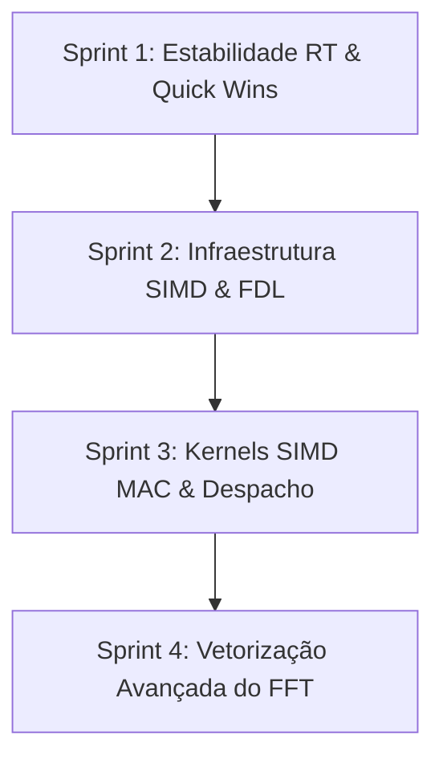

<!--
SPDX-License-Identifier: Apache-2.0
Copyright (c) 2026 Fábio Henrique de Lima Silva (fhl.bsb@gmail.com) All rights reserved.
-->

# TODO-sprints — Cab Sim de alta performance (Épico A)

Este documento define o planejamento de sprints e tarefas técnicas para a execução do **Épico A — "Cab Sim de alta performance"**, agrupando e detalhando os achados **P1**, **P2** e **P9** descritos no arquivo [TODO-findings.md](file:///home/fabio/nam-rs/TODO-findings.md).

O objetivo deste épico é otimizar o simulador de gabinete (UPOLS Convolution Engine e FFT/IFFT associados), que representa a maior reserva de CPU do projeto fora dos modelos neurais. As tarefas estão ordenadas de forma incremental para maximizar o ganho de performance e minimizar riscos de regressão matemática (SNR) ou estabilidade RT.

---

## Estrutura de Sprints



---

## Sprint 1: Estabilidade Real-Time e Quick Wins (P9 & P1.1)

Foco em remover riscos imediatos de pânico/alocação de memória no caminho de áudio real-time e obter ganhos rápidos e de baixo risco no FFT.

### Tarefa A1 (P9) — Rebaixamento de Asserts no FFT [DONE]

* **Prioridade:** P1
* **Complexidade/Esforço:** Baixo (Trivial)
* **Risco:** Mínimo
* **Arquivos Afetados:** [fft.rs](file:///home/fabio/nam-rs/src/math/dsp/fft.rs)
* **Descrição:**
  Substituir todas as ocorrências de `assert_eq!` no caminho quente do FFT por `debug_assert_eq!`. Em particular:
  * `FftPlanner::process` (linhas 187-188)
  * `FftPlanner::process_inverse` (linhas 237-238)
  * `RfftPlanner::process_forward` (linhas 376-378)
  * `RfftPlanner::process_inverse` (linhas 439-441)
  *Justificativa:* Evitar risco de pânico com *stack unwinding* (que aloca memória e quebra o determinismo RT) na thread de áudio. Os tamanhos dos buffers são invariantes garantidos na inicialização (`ConvEngine::new`).
* **Estratégia de Validação:**
  * `cargo test` (valida em modo debug que as asserções ainda passam).
  * Revisar estaticamente se os construtores de `ConvEngine` garantem tamanhos compatíveis com o planejado.

### Tarefa A2 (P1.1) — Eliminação de Bounds Checks no FFT Escalar [DONE]

* **Prioridade:** P1
* **Complexidade/Esforço:** Médio (Quick Win)
* **Risco:** Baixo
* **Arquivos Afetados:** [fft.rs](file:///home/fabio/nam-rs/src/math/dsp/fft.rs)
* **Descrição:**
  Substituir indexações diretas com checagem de limites (`re[idx]` e `im[idx]`) por acessos inseguros usando `get_unchecked` e `get_unchecked_mut`.
  * Aplicar na permutação de bit-reversal (`bit_reverse[i]`, `re.swap`, `im.swap`).
  * Aplicar no loop interno das borboletas Radix-2 DIT (acessos a `twiddle_re`, `twiddle_im`, `re[idx1]`, `re[idx2]`, `im[idx1]`, `im[idx2]`).
  * Documentar cada bloco inseguro com o comentário `// SAFETY:` demonstrando que `idx1, idx2 < n` e `w_idx < n/2` são garantidos pelas invariantes do tamanho `N` (potência de dois).
* **Estratégia de Validação:**
  * `cargo test` para verificar a paridade matemática (saída bit-a-bit idêntica contra a referência escalar antiga).
  * Comparar tempo de execução usando o benchmark de convolução atual.

---

## Sprint 2: Otimização da Cópia do FDL e Abstração de Multiplicação Complexa (P2.2 & P2.1 - Infra)

Foco em otimizar a escrita de memória na FDL e modelar a infraestrutura necessária para suportar múltiplos kernels SIMD (AVX2 e AVX-512) no processamento do Cab Sim.

### ✅ Tarefa A3 (P2.2) — Cópia Vetorizada para a FDL [DONE]

* **Prioridade:** P2
* **Complexidade/Esforço:** Baixo
* **Risco:** Mínimo
* **Arquivos Afetados:** [conv.rs](file:///home/fabio/nam-rs/src/dsp/cabsim/conv.rs)
* **Descrição:**
  Substituir o loop escalar que transfere o espectro de entrada do FFT para a Frequency Delay Line (circular buffer) por `copy_from_slice`:

  ```rust
  // De:
  for k in 0..self.n_bins {
      self.fdl_re[fdl_base + k] = self.fft_buf_re[k];
      self.fdl_im[fdl_base + k] = self.fft_buf_im[k];
  }
  // Para:
  self.fdl_re[fdl_base..fdl_base + n_bins].copy_from_slice(&self.fft_buf_re[..n_bins]);
  self.fdl_im[fdl_base..fdl_base + n_bins].copy_from_slice(&self.fft_buf_im[..n_bins]);
  ```

  Isso permite que o compilador utilize instruções de cópia de bloco altamente otimizadas (`memcpy` vetorizado).
* **Estratégia de Validação:**
  * `cargo test` para garantir integridade.
* **Conclusão (2026-06-25):** Loop escalar substituído por `copy_from_slice` no Step 3 de `ConvEngine::process()`. Todos os 152 testes passam sem regressão.

### Tarefa A4 (P2.1 - Infra) — Trait SimdMath com Operações Complexas [DONE]

* **Prioridade:** P2
* **Complexidade/Esforço:** Médio
* **Risco:** Baixo
* **Arquivos Afetados:** [traits.rs](file:///home/fabio/nam-rs/src/math/common/traits.rs)
* **Descrição:**
  Estender o trait `SimdMath` para definir a operação de multiplicação-acumulação espectral complexa (MAC).
  Adicionar os seguintes métodos (ou equivalentes):
  * `complex_mac_overwrite`: multiplica dois vetores complexos e escreve o resultado no destino.
  * `complex_mac_accumulate`: multiplica dois vetores complexos e adiciona ao acumulador de destino.
  Assinaturas planejadas:

  ```rust
  unsafe fn complex_mac_overwrite(
      h_re: &[f32], h_im: &[f32],
      x_re: &[f32], x_im: &[f32],
      out_re: &mut [f32], out_im: &mut [f32]
  );

  unsafe fn complex_mac_accumulate(
      h_re: &[f32], h_im: &[f32],
      x_re: &[f32], x_im: &[f32],
      acc_re: &mut [f32], acc_im: &mut [f32]
  );
  ```

* **Estratégia de Validação:**
  * `cargo check` para garantir consistência de tipos.
  * **Conclusão (2026-06-25):** `complex_mac_overwrite` e `complex_mac_accumulate` adicionados ao trait `SimdMath` com implementações inline SIMD nos três backends (AVX2, AVX-512F, AVX-512 VNNI+BF16). `cargo check` limpo sem warnings.

---

## Sprint 3: Implementação de Kernels SIMD Complex MAC e Despacho Integrado (P2.1 - Kernels)

Foco em implementar a vetorização nos backends e integrá-la ao motor de convolução do simulador de gabinete.

### Tarefa A5 (P2.1 - AVX2) — Kernel MAC Complexo no Backend AVX2

* **Prioridade:** P2
* **Complexidade/Esforço:** Médio
* **Risco:** Médio (Cuidado com alinhamento e precisão FMA)
* **Arquivos Afetados:** [avx2_impl.rs](file:///home/fabio/nam-rs/src/math/common/avx2_impl.rs)
* **Descrição:**
  Implementar os métodos de multiplicação complexa no bloco `impl SimdMath for Avx2Math` usando intrínsecos de AVX2/FMA (`_mm256_fmadd_ps`, `_mm256_fnmadd_ps`, etc.).
  O loop deve processar chunks contíguos de 8 bins por iteração e tratar o restante de forma escalar.
* **Estratégia de Validação:**
  * Testes unitários inline para comparar a saída do kernel AVX2 contra a lógica de multiplicação complexa pura do Rust.

### Tarefa A6 (P2.1 - AVX-512) — Kernel MAC Complexo no Backend AVX-512 [DONE]

* **Prioridade:** P2
* **Complexidade/Esforço:** Médio
* **Risco:** Médio
* **Arquivos Afetados:** [mod.rs](file:///home/fabio/nam-rs/src/math/common/avx512/mod.rs)
* **Descrição:**
  Implementar os métodos correspondentes no bloco `impl SimdMath for Avx512Math` e `Avx512VnniBf16Math` utilizando as extensões AVX-512 (processando 16 bins por iteração).
* **Estratégia de Validação:**
  * Teste de paridade de codegen e checagem de corretude matemática.
* **Conclusão (2026-06-25):** Kernels AVX-512 (`_mm512_fmsub_ps`/`_mm512_fmadd_ps`, 16 bins) já implementados nos macros `impl_avx512_dsp!()` (base) e `impl_avx512vnni_bf16_dsp!()` (delegação para `Avx512Math`). Adicionadas funções de referência escalar (`complex_mac_overwrite_scalar`/`complex_mac_accumulate_scalar`) e testes de paridade (`test_complex_mac_overwrite_parity`/`test_complex_mac_accumulate_parity`) com 14 tamanhos (0–256). `cargo test -- math::common::common_test` passa com 31/31.

### Tarefa A7 (P2.1 - Integração) — Integração e Despacho Dinâmico em ConvEngine

* **Prioridade:** P1
* **Complexidade/Esforço:** Médio-Alto
* **Risco:** Médio
* **Arquivos Afetados:** [conv.rs](file:///home/fabio/nam-rs/src/dsp/cabsim/conv.rs)
* **Descrição:**
  Integrar o despacho dinâmico no `ConvEngine`.
  * Guardar uma representação da ISA (ou um ponteiro de função estático/objeto dinâmico) em `ConvEngine` na sua criação (`ConvEngine::new`) para evitar validações de CPU em tempo de áudio.
  * Substituir o bloco `unsafe` com AVX2 hardcoded em `ConvEngine::process` por uma chamada aos novos métodos do trait `SimdMath` selecionados para a ISA ativa.
* **Estratégia de Validação:**
  * Medição do SNR do sinal de saída para garantir que a convolução com dispatch dinâmico produz o mesmo resultado (SNR ≥ 120 dB).
  * Benchmarks comparativos de `ConvEngine::process` com diferentes contagens de partição.

---

## Sprint 4: Vetorização Avançada do FFT (P1.2 & P1.3)

Investigação e desenvolvimento de vetorização profunda no cálculo do FFT/IFFT para diminuir ainda mais o custo de execução por bloco.

### Tarefa A8 (P1.2) — Vetorização das Borboletas do FFT

* **Prioridade:** P9 (Desejável)
* **Complexidade/Esforço:** Alto
* **Risco:** Alto (Potencial instabilidade numérica)
* **Arquivos Afetados:** [fft.rs](file:///home/fabio/nam-rs/src/math/dsp/fft.rs)
* **Descrição:**
  Vetorizar o loop do FFT nos estágios em que `half >= LARGURA_SIMD` (ex.: `half >= 8` em AVX2).
  * *Problema:* O twiddle factor varia no laço interno com padrão strided (`w_idx = j * step`).
  * *Solução:* Reorganizar a tabela de twiddles (pré-computar twiddles organizados de forma contígua por estágio na inicialização de `FftPlanner`), permitindo cargas SIMD contíguas.
  * Onde `half < LARGURA_SIMD` (primeiros estágios da transformada direta / últimos da inversa), manter a execução escalar acelerada (ou vetorização pequena se viável).
* **Estratégia de Validação:**
  * Testes em `fft_test.rs` de paridade absoluta contra a transformada original e transformada matemática `f64`.
  * Medições de SNR em todo o Cab Sim.

### Tarefa A9 (P1.3) — Algoritmos Avançados de Transformada (Opcional/Pesquisa)

* **Prioridade:** P9 (Desejável)
* **Complexidade/Esforço:** Alto
* **Risco:** Alto
* **Arquivos Afetados:** [fft.rs](file:///home/fabio/nam-rs/src/math/dsp/fft.rs)
* **Descrição:**
  Avaliar se a transição para outros layouts de FFT (como Radix-4, Split-Radix ou Stockham que dispensa bit-reversal no início) traz ganhos que justificam a complexidade acrescida.
* **Estratégia de Validação:**
  * Benchmarking rigoroso contra a implementação resultante da Tarefa A8.

---

## Critério de Pronto Geral (Definition of Done)

Para considerar o Épico A finalizado, os seguintes requisitos devem ser atendidos:

1. **Compilação Limpa:** Sem avisos (warnings) ou erros em `cargo build` e `cargo clippy`.
2. **Qualidade de Sinal (SNR):** SNR da resposta convolucional do simulador de gabinete contra a versão escalar inicial deve ser ≥ 120 dB (paridade numérica).
3. **Desempenho Comprovado:** Benches de `ConvEngine::process` devem mostrar melhoria clara e consistente proporcional à ISA disponível (AVX2 vs AVX-512).
4. **RT-Safety:** Garantir que nenhuma alocação de memória ou chamada bloqueante ocorra no caminho quente.
5. **Políticas de Código:** Preservar licenças SPDX e direitos autorais nos cabeçalhos dos arquivos modificados.
