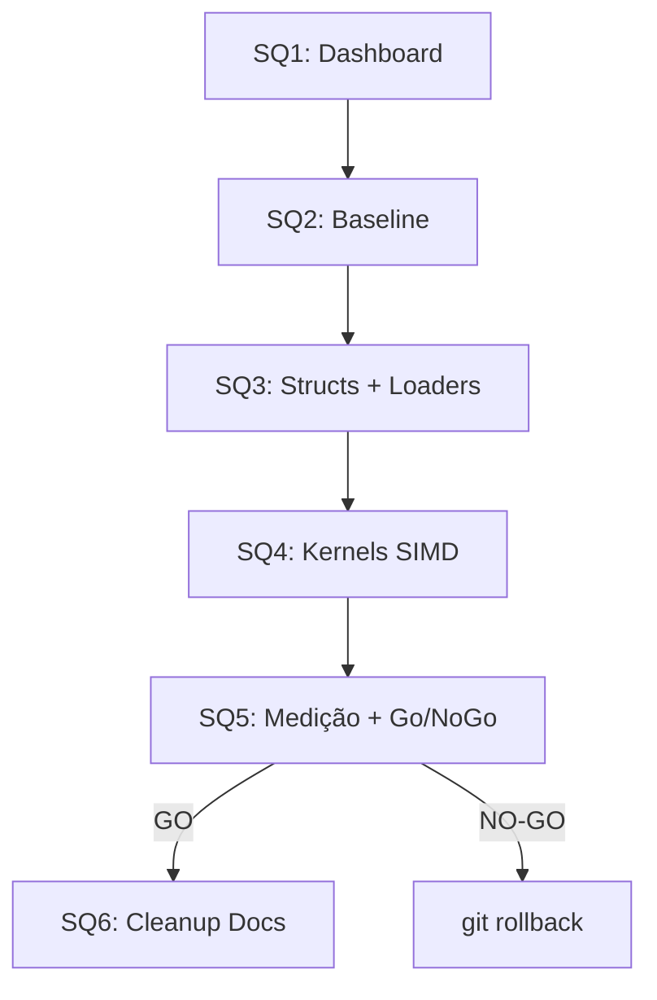

<!--
SPDX-License-Identifier: Apache-2.0
Copyright (c) 2026 Fábio Henrique de Lima Silva (fhl.bsb@gmail.com) All rights reserved.
-->

# TODO-sprints — Épico EQ: Remoção da Quantização de Pesos

> **Ref**: [TODO-findings.md](TODO-findings.md) — Findings F-Q1, F-Q2, F-Q3
> **Decisão arquitetural**: Remoção completa e definitiva da compressão f32→u16 (F16C/BF16). Git rollback se o impacto em performance for inaceitável.
> **Prioridade**: Fidelidade ao ideal (f64) > Paridade NAMCore.
> **ISA foco**: x86-64-v3 (AVX2) e AVX-512. Apenas f32.
>
> ⓘ **Nota**: O Sprint SQ1 (Quality Dashboard) é uma **entrega independente de uso geral** do nam-rs. Cobre todas as 6 famílias de arquitetura, todos os 31 modelos fixture, todos os modos de qualidade (Live/HQ), todas as ISAs (AVX2/AVX-512/VNNI-BF16), e permanece no projeto mesmo que a PoC fracasse e seja revertida.

---

## Sprint SQ1 — Dashboard de Qualidade (ferramenta permanente)

> **Objetivo**: Criar o instrumento de medição permanente e de uso geral do nam-rs. Cobre **todas** as arquiteturas, modelos, modos de qualidade e ISAs. Independente da PoC de quantização — permanece no projeto em qualquer cenário.
> **Risco**: 🟢 Baixo — não modifica código de produção.
> **Estimativa**: ~3-4h
> **Ref**: Finding F-Q2

### Tarefa SQ1.1 — Criar `utils/quality-dashboard.sh` [DONE]

**Descrição**: Script bash que roda **todas** as suítes de fidelidade e benchmarks de performance existentes, captura seus outputs, e gera um relatório humano-friendly cobrindo o universo completo do nam-rs.

**Cobertura obrigatória — TODOS os modelos disponíveis** (31 fixtures):

| Família                      | Modelos                                                                                                                                                                                         | Quant u16?            |
|:---------------------------- |:----------------------------------------------------------------------------------------------------------------------------------------------------------------------------------------------- |:--------------------- |
| **WaveNet A1** (6)           | `BossWN-standard.nam`, `BossWN-feather.nam`, `BossWN-lite.nam`, `BossWN-nano.nam`, `wavenet_a1_standard.nam`, `wavenet_official.nam`                                                            | ❌ (f32 nativo)       |
| **WaveNet A2** (4)           | `wavenet_a2_full.nam`, `wavenet_a2_lite.nam`, `wavenet_a2_max.nam`, `wavenet_a2_container.nam`                                                                                                  | ✅ (rechannel + conv) |
| **A2 FiLM** (2)              | `wavenet_a2_film_lite.nam`, `wavenet_a2_film_full.nam`                                                                                                                                          | ✅                    |
| **A2/WaveNet Dynamic** (4+3) | `wavenet_dyn_free.nam`, `wavenet_condition_dsp.nam`, `a2_dynamic_gated_ch8.nam`, `a2_dynamic_blended_ch3.nam` + Slimmable: `slimmable_container.nam`, `slimmable_wavenet.nam`, `a2_example.nam` | Misto                 |
| **LSTM** (4)                 | `BossLSTM-1x16.nam`, `BossLSTM-2x8.nam`, `lstm.nam`, `lstm_dyn_test.nam`                                                                                                                        | ✅ (backbone + head)  |
| **ConvNet/Linear** (6)       | `convnet_test.nam`, `linear_test.nam`, `linear_fft_rf320.nam`, `linear_fft_rf2048.nam`, `linear_fft_rf4096.nam`, `linear_fft_rf8192.nam`                                                        | ❌ (f32 nativo)       |

**Suítes de teste a executar** (todas em `--release`):

| Suite                  | Comando                                                                  | Dados extraídos                                                                       | Cobertura                                                                               |
|:---------------------- |:------------------------------------------------------------------------ |:------------------------------------------------------------------------------------- |:--------------------------------------------------------------------------------------- |
| Golden vectors (v1+v2) | `cargo test --release --test golden_vectors -- --nocapture`              | ESR, SNR, MSE, MR-STFT vs C++ NAMCore por modelo e por sample rate                    | Todos com `.golden.bin`                                                                 |
| F64 Oracle             | `cargo test --release --test reference_oracle_f64 -- --nocapture`        | ESR vs f64 ideal + decomposição de fontes de erro (quantização, ativação, acumulação) | WaveNet, LSTM, A2, A2-FiLM, ConvNet, A2-Generic                                         |
| ISA Parity             | `cargo test --release --test isa_parity -- --test-threads=1 --nocapture` | Paridade bitwise AVX2 vs AVX-512 vs VNNI-BF16                                         | Todos                                                                                   |
| Spectral Fidelity      | `cargo test --release --test spectral_fidelity -- --nocapture`           | ASR (aliasing spectral ratio), harmonic analysis                                      | Todos que tenham spectral tests                                                         |
| Activation Precision   | `cargo test --release --test lstm_activation_precision -- --nocapture`   | Impacto Standard (Padé) vs HighFidelity (stdlib)                                      | LSTM (mais sensível a ativações)                                                        |
| Regression Gate        | `cargo bench --bench regression_gate 2>&1`                               | Latência mediana por bloco (64 samp, 48kHz, Criterion stats)                          | 10 modelos: WaveNet Std/Feather/Lite/Nano, A2 Full/Lite, LSTM 1×16/2×8, Linear, ConvNet |

**Formato do output aprovado**:

```text
╔══════════════════════════════════════════════════════════════════╗
║              nam-rs Quality Dashboard                           ║
║              ──────────────────────────────────────              ║
║              Medido em: 2026-07-05 09:10:42 -03:00              ║
║              ISA: AVX2 (x86-64-v3) │ CPU: ...                  ║
╚══════════════════════════════════════════════════════════════════╝

🎯 RESUMO RÁPIDO (para não-cientistas)
═══════════════════════════════════════

  🎸 WaveNet Standard (A1, CH16)
     vs NAMcore:  ...  │  vs Ideal (f64):  ...  │  ⚡ CPU: 12.3% do budget

  🎸 LSTM 1×16 (BossLSTM)
     vs NAMcore:  ...  │  vs Ideal (f64):  ...  │  ⚡ CPU: 8.1% do budget

  🎸 A2 Full (CH8)
     vs NAMcore:  ...  │  vs Ideal (f64):  ...  │  ⚡ CPU: ...

  🎸 ConvNet
     vs NAMcore:  ...  │  vs Ideal (f64):  ...  │  ⚡ CPU: ...

  🎸 Linear (RF=2048)
     vs NAMcore:  ...  │  vs Ideal (f64):  ...  │  ⚡ CPU: ...

  ... (todos os modelos disponíveis)

📊 FIDELIDADE SONORA — Detalhes Técnicos
═════════════════════════════════════════
  Modelo                  │ ESR (vs NAMcore) │ ESR (vs f64) │ SNR dB │ MR-STFT │ Modo
  ─────────────────────── │ ──────────────── │ ──────────── │ ────── │ ─────── │ ────
  WaveNet Std CH16 @48k   │ 4.8e-14          │ 6.1e-14      │ 132 dB │ 0.0003  │ Live
  WaveNet Std CH16 @96k   │ ...              │ ...          │ ...    │ ...     │ Live
  LSTM 1×16 @48k          │ 2.61e-2          │ 3.57e-3      │ ...    │ ...     │ Live
  ...                     │                  │              │        │         │

⚡ PERFORMANCE — Latência por Bloco (64 amostras @ 48kHz)
══════════════════════════════════════════════════════════
  Deadline RT: 1333 µs (1.33 ms)

  Modelo                  │ Latência Mediana │ % do Budget │ Folga
  ─────────────────────── │ ──────────────── │ ─────────── │ ─────────
  WaveNet Standard CH16   │    164 µs        │  12.3%      │ 87.7% ✅
  WaveNet Feather CH8     │     48 µs        │   3.6%      │ 96.4% ✅
  ...

  ⓘ Folga > 50%:  Pode usar oversampling 2× sem xruns
  ⓘ Folga > 75%:  Pode usar oversampling 4× sem xruns
  ⓘ Folga < 25%:  ⚠ Risco de xruns com buffer de 64 amostras

🔬 ISA PARITY
═════════════
  AVX2 vs AVX-512: bitwise identical ✅ / divergent ⚠

🎹 ACTIVATION PRECISION
════════════════════════
  LSTM Standard (Padé) vs HighFidelity (stdlib): ESR diff = ...
```

**Regras de parseamento**:

- Capturar linhas contendo `ESR`, `SNR`, `MSE`, `MR-STFT`, `LUFS` do stdout dos testes
- Identificar o modelo pela label entre `[` e `]` no output de `report_dsp_fidelity`
- Capturar `time:` do Criterion para extrair latência mediana
- Calcular `% budget RT = (latência / 1333µs) × 100`
- Traduzir ESR → veredicto humano:
  - ESR < 1e-10: "IDÊNTICO — erro abaixo do chão numérico"
  - ESR < 1e-5: "IMPERCEPTÍVEL — perfeito para qualquer uso"
  - ESR < 1e-2: "AUDÍVEL APENAS COM A/B CIENTÍFICO"
  - ESR < 1e-1: "AUDÍVEL EM COMPARAÇÃO DIRETA"
  - ESR ≥ 1e-1: "⚠ AUDÍVEL — necessita investigação"

**Features do script**:

- `--save <filename>`: Além de exibir na tela, também salva (como output limpo sem ANSI) em arquivo para comparação A/B
- `--fidelity-only`: pular benchmarks Criterion (roda apenas testes de fidelidade, ~2 min)
- `--bench-only`: pular testes de fidelidade (roda apenas benchmarks, ~3 min)
- Graceful-skip para componentes ausentes (modelo não encontrado, golden não gerado, C++ render indisponível)
- Exit code 0 com testes skipped (informacional), ≠0 apenas em erros de infraestrutura
- Informações de sistema no header: ISA detectada, CPU model, data/hora, rustc version

**Arquivos a criar/modificar**:

- `[NEW]` `utils/quality-dashboard.sh`

---

## Sprint SQ2 — Captura do Baseline

> **Objetivo**: Registrar todas as métricas atuais (com quantização) para comparação A/B posterior.
> **Risco**: 🟢 Baixo — apenas roda testes e salva output.
> **Estimativa**: ~30min
> **Ref**: Finding F-Q2
> **Pré-requisito**: SQ1 completo.

### Tarefa SQ2.1 — Executar o dashboard e salvar baseline [DONE]

**Descrição**: Rodar `utils/quality-dashboard.sh` e salvar o output como `docs/baseline-with-quantization.log` (commitado, para referência futura).

### Tarefa SQ2.2 — Salvar baseline do regression_gate [DONE]

**Descrição**: Executar `utils/tests-performance-regression.sh --save` para persistir o baseline Criterion. Este será o ponto de comparação estatístico para a performance pós-remoção.

---

## Sprint SQ3 — Remoção da Quantização: Structs e Loaders

> **Objetivo**: Converter todos os campos de pesos de `u16` para `f32` e ajustar os loaders para não quantizar.
> **Risco**: 🔴 Alto — modifica tipos fundamentais que afetam toda a cadeia de compilação.
> **Estimativa**: ~4h
> **Ref**: Finding F-Q1
> **Pré-requisito**: SQ2 completo. Nenhuma mudança em kernels SIMD neste sprint (o código não compilará até SQ4).

### Tarefa SQ3.1 — Converter structs LSTM de `u16` → `f32`

**Descrição**: Alterar os tipos de armazenamento de pesos em todas as structs LSTM.

**Arquivos a modificar**:

| Arquivo                           | Mudança                                                                                   |
|:--------------------------------- |:----------------------------------------------------------------------------------------- |
| `src/models/lstm/layer.rs:11`     | `input_hidden_weights: Aligned64<[[[u16; H]; IH]; 4]>` → `Aligned64<[[[f32; H]; IH]; 4]>` |
| `src/models/lstm/layer.rs:17`     | Remover `state_bf16: Aligned64<[u16; IH]>` (mirror BF16 — não mais necessário)            |
| `src/models/lstm/layer.rs:28`     | Ajustar `new()` — inicializar com `0.0f32` em vez de `0u16`                               |
| `src/models/lstm/layer_dyn.rs:21` | `input_hidden_weights: AlignedVec<u16>` → `AlignedVec<f32>`                               |
| `src/models/lstm/layer_dyn.rs:29` | Remover `state_bf16: AlignedVec<u16>`                                                     |
| `src/models/lstm/layer_dyn.rs:46` | Ajustar `new()` — `AlignedVec::new(weights_len, 0.0f32)`                                  |
| `src/models/lstm/model1.rs:46`    | `head_weights: [u16; H]` → `[f32; H]`                                                     |
| `src/models/lstm/model2.rs:76`    | `head_weights: [u16; H]` → `[f32; H]`                                                     |
| `src/models/lstm/model_dyn.rs:33` | `head_weights: AlignedVec<u16>` → `AlignedVec<f32>`                                       |

**Atenção**: Ao remover `state_bf16`, todas as referências a `get_hidden_state_bf16()` precisam ser removidas ou adaptadas. Buscar com `grep -rn "state_bf16\|get_hidden_state_bf16" src/`.

**Critério de aceite**:

- [ ] Todas as structs LSTM armazenam pesos em `f32`
- [ ] Campo `state_bf16` removido de `layer.rs` e `layer_dyn.rs`
- [ ] `cargo check` não passa ainda (kernels SIMD esperam u16) — esperado

### Tarefa SQ3.2 — Converter structs A2 de `u16` → `f32`

**Descrição**: Alterar os campos de pesos quantizados no A2.

**Arquivos a modificar**:

| Arquivo                                 | Mudança                                            |
|:--------------------------------------- |:-------------------------------------------------- |
| `src/models/a2/model/static/mod.rs:54`  | `rechannel_w: AlignedVec<u16>` → `AlignedVec<f32>` |
| `src/models/a2/model/dynamic/mod.rs:56` | `rechannel_w: AlignedVec<u16>` → `AlignedVec<f32>` |

**Atenção**: O A2 `set_weights.rs` também armazena conv weights em layouts interleaved u16. Procurar todos os `AlignedVec<u16>` no set_weights.rs e convertê-los.

**Critério de aceite**:

- [ ] Todos os campos de pesos A2 armazenam `f32`
- [ ] `cargo check` não passa ainda — esperado

### Tarefa SQ3.3 — Remover a quantização dos loaders

**Descrição**: Os loaders chamam `quantize_weight(f, is_bf16)` para converter f32→u16 durante o carregamento. Agora devem guardar o f32 diretamente.

**Arquivos a modificar**:

| Arquivo                                              | Mudança                                                      |
|:---------------------------------------------------- |:------------------------------------------------------------ |
| `src/loader/dispatcher/lstm/weights.rs:30,38`        | Remover chamadas a `quantize_weight()`, guardar `f32` direto |
| `src/loader/dispatcher/lstm/static_builder.rs:40,92` | Idem para head weights                                       |
| `src/loader/dispatcher/lstm/dynamic_builder.rs:49`   | Idem                                                         |
| `src/models/a2/model/set_weights.rs:57`              | Remover `quantize_weight()`, guardar `f32`                   |

**Atenção**: A variável `is_bf16` e todo o caminho de detecção VNNI/BF16 para pesos pode ser removido/simplificado. A detecção de ISA (`SimdMathConfig::get().instruction_set`) pode permanecer para dispatch AVX2 vs AVX-512 dos kernels de inferência, mas o branch BF16-specific para pesos morre.

**Critério de aceite**:

- [ ] Nenhum loader chama `quantize_weight()` para pesos de backbone
- [ ] Pesos são carregados como `f32` nativo
- [ ] `quantize_weight()` pode ser marcada `#[deprecated]` ou removida (verificar se algum uso externo sobrevive, como no oráculo f64)

### Tarefa SQ3.4 — Remover `use_f32_head` flag do LSTM

**Descrição**: O flag `use_f32_head: bool` nos modelos LSTM controlava se o head projection usava pesos f32 nativos ou u16 quantizados. Com todos os pesos agora em f32, este flag é redundante (sempre `true`).

**Arquivos a modificar**:

| Arquivo                                             | Mudança                                            |
|:--------------------------------------------------- |:-------------------------------------------------- |
| `src/models/lstm/model1.rs:52,67,118`               | Remover campo `use_f32_head`, simplificar branches |
| `src/models/lstm/model2.rs:82,100,153`              | Idem                                               |
| `src/models/lstm/model_dyn.rs:39,64,84,135,186,272` | Idem                                               |
| `src/models/lstm/head_projection.rs`                | Simplificar — sempre usa path f32                  |
| Builders em `src/loader/dispatcher/lstm/`           | Remover atribuições `use_f32_head: true`           |

**Critério de aceite**:

- [ ] Campo `use_f32_head` removido de todas as structs LSTM
- [ ] Sempre usa o caminho f32 do head projection
- [ ] Nenhum branch morto relacionado a `use_f32_head`

---

## Sprint SQ4 — Remoção da Quantização: Kernels SIMD

> **Objetivo**: Adaptar todos os kernels SIMD de inferência para operar com pesos `f32` em vez de `u16`.
> **Risco**: 🔴 Alto — é o sprint mais complexo e delicado. Cada kernel SIMD que fazia `_mm256_cvtph_ps` para descomprimir pesos u16 precisa mudar para `_mm256_loadu_ps` carregando pesos f32 diretamente. Erro aqui causa output silenciosamente errado.
> **Estimativa**: ~6-8h
> **Ref**: Finding F-Q1
> **Pré-requisito**: SQ3 completo.
> **Estratégia**: Atacar por camada de abstração — GEMV primeiro (LSTM), depois batch-GEMM (A2/WaveNet), depois dot (head).

### Tarefa SQ4.1 — Adaptar kernels GEMV 4-gate do LSTM (AVX2)

**Descrição**: O LSTM GEMV 4-gate AVX2 (`src/math/gemm/gemv_4gate/avx2.rs`) faz operação matricial com 4 gates (I, F, G, O) em paralelo. Atualmente carrega pesos u16 com `_mm_loadu_si128` + `_mm256_cvtph_ps` (8 pesos de 16-bit → 8 f32). Precisa mudar para `_mm256_loadu_ps` (8 pesos f32 diretos).

**Pontos de atenção**:

- Os ponteiros de peso agora apontam para `f32` (4 bytes cada) em vez de `u16` (2 bytes). Os strides e offsets de ponteiro mudam.
- O loop de 16 elementos antes carregava 16×u16 = 32 bytes (2× `_mm_loadu_si128`). Agora carrega 16×f32 = 64 bytes (2× `_mm256_loadu_ps`). **O throughput de memória dobra.**
- As macros de pointer arithmetic precisam ser revisadas cuidadosamente.

**Arquivos a modificar**:

- `src/math/gemm/gemv_4gate/avx2.rs` (~12 chamadas a `_mm256_cvtph_ps`)

**Critério de aceite**:

- [ ] Kernel AVX2 4-gate compila sem erros
- [ ] Sem `_mm256_cvtph_ps` no arquivo
- [ ] Pointer arithmetic correta para stride de f32 (4 bytes em vez de 2)

### Tarefa SQ4.2 — Adaptar kernels GEMV 4-gate do LSTM (AVX-512)

**Descrição**: Análogo ao SQ4.1, mas para `src/math/gemm/gemv_4gate/avx512.rs`. Usa `_mm512_cvtph_ps` (16 u16 → 16 f32). Muda para `_mm512_loadu_ps`.

**Arquivos a modificar**:

- `src/math/gemm/gemv_4gate/avx512.rs` (~4 chamadas a `_mm512_cvtph_ps`)

**Critério de aceite**:

- [ ] Kernel AVX-512 4-gate compila sem erros
- [ ] Sem `_mm512_cvtph_ps` para pesos no arquivo

### Tarefa SQ4.3 — Adaptar kernels GEMV genéricos f16 (AVX2 + AVX-512)

**Descrição**: Os kernels GEMV em `src/math/gemm/gemv/f16_avx2.rs`, `f16_avx2_specialized.rs`, e `f16_avx512.rs` servem o path genérico de GEMV com pesos u16. Estes precisam ser convertidos para carregar `f32` ou substituídos por versões f32 nativas.

**Decisão arquitetural**: Estes arquivos podem ser **renomeados/fundidos** com versões f32. Se já existirem variantes f32 dos GEMVs (para o head projection, por exemplo), considerar unificar.

**Arquivos a modificar/remover**:

- `src/math/gemm/gemv/f16_avx2.rs` — converter ou remover
- `src/math/gemm/gemv/f16_avx2_specialized.rs` — converter ou remover
- `src/math/gemm/gemv/f16_avx512.rs` — converter ou remover

**Critério de aceite**:

- [ ] Nenhum GEMV carrega pesos como u16
- [ ] Testes unitários de GEMV em `gemv_test.rs` adaptados para f32

### Tarefa SQ4.4 — Adaptar batch-GEMM e dot product

**Descrição**: Os batch-GEMM em `src/math/gemm/gemm_batch/` e o dot product em `src/math/gemm/dot.rs` também fazem conversão f16→f32 de pesos. Adaptar para f32.

**Arquivos a modificar**:

- `src/math/gemm/dot.rs` — ~6 chamadas `_mm256_cvtph_ps` + ~1 `_mm512_cvtph_ps`
- `src/math/gemm/gemm_batch/fused_add_gemm_batch.rs` — ~3 chamadas
- `src/math/gemm/gemm_batch/fused_residual_batch.rs` — ~4 chamadas
- `src/math/gemm/gemm_batch/avx512.rs` — ~3 chamadas

**Critério de aceite**:

- [ ] Nenhum kernel em `src/math/gemm/` faz conversão f16→f32 de pesos
- [ ] `cargo check` passa (todos os tipos alinhados: structs f32, kernels f32)

### Tarefa SQ4.5 — Adaptar layer_kernels do LSTM

**Descrição**: `src/models/lstm/layer_kernels.rs` é o arquivo que orquestra o dispatch dos kernels GEMV para o LSTM. Contém lógica de VNNI/BF16 que precisa ser simplificada.

**Arquivos a modificar**:

- `src/models/lstm/layer_kernels.rs` — simplificar dispatch, remover branches BF16/VNNI para pesos

**Critério de aceite**:

- [ ] Dispatch simplificado (AVX2 vs AVX-512 apenas, sem branch BF16)
- [ ] Não referencia `state_bf16` (removido em SQ3.1)

### Tarefa SQ4.6 — Adaptar process kernels do A2

**Descrição**: O A2 `process.rs` (static e dynamic) usa os pesos quantizados u16 do `rechannel_w` e conv weights. Adaptar para ler f32.

**Arquivos a modificar**:

- `src/models/a2/model/static/process.rs`
- `src/models/a2/model/dynamic/` (kernels de inferência)

**Critério de aceite**:

- [ ] A2 compila e roda com pesos f32
- [ ] Sem referência a u16 em pesos de A2

### Tarefa SQ4.7 — Compilação verde + testes unitários

**Descrição**: Após SQ4.1–SQ4.6, o projeto deve compilar. Rodar `cargo check`, depois `cargo test --lib` para validar testes unitários.

**Critério de aceite**:

- [ ] `cargo check` passa sem erros
- [ ] `cargo clippy` passa sem warnings novos
- [ ] `cargo test --lib` — todos os testes unitários passam
- [ ] Testes unitários de GEMV/dot/GEMM em `src/math/` passam com pesos f32

---

## Sprint SQ5 — Medição Pós-Remoção + Decisão Go/NoGo

> **Objetivo**: Medir o impacto real e comparar com o baseline. Decisão: commit ou rollback.
> **Risco**: 🟡 Médio — os testes podem falhar por thresholds desatualizados (os gates foram calibrados para o regime quantizado).
> **Estimativa**: ~2h
> **Ref**: Findings F-Q1, F-Q2
> **Pré-requisito**: SQ4 completo (compilação verde).

### Tarefa SQ5.1 — Rodar testes de integração em release

**Descrição**: Rodar os testes de fidelidade. **Esperar que alguns falhem** por thresholds calibrados para o regime quantizado (os ESRs agora devem ser muito menores).

```bash
cargo test --release --test golden_vectors -- --nocapture
cargo test --release --test reference_oracle_f64 -- --nocapture
cargo test --release --test spectral_fidelity -- --nocapture
cargo test --release --test isa_parity -- --test-threads=1 --nocapture
```

**Atenção**:

- `golden_vectors` compara vs NAMCore (que quantiza). Os ESRs vão **piorar** nesta comparação (nam-rs agora mais preciso que NAMCore → mais divergência). Isso é **esperado e correto** — estamos priorizando fidelidade ao ideal.
- `reference_oracle_f64` ESRs devem **melhorar dramaticamente** (principal vitória).
- Os thresholds em `tests/common/constants.rs` precisarão ser recalibrados na SQ5.3.

**Critério de aceite**:

- [ ] Testes rodaram (mesmo com falhas por thresholds)
- [ ] Output completo capturado para análise

### Tarefa SQ5.2 — Rodar dashboard e comparar com baseline

**Descrição**: Executar `utils/quality-dashboard.sh` e comparar o relatório lado-a-lado com `docs/baseline-with-quantization.log`.

**Critério de aceite**:

- [ ] Relatório pós-remoção salvo como `docs/measurement-without-quantization.log`
- [ ] Comparação documentada: quais métricas melhoraram, pioraram, ou ficaram iguais

### Tarefa SQ5.3 — Rodar performance regression gate

**Descrição**: Executar `utils/tests-performance-regression.sh --check` para verificar impacto em latência.

**Critério de aceite**:

- [ ] Resultado documentado: regressão sim/não, magnitude
- [ ] Se regressão > 20% em qualquer modelo: flag como risco alto para decisão Go/NoGo

### Tarefa SQ5.4 — Decisão Go/NoGo

**Descrição**: Com base nos dados coletados em SQ5.1–SQ5.3, tomar a decisão:

**Critério de GO (commit)** — TODOS devem ser satisfeitos:

- ESR vs f64 oracle melhora para LSTM (confirmando eliminação do drift)
- Performance (latência) não regride mais de 30% em nenhum modelo
- Todos os modelos ainda produzem áudio razoável (ESR vs golden < 1.0)

**Critério de NO-GO (rollback)**:

- Performance regride > 50% em qualquer modelo principal
- Algum modelo produz áudio corrupto (ESR > 1.0 vs golden)

**Se GO**: Prosseguir para SQ5.5 e SQ6.
**Se NO-GO**: `git checkout -- src/` e registrar a descoberta como lição aprendida em `docs/`.

### Tarefa SQ5.5 — Recalibrar thresholds de teste (apenas se GO)

**Descrição**: Atualizar `tests/common/constants.rs` com os novos pisos de precisão medidos. Os ESR limits devem refletir o novo regime f32 (mais preciso que f16c).

**Arquivos a modificar**:

- `tests/common/constants.rs` — novos ESR limits baseados em medições
- `tests/golden_vectors.rs` — ajustar thresholds se necessário
- `tests/cpp_parity.rs` — os caps de interop LSTM mudam (drift diferente)

**Critério de aceite**:

- [ ] Todos os testes em `utils/tests-quick.sh` passam com os novos thresholds
- [ ] Novos thresholds documentados com comentários de medição (`// Measured: ...`)

### Tarefa SQ5.6 — Salvar novo baseline de performance (apenas se GO)

**Descrição**: Executar `utils/tests-performance-regression.sh --save` para persistir o novo baseline pós-remoção.

**Critério de aceite**:

- [ ] Novo baseline Criterion salvo
- [ ] `utils/tests-performance-regression.sh --check` passa

---

## Sprint SQ6 — Cleanup de Documentação (apenas se GO)

> **Objetivo**: Atualizar toda a documentação para refletir que a quantização foi removida.
> **Risco**: 🟢 Baixo — apenas edição de docs.
> **Estimativa**: ~2h
> **Ref**: Finding F-Q3
> **Pré-requisito**: SQ5 com decisão GO.

### Tarefa SQ6.1 — Atualizar `docs/audio_fidelity_map.md`

**Mudanças**:

- §1 (Weight Compression): Mover para seção "Histórico" com breve nota: "Removido — medição PoC demonstrou ganho de fidelidade sem impacto inaceitável em performance."
- §3 (LSTM Recurrent Drift): Atualizar com novos números. Se drift eliminado, reduzir a seção para nota histórica.
- Tabela Quick Reference: Atualizar status de "Active" para "Removed" para §1; ajustar §3.

### Tarefa SQ6.2 — Atualizar `docs/lstm_recurrent_drift.md`

**Mudanças**:

- Adicionar seção "§8 — Resolução: Remoção da Quantização" com os resultados da PoC
- Preservar o resto como registro histórico de aprendizado (não deletar)
- Atualizar a conclusão: o drift foi eliminado na raiz, não apenas mitigado

### Tarefa SQ6.3 — Atualizar `docs/cpp_parity_map.md`

**Mudanças**:

- §2.5 (Precision divergence): Atualizar para refletir que nam-rs agora é f32 nativo (diverge do NAMCore que quantiza)
- §2.7 (Measured interop drift): Os números vão mudar — atualizar com novas medições
- §7.2 (Known tradeoffs): Remover ou atualizar item de quantização LSTM

### Tarefa SQ6.4 — Limpeza de código morto

**Descrição**: Remover código que só existia por causa da quantização.

**Candidatos a remoção**:

- `src/math/common/ops.rs` — `quantize_weight()`, `f32_to_bf16()`, `f32_to_bf16_avx512()`
- `src/math/common/half.rs` — se nenhum outro uso sobrevive (verificar com `grep`)
- Kernels GEMV f16 originais se foram substituídos por versões f32
- `state_bf16` mirror no LSTM (já removido em SQ3.1)
- VNNI/BF16 dispatch paths em `layer_kernels.rs` (já simplificado em SQ4.5)

**Atenção**: O `half.rs` pode ser usado pelo NAMB binary format ou por testes. Verificar com `grep -rn "half::" src/ tests/ benches/` antes de remover.

**Critério de aceite**:

- [ ] `cargo clippy` não reporta dead code
- [ ] Todos os `#[allow(dead_code)]` relacionados a quantização removidos
- [ ] `utils/tests-quick.sh` 100% verde

### Tarefa SQ6.5 — Commit final e registro

**Descrição**: Fazer commit com mensagem descritiva e atualizar o `TODO-findings.md` marcando F-Q1, F-Q2, F-Q3 como resolvidos.

**Critério de aceite**:

- [ ] Commit limpo com mensagem descritiva
- [ ] `utils/lints.sh` passa
- [ ] `utils/tests-quick.sh` passa
- [ ] `TODO-findings.md` atualizado com status de resolução

---

## Resumo de Dependências



## Estimativa Total

| Sprint    | Estimativa  | Risco |
|:--------- |:----------- |:----- |
| SQ1       | ~2h         | 🟢    |
| SQ2       | ~30min      | 🟢    |
| SQ3       | ~4h         | 🔴    |
| SQ4       | ~6-8h       | 🔴    |
| SQ5       | ~2h         | 🟡    |
| SQ6       | ~2h         | 🟢    |
| **Total** | **~16-18h** |       |

> **Nota**: Os sprints SQ3 e SQ4 são os mais arriscados e devem ser atacados com máxima atenção. Cada tarefa SIMD deve ser verificada com cargo test antes de prosseguir para a seguinte. Erros de pointer arithmetic em SIMD geram output silenciosamente errado (sem crash) — os testes de paridade são a única defesa.
