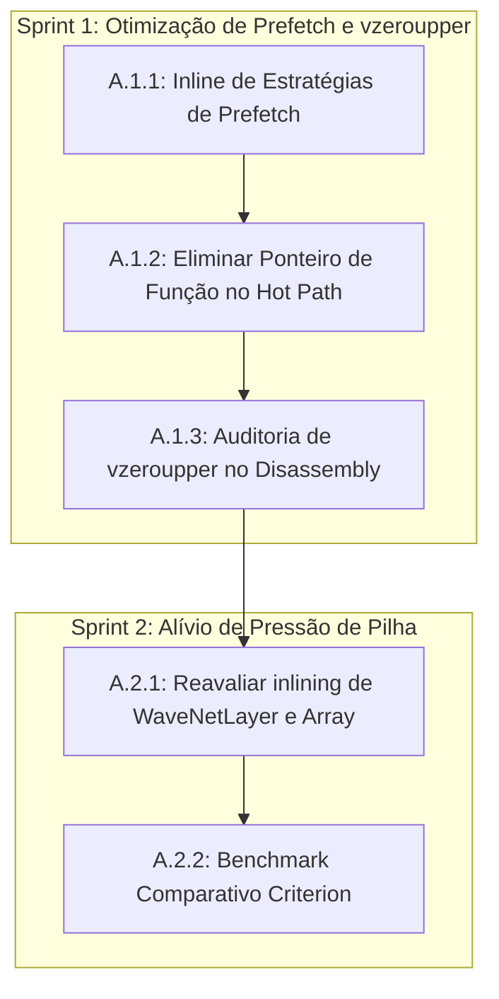

<!--
SPDX-License-Identifier: Apache-2.0
Copyright (c) 2026 Fábio Henrique de Lima Silva (fhl.bsb@gmail.com) All rights reserved.
-->

# TODO-sprints.md — Planejamento de Sprints e Tarefas Técnicas

> Planejamento gerado pela skill `planejador-arquiteto` a partir dos achados em [TODO-findings.md](file:///home/fabio/nam-rs/TODO-findings.md).
> Este documento foca exclusivamente no **ÉPICO A — "Quick Wins" sem impacto numérico (maior ROI, risco mínimo)**.

---

## 1. Visão Geral do Épico A

O objetivo deste épico é obter ganhos rápidos de performance através da eliminação de overheads estruturais de compilador (chamadas indiretas de função, transições de registradores SSE/AVX via `vzeroupper` e pressão na pilha/registradores decorrente de super-inlining), **sem alterar a lógica matemática ou a ordem de acumulação**.

Com isso, o risco de regressão numérica é nulo, eliminando a necessidade de recalibração de ESR (`threshold_calibration.rs`). A validação será focada em benchmarks de microarquitetura, tempos de execução e integridade da suíte de testes.

### Riscos e Mitigações

| Risco                                                                    | Impacto | Mitigação                                                                                                                    |
| ------------------------------------------------------------------------ | ------- | ---------------------------------------------------------------------------------------------------------------------------- |
| Regressão de performance por falta de inline em compiladores específicos | Médio   | Manter a marcação `#[inline(always)]` em funções críticas internas e testar variações com compiladores suportados.           |
| Violação de RT-Safety (ex: introdução de heap/lock acidental)            | Alto    | Seguir estritamente as diretrizes de RT-safety e executar `tests-quick.sh` (que inclui auditoria de heap em CLAP/Resampler). |
| Compilação quebrada por desalinhamento do carregador/dispatcher          | Médio   | Garantir que a assinatura das estruturas internas permaneça compatível ou atualizar o builder/loader de forma atômica.       |

---

## 2. Divisão de Sprints

Dividimos o Épico A em **2 Sprints de curto prazo**, ordenadas para isolar o impacto do prefetch e do inlining de camadas.



---

## 3. Detalhamento das Sprints e Tarefas Técnicas

### SPRINT A.1 — Otimização de Prefetch e Eliminação de `vzeroupper` (F2, F7)

Esta sprint ataca a chamada indireta `(self.prefetch_fn)(...)` no laço interno de convolução, eliminando o overhead de desvio, salvamento de registradores e a inserção forçada de instruções `vzeroupper`.

#### [NEW] Tarefa A.1.1: Inline das Estratégias de Prefetch

* **Objetivo:** Garantir que o compilador inline as estratégias de prefetch diretamente no laço de convolução.
* **Arquivo Alvo:** [ops.rs](file:///home/fabio/nam-rs/src/math/common/ops.rs#L142-L180)
* **Descrição da Mudança:**
  * Adicionar a anotação `#[inline(always)]` às funções `prefetch_strategy_simple` e `prefetch_strategy_2stage`.
* **Precauções/Riscos:** Nenhum risco numérico.

#### [MODIFY] Tarefa A.1.2: Substituição de Ponteiro de Função por Dispatch Estático

* **Objetivo:** Substituir a invocação dinâmica de `self.prefetch_fn` por chamadas estáticas inlinadas com base em um teste de dilatação.

* **Arquivos Alvos:**

  * [conv1d.rs](file:///home/fabio/nam-rs/src/models/wavenet/conv1d.rs#L79-L87)
  * [conv1d_dual.rs](file:///home/fabio/nam-rs/src/models/wavenet/conv1d_dual.rs#L72-L79)
  * [conv1d_dyn.rs](file:///home/fabio/nam-rs/src/models/wavenet/conv1d_dyn.rs#L63-L66)
  * [conv1d_dyn_dual.rs](file:///home/fabio/nam-rs/src/models/wavenet/conv1d_dyn_dual.rs)
  * [grouped_conv1d.rs](file:///home/fabio/nam-rs/src/models/a2/grouped_conv1d.rs)

* **Descrição da Mudança:**

  * No laço de carregamento de taps, substituir a chamada `(self.prefetch_fn)(...)` por uma verificação condicional estática inlinada:

    ```rust
    unsafe {
        if self.dilation >= 128 {
            prefetch_strategy_2stage(base_ptr, step, k, k_limit, self.dilation);
        } else {
            prefetch_strategy_simple(base_ptr, step, k, k_limit, self.dilation);
        }
    }
    ```

  * *Opcional:* Se possível sem quebrar a API pública de carregamento de pesos, avaliar a remoção completa do campo `prefetch_fn` e do tipo `PrefetchFn` para limpeza do código. Se mantidos para retrocompatibilidade do layout/loader, apenas ignorar o campo durante o processamento do hot path.

* **Precauções/Riscos:** Assegurar que os argumentos passados para as funções inlinadas correspondam exatamente à assinatura original de `PrefetchFn`.

#### [VERIFY] Tarefa A.1.3: Auditoria de Emissão de `vzeroupper` (F7)

* **Objetivo:** Validar que as instruções `vzeroupper` e `callq` indiretas no disassembly do monólito foram eliminadas ou reduzidas drasticamente.
* **Descrição da Mudança:**
  * Compilar a crate em modo release com suporte a AVX2 (`RUSTFLAGS="-C target-feature=+avx2"` ou via script de build oficial).
  * Obter o disassembly da função `WaveNetModel::process` (ex: via `objdump`, `cargo-show-asm` ou `perf annotate`) e auditar a contagem de instruções `vzeroupper` e `callq` associadas ao prefetch.
* **Critério de Sucesso:** Eliminação total de `callq` no laço interno de convolução e redução expressiva da contagem global de `vzeroupper` no monólito.

---

### SPRINT A.2 — Alívio de Pressão de Pilha e Redução de Spills (F5)

Esta sprint ataca a pressão sobre os registradores e pilha causada pelo inlining agressivo de todas as camadas dentro de uma única pilha monolítica de ~10 KB em `WaveNetModel::process`.

#### [MODIFY] Tarefa A.2.1: Flexibilização do Inlining na Fronteira de Camada

* **Objetivo:** Permitir ao compilador criar limites de chamada reais entre as camadas de processamento para evitar que variáveis locais de múltiplas camadas ocupem os mesmos registradores físicos e pilha simultaneamente.
* **Arquivos Alvos:**
  * [layer.rs](file:///home/fabio/nam-rs/src/models/wavenet/layer.rs#L27)
  * [layer_array.rs](file:///home/fabio/nam-rs/src/models/wavenet/layer_array.rs#L64)
* **Descrição da Mudança:**
  * Alterar a anotação da função `process_block_internal` de `#[inline(always)]` para `#[inline]` (ou remover a anotação completamente) nos módulos `WaveNetLayer` e `WaveNetLayerArray`.
  * Avaliar se o compilador gera código mais limpo (com menos `movq` e spills para a pilha) ao estabelecer essa fronteira de função.
* **Precauções/Riscos:** Monitorar se a remoção do inline causa regressões em loops muito pequenos ou em compiladores específicos. O benchmark Criterion na tarefa A.2.2 é a salvaguarda.

#### [VERIFY] Tarefa A.2.2: Validação Comparativa de Performance (Criterion + perf stat)

* **Objetivo:** Confirmar que a flexibilização do inlining resultou em ganho líquido de performance (ou estabilidade) e redução de stalls na CPU.
* **Descrição da Validação:**
  * Executar a suíte de benchmarks oficial: `cargo bench --bench benchmarks` com foco no benchmark `Long_WaveNet_Standard_CH16`.
  * Comparar os tempos obtidos contra a baseline registrada em `TODO-findings.md` (3.6214 ms para `Long_WaveNet_Standard_CH16_4096samp`).
  * Utilizar `perf stat -e instructions,cycles,cache-misses,L1-dcache-load-misses` para validar a diminuição de instruções de movimentação de memória (`movq`) e stalls de dados.
* **Critério de Sucesso:** Tempo de execução igual ou inferior à baseline e redução mensurável de spills na pilha/acessos a cache de dados L1d.
