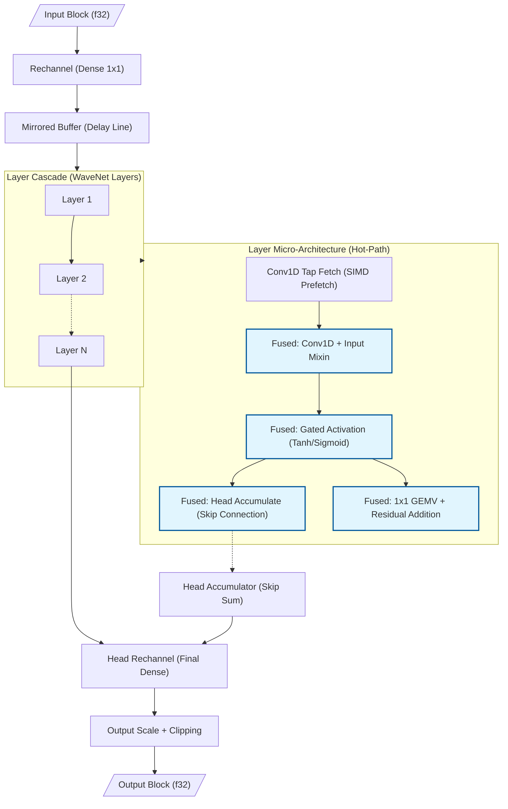
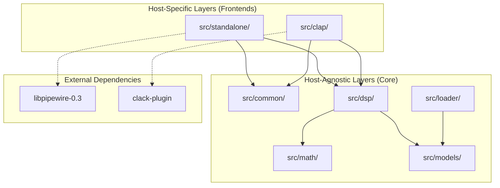
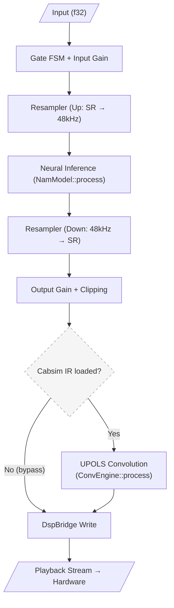
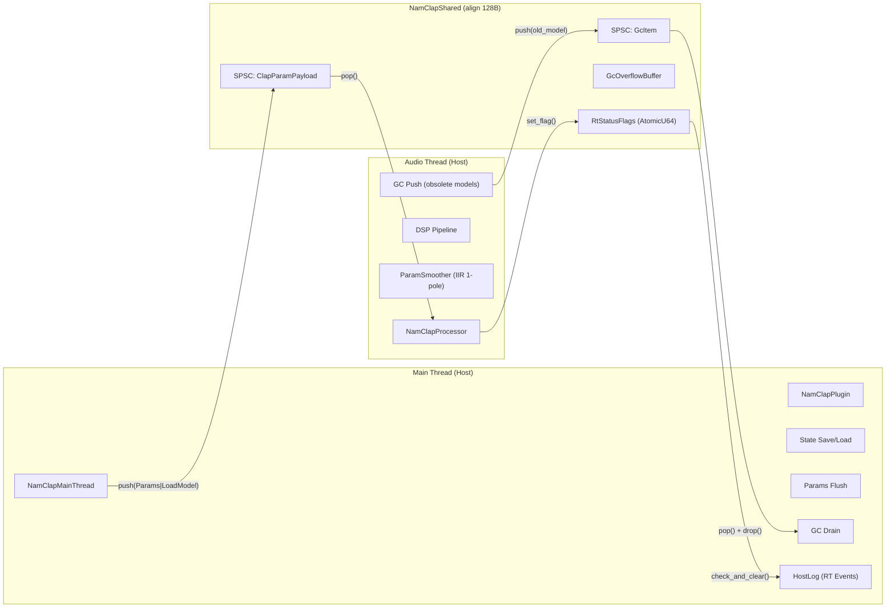

<!-- SPDX-License-Identifier: Apache-2.0 -->

<!-- Copyright (c) 2026 Fábio Henrique de Lima Silva (fhl.bsb@gmail.com) All rights reserved. -->

# NAM-rs Architecture: Standalone Neural Inference Client

The architecture of NAM-rs is designed for low-latency DSP processing and neural inference focused on audio equipment simulation (Neural Amp Modeler). Operating as a standalone PipeWire client (Stable) or as a CLAP plugin (Release) on Linux, it utilizes idiomatic Rust with a focus on RT (Real-Time) safety.

## 1. PipeWire Topology (Standalone Mode): Dual-Stream (Capture + Playback)

- **Virtual Sink (Audio/Sink):** NAM-rs declares itself as the default sound output via `pw_stream`. Apps connect automatically via WirePlumber.
- **Playback Stream (Stream/Output):** A second stream reads the processed audio and delivers it to the physical hardware, bypassing the limitations of monitor ports on virtual sinks.
- **DspBridge (Lock-Free Double-Buffer):** An aligned structure (128B) that isolates the streams. Capture writes to the inactive buffer (Release); playback reads from the active one (Acquire), synchronized by `AtomicU64` (generation).
- **True Stereo and Bypass:** Symmetric L/R inference in Standalone/Pipewire mode. Since the NAM standard is mono by definition, stereo operation is a convenience feature implemented in standalone. If R is silent or identical to L, the system skips R inference (saving ~50% CPU).

> **Note:** The Dual-Stream topology is preferred over `pw_filter` because it guarantees automatic "plug-and-play" routing by WirePlumber and due to the maturity of the safe wrappers in the `pipewire` crate.

## 2. Inference & Microarchitecture (SIMD x86-64-v3/v4)

- **Monomorphization via `dispatch_simd!` Macro:** Static dispatch via compile-time monomorphization driven by `dispatch_simd!` (see [`src/math/common/mod.rs`](../src/math/common/mod.rs)). The macro matches on `SIMD_MATH.instruction_set` and resolves branches at compile time to concrete calls: `<Avx2Math>::method()`, `<Avx512Math>::method()`, or `<Avx512VnniBf16Math>::method()`. No v-table (function pointers) exist — all dispatch is trait-associated-function static dispatch via the `SimdMath` trait. The compiler emits a direct (inline) function call per branch, achieving zero dispatch overhead in the inference hot-path after the CPU branch predictor converges. The `SimdMathConfig` struct holds only descriptive metadata (`instruction_set`, `name`, `is_avx512`); it carries no function pointers.
- **FastMath Activations & Gain LUT:** `simd_tanh` uses a **Padé [5,4]** rational approximant with hardware `_mm256_div_ps`; `simd_sigmoid` uses a direct **Minimax degree-17** polynomial. Maximum error: tanh ~2.32e-3 on [-4, 4], sigmoid ~4.09e-4 on [-8, 8] (see [fastmath-approximations.md](fastmath-approximations.md)). Includes an interpolated **Gain LUT (Look-Up Table)** for ultra-fast dB → Linear conversion in RT, avoiding expensive calls to `powf`.
- **Gated Activation Fusion (WaveNet A2):** Unification of `tanh` and `sigmoid` into a single native SIMD kernel, reducing register pressure and avoiding multiple passes over the activation vector.
- **Dot Product ILP:** Implementation with multiple independent accumulators (`sum0..sum3` in AVX2, `acc0..acc7` in AVX-512) to saturate FMA port throughput, breaking dependency chains.
- **Weight Compression (F16C/BF16):** Weights are stored in `f16` (Half-Precision) or `bf16` (Bfloat16) to reduce L1/L2 memory traffic. Precision selection and the corresponding on-the-fly conversion/decompression (via `_mm256_cvtph_ps`/`_mm512_cvtph_ps` for F16, or corresponding bit-unpacking for BF16) occur at runtime via static dispatch through the `dispatch_simd!` macro, which calls the concrete `SimdMath` implementation identified at startup.
- **Gate-Major Layout & Fused 4-Gate GEMV (LSTM):** Transposition of weights to a `[Gate][Input][Hidden]` layout. The inference fuses the calculation of the 4 gates in a single pass over the state vector.
- **Layer Overlap Pipelining (LSTM 2-Layer):** Fine-grained parallelism where Layer 2 processes frame `N-1` simultaneously with frame `N` of Layer 1, increasing throughput in multi-layer models.
- **Native BF16 (AVX-512 BF16):** Native kernel support via `_mm512_dpbf16_ps` (VNNI-BF16) for Sapphire Rapids and newer CPUs. Includes the **Fused 4-Gate GEMV BF16** kernel for LSTM, eliminating scalar dispatch cost and doubling dot-product throughput relative to AVX2.
- **Fused Conv1d+Mixin (WaveNet):** The sum of the mixin vector is fused directly into the Conv1D accumulator.
- **Fused Tanh + Head Accumulate (WaveNet):** Native unification of the activation and skip-connection (head) phases into a single SIMD kernel (`tanh_and_accumulate_block`).
- **Fused Residual GEMV with Frame Tiling (WaveNet):** The residual calculation is fused into the GEMV of the next layer, utilizing **4-frame tiling (AVX2)** or **8-frame tiling (AVX-512)** to maximize weight reuse in registers.
- **Conv1D Tiling:** Block processing of multiple channels to maximize data reuse in SIMD registers and reduce cache latency in deep dilation models.
- **Linear Model (FIR Filter):** A fast non-neural FIR filter architecture implementing convolved input history with weights and a bias.
- **ConvNet Architecture:** A feed-forward convolutional neural network composed of a sequential chain of `ConvNetBlock` layers. Each block performs causal Conv1D → BatchNorm1D (pre-fused affine `y = x * scale + offset`) → activation (Tanh, ReLU, LeakyReLU, etc.), chained via ping-pong scratch buffers. An optional `PostStackHead` (Conv1D + activation) can process the final block output before the `head_scale` gain. Unlike WaveNet, ConvNet has no gating, no rechannel projections, and no dual-array architecture. See [`src/models/convnet/`](../src/models/convnet/).

### Structural Dispatch: `StaticModel` Enum (Zero Vtable Routing)

NAM-rs uses a **static enum dispatch** pattern to route inference calls to the correct model architecture without virtual table (vtable) overhead. The `StaticModel` enum (`src/models/mod.rs:77`) has 23 variants covering all supported architectures:

| Family             | Variants                                                                                  | Dispatch Strategy                  |
|:------------------ |:----------------------------------------------------------------------------------------- |:---------------------------------- |
| **WaveNet A1**     | `Standard` (ch=16), `Lite` (ch=12), `Feather` (ch=8), `Nano` (ch=4)                       | Const-generic monomorphization     |
| **WaveNet A2**     | `A2Full` (ch=8), `A2Lite` (ch=3)                                                          | Const-generic monomorphization     |
| **WaveNet A2 Dyn** | `WaveNetA2Dyn`                                                                            | Runtime dimensions (free channels) |
| **WaveNet Dyn**    | `WaveNetModelDyn`                                                                         | Free geometry fallback             |
| **LSTM Static**    | `1×3`, `1×8`, `1×12`, `1×16`, `1×24`, `2×8`, `2×12`, `2×16`, `1×40`, `2×24` (10 profiles) | Const-generic monomorphization     |
| **LSTM Dyn**       | `LstmModelDyn`                                                                            | Runtime dimensions fallback        |
| **Container**      | `ContainerModel`                                                                          | Nested `StaticModel` dispatch      |
| **ConvNet**        | `ConvNetModel`                                                                            | Layer-chain SIMD dispatch          |
| **Linear**         | `LinearModel`                                                                             | Direct SIMD FIR                    |

The `NamModel::process()` implementation uses a flat `match self` on all 23 variants and directly calls the inner model's method (`src/models/static_model.rs:242`). With `#[inline(always)]`, the compiler produces a jump table at each call site — the CPU branch predictor learns the active model type within a few blocks, achieving **zero dispatch overhead** in the steady state, equivalent to a direct function call.

#### Dynamic Models: Free-Shape Fallback

For models whose geometry does not match any of the const-generic profiles, the loader routes to one of three dynamic variants:

- **`WaveNetModelDyn`** (`src/models/wavenet/model_dyn.rs`): Activated when `get_wavenet_topology()` returns `Free(geometry)` — handling arbitrary `channels`, `head`, `condition_size`, and `post_stack_head` dimensions. Supports optional `condition_dsp` (a nested `StaticModel` sub-model that pre-processes raw audio, mirroring C++ `model.cpp:692-722`).
- **`LstmModelDyn`** (`src/models/lstm/model_dyn.rs`): Activated when the `(num_layers, hidden_size)` pair does not match any of the 10 static LSTM profiles. Supports arbitrary layer counts and hidden sizes, with three SIMD kernels (AVX2+FMA+F16C, AVX-512F+VL, AVX-512 BF16 VNNI).
- **`WaveNetA2Dyn`** (`src/models/a2/wavenet_a2_dyn.rs`): Activated for models matching the A2 23-layer pattern with channel counts other than 3 or 8. Uses runtime-dimensioned conv1d and GEMV kernels.

These dynamic paths use heap-allocated `Vec`-based arrays for weights and states instead of stack-allocated const-generic arrays. While they introduce a one-time allocation at load time, the hot inference path remains **zero-allocation** and **RT-safe** via the same `match self` dispatch as const-generic variants.

### Technical Decision: FastMath Precision vs. Performance

> **Decision:** `tanh` uses a Padé [5,4] rational approximant (`_mm256_div_ps`); `sigmoid` uses a direct Minimax degree-17 polynomial — both replacing IEEE-754 `libm` in the hot-path.
>
> **Trade-off:** ~2–3 decimal places of precision for ~10–20× throughput vs. scalar `libm`.
> Maximum error: **tanh ~2.32e-3** on [-4, 4], **sigmoid ~4.09e-4** on [-8, 8].
> The divergence vs. C++ is perceptually inaudible (below the 16-bit PCM quantization floor).
>
> **Validation:** Deterministic sweep, proptest (10k inputs), golden vectors cross-validation against NeuralAmpModelerCore (7 models).
>
> **References:** [src/math/activations/tanh/](../src/math/activations/tanh/), [src/math/activations/sigmoid.rs](../src/math/activations/sigmoid.rs), [docs/fastmath-approximations.md](fastmath-approximations.md), [tests/nam_infer_test.rs](../tests/nam_infer_test.rs).

### Activation Precision Modes (Standard / HighFidelity)

NAM-rs provides two activation precision modes, selectable via the `ActivationPrecision` enum in `src/math/activations/mod.rs`. The mode is set once at initialisation (or during a hot-swap rebuild) via an atomic flag — the CPU branch predictor specialises to the active path during steady-state inference.

| Mode             | Tanh Error (max) | Sigmoid Error (max) | Use Case                   |
|:---------------- |:---------------- |:------------------- |:-------------------------- |
| **Standard**     | ~2.32e-3         | ~4.09e-4            | Live, production default   |
| **HighFidelity** | ~2.4e-7          | ~2.1e-7             | Offline rendering, mixdown |

- **Standard** (`ActivationPrecision::Standard = 0`): Padé [5,4] tanh + minimax degree-17 sigmoid. Fastest path — ~54 ns for 256-element slice (AVX2).
- **HighFidelity** (`ActivationPrecision::HighFidelity = 1`): Polynomial exp-based kernels with degree-6 Taylor minimax and integer range reduction. Error is ~10,000× lower than Standard, reducing aliasing from activations at higher per-element compute cost.

**Dispatch coverage.** All model families — WaveNet (A1 + A2), ConvNet, Linear, and LSTM — dispatch correctly to both Standard and HighFidelity kernels. LSTM HighFidelity gate kernel coverage was completed in Épico β / Sprint β1.1–β1.2: scalar fallback (`layer_kernels.rs`, `layer_dyn_kernels.rs`), AVX2 SIMD (`fused_lstm_gates_avx2`), and AVX-512 SIMD (`fused_lstm_gates_avx512`) paths all support HF dispatch with a branch-direct hoisted flag (`is_hf`). The runtime mode switch is functional and zero-alloc for all model families.

**Interaction with oversampling:** Activation precision improvements are most effective when combined with oversampling (HQ mode). Without oversampling, the aliasing from non-linear activations folds back into the baseband and dominates the error floor. With 4× oversampling, the HighFidelity mode further suppresses residual tanh/sigmoid harmonic folding that survives half-band filtering.

> **References:** [`src/math/activations/mod.rs`](../src/math/activations/mod.rs), [`src/math/activations/tanh/high_fidelity.rs`](../src/math/activations/tanh/high_fidelity.rs), [`src/math/activations/tanh/production.rs`](../src/math/activations/tanh/production.rs), [`tests/activation_precision.rs`](../tests/activation_precision.rs).

### Technical Decision: Portability and Virtual Allocation of `MirroredBuffer`

> **Decision:** The `MirroredBuffer` structure performs virtual memory mirroring by mapping the same physical block twice consecutively to avoid logical wrap-around in the DSP hot-path. Primary support is strictly targeted at Linux using `memfd_create`. For non-Linux platforms, a fallback (stub) is provided that returns an incompatibility error (`Unsupported`).
>
> **Trade-off:** Using `memfd_create` on Linux offers an ideal way to allocate mirrored buffers without creating files on physical disk and without requiring complex cleanup on the filesystem. Since the production ecosystem of NAM-rs is exclusively focused on Linux (Standalone PipeWire and CLAP plugin), the implementation of stubs for other platforms is sufficient for static compilation portability of the crate, avoiding additional concurrency or I/O complexity in the cold loading path.

### NAMB Binary Format (Native Audio Model Binary)

The `.namb` format is an optimized evolution of the original JSON for real-time use.

- **NAMB v1:** Encapsulates the metadata JSON and the weights in `f32` (Little-Endian) in a single binary block with CRC32.
- **NAMB v2 (Pre-Transposed):** Stores weights directly in the final kernel layout (Gate-Major for LSTM or Interleaved-4 for WaveNet).
  - Eliminates the need for memory transposition during loading.
  - Reduces model swap latency from ~50ms to <1ms (cold loading path).
  - Identified by the header flag `NambHeader::layout_type`.

### WaveNet Data Flow (Inference Pipeline)

The diagram below illustrates the data flow in a WaveNet inference block, highlighting the fused operations that minimize memory traffic and maximize SIMD throughput:



### 6.1 Mixed-Precision Selective

To optimize the trade-off between computational latency and tonal accuracy, NAM-rs uses selective mixed precision (E8.T08). While the WaveNet backbone (including Conv1D convolutions, input_mixin, and one_by_one) is computed with weights compressed in F16 or BF16 to save cache bandwidth, the final output projection layer (`head_rechannel`) and the final projection in LSTMs use full floating-point precision (`f32`). Head inference executes a native f32 scalar GEMV (`process_block_f32_native`), ensuring 24-bit fidelity in the analytically most sensitive stage of the output.

### 6.2 Numerical Stability (Dither + Scalar-Fallback Kahan)

To prevent the accumulation of numerical drift and mathematical instabilities in long-duration runs:

- **Kahan Summation (E8.T06):** Employed in the interleaved 4x scalar fallback dot products (`scalar_ref/dot.rs`) to reduce relative accumulation error from $O(N \cdot \epsilon)$ to $O(\epsilon)$. The static conv1d paths (`conv1d.rs`, `conv1d_dual.rs`) use plain `+=` accumulation — error for K≤3 taps is below −129 dBFS per layer, inaudible.
- **Deterministic Dither (E8.T05):** Injection of an inaudible deterministic DC offset of $-220\text{ dBFS}$ ($1.0 \times 10^{-11}$) at the input stage ([apply_input_stage](../src/dsp/pipeline/stages/input.rs#L47) after gain) with corresponding compensatory subtraction at the output ([apply_output_stage](../src/dsp/pipeline/stages/output.rs#L21)). Keeps neural activations (tanh/sigmoid) out of subnormal (denormal) ranges during fade-outs or absolute silence, preventing pops and CPU spikes.

## 3. Time Management and Isolation (Strict RT)

- **DSP Thread (SCHED_FIFO):** Pinned via Core Affinity (`select_optimal_cpu`) preferring cores with lower IRQ load.
- **Zero-Allocation:** Strict prohibition of heap allocations, `Vec`, `Box`, or panics in the DSP thread.
- **Jitter Isolation:**
  - `mlockall` to prevent page faults.
  - PM QoS Lock (`/dev/cpu_dma_latency`) to disable deep C-States **globally across all system cores**, ensuring zero wakeup latency.
  - Disabling THP (Transparent Huge Pages) via `prctl` to prevent kernel compaction spikes.
- **High-Precision Telemetry (RDTSC):** Replacement of `Instant::now()` (vDSO syscall) with direct reading of the calibrated TSC in the RT callback. Guarantees ~1ns precision with ~1 CPU cycle overhead, eliminating kernel-induced jitter in DSP load measurement.
- **SPSC Channels (rtrb):** Lock-free communication between CLI (async) and DSP (RT). Payload aligned (128B) to prevent False Sharing.

## 4. Module Structure (Tripartite Organization)

From v1.4 onwards, NAM-rs adopts a clear modular structure to support multiple hosts (Standalone/PipeWire and Plugin/CLAP) without dependency pollution:

| Layer                              | Sub-modules                                                    | Responsibility                                                                                                          |
|:---------------------------------- |:-------------------------------------------------------------- |:----------------------------------------------------------------------------------------------------------------------- |
| **Common** (`src/common/`)         | `diagnostics`, `spsc`, `params`, `audio_host`                  | Shared infrastructure, inter-thread communication (SPSC), and host-agnostic abstractions.                               |
| **Standalone** (`src/standalone/`) | `pw_host`, `rt_setup`, `cli`, `colors`                         | Native Linux backend. Manages the PipeWire server, hardware setup (FIFO/Affinity), and the command-line interface.      |
| **CLAP** (`src/clap/`)             | `plugin`, `processor`, `param_smoother`, `extensions/`, `gui/` | Full CLAP plugin with DSP pipeline, parameters, persistence, egui/baseview visual interface, and anti-zipper smoothing. |
| **Math** (`src/math/`)             | `common/`, `activations/`, `gemm/`, `dsp/`...                  | Mathematical infrastructure modularized by domain, isolating low-level SIMD kernels from dispatch logic.                |
| **Core DSP** (`src/`)              | `dsp/`, `models/`, `loader/`                                   | The "brain" of NAM-rs. Neural inference algorithms and model parsing.                                                   |

### Architecture Layers Diagram



This separation ensures that building for CLAP does not drag in PipeWire dependencies and facilitates future portability to other operating systems.

## 4.1 Conditional Compilation Strategy (Feature Flags)

NAM-rs uses *feature flags* to isolate backends and reduce the final binary footprint:

| Build Profile            | Compilation Command                                              | Generated Asset        | Main Dependencies                                      |
|:------------------------ |:---------------------------------------------------------------- |:---------------------- |:------------------------------------------------------ |
| **Standalone** (default) | `cargo build`                                                    | Executable Binary      | `pipewire`, `rtrb`, `clap` (CLI)                       |
| **CLAP Plugin**          | `cargo build --no-default-features --features clap-plugin --lib` | `.so` Library (cdylib) | `clack-plugin`, `clack-extensions`, `egui`, `baseview` |
| **DSP Lib (Pure)**       | `cargo build --no-default-features --lib`                        | Rust Library (`.rlib`) | Core DSP only (no-std ready)                           |

### 4.1.1 Feature Flag: `dynamic-engine`

> **Scope:** The `dynamic-engine` feature flag (`Cargo.toml:70`) controls **exclusively** a scalar per-frame fallback path inside the `WaveNetA2` fast-path (`src/models/a2/model/mod.rs:439-531`). It enables runtime handling of A2 layers whose convolution does not match the CH=3 (A2-Lite) or CH=8 (A2-Full) specialized kernels — e.g., grouped, depthwise, or heterogeneous-channel convolutions within an A2 model.
>
> **When disabled** (production default), generic A2 convolutions are impossible by construction: the A2 loaders enforce CH∈{3,8} at parse time, and the fallback block compiles to `unreachable!()` with a static invariant message.
>
> **When enabled** (testing / scaffolding), the scalar fallback is compiled in, allowing A2 models with non-standard channel geometries to execute inference correctly — at the cost of per-frame scalar processing (no SIMD tile optimization) for those layers.
>
> **What this flag does NOT control:** The main dynamic engine variants — `WaveNetModelDyn`, `LstmModelDyn`, and `WaveNetA2Dyn` — are **always compiled** as integral variants of the `StaticModel` enum (§2, Structural Dispatch). These engines handle free-shape models (A1 WaveNet, LSTM, and A2 with runtime channel counts) regardless of the `dynamic-engine` flag. The flag is narrowly scoped to the A2 fast-path's internal scalar branch for non-standard convolution geometries.

## 5. DSP & Native Resampling

NAM-rs uses a native **Minimum-Phase Polyphase FIR Sinc Resampler** (`NamResampler` in `src/dsp/resampler.rs`), replacing external dependencies.

### Quality Metrics (TAPS_PER_PHASE = 64)

| Rate Pair   | Passband Ripple | Stopband Attenuation | SNR (multitone vs. soxr) |
|:----------- |:--------------- |:-------------------- |:------------------------ |
| 44.1→48 kHz | < 0.05 dB       | ≥ 105 dB             | ≥ 100 dB                 |
| 48→44.1 kHz | < 0.02 dB       | ≥ 105 dB             | ≥ 100 dB                 |
| 48→96 kHz   | < 0.02 dB       | ≥ 110 dB             | ≥ 100 dB                 |
| 96→48 kHz   | < 0.02 dB       | ≥ 115 dB             | ≥ 100 dB                 |

### Architecture

- **Polyphase oversampled with linear interpolation:** 256 phases × 64 taps, Kaiser β=12 windowed sinc. Adjacent-phase linear interpolation yields arbitrary conversion ratios with < 0.05 dB passband ripple.
- **Minimum-phase transform (Real Cepstrum):** Eliminates pre-ringing by concentrating all filter energy into the shortest possible delay via f64 FFT. Magnitude-preserving — measured cepstrum ripple ≤ 0.06 dB in the passband (< 60 dB attenuation).
- **Linear-phase option:** Available via `NamResampler::new_linear()` for offline/mixdown use where zero pre-ringing is not critical and perfect phase linearity is preferred.
- **AVX2+FMA inner product:** Coefficients aligned to 64 bytes, saturating FMA port throughput.
- **Double-buffer delay line:** Maintains two contiguous copies of history (2 × TAPS_PER_PHASE samples), eliminating circular wrap logic in the SIMD inner loop.

### Advantanges over external resamplers (rubato)

- **Pre-ringing elimination:** Minimum-phase transform removes 100% of pre-echo artifacts on guitar transients.
- **Algorithmic latency:** ~61 samples (~1.4 ms @ 44.1 kHz) vs. ~1.5 ms for equivalent linear-phase FIR.
- **Vectorized:** Dedicated AVX2/AVX-512 convolution path — no scalar dispatch overhead.

### Bypass at Native Rate

When the host sample rate matches the model's native 48 kHz, the resampler enters a zero-cost bypass path — input samples are memcpy'd directly to output buffers with no convolution overhead.

### Default Quality

HQ (64 taps, minimum-phase) is the **production default**. The cost of 64 taps vs. 32 taps is < 1% of the total pipeline when the neural model is active (the bypass-at-48 kHz path is the common case). A user-facing "resampler quality" parameter is deferred pending quantitative benchmark of the Δμs cost (Tarefa 5.7).

### Gate FSM

Implements temporal and amplitude hysteresis (Schmitt Trigger) to prevent chattering at noise floor levels. Includes linear SIMD ramping for smooth transitions (fade-in/out), fused into a single stereo pass to optimize cache locality.

### Bidirectional DSP Flow

```text
PipeWire Input (Nk Hz)
    ▼ Gate FSM: Silence/Mono Detection + Gain Ramp
    │
    ▼ Input Gain (SIMD)
    │
    ▼ NamResampler::process_input (Nk → 48 kHz)
    │
    ▼ NamModel::process (Neural Inference @ 48 kHz)
    │
    ▼ NamResampler::process_output (48 kHz → Nk)
    │
    ▼ Output Gain (SIMD) + Clipping
    │
    ▼ IR Cabsim (UPOLS Convolution, Optional / Zero-Cost Bypass)
    │
    ▼ DspBridge (Lock-Free Write) → Playback Stream (Read) → Hardware
```

## 5.0O Oversampling Engine — Anti-Aliasing for Neural Activations

NAM-rs provides optional **2×/4× oversampling** around the neural model to suppress aliasing from non-linear activations (tanh, sigmoid, ReLU). The engine is implemented in `src/dsp/oversample.rs` and follows the half-band filter design principles of Kahles, Esqueda & Välimäki (JAES 2019).

### Oversampling Engine Architecture

Each 2× stage uses a **Kaiser-windowed half-band FIR filter** (25 taps, β=12, >100 dB stop-band rejection). The half-band property `h[2n] = 0` (for `n ≠ D/2`) halves the effective MAC count per sample:

- **Upsampler:** inserts zeros between input samples → filters. Even outputs = `x[n−D/2] × 0.5`; odd outputs = convolution with non-zero odd taps.
- **Downsampler:** FIR at full rate → decimates by 2. Uses a contiguous double-buffer delay line (same pattern as `NamResampler`).

### Modes

| Factor          | Stages | Latency (samples @ native) | Aliasing Suppression |
|:--------------- |:------:|:-------------------------- |:-------------------- |
| `Off` (default) | 0      | 0                          | None — pass-through  |
| `X2`            | 1      | 12 (0.27 ms @ 44.1 kHz)    | ~100 dB stop-band    |
| `X4`            | 2      | 24 (0.54 ms @ 44.1 kHz)    | ~200 dB stop-band    |

### Quality Modes

| Mode     | Description                                                                                                  | Target           |
|:-------- |:------------------------------------------------------------------------------------------------------------ |:---------------- |
| **Live** | `Off` (default). Zero overhead — neural model runs at host sample rate. Suitable for low-latency monitoring. | Minimal latency  |
| **HQ**   | 4× oversampling. Maximum aliasing suppression for offline rendering, mixdown, and critical listening.        | Maximum fidelity |

### RT-Safety

All filter coefficients, ring buffers, and scratch space are allocated at `OversampleEngine::new()`, **outside** the audio thread. During `process()`, only pre-allocated buffers are read/written — zero allocations, zero heap-drops, zero `unwrap()`. Factor changes trigger an off-RT rebuild (main thread constructs new engines → pushes via SPSC → audio thread swaps inline), following the same lock-free GC cascade as model hot-swap.

### Trade-off: Latency vs. Aliasing

The decision to default to `Off` in live mode reflects a deliberate trade-off:

- **Live monitoring** requires minimal latency (≤ 2 ms end-to-end). The 12-sample half-band delay per 2× stage is acceptable at 48 kHz (~0.25 ms) but the 4× compute overhead (~4× neural inference) can push near the RT deadline.
- **Offline rendering** has no latency constraint. 4× oversampling provides the maximum anti-aliasing benefit, reducing harmonic folding artifacts from activations.

The ADAA (Anti-Derivative Anti-Aliasing) alternative — Parker, Zavalishin, Le Bivic (DAFx-16) / Bilbao et al. (IEEE SPL 2017) — was evaluated and **not** adopted: ADAA requires per-activation analytical anti-derivatives, which conflicts with the polyvalent multi-architecture dispatch (`dispatch_simd!` macro). The half-band oversampling approach is activation-agnostic and transparent to the model dispatch.

### References

- [`src/dsp/oversample.rs`](../src/dsp/oversample.rs) — `OversampleEngine`, `OversampleFactor`
- [`src/dsp/pipeline/stages/inference.rs`](../src/dsp/pipeline/stages/inference.rs) — `model_process_stereo_with_os()`
- [`src/common/spsc/status.rs`](../src/common/spsc/status.rs) — `RT_STATUS_NEEDS_OS_REBUILD`
- [`src/clap/processor/events.rs`](../src/clap/processor/events.rs) — `cold_load_os()` (audio-thread swap)

## 5.1 Adaptive Compute: Graceful CPU Fallback

To guarantee xrun-free operation in real-time audio threads under high CPU utilization, NAM-rs includes a dynamic **Adaptive Compute** sub-system.

- **Objective:** Gracefully lower the computational footprint of neural model inference when the audio thread approaches its deadline budget, preventing audible dropouts (xruns) at the cost of a transient, imperceptible decrease in model complexity.
- **Hysteresis FSM:** Prevents rapid toggling ("chattering") between states by using asymmetric thresholds and consecutive confirmation blocks:
  - **Full → Reduced:** Triggered after 3 consecutive blocks exceeding `0.70 * budget` (Conservative) or `0.55 * budget` (Aggressive). In WaveNet, skips 25% of layers; in LSTM, reduces to 1 layer.
  - **Reduced → Minimal:** Triggered after 3 consecutive blocks exceeding `0.85 * budget` (Conservative) or `0.70 * budget` (Aggressive). In WaveNet, skips 50% of layers; in LSTM, transitions to direct passthrough.
  - **Recovery:** Upgrades to the previous state only after 5 consecutive blocks remain safely below recovery thresholds (`0.35 * budget` for Conservative, `0.275 * budget` for Aggressive).
- **Linear Crossfade:** Integrates a 32 ms linear parameter crossfade between active layers to guarantee smooth, click-free structural transitions.
- **Deterministic Offline Bounce:** During offline rendering/export (`RenderMode::Offline` in CLAP), the host DAW does not operate under real-time constraints. To guarantee deterministic, maximum-quality output, the render mode transition forces `AdaptiveCompute` to `Off` (which resets the FSM state to `Full`), clears all active degradation status flags (`RT_STATUS_DEGRADE_REDUCED`, `RT_STATUS_DEGRADE_MINIMAL`), and ignores all block deadline measurements.
- **A2 slimmable degradation:** For A2 models delivered as a `SlimmableContainer`, this same FSM drives the runtime **A2-Full → A2-Lite** switch (selecting the lighter submodel under CPU pressure) instead of layer-skipping, reusing the crossfade machinery. See §7.

## 5.2 IR Cabsim — Impulse Response Convolution

The cabsim stage performs real-time convolution of the neural model output with a speaker cabinet impulse response (IR), simulating the physical cabinet/speaker coloration that follows amplifier modeling.

### Algorithm: Uniform-Partitioned Overlap-Save (UPOLS)

The convolution engine (`src/dsp/cabsim/conv.rs`) implements UPOLS in the frequency domain, following Gardner's efficient convolution design:

- **Partition size** equals the audio block size (typically 64–256 samples). The engine is reconstructed on buffer-size changes (`activate()` in CLAP, buffer swap in standalone).
- **FFT size** is `2 × partition_size` (rounded up to next power of two).
- **Kernel pre-FFT:** All IR partitions are transformed to the frequency domain once at construction time (outside the audio thread), so the hot-path only performs forward FFT of the input block and IFFT of the accumulated spectrum.
- **FDL (Frequency Delay Line):** A pre-allocated circular buffer of complex spectra stores the history of input FFTs. Each block shifts the FDL and computes `Σ(H_k × X_{i-k})` across all partitions before inverse FFT.
- **Latency** is exactly `partition_size` samples (one full audio block).

### Zero-Allocation Hot-Path

The `ConvEngine::process()` method performs zero heap allocations — all working buffers (input overlap, FFT scratch, FDL, accumulation buffer) are allocated once at construction. The bypass path (no IR loaded) is a single branch check with no measurable overhead.

### Pipeline Integration

The cabsim runs as an optional post-inference stage (Stage 3) in the DSP pipeline, positioned between inference and output processing:



### IR Loading and Transfer

IR `.wav` files (mono, PCM16/24/float32) are loaded and resampled to the active sample rate via `CabSimIr::load()` (`src/dsp/cabsim/loader.rs`). The prepared IR and pre-built `ConvEngine` are transferred to the audio thread via lock-free SPSC — the same pattern used for model loading (GC cascade for old engine disposal).

### CLAP Integration

The CLAP plugin exposes IR loading via:

- **GUI file browser** (Zone 1, filtered to `.wav`)
- **State save/load** (`ir_path` serialized in the preset blob)
- **SPSC `ClapParamPayload::LoadCabIr`** for RT-safe engine swap
- **`activate()` reconstruction** on `max_frames_count` changes, storing raw IR samples for fast rebuild without re-reading the file

In standalone mode, the `--cab <path>` CLI flag triggers IR loading; the `cabsim_producer` SPSC channel handles runtime buffer-size changes.

For full architectural decisions on validation and cross-reference, see [TODO-sprints.md](../TODO-sprints.md) (Épico 4).

## 5.3 Measurement & Spectral Analysis Framework

NAM-rs includes a comprehensive off-RT measurement library (`src/testing/`) that serves as the quantitative backbone for fidelity validation, perceptual benchmarking, and regression detection. All functions allocate on the heap and are **not** safe for the DSP real-time callback — they are designed for integration tests, offline QA tooling, and one-shot main-thread telemetry.

### Module Map

| Module                     | File                                                                    | Capability                                                                                                                                                                                                                              |
|:-------------------------- |:----------------------------------------------------------------------- |:--------------------------------------------------------------------------------------------------------------------------------------------------------------------------------------------------------------------------------------- |
| **ASR** (Aliasing)         | [`src/testing/aliasing.rs`](../src/testing/aliasing.rs)                 | Aliasing-to-Signal Ratio per Sato & Smith (DAFx 2025). Sine → FFT → harmonic vs. aliased bin classification. Used by `tests/spectral_fidelity.rs`.                                                                                      |
| **Spectral**               | [`src/testing/spectral.rs`](../src/testing/spectral.rs)                 | Farina exponential sweep FR+THD per harmonic (AES 108, 2000), AES17 THD+N @ 997 Hz, SMPTE/DIN IMD (60 Hz + 7 kHz, 4:1).                                                                                                                 |
| **Perceptual**             | [`src/testing/perceptual.rs`](../src/testing/perceptual.rs)             | ES-R (Error-to-Signal Ratio), BS.1770-4 integrated LUFS (2-pass gating), EBU Tech 3342 LRA, BS.1770-4 Annex 2 true-peak (4× polyphase FIR, 48 taps), MR-STFT, K-weighting.                                                              |
| **Reference Oracle (f64)** | [`src/testing/reference_oracle.rs`](../src/testing/reference_oracle.rs) | Double-precision forward pass for WaveNet/LSTM/A2. Anchors NAM-rs against absolute numerical truth — independent of C++ or any external reference. Decomposes error by source (activation precision, weight compression, accumulation). |
| **Stress Signals**         | [`src/testing/stress.rs`](../src/testing/stress.rs)                     | Deterministic multi-component test signals (guitar harmonics, chirp, transients) for cross-model validation. Two profiles: `v1` (basic) and `v2` (extended).                                                                            |
| **MUSHRA Primitives**      | [`src/testing/mushra.rs`](../src/testing/mushra.rs)                     | MIT-ported deterministic PRNG + audio DSP primitives (gain, filters, soft-clip) for test stimulus generation.                                                                                                                           |
| **WAV I/O**                | [`src/testing/wav.rs`](../src/testing/wav.rs)                           | Pure-Rust IEEE float32 mono WAV read/write — zero external crate dependencies.                                                                                                                                                          |

### Key Metrics and Their Gates

| Metric              | Function                                 | Gate (pass threshold)                        | Standard                      |
|:------------------- |:---------------------------------------- |:-------------------------------------------- |:----------------------------- |
| **ASR**             | `compute_asr()`                          | < −70 dB (per Sato & Smith)                  | DAFx 2025                     |
| **ES-R**            | `compute_esr()` + `esr_to_db()`          | Per-model calibrated (SNR + ES-R compound)   | Wright et al. Appl. Sci. 2020 |
| **THD+N**           | `measure_thdn()`                         | < −60 dB @ 997 Hz, −20 dBFS                  | AES17                         |
| **FR ripple**       | `farina_measure()`                       | Passband < 0.5 dB, stopband < −80 dB         | Farina AES 2000               |
| **Integrated LUFS** | `compute_integrated_lufs()`              | Absolute gate −70 LUFS, relative gate −10 LU | ITU-R BS.1770-4               |
| **LRA**             | `compute_lra()`                          | Statistical distribution of short-term LUFS  | EBU Tech 3342                 |
| **True-peak**       | `compute_true_peak_db()`                 | Inter-sample overs > 0 dBFS detected         | BS.1770-4 Annex 2             |
| **Oracle ES-R**     | `oracle_forward()` + `decompose_error()` | Per-model ESR vs. f64 ground truth           | Absolute numerical truth      |

### True-Peak vs. Sample-Peak (RT-Safety Decision)

The audio-thread hot-path (`src/dsp/pipeline/stages/output.rs`) uses traditional sample-peak detection to set the `RT_STATUS_HAS_CLIPPED` flag — a single comparison per sample with zero overhead. True-peak measurement per BS.1770-4 Annex 2 requires a 48-tap polyphase FIR × 4× oversampling (~48 MAC/sample), which would exceed the real-time budget.

The off-RT true-peak functions (`compute_true_peak_db()`, `find_true_peak_overs()`) in `src/testing/perceptual.rs` expose the full BS.1770-4 dBTP pipeline for integration tests and optional main-thread telemetry. The integrated LUFS + LRA + true-peak computation is available as a single-pass function `measure_loudness()` returning a `LoudnessResult` struct.

### Integration Test Mapping

| Test File                                                           | Metrics Exercised                                   | Models Covered                     |
|:------------------------------------------------------------------- |:--------------------------------------------------- |:---------------------------------- |
| [`tests/spectral_fidelity.rs`](../tests/spectral_fidelity.rs)       | ASR, THD+N, IMD, Farina FR per harmonic             | All SKUs (11 fast + 4 model tests) |
| [`tests/reference_oracle_f64.rs`](../tests/reference_oracle_f64.rs) | Oracle ES-R + error source decomposition            | LSTM, WaveNet, A2                  |
| [`tests/cpp_parity.rs`](../tests/cpp_parity.rs)                     | ES-R, MSE, SNR, MR-STFT, LUFS, dBTP vs. C++ NAMCore | All SKUs × sample rates            |
| [`tests/isa_parity.rs`](../tests/isa_parity.rs)                     | Output parity scalar vs. AVX2 vs. AVX-512 per model | All architectures                  |
| [`tests/activation_precision.rs`](../tests/activation_precision.rs) | ES-R via oracle for Standard vs. HighFidelity       | WaveNet, ConvNet, Linear           |

Baseline fingerprints for ASR/THD/FR are versioned in [`tests/fixtures/spectral_fidelity_baseline.json`](../tests/fixtures/spectral_fidelity_baseline.json) and regenerated via `--accept` flag on the spectral fidelity test binary.

### f64 Reference Oracle Architecture

The f64 oracle (`src/testing/reference_oracle.rs`) performs a full double-precision forward pass for WaveNet, LSTM, and A2 models using configurable precision parameters (`PrecisionConfig`):

- **Weight Precision:** `F64` (reference), `F32`, `F16`, `BF16` — simulates any compression format.
- **Activation Mode:** `TanhF64` (libm, reference), `TanhF32Standard` (Padé [5,4]), `TanhF32HighFidelity` (polynomial exp) — isolates activation error from accumulation error.
- **Accumulation Mode:** `F64` (reference), `F32` — isolates floating-point rounding from weight precision.

The `decompose_error()` function partitions the total ES-R into components attributable to each precision dimension, enabling targeted optimization. This is the project's absolute ground truth — it answers "how close is NAM-rs to mathematically ideal inference?" rather than "how close is NAM-rs to C++?"

> **References:** [`src/testing/perceptual.rs`](../src/testing/perceptual.rs), [`src/testing/spectral.rs`](../src/testing/spectral.rs), [`src/testing/aliasing.rs`](../src/testing/aliasing.rs), [`src/testing/reference_oracle.rs`](../src/testing/reference_oracle.rs), [`docs/perceptual_validation.md`](perceptual_validation.md), [`docs/research-references.md`](research-references.md).

---

## 6. Testing Strategy & Quality

The testing philosophy of NAM-rs prioritizes **quality over quantity**: we maintain only the layers that provide high-confidence signals, without circular redundancies.

### Test Organization

The project follows a strict hierarchy to ensure internal logic and the public API are validated efficiently:

1. **Unit Tests:** Focused on the internal logic of each module. Small files (< 300 lines) keep tests `inline` via `mod tests`. Larger files (e.g., `resampler.rs`, `lstm/mod.rs`) use the suffix `_test.rs` in the same directory to maintain readability.
2. **Integration Tests:** Located in `tests/`, they exercise the complete pipeline, model loading, and real-time stability.
3. **Benchmarks:** Located in `benches/`, they use `criterion` to monitor performance regressions in critical kernels.

### Active Layers

| Layer                         | Location                                         | Strength as Ground Truth          | What it captures                                                                                                                                                                                            |
|:----------------------------- |:------------------------------------------------ |:--------------------------------- |:----------------------------------------------------------------------------------------------------------------------------------------------------------------------------------------------------------- |
| **Golden Vectors**            | `tests/nam_infer_test.rs`, `tests/cpp_parity.rs` | ✅✅ External anchoring to C++    | Errors in kernel composition, end-to-end regressions, and parity vs. canonical reference (NeuralAmpModelerCore).                                                                                            |
| **PropTests (random)**        | `tests/proptest_math.rs`                         | ✅ native `f64` and `f32::tanh()` | SIMD numerical errors (RMSE) and SIMD vs. Scalar parity over a wide input space.                                                                                                                            |
| **Bit Unit Tests**            | `src/math/common/tests.rs`                       | ✅ Direct bit operation           | Correctness of f32↔bf16/f16 conversion, FMA, and hardware setup (DAZ/FTZ).                                                                                                                                  |
| **A1/A2 Compatibility**       | `tests/a2_loader.rs`                             | ✅ Format Specification           | Ensures new loaders accept old models (Regression) and perform correct fallback to A2.                                                                                                                      |
| **NAMB v2 Validation**        | `tests/namb_v2_validation.rs`                    | ✅ Layout Specification           | Validates correctness of the pre-transposed layout (Gate-Major/Interleaved) vs. classic loading.                                                                                                            |
| **PipeWire Integration**      | `tests/pw_integration_test.rs`                   | —                                 | PipeWire host initialization, buffer processing, and safe teardown.                                                                                                                                         |
| **Zero-Allocation Guard**     | `tests/nam_infer_test.rs`                        | —                                 | Ensures the hot-path does not allocate heap via `CountingAllocator` (RT-Safety).                                                                                                                            |
| **Fuzz Testing (`proptest`)** | `tests/proptest_parsers.rs`                      | —                                 | ~45,000 adversarial inputs against JSON/.namb parsers to prevent vulnerabilities and panics.                                                                                                                |
| **Soak Test (Endurance)**     | `tests/soak_test.rs`                             | —                                 | Long-duration numerical stability (10M+ frames). `#[ignore]` in CI; run via `bash utils/tests-long.sh`. **Known limitation:** `test_lstm_noise_soak` requires non-zero weights (see `TODO-findings.md#C2`). |

### Validation Pyramid: Complementary Roles of Scalar Reference and Golden Vectors

Two validation layers capture **different classes of bug** and are deliberately not redundant:

- **Scalar reference (`src/math/common/scalar_ref.rs`) — tight-band oracle.** SIMD↔scalar parity must hold to `~1e-6` (only floating-point reassociation differs). Driven by **PropTests** over a wide random input space (10k+ cases with independent `f64`/`f32::tanh()` references), it localizes kernel bugs, sweeps edge cases the golden never exercises (remainder lengths `n % 8`, denormals, alignment boundaries), runs in the **fast hermetic lane** (`cargo test`, no C++ toolchain), and is the shared **cross-ISA invariant** when new SIMD paths (e.g., AVX-512) are added.
  - **Not a production fallback.** There is no scalar runtime path for non-AVX2 CPUs: detection (`src/math/common/dispatch/detect.rs`) **fail-fasts** because x86-64-v3 (AVX2+FMA) is the mandatory baseline. In production, the `_fallback` functions act only as the **tail/remainder and small-N handlers inside the SIMD kernels** (and as the native-`f32` path for select LSTM head ops).
- **Golden Vectors vs. NeuralAmpModelerCore — loose-band external truth.** By design (see [docs/perceptual_validation.md](perceptual_validation.md)), goldens are **not bit-exact** with the C++ reference: divergence is dominated by the FastMath approximations (see [docs/fastmath-approximations.md](fastmath-approximations.md)), so they are validated against an adaptive **tolerance band** (SNR/ESR/MR-STFT). They anchor the *algorithm/spec* against canonical truth, end-to-end, in the slow lane (`#[ignore]`, `utils/tests-long.sh`).

> **Why both?** A kernel bug small enough to stay inside the loose golden band but large enough to break the tight scalar parity is caught only by the scalar oracle. Conversely, a spec error shared by both scalar and SIMD implementations is caught only by the external golden. Removing either layer leaves a corresponding blind spot.
>
> **History:** Earlier *fixed-input* parity tests against a `ScalarRefMath` struct were removed (circular — validating against themselves) in favor of the PropTest approach above; the `ScalarRefMath` struct was eliminated while the scalar delegates remained. The self-referential goldens (NeuralAudio, `tests/regression_goldens.rs`, `tests/golden/`) were replaced with external anchoring to [NeuralAmpModelerCore](https://github.com/sdatkinson/NeuralAmpModelerCore). Reference models cover WaveNet (Standard/Lite/Feather/Nano), LSTM (1×8/1×12/1×16/1×24/1×40/2×8/2×12/2×16/2×24), and Linear (FIR-based models), with 5 accuracy metrics (MSE, MAE, SNR, PSNR, equiv. bits) computed in a single-pass fusion. See [tests/fixtures/golden_gen_build.sh](../tests/fixtures/golden_gen_build.sh) and [docs/dependencies.md §6](dependencies.md#6-dependencies-for-c-cross-validation-optional).

### Principle: "Todo Golden Deve Poder Falhar" (Every Golden Must Be Able to Fail)

A golden test is a **gate** — it must be capable of catching regressions. Three pitfalls
turn goldens into placebos that grant false confidence:

1. **Self-golden:** Validating output against itself. Passes by definition; catches nothing.
2. **Neutralized threshold:** `SNR ≤ 0 dB`, `ESR ≥ 1.0`, or `MSE ≥ 1e29` without rigid
   SNR+ESR compensation. Metrics that can never fire.
3. **Silent heuristic fallback:** Models without a calibrated entry falling back to
   `topology_thresholds()` with undocumented, untraceable thresholds.

**Meta-test enforcement** (`tests/threshold_calibration.rs`):

- `test_all_golden_models_have_calibrated_thresholds` — Every committed golden `.bin` MUST
  have an explicit calibrated entry. No silent fallback.
- `test_all_calibrated_entries_have_measurement_comments` — Every entry MUST document its
  provenance with `// Measured: SNR=…, ESR=…`.
- `test_all_thresholds_anti_placebo` — Each threshold dimension is independently checked:
  SNR ≤ 0, ESR ≥ 1, and MSE ≥ 1e29 without rigid SNR+ESR all fail individually.

> **A2 Exception:** A2 Full/Lite intentionally use `mse_limit = 1e30` because their ESR
> gates are ultra-strict (≤ 8e-8) and SNR ≥ 70 dB. The anti-placebo test accepts
> `mse_limit ≥ 1e29` only when SNR ≥ 40 dB and ESR < 0.1. Total neutralization still fails.

### Benchmarks and Performance

- **Criterion Benches:** `benches/inference_bench.rs` measures inference latency per model and SIMD architecture.
- **Long Run Benchmarks:** `Long_Run_*` group in `benches/inference_bench.rs` activated via `long_bench` feature, with 4096-sample blocks and `measurement_time(30s)` to measure real throughput in continuous operation. Activated via `bash utils/tests-long.sh`.

### IR Cabsim Testing Strategy

The IR Cabsim convolution stage (`src/dsp/cabsim/`) follows the **component-level testing** approach of the project's validation pyramid. Each aspect is validated independently, avoiding circular redundancies:

| Layer                      | Location                      | Count | What it validates                                                                               |
|:-------------------------- |:----------------------------- |:-----:|:----------------------------------------------------------------------------------------------- |
| **Convolution unit tests** | `src/dsp/cabsim/conv_test.rs` | 11    | UPOLS engine: partition logic, FDL, tail handling, DC, noise                                    |
| **Golden parity**          | `tests/cabsim_golden.rs`      | 6     | UPOLS vs. direct convolution O(N²) reference — ESR < 1e-5 in short/medium/long/stress scenarios |
| **Heap-audit**             | `tests/cabsim_heap_audit.rs`  | 4     | Zero heap allocation on the hot-path (RT-Safety)                                                |
| **Bitwise determinism**    | `tests/cabsim_golden.rs`      | 1     | Same inputs → bit-identical outputs across two engines                                          |
| **Passthrough**            | `tests/cabsim_golden.rs`      | 1     | Empty IR → unity gain (output ≈ input)                                                          |

#### Decision: End-to-End Pipeline Test with Cabsim Considered Unnecessary

> **Decision:** No dedicated end-to-end integration test is implemented for the cabsim stage interacting with the full DSP pipeline (input → inference → cabsim → output).
>
> **Justification:**
>
> 1. **Each component is individually validated:** The cabsim stage has 11 unit tests covering its internal convolution logic, 6 golden parity tests anchoring UPOLS against the mathematically-rigorous direct convolution reference, and 4 heap-audit tests ensuring RT-safety. These layers collectively cover correctness, numerical precision, and the zero-allocation contract.
> 2. **Pipeline integration is structurally decoupled:** The cabsim stage (`capture.rs:60-72`) is a stateless pass-through block — it receives pre-allocated input/output buffers, applies convolution, and returns. It does not share mutable state with the inference, gate, or output stages, nor does it introduce cross-stage coupling that warrants integration-level testing.
> 3. **Integration verified by code review:** The stage's insertion point in `capture.rs` and its interaction with buffer sizing (`partition_size` vs. host `max_frames_count`) have been verified during architectural review and are documented in the pipeline flow diagram (§5.2).
> 4. **Golden parity tests exercise realistic data paths:** The golden tests use synthetic IRs and mixed-sine signals at realistic lengths (up to 65536 samples), covering the same data paths the pipeline would exercise.

## 7. A2 Architecture: Current State (Beta)

The A2 architecture is NAM's next-generation format (NeuralAmpModelerCore v0.5.2+). NAM-rs provides a complete, high-performance, real-time safe implementation of the fixed A2 fast-path (**A2-Full** with 8 channels and **A2-Lite** with 3 channels), matching the behavior of `NAM/wavenet/a2_fast.cpp`.

### Microarchitectural Optimizations

To run the deep 23-layer A2 network within real-time budgets under AVX2, the engine employs specialized kernels:

- **Fully Unrolled GEMV (A2-Lite, CH=3):** Transposes and fully unrolls the matrix-vector multiplication for 3 channels. Convolutions for both $K=6$ (18 FMAs) and $K=15$ (45 FMAs) are hardcoded without loop overhead (`src/models/a2/conv1d_ch3.rs`), achieving peak throughput on low-channel counts.
- **Tap-Major Frame-Tiled Convolution (A2-Full, CH=8):** Processes blocks using a $T=4$ frame-tiled broadcast-FMA strategy (`src/models/a2/conv1d_ch8.rs`). Weights are permutated once on load into a `col-major-per-tap` layout (`w[k * 64 + in * 8 + out]`), enabling contiguous 256-bit SIMD loads of 8 outputs and register reuse via `_mm256_broadcast_ss` of input frames.
- **Branchless Pow2 Rings (`MirroredBuffer`):** Buffers of history for dilations use a virtual double-mapped ring topology. Read lookbacks are mapped branchless via a power-of-two bitwise mask (`& ring_mask`). The write cursor advances circularly, eliminating expensive `copy_within` (memmove) shifts inside the layer hot-path.
- **Bypass of General A2 Overhead:** Features unused by production capturing (FiLM, heterogenous activations, dynamic gating/gated/blended modes, `condition_dsp`, `bottleneck ≠ channels`) are kept out of the hot-path, parsing them into stub surfaces to maintain backward compatibility while avoiding runtime overhead.

### Slimmable Container and FSM Integration

NAM-rs supports the official A2 distribution format, where models are bundled together inside a `SlimmableContainer` (defining a `"SlimmableContainer"` config with submodels):

- **Pre-Allocated Submodels:** Both A2-Full (CH=8) and A2-Lite (CH=3) submodels are loaded, prewarmed, and held in memory. Swapping between them involves zero heap allocations.
- **FSM-Driven Degradation:** The `AdaptiveCompute` FSM monitors block deadlines. Under high CPU load, it triggers a downgrade transition (**A2-Full → A2-Lite**), reducing the active channels from 8 to 3.
- **Linear Crossfade:** To prevent audible switching transients (clicks), transitions perform a 32 ms linear crossfade blend between the outputs of the active and pending models, utilizing pre-allocated scratch buffers.

## 8. DAW Integration (CLAP Integration)

The architecture of NAM-rs supports the decoupling necessary for execution as a CLAP (Clever Audio Plug-in) plugin, enabling use in DAWs (Digital Audio Workstations).

- **`AudioHost` Trait:** Defines the agnostic communication interface between the DSP engine and the host. Located in `src/common/audio_host.rs`.
- **Feature Flags:** Build is controlled by flags (`standalone` vs `clap-plugin`), ensuring system dependencies (such as `pipewire`) are removed in the plugin binary for maximum portability.
- **Agnostic Parameters:** `NamPluginParams` (in `src/common/params.rs`) centralizes plugin state (`input_gain_db`, `output_gain_db`, `gate_threshold_db`, `model_path`), facilitating mapping for DAW automation and state persistence (save/load).

## 8.1 CLAP Architecture: Threads and Lifecycle

CLAP mode is architecturally distinct from Standalone: the host controls the lifecycle and provides buffers directly in `process()`, eliminating the need for `DspBridge`.

### Thread Model



### Decision: No `DspBridge` in CLAP

The `DspBridge` (lock-free double-buffer) exists in Standalone mode to synchronize two independent PipeWire streams (capture and playback). In CLAP mode, the host calls a single `process()` — input and output are buffers of the same cycle. Therefore, CLAP **does not use `DspBridge`**. The `DspPipelineContext` is constructed on-stack in `process()` with pre-allocated buffers and executed directly.

### GC (Garbage Collection) Strategy

Model switching in the audio thread is RT-safe:

1. The main thread loads the model (cold-path with allocations) and sends it via SPSC `param_tx`.
2. The audio thread replaces the active model and sends the old one via `gc_tx` to be dropped outside the RT thread.
3. `on_main_thread()` drains `gc_rx` and executes `drop()` on obsolete models.
4. If the GC channel is full, it uses `GcOverflowBuffer` (overwrite ring buffer with `AtomicPtr`).

### Decision: Reject `SwapStrategy<T>` for Standalone/CLAP Deduplication

**Context:** An investigation was conducted on unifying the object-swap + GC-cascade logic shared between
`src/standalone/pw_host/rt_callback/{resampler_swap,commands,cabsim_swap}.rs` and
`src/clap/processor/events.rs` into a common `SwapStrategy<T>` in `src/dsp/`.

**Analysis:**

| Duplication site                      | Inline SLOC | Fix                         | SLOC saved |
| ------------------------------------- | -----------:| --------------------------- | ----------:|
| `resampler_swap.rs` inline GC cascade | 20          | Replace with `gc_cascade()` | 19         |
| `commands.rs` model GC cascade        | 18          | Replace with `gc_cascade()` | 17         |
| `clap/processor/gc.rs` `push_to_gc()` | 15          | Delegate to `gc_cascade()`  | 10         |
| **Total** with `gc_cascade()` reuse   |             |                             | **46**     |

A `SwapStrategy<T>` would encapsulate only the `std::mem::replace(active, new)` + GC cascade pair.
Each drain site has unique logic interleaved with the swap (rate tracking in `drain_resamplers`,
`inject_rt_status` in model swaps, `set_max_buffer_size` in CLAP), so the abstraction would not
eliminate additional lines beyond what `gc_cascade()` already does.

**Decision:** Reject `SwapStrategy<T>` in `src/dsp/`. Justification:

1. **Net savings < 100 lines:** Even with `gc_cascade()` reuse, the total savings are ~46 SLOC —
   well below the 100-line threshold. `SwapStrategy<T>` does not bridge the gap because the
   interleaved mutation logic is type-specific and cannot be generically abstracted.
2. **Layering violation:** Placing `SwapStrategy<T>` in `src/dsp/` would create a dependency from
   the DSP layer on `common::spsc::gc` (GC infrastructure), breaking the current layering where
   GC is a `common` concern, not a DSP concern.
3. **No RT benefit:** The swap itself is `std::mem::replace` — zero-cost and proven RT-safe.
   Adding an abstraction layer risks compiler optimization barriers without measurable gain.
4. **Existing `gc_cascade()` suffices:** The free function in `src/common/spsc/gc.rs` already
   abstracts the 3-tier cascade (SPSC → parking-lot → overflow). The residual inline copies
   in `resampler_swap.rs` and `commands.rs` are fixed by adopting it, not by adding a new type.

**Consequences:**

- The standalone inline GC cascades in `resampler_swap.rs` and `commands.rs` are replaced with
  direct `gc_cascade()` calls.
- `push_to_gc()` in `clap/processor/gc.rs` delegates to `gc_cascade()` instead of duplicating it.
- `drain_parking_lot()` remains a distinct concern (re-draining parked items on each audio block),
  which `gc_cascade()` does not handle.

**References:** [src/common/spsc/gc.rs](../src/common/spsc/gc.rs),
[src/standalone/pw_host/rt_callback/resampler_swap.rs](../src/standalone/pw_host/rt_callback/resampler_swap.rs),
[src/clap/processor/gc.rs](../src/clap/processor/gc.rs).

### CLAP Extensions and Graphical Interface

The plugin implements 11 CLAP extensions: `audio_ports`, `params`, `state`, `latency`, `track_info`, `remote_controls`, `param_indication`, `preset_load`, `render`, `state_context`, and `gui`. The plugin operates strictly in mono to accommodate standard DAW workflows (mono-in/mono-out), while the GUI uses `egui` + `baseview` over a pure X11 backend (600×275px), with complete isolation between the UI thread and audio thread via atomic fields and SPSC.

For details on each extension, graphical stack, and windowing strategy, see [docs/clap_integration.md](clap_integration.md).

## 8.2 CLAP DSP Pipeline and Parameter Flow

The CLAP plugin's audio processing engine is designed for zero-jitter, low-latency, real-time audio operations. The host DAW invokes the `process()` callback inside [PluginAudioProcessor::process](../src/clap/processor/mod.rs#L178), executing a sequential pipeline of event handling, DSP, and telemetry compilation.

### CLAP DSP Pipeline Diagram

The following Mermaid diagram traces the detailed layout of parameter updates, event queues, DSP processing, and real-time safe cleanup steps inside the audio processing thread:

```mermaid
graph TD
    %% Parameter Flow
    subgraph ParameterFlow ["Parameter Flow (Main/GUI -> RT)"]
        GUI["GUI Knobs (egui)"] -- "atomic writes +\nbump generation (Release)" --> Atomics["Shared ui_to_rt atomics"]
        HostState["Host Preset / State Load"] -- "Load Model / Params" --> SPSC_Tx["SPSC param_tx (Main Thread)"]
        DAW_Auto["DAW Automation / MIDI"] -- "Sample-Accurate Queue" --> HostEvents["Events Input Queue"]
    end

    %% Audio Thread Callback
    subgraph RTThread ["RT Audio Thread (process)"]
        Entry["PluginAudioProcessor::process()"] --> Prio["Priority & DAZ/FTZ Setup\n(first block)"]
        Prio --> PE["process_events()"]

        %% Event Draining in process_events
        subgraph EvDraining ["process_events() details"]
            SPSC_Rx["Drain param_rx"] --> |LoadModel| SwapModel["Swap Model & Resampler\nPush old to gc_tx"]
            HostEventsD["Drain Host Events\n(ParamValue/Mod)"] --> UpdateTgt["Update local parameter targets"]
            GenGuard{"generation != last_seen?"} -->|Yes| SyncAtomics["Sync from Shared Atomics"]
            SyncAtomics --> UpdateTgt
        end

        PE --> EvDraining
        EvDraining --> DSPProc["process_dsp_audio()"]

        %% DSP Processing in process_dsp_audio
        subgraph DSPPipeline ["process_dsp_audio() Pipeline"]
            AudioPorts["Iterate Audio Ports"] --> BypassCh{"Bypass active?"}
            BypassCh -->|Yes| RunBypass["process_bypass() (copy / zero)"]
            BypassCh -->|No| ChanExt["extract_channels()"]
            ChanExt --> InputGain["Apply Input Gain\n(SIMD + Smoother)"]
            InputGain --> InputStage["apply_input_stage()\n(Dither & Gate)"]
            InputStage --> GateCh{"Gate open?"}
            GateCh -->|No| ZeroOut["Fill output with 0.0"]
            GateCh -->|Yes| Infer["run_inference()\n- NamResampler (Up)\n- NamModel::process()\n- NamResampler (Down)"]
            Infer --> OutputStage["apply_output_stage()\n(Dither comp & Gate fade\n& Adaptive Compute check)"]
            ZeroOut --> OutputStage
            OutputStage --> OutputGain["Apply Output Gain\n(SIMD + Smoother)"]
            OutputGain --> OutputPeaks["compute_output_peaks()\nStore peaks in Shared"]
        end

        DSPProc --> DSPPipeline
        DSPPipeline --> Telemetry["process_telemetry()\n- Read TSC cycles\n- Heap-audit assert"]
    end

    %% GC Drop
    SwapModel -.-> |gc_tx| SPSC_Gc["SPSC gc_rx"]
    SPSC_Gc -.-> |drop()| GcDrop["Main Thread GC Drain"]
```

### 8.2.1 Pipeline Execution Flow

The processing execution pathway inside [process_dsp_audio](../src/clap/processor/dsp/orchestrator.rs#L16) consists of the following consecutive stages:

1. **Bypass Evaluation:** Evaluates whether active bypass is requested via [process_bypass](../src/clap/processor/dsp/bypass.rs#L11). If bypass is active, the pipeline copies input samples directly to the output ports, writes zero/clipping telemetry, and short-circuits the downstream DSP/inference modules.
2. **Channel Extraction:** Calls [extract_channels](../src/clap/processor/dsp/channels.rs#L10) to map host audio ports (which might be mono or stereo depending on the DAW configuration) to thread-local aligned input buffers.
3. **Input Gain Stage:** Multiplies the input samples by the configured input gain using SIMD operations, driven by a sample-accurate [ParamSmoother](../src/dsp/smoother.rs#L12) to prevent zipper noise.
4. **Gate Parameter Refresh:** If gate parameters have been marked dirty, the pipeline dynamically computes the linear squared thresholds for opening and closing the gate.
5. **Input Pipeline Stage (Dither & Gate):** Calls [apply_input_stage](../src/dsp/pipeline/stages/input.rs#L47). This function injects a deterministic $-220\text{ dBFS}$ dither offset to avoid denormal numbers (preventing CPU performance degradation) and evaluates the Noise Gate state machine ([GateState](../src/dsp/gate.rs#L60)). If the gate is closed, the processing skips inference and proceeds to immediately fill the output buffers with silence.
6. **Model Inference:** If the gate is open, calls [run_inference](../src/dsp/pipeline/stages/inference.rs#L113) to run the neural net. If the host sample rate differs from the model's native rate, the [NamResampler](../src/dsp/resampler.rs#L283) up-samples the buffer. Next, the active neural model runs inference (`NamModel::process`), and the resampler down-samples the result back to the host rate.
7. **Output Pipeline Stage (Dither compensation & Gate Fade):** Calls [apply_output_stage](../src/dsp/pipeline/stages/output.rs#L21). This stage subtracts the compensatory dither offset, applies linear fade-in/out transitions when the gate opens or closes, and measures block execution time to run the **Adaptive Compute** FSM.
8. **Output Gain Stage:** Multiplies the output by the output gain, smoothed via [ParamSmoother](../src/dsp/smoother.rs#L12).
9. **VU Peaks Telemetry:** Computes the output peaks via [compute_output_peaks](../src/clap/processor/dsp/peaks.rs#L10) and stores them in shared memory for the GUI using [store_peaks](../src/clap/processor/dsp/peaks.rs#L95).
10. **High-Precision Telemetry:** Reads CPU cycle metrics at the end of the block via `minstant::Instant` in [process_telemetry](../src/clap/processor/dsp/telemetry.rs#L10) to compute the actual DSP load without system call overhead.

### 8.2.2 Parameter Flow and Synchronization

Parameters (e.g., gain, gate threshold, bypass state, and neural model files) are synchronized across threads via a lock-free protocol in [process_events](../src/clap/processor/events.rs#L21). Synchronization handles three incoming paths:

- **SPSC Queue (`param_rx`):** The Main Thread processes expensive operations (like loading models from disk or allocating memory) and transfers the results via [ClapParamPayload](../src/clap/plugin/shared.rs#L17) to the RT thread. If loading a model, [cold_load_model](../src/clap/processor/events.rs#L136) replaces the active pointers on the RT thread and pushes the old instances to `gc_tx` so the Main Thread can safely drop them outside the RT context.
- **Host DAW Events Queue:** The host DAW feeds sample-accurate automation and MIDI events into the processing block's input queue. The RT thread reads these events sequentially to update local parameter targets.
- **GUI Atomics Sync:** GUI controls (e.g., egui knobs) write parameter updates to atomic variables in `NamClapShared::ui_to_rt` and increment `gui_param_generation` using `Release` ordering. The RT thread performs an `Acquire` check of the generation count; if they differ, it pulls the updated atomic values and aligns local targets.

### 8.2.3 User Control Surface (CLI + CLAP GUI + Host Automation)

NAM-rs exposes a unified parameter set across standalone CLI and CLAP plugin surfaces, with parameter synchronization following the lock-free SPSC protocol described in §8.2.2.

#### Full Parameter Matrix

| Parameter      | CLI Flag                        | CLAP Param ID | CLAP GUI Zone | Type           | Sync Strategy            |
|:-------------- |:------------------------------- |:------------- |:------------- |:-------------- |:------------------------ |
| Model file     | `-m`, `--model <FILE>`          | State-only    | Zone 1        | `PathBuf`      | SPSC `LoadModel` payload |
| Cabsim IR      | `-c`, `--cab <FILE>`            | State-only    | Zone 1        | `PathBuf`      | SPSC `LoadCabIr` payload |
| Input gain     | `-i`, `--input-gain <DB>`       | ID=0          | Zone 2 (knob) | `f32` dB       | Atomic + SPSC + DAW auto |
| Output gain    | `-o`, `--output-gain <DB>`      | ID=1          | Zone 2 (knob) | `f32` dB       | Atomic + SPSC + DAW auto |
| Gate threshold | (reserved)                      | ID=2          | Zone 2 (knob) | `f32` dB       | Atomic + SPSC + DAW auto |
| Bypass         | (CLAP-only)                     | ID=3          | Zone 4        | `bool`         | Atomic + DAW auto        |
| Buffer size    | `-b`, `--buffer-size <SAMPLES>` | (host-driven) | —             | `u32`          | CLI-only, at startup     |
| Slim override  | `--slim auto\|full\|lite`       | ID=6          | Zone 5        | `SlimOverride` | SPSC `SetSlim` payload   |
| Oversampling   | `--oversample off\|2x\|4x`      | ID=7          | Zone 2        | stepped enum   | SPSC off-RT rebuild      |
| Diagnose       | `--diagnose`                    | —             | —             | `bool`         | CLI-only, immediate exit |
| Diagnose full  | `--diagnose-full`               | —             | —             | `bool`         | CLI-only, immediate exit |

#### CLI (Standalone Mode)

All parameters are parsed in `src/standalone/cli.rs` via the `CliArgs` struct. Model, cab, and oversample parameters require off-RT resource allocation (file loading, filter construction) and are sent via SPSC `ParamPayload` to the DSP thread. Gain and buffer-size parameters are applied during `RtSetup` initialization. The `--slim` flag overrides the Adaptive Compute FSM with a fixed quality level (Auto/Full/Lite). The `--diagnose` flag prints a technical support block and exits immediately — no audio processing.

```text
nam-rs -m /path/to/model.nam -c /path/to/cab.wav \
       --input-gain 3.0 --output-gain -2.5 \
       --buffer-size 128 --slim full --oversample 4x
```

#### CLAP GUI (Zones)

The CLAP GUI is decomposed into 5 visual zones rendered by `draw_ui()` in `src/clap/gui/ui/mod.rs`:

| Zone | File                                                              | Content                                                                               |
|:---- |:----------------------------------------------------------------- |:------------------------------------------------------------------------------------- |
| 1    | [`zones/identity.rs`](../src/clap/gui/ui/zones/identity.rs)       | Logo + model/cab file browser (`.nam`, `.namb`, `.wav`)                               |
| 2    | [`zones/controls.rs`](../src/clap/gui/ui/zones/controls.rs)       | Rotary knobs: Input Gain, Output Gain, Gate Threshold; segmented Oversampling control |
| 3    | [`zones/meters.rs`](../src/clap/gui/ui/zones/meters.rs)           | Adaptive VU meters (mono/stereo) with OpenGL-accelerated glow                         |
| 4    | [`zones/bypass_zone.rs`](../src/clap/gui/ui/zones/bypass_zone.rs) | Bypass toggle switch                                                                  |
| 5    | [`status_bar/`](../src/clap/gui/ui/status_bar/)                   | Footer: DSP load %, sample rate, latency, SIMD badge, model metadata, toast alerts    |

Zone 2 knobs use a custom high-precision rotary widget (`knob.rs`) with drag gesture, fine-tune (Shift+drag), and double-click reset. All controls follow the CLAP gesture protocol (`clap_process_start(CLAP_EVENT_PARAM_GESTURE_BEGIN)` → parameter set → `clap_process(CLAP_EVENT_PARAM_GESTURE_END)`), ensuring DAW automation recording compatibility.

#### Oversampling Control (CLI + CLAP GUI)

The oversampling mode is exposed through two surfaces:

**CLI:**

```text
nam-rs --oversample off     # Default: no oversampling, zero overhead
nam-rs --oversample 2x      # 2× oversampling (one half-band stage, 12-sample latency)
nam-rs --oversample 4x      # 4× oversampling (two cascaded stages, 24-sample latency)
```

The alias `--os` is also accepted.

**CLAP GUI:**

A segmented control labeled "Oversampling" with three selectable options (**Off** | **2×** | **4×**), rendered in Zone 2 below the gain knobs. Uses `egui::selectable_value` with CLAP gesture protocol.

**CLAP host automation:**

`PARAM_OVERSAMPLE` (ID=7) is a stepped parameter (0=Off, 1=2×, 2=4×) with flags `IS_AUTOMATABLE | IS_STEPPED`. Hosts can automate the parameter, but transitions are **not sample-accurate** — they trigger an off-RT rebuild of the oversampling engine via the protocol below.

**Off-RT rebuild protocol:**

1. GUI/host sets `requested_os_factor` + flag `RT_STATUS_NEEDS_OS_REBUILD` in shared status word.
2. Audio thread detects the flag in `process_events()`, reads the requested factor, signals the main thread.
3. Main thread (housekeeping callback) constructs new `OversampleEngine` instances (filter allocation, buffer allocation) and pushes them via `ClapParamPayload::SetOversample` SPSC.
4. Audio thread receives the payload and calls `cold_load_os()` — atomically swaps the old engines with the new ones, pushing the old engines to `gc_tx` for safe deallocation.

This is the same lock-free GC cascade pattern used for model hot-swap.

> **References:** [`src/standalone/cli.rs`](../src/standalone/cli.rs), [`src/clap/gui/ui/zones/controls.rs`](../src/clap/gui/ui/zones/controls.rs), [`src/clap/gui/ui/zones/identity.rs`](../src/clap/gui/ui/zones/identity.rs), [`src/clap/gui/ui/zones/meters.rs`](../src/clap/gui/ui/zones/meters.rs), [`src/clap/gui/ui/zones/bypass_zone.rs`](../src/clap/gui/ui/zones/bypass_zone.rs), [`src/clap/gui/ui/status_bar/orchestrator.rs`](../src/clap/gui/ui/status_bar/orchestrator.rs), [`src/clap/processor/events.rs`](../src/clap/processor/events.rs), [`src/clap/plugin/main_thread/housekeeping.rs`](../src/clap/plugin/main_thread/housekeeping.rs), [`docs/gui-architecture.md`](gui-architecture.md).

---

## 8.3 Architectural Decisions

Detailed decisions regarding the framework (`clack-plugin`), GUI (`egui` + `baseview`), and target DAWs are documented in [docs/clap_integration.md](clap_integration.md). A comprehensive guide to the graphical user interface architecture, rendering lifecycle, and thread synchronization is available in [docs/gui-architecture.md](gui-architecture.md).

### 8.3.1 Graphical Interface and GUI Sub-modules (CLAP GUI)

The graphical interface is decomposed from its original monolithic state into a structure of readable and reusable modules located in [src/clap/gui/ui/](../src/clap/gui/ui/) (see the detailed [docs/gui-architecture.md](gui-architecture.md) for full architectural mapping):

- **`mod.rs`:** Main drawing orchestrator. The `draw_ui` function delegates to 5 zone functions: `draw_zone1_identity`, `draw_zone2_controls`, `draw_zone3_meters`, `draw_zone4_bypass`, and `draw_zone5_status_bar`.
- **`zones/`:** One file per GUI zone — `identity.rs` (Zone 1 logo + model loader), `controls.rs` (Zone 2 knobs), `meters.rs` (Zone 3 adaptive VU meters), `bypass_zone.rs` (Zone 4 bypass toggle).
- **`status_bar/`:** Zone 5 footer — `orchestrator.rs` (layout + toast + A2 warning), `telemetry.rs` (DSP load, sample rate, latency strings), `metadata.rs` (model metadata line).
- **`meter/`:** GPU-accelerated VU meter rendering — `glow.rs` (OpenGL GLSL shaders), `orchestrator.rs` (draw entry point), `cpu.rs` (software fallback), `readout.rs` (peak readout labels).
- **`bypass.rs`:** Interactive design and behavior of the bypass toggle switch.
- **`colors.rs`:** HSL definitions for the plugin color palette and accent color resolution.
- **`focus.rs`:** Keyboard focus cycle management (Tab/Shift+Tab navigation).
- **`knob.rs`:** Custom high-precision rotary control widgets with drag gesture, fine-tune, and reset support.
- **`simd.rs`:** Visual component displaying the active SIMD instruction set badge.
- **`state.rs`:** Local persistent GUI state, VU peak-hold, telemetry cache, toast and error expiration.
- **`vsep.rs`:** Styled vertical separator lines between zones.
- **`test.rs`:** Automated egui interface tests and mocks.

#### Technical Decision: Adaptive VU Meter Layout (Mono vs. Stereo)

> **Decision:** The Zone 3 VU meter uses a dynamic layout to display either a single centered mono meter or dual L/R stereo meters based on the host routing context [active_channel_count](../src/clap/plugin/shared.rs#L75), rather than being locked to a mono meter to match the DSP engine's mono processing.
>
> **Motivation:** Inform the user of the signal level present on the processed channel and detect routing imbalances or mismatch configurations in the host DAW.
>
> **Implementation:**
>
> 1. The audio processing thread determines the active host output channel count in [extract_channels](../src/clap/processor/dsp/channels.rs#L10).
> 2. It updates the atomic variable [active_channel_count](../src/clap/plugin/shared.rs#L75) in [shared.rs](../src/clap/plugin/shared.rs) via relaxed memory ordering (`Ordering::Relaxed`).
> 3. The GUI thread dynamically loads the count and checks if the count is $\ge 2$ in [meters.rs](../src/clap/gui/ui/zones/meters.rs#L40). If so, it renders dual visual meters (L and R); otherwise, it falls back to a single centered mono meter.
>
> **Trade-off:** Displaying a stereo VU meter with a mono DSP engine introduces no real-time performance overhead. Only the left channel (L) is processed by the neural model, and the right channel (R) is mapped to the peak value of either a bypass buffer (if stereo bypass mode is supported) or a copy of the same buffer, without running redundant neural inference.
>
> **References:** [channels.rs](../src/clap/processor/dsp/channels.rs), [meters.rs](../src/clap/gui/ui/zones/meters.rs), [shared.rs](../src/clap/plugin/shared.rs).

### 8.3.2 Math & SIMD — Modular Reorganization

- **Decision:** Fragmentation of the monolithic mathematical infrastructure into domain-specific modules (`activations/`, `gemm/`, `dsp/`, `lstm/`, `wavenet/`).
- **Justification:** Reduces cognitive noise in files with 2000+ lines, allows isolated unit testing per kernel, and facilitates compiler inlining audits.
- **Elimination of Redundancy (VNNI):** The `Avx2VnniMath` struct was eliminated and replaced with a type alias for `Avx2Math` in `common/avx2_impl.rs`. The `VPDPBUSD` (VNNI-Int8) instruction offers no gains for the floating-point kernels of NAM-rs. The cleanup of the `Avx2Vnni`/`Avx512Vnni` `InstructionSet` variants has been completed; only `Avx512VnniBf16` remains as an actively used VNNI variant (BF16 dot-product for weight-compressed WaveNet models).
- **Resolution (Dual Dispatch):** The previous dual-dispatch design debt (loader→model→`SimdMathConfig` v-table) has been fully eliminated. All mathematical dispatch now uses the static monomorphized `dispatch_simd!` macro exclusively, with `SimdMathConfig` reduced to a descriptive metadata holder (see §2). No function pointers remain in the dispatch path.

### 8.3.3 GUI Conditional Rendering (Idle Reduce)

> **Decision:** Implement a conditional frame-skipping strategy inside the GUI event loop (`WindowHandler::on_frame` in `window/handler.rs`) to avoid redundant paint operations and minimize CPU usage when the interface is idle.
>
> **Motivation:** Immediate-mode GUIs (like `egui`) execute the layout and drawing code on every frame. Since baseview runs a continuous rendering loop (typically targeting ~30–45 FPS via a 30 ms interval), multiple active instances of the plugin in a host DAW would consume excessive CPU cycles even when displaying static information, which is a common source of user complaints in DAW environments.
>
> **Implementation:**
> Inside the baseview paint handler (`on_frame`), we snapshot the VU meter peak-hold states (`peak_l_hold`/`peak_r_hold`) and run egui's layout phase. We then evaluate a skip condition before executing the expensive tessellation and OpenGL paint commands:
>
> ```rust
> let should_skip = !self.dirty
>     && !has_short_repaint
>     && !hold_changed
>     && time_since_paint < std::time::Duration::from_millis(22);
> ```
>
> - `!self.dirty`: Evaluates to true if no user input events (mouse move, click, keystroke, window resize) have been registered since the last paint cycle.
> - `!has_short_repaint`: Bypasses the skip check if egui requests a repaint delay of less than 50 ms. This ensures active animations (e.g., toast alerts, warning timeouts, or loading indicators) remain fluid.
> - `!hold_changed`: Bypasses the skip check if the peak-hold levels are decaying. Once hold levels decay and stabilize at zero, they stop forcing repaints.
> - `time_since_paint < 22ms`: Throttles the UI rendering rate to a maximum of ~45 FPS when the UI is actively being painted, ensuring fluid visual feedback while capping maximum CPU load.
>
> **Consequences:**
>
> - **Toast/Loading Animations:** Visual elements that animate or fade out cannot rely solely on the host scheduling frame ticks or on passive repaint flags. Instead, they must actively call `request_repaint()` on the `egui::Context` during their active duration.
> - **Reduced Idle CPU:** CPU utilization drops to virtually 0% when the UI is open but static (no audio playing and no user interaction).

- **References:** [handler.rs](../src/clap/gui/window/handler.rs), [gui-architecture.md](gui-architecture.md#L154-L172).

### 8.3.4 CLAP Mono Design and Stereophonic Discard

> **Decision:** The CLAP plugin is strictly configured as mono-in/dup-out for its core DSP pipeline. When loading a model pair, `model_r` (the right-channel model) is immediately discarded to the real-time SPSC garbage collection channel at the time of preset swap.
>
> **Motivation:** Minimizes DSP overhead and matches the expected routing semantics of guitar processors in modern DAWs, which primarily process a single input channel. Running a dual-channel model when only the left channel is processed would double CPU utilization without providing any auditory benefit.
>
> **Implementation:**
> Inside `cold_load_model` ([events.rs](../src/clap/processor/events.rs#L160)), the swap logic replaces the left-channel model with `model_l`. If `model_r` is present in the payload, it is sent straight to `push_to_gc()` to be dropped by the main thread.
>
> **References:** [events.rs](../src/clap/processor/events.rs), [channels.rs](../src/clap/processor/dsp/channels.rs).

### 8.3.5 Gain Multiplier Fusion: Standalone vs. CLAP

> **Decision:** Apply user gain controls and model calibration adjustments separately in the CLAP plugin pipeline, whereas the standalone client pre-fuses them into single input/output multipliers.
>
> **Motivation:** The CLAP plugin must support sample-accurate DAW parameter automation. Combining the static model adjustments (`input_level_dbu` and `loudness` calibration) with automated user parameters inside the real-time process loop would prevent efficient, isolated smoothing, causing computational overhead or audible artifacts (clicks/pops).
>
> **Implementation:**
> Standalone computes a combined multiplier using `compute_gain_multipliers()` in [rt_setup/mod.rs](../src/standalone/rt_setup/mod.rs#L25). CLAP uses smoothers (`smoother_in`/`smoother_out`) on the user gains during `apply_input_gain`/`apply_output_gain`, applying model calibration multipliers separately via the `DspPipelineContext` [input_gain_mult](../src/clap/processor/dsp/orchestrator.rs#L70).
>
> **References:** [orchestrator.rs](../src/clap/processor/dsp/orchestrator.rs), [rt_setup/mod.rs](../src/standalone/rt_setup/mod.rs).

### 8.3.6 Multi-Tiered Real-Time Garbage Collection Cascade

> **Decision:** Implement a three-tiered fallback queue structure (SPSC Queue -> Parking Lot Array -> Ring Buffer Overflow) to manage the safe disposal of heap-allocated resources from the audio thread without blocking.
>
> **Motivation:** Dropping heavy structures (e.g. neural models, resamplers) is not real-time safe because it triggers system deallocations which can cause CPU spikes and audio dropouts. The audio thread must delegate deallocation to the main thread in a lock-free, zero-allocation manner.
>
> **Implementation:**
>
> 1. **Primary Queue:** A lock-free SPSC queue (`gc_tx`/`gc_rx` via `rtrb`) of capacity 32 handles normal swaps.
> 2. **Parking Lot Array:** A 16-slot static array ([parking_lot](../src/clap/processor/state.rs#L79)) buffers items if the primary queue is temporarily full (e.g., during rapid parameter swaps). Drained at the start of every block.
> 3. **Overflow Buffer:** A 64-capacity overwriting ring buffer (`GcOverflowBuffer`) handles overflow as a last resort, setting the `RT_STATUS_GC_OVERFLOW` flag if items are dropped.
>
> **References:** [gc.rs](../src/clap/processor/gc.rs), [gc.rs](../src/common/spsc/gc.rs).

### 8.3.7 Neural Amp Model Testing and Fixture Policies

> **Decision:** Establish a strict, multi-tiered hierarchy for fixture usage in testing (synthetic boundary tests, C++ validation goldens, and self-goldens) and mandate that mock fixtures must be complete if used in load-success verification.
>
> **Motivation:** Standardizes test verification to guarantee DSP correctness, prevent regression of mathematical parity with C++, and handle known upstream limitations (e.g., A2 rendering instabilities in the C++ library) without silently compromising test integrity.
>
> **Implementation:**
>
> - **Synthetic Fixtures:** Microscopic configurations (e.g., shape mismatches, custom activations) to test parser safety.
> - **C++ Goldens:** Step-by-step parity fixtures compared in `cpp_parity.rs`.
> - **Self-Goldens:** Used as a fallback regression shield when C++ is unstable, pinning the upstream reference commit.
> - **Mock Rule:** Incomplete mock files must never be passed to tests assuming load success; they must assert failure, ensuring that tightened validation rules do not cause obscure failures elsewhere.
>
> **References:** [TODO-sprints.md](../TODO-sprints.md#L967), [tests-long.sh](../utils/tests-long.sh).

### 8.3.8 WaveNet Heterogeneous Layer Array Skip-Connection Head Cascade

> **Decision:** Seed the head accumulator of the second heterogeneous layer array (`array2`) in WaveNet models with the projected skip-connection head outputs from the first array (`array1`), aligning exactly with the reference NeuralAmpModeler C++ behavior.
>
> **Motivation:** Ensures mathematically identical inference parity with reference models. Previously, the Rust implementation processed the array head outputs independently and summed them at the end, leading to significant tonal/numerical divergence.
>
> **Implementation:**
> The head output of `array1` is passed to the start of `array2` processing. Rather than initializing `head_accum` to zero at the beginning of `array2` layers, it is seeded with `array1`'s projected head outputs. The final output is then obtained exclusively by scaling the output of `array2`'s head projection by `head_scale`: `out = head_scale * array2.head_outputs`.
>
> **References:** [model.rs](../src/models/wavenet/model.rs#L90), [layer_array.rs](../src/models/wavenet/layer_array.rs).

## 9. Error Catalog (NamErrorCode)

Typed error codes for structured diagnostics. Defined in `src/common/diagnostics/error_codes.rs`. The table below shows the category ranges with representative examples; the complete catalog of 40+ codes lives in the source enum.

| Range   | Category                   | Examples                                                                                                                                     |
|:------- |:-------------------------- |:-------------------------------------------------------------------------------------------------------------------------------------------- |
| `E1xxx` | Model loading (I/O, parse) | `E1100` FILE_NOT_FOUND, `E1200` NAM_JSON_PARSE_ERROR, `E1201` NAMB_CRC32_MISMATCH, `E1300` UNSUPPORTED_ARCHITECTURE, `E1304` MODEL_TOO_LARGE |
| `E2xxx` | PipeWire / Audio / RT      | `E2001` DEADLINE_EXCEEDED, `E2100` PIPEWIRE_INIT_FAILED, `E2200` RESAMPLER_BUILD_FAILED, `E2300` SCHED_FIFO_DENIED                           |
| `E3xxx` | SPSC / Communication       | `E3100` PARAM_CHANNEL_FULL, `E3101` GC_OVERFLOW, `E3102` GC_CORRUPTED                                                                        |
| `E4xxx` | Runtime / CLI              | `E4100` INVALID_GAIN_VALUE, `E4101` UNKNOWN_COMMAND, `E4102` CTRL_C_HANDLER_FAILED, `E4103` IR_LOAD_FAILED                                   |
| `E5xxx` | System / Hardware          | *(reserved for future CPU/memory diagnostics)*                                                                                               |

Each emitted diagnostic includes version, architecture, and timestamp to enable automated triage via the `diagnostico` skill (see [SKILL.md](../.agents/skills/diagnostico/SKILL.md)).

## 10. References

The following repositories and specifications are the primary references for NAM-rs:

- [NeuralAmpModelerCore](https://github.com/sdatkinson/NeuralAmpModelerCore) - Reference implementation of NAM.
- [CLAP (CLever Audio Plug-in)](https://cleveraudio.org/) - Specification of the CLAP plugin format.
- [Clack Framework](https://github.com/prokopyl/clack) - Rust infrastructure for implementing CLAP plugins.
- [NeuralAudio](https://github.com/mikeoliphant/NeuralAudio) - Historical reference; original golden vectors migrated to anchor on NeuralAmpModelerCore (see §6).
