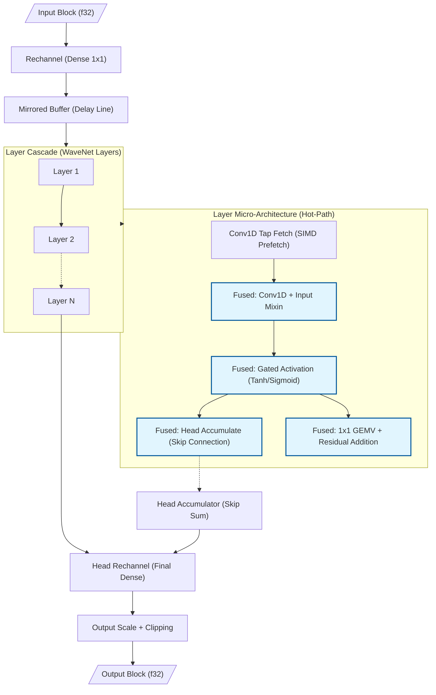
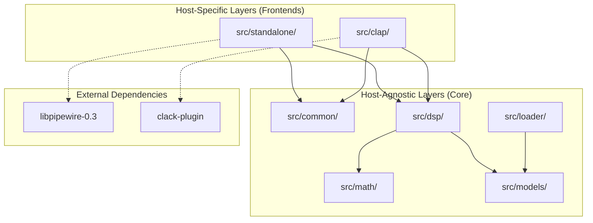
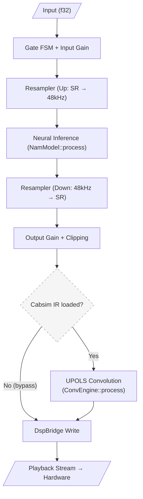

<!--
SPDX-License-Identifier: Apache-2.0
Copyright (c) 2026 Fábio Henrique de Lima Silva (fhl.bsb@gmail.com) All rights reserved.
-->

# NAM-rs Architecture: Standalone Neural Inference Client

This is the general architecture reference for NAM-rs: system topology, module layout, build configuration, and cross-cutting design decisions that don't belong to any single specialized document. For domain-specific detail, see the pointers in each section and [docs/] as a whole — this file intentionally does not repeat content that already has a dedicated home (fidelity trade-offs, CLAP/GUI internals, testing methodology, NAMB byte layout, etc.).

NAM-rs targets low-latency DSP processing and neural inference for audio equipment simulation (Neural Amp Modeler), operating as a standalone PipeWire client (Stable) or as a CLAP plugin (Release) on Linux, in idiomatic Rust with a focus on RT (Real-Time) safety.

## 1. PipeWire Topology (Standalone Mode): Dual-Stream (Capture + Playback)

- **Virtual Sink (Audio/Sink):** NAM-rs declares itself as the default sound output via `pw_stream`. Apps connect automatically via WirePlumber.
- **Playback Stream (Stream/Output):** A second stream reads the processed audio and delivers it to the physical hardware, bypassing the limitations of monitor ports on virtual sinks.
- **DspBridge (Lock-Free Double-Buffer):** An aligned structure (128B) that isolates the streams. Capture writes to the inactive buffer (Release); playback reads from the active one (Acquire), synchronized by `AtomicU64` (generation).
- **True Stereo and Bypass:** Symmetric L/R inference in Standalone/Pipewire mode. Since the NAM standard is mono by definition, stereo operation is a convenience feature implemented in standalone. If R is silent or identical to L, the system skips R inference (saving ~50% CPU).

> **Note:** The Dual-Stream topology is preferred over `pw_filter` because it guarantees automatic "plug-and-play" routing by WirePlumber and due to the maturity of the safe wrappers in the `pipewire` crate.

CLAP plugin mode uses a structurally different topology (host-driven `process()`, no `DspBridge`, mono core with adaptive stereo metering) — see [docs/clap_integration.md](clap_integration.md) §1 and §8.2 below.

## 2. Inference Engine Architecture

### 2.1 Structural Dispatch: `StaticModel` Enum (Zero Vtable Routing)

NAM-rs uses a **static enum dispatch** pattern to route inference calls to the correct model architecture without virtual table (vtable) overhead. The `StaticModel` enum (`src/models/mod.rs:106`) has 23 variants covering all supported architectures:

| Family                 | Variants                                                                                                                 | Dispatch Strategy                  |
|:---------------------- |:------------------------------------------------------------------------------------------------------------------------ |:---------------------------------- |
| **WaveNet A1**         | `WavenetStandard` (ch=16), `WavenetLite` (ch=12), `WavenetFeather` (ch=8), `WavenetNano` (ch=4)                          | Const-generic monomorphization     |
| **WaveNet A2**         | `WavenetA2Full` (ch=8), `WavenetA2Lite` (ch=3)                                                                           | Const-generic monomorphization     |
| **WaveNet A2 Dyn**     | `WavenetA2Dyn`                                                                                                           | Runtime dimensions (free channels) |
| **WaveNet A2 Cascade** | `WavenetA2Cascade`                                                                                                       | Multi-array dynamic cascade        |
| **WaveNet Dyn**        | `WavenetDyn` (backed by `WaveNetModelDyn`)                                                                               | Free geometry fallback             |
| **LSTM Static**        | `Lstm1x3`, `Lstm1x8`, `Lstm1x12`, `Lstm1x16`, `Lstm1x24`, `Lstm2x8`, `Lstm2x12`, `Lstm2x16`, `Lstm1x40`, `Lstm2x24`      | Const-generic monomorphization     |
| **LSTM Dyn**           | `LstmDyn` (backed by `LstmModelDyn`)                                                                                     | Runtime dimensions fallback        |
| **Container**          | `Container` (backed by `ContainerModel`)                                                                                 | Nested `StaticModel` dispatch      |
| **ConvNet**            | `ConvNet` (backed by `ConvNetModel`)                                                                                     | Layer-chain SIMD dispatch          |
| **Linear**             | `Linear` (backed by `LinearModel`)                                                                                       | Direct SIMD FIR / Partitioned FFT  |

The `NamModel::process()` implementation uses a flat `match self` on all 23 variants and directly calls the inner model's method (`src/models/static_model.rs:359`). With `#[inline(always)]`, the compiler produces a jump table at each call site — the CPU branch predictor learns the active model type within a few blocks, achieving **zero dispatch overhead** in the steady state, equivalent to a direct function call.

#### Dynamic Models: Free-Shape Fallback

For models whose geometry does not match any of the const-generic profiles, the loader routes to one of three dynamic variants:

- **`WaveNetModelDyn`** (`src/models/wavenet/model_dyn.rs`): Activated when `get_wavenet_topology()` returns `Free(geometry)` — handling arbitrary `channels`, `head`, `condition_size`, and `post_stack_head` dimensions. Supports optional `condition_dsp` (a nested `StaticModel` sub-model that pre-processes raw audio, mirroring C++ `model.cpp:692-722`).
- **`LstmModelDyn`** (`src/models/lstm/model_dyn.rs`): Activated when the `(num_layers, hidden_size)` pair does not match any of the 10 static LSTM profiles. Supports arbitrary layer counts and hidden sizes, with two SIMD kernels (AVX2+FMA+F16C and AVX-512F+VL) plus a scalar fallback.
- **`WaveNetA2Dyn`** (`src/models/a2/model/dynamic/mod.rs`): Activated for models matching the A2 23-layer pattern with channel counts other than 3 or 8. Uses runtime-dimensioned conv1d and GEMV kernels.
- **`WaveNetA2Cascade`** (`src/models/a2/model/cascade/mod.rs`): Activated for multi-array A2 models, serializing multiple `WaveNetA2Dyn` instances into a sequential pipeline.

These dynamic paths use heap-allocated `Vec`-based arrays for weights and states instead of stack-allocated const-generic arrays. While they introduce a one-time allocation at load time, the hot inference path remains **zero-allocation** and **RT-safe** via the same `match self` dispatch as const-generic variants.

### 2.2 SIMD Microarchitecture (x86-64-v3/v4)

Static dispatch to `Avx2Math` / `Avx512Math` / `Avx512VnniBf16Math` is resolved entirely at compile time via the `dispatch_simd!` macro (see [`src/math/common/mod.rs`](../src/math/common/mod.rs)), which matches on `SIMD_MATH.instruction_set` and emits a direct, inlined call per branch — no function pointers exist anywhere in the dispatch path. `SimdMathConfig` is a descriptive metadata holder only (`instruction_set`, `name`, `is_avx512`).

Key fused/tiled kernels built on top of this dispatch:

- **Gated Activation Fusion (WaveNet A2):** `tanh`/`sigmoid` unified into a single native SIMD kernel.
- **Dot Product ILP:** Multiple independent accumulators (`sum0..sum3` AVX2, `acc0..acc7` AVX-512) to saturate FMA port throughput.
- **Weight Compression (F16C/BF16):** Weights stored in `f16`/`bf16` to reduce L1/L2 traffic, decompressed on-the-fly (`_mm256_cvtph_ps`/`_mm512_cvtph_ps` or BF16 bit-unpacking) inside the SIMD kernel.
- **Gate-Major Layout & Fused 4-Gate GEMV (LSTM):** Weights transposed to `[Gate][Input][Hidden]`; all 4 gates computed in one pass over the state vector.
- **Layer Overlap Pipelining (LSTM 2-Layer):** Layer 2 processes frame `N-1` while Layer 1 processes frame `N`.
- **Native BF16 (AVX-512 BF16):** `_mm512_dpbf16_ps` (VNNI-BF16) on Sapphire Rapids+, including a Fused 4-Gate GEMV BF16 kernel.
- **Fused Conv1d+Mixin / Tanh+Head Accumulate / Residual GEMV with Frame Tiling (WaveNet):** Each fuses an adjacent elementwise or accumulation step directly into the GEMV/conv accumulator, avoiding an extra pass over the activation vector.
- **Conv1D Tiling:** Block processing of multiple channels to maximize register reuse.
- **ConvNet:** Feed-forward chain of `ConvNetBlock` (causal Conv1D → fused-affine BatchNorm1D → activation) via ping-pong scratch buffers, plus an optional `PostStackHead`. No gating, no dual-array architecture. See [`src/models/convnet/`](../src/models/convnet/).
- **Linear:** FIR filter — convolved input history with weights and a bias.

Activation approximations (Padé tanh, minimax sigmoid, the `Standard`/`HighFidelity` precision modes) and their exact error budgets are **not repeated here** — see [docs/fastmath-approximations.md](fastmath-approximations.md) for the numerical analysis and [docs/audio_fidelity_map.md](audio_fidelity_map.md) §1–2 for the fidelity/performance trade-off.

#### Decision: Modular Math Reorganization & VNNI Cleanup

The monolithic math implementation was fragmented into domain-specific modules (`activations/`, `gemm/`, `dsp/`, `lstm/`, `wavenet/`) to reduce cognitive load in 2000+ line files and enable isolated kernel testing. As part of this cleanup, `Avx2VnniMath` was eliminated (aliased to `Avx2Math` — `VPDPBUSD` int8 VNNI offers no gain for float kernels), and the previous dual-dispatch design (loader→model→`SimdMathConfig` v-table) was fully replaced by the static `dispatch_simd!` macro described above. Only `Avx512VnniBf16` remains as an actively used VNNI variant.

### 2.3 Mixed Precision and Numerical Stability

- **Selective mixed precision:** The WaveNet backbone (Conv1D, `input_mixin`, `one_by_one`) runs on F16/BF16-compressed weights; the final projection (`head_rechannel`, and the equivalent LSTM head) runs a native `f32` GEMV (`process_block_f32_native`) to preserve 24-bit fidelity in the analytically most sensitive stage. Full quality/performance rationale: [docs/audio_fidelity_map.md](audio_fidelity_map.md) §1.
- **Kahan summation:** Used in the interleaved 4× scalar-fallback dot products (`scalar_ref/dot.rs`) to bound relative accumulation error at `O(ε)` instead of `O(N·ε)`. Static conv1d paths use plain `+=` (error for K≤3 taps is below −129 dBFS, inaudible).
- **Deterministic dither:** A fixed `−220 dBFS` DC offset is added at the input stage ([apply_input_stage](../src/dsp/pipeline/stages/input.rs#L47)) and subtracted at the output ([apply_output_stage](../src/dsp/pipeline/stages/output.rs#L21)), keeping activations out of subnormal ranges during silence without any net signal change. Full analysis: [docs/audio_fidelity_map.md](audio_fidelity_map.md) §6.

### 2.4 NAMB Binary Format (Native Audio Model Binary)

`.namb` is a real-time-oriented binary evolution of the original `.nam` JSON format: a single block with metadata JSON + `f32` weights + CRC32 (v1), or weights pre-transposed into the final kernel layout — Gate-Major for LSTM, Interleaved-4 for WaveNet (v2), eliminating load-time transposition and cutting model-swap latency from ~50 ms to <1 ms. Full byte-level layout, flags, and hex examples: [docs/namb-spec.md](namb-spec.md).

### 2.5 WaveNet Data Flow (Inference Pipeline)

The diagram below illustrates the data flow in a WaveNet inference block, highlighting the fused operations that minimize memory traffic and maximize SIMD throughput:



#### Decision: Heterogeneous Layer Array Skip-Connection Head Cascade

For multi-array WaveNet models, the head accumulator of the second layer array (`array2`) is seeded with the projected skip-connection head output of `array1`, instead of starting from zero — matching the reference C++ behavior (`out = head_scale * array2.head_outputs`, with `array1`'s head feeding into `array2`'s accumulation). This was required for parity: independently summing each array's head output at the end caused significant tonal divergence. See [`model.rs`](../src/models/wavenet/model.rs#L90), [`layer_array.rs`](../src/models/wavenet/layer_array.rs). A related latent edge case (head propagation for multi-array models with `head_kernel_size > 1`) is tracked in [docs/cpp_parity_map.md](cpp_parity_map.md) §4.6.

### 2.6 Decision: Portability and Virtual Allocation of `MirroredBuffer`

> **Decision:** The `MirroredBuffer` structure performs virtual memory mirroring by mapping the same physical block twice consecutively to avoid logical wrap-around in the DSP hot-path. On Linux, it attempts allocating 2 MB explicit HugeTLB pages (MAP_HUGETLB / MFD_HUGETLB) to reduce TLB pressure, falling back to regular pages with THP (madvise MADV_HUGEPAGE + MADV_COLLAPSE), and finally standard 4 KB pages. For non-Linux platforms, a fallback (stub) is provided that returns an incompatibility error (`Unsupported`).
>
> **Trade-off:** Using `memfd_create` on Linux offers an ideal way to allocate mirrored buffers without creating files on physical disk and without requiring complex cleanup on the filesystem. Buffer sizing is rounded up to the least common multiple of standard/huge page sizes and `elem_multiple * sizeof(T)` to keep ring arithmetic correct. Since the production ecosystem of NAM-rs is exclusively focused on Linux (Standalone PipeWire and CLAP plugin), the implementation of stubs for other platforms is sufficient for static compilation portability of the crate.

## 3. Time Management and Isolation (Strict RT)

- **DSP Thread (SCHED_FIFO):** Pinned via Core Affinity (`select_optimal_cpu`) preferring cores with lower IRQ load.
- **Zero-Allocation:** Strict prohibition of heap allocations, `Vec`, `Box`, or panics in the DSP thread.
- **Jitter Isolation:**
  - `mlockall` to prevent page faults.
  - PM QoS Lock (`/dev/cpu_dma_latency`) to disable deep C-States **globally across all system cores**, ensuring zero wakeup latency.
  - Disabling THP (Transparent Huge Pages) via `prctl` to prevent kernel compaction spikes.
- **High-Precision Telemetry (RDTSC):** Replacement of `Instant::now()` (vDSO syscall) with direct reading of the calibrated TSC in the RT callback. Guarantees ~1ns precision with ~1 CPU cycle overhead, eliminating kernel-induced jitter in DSP load measurement.
- **SPSC Channels (rtrb):** Lock-free communication between CLI (async) and DSP (RT). Payload aligned (128B) to prevent False Sharing.

## 4. Module Structure (Tripartite Organization)

From v1.4 onwards, NAM-rs adopts a clear modular structure to support multiple hosts (Standalone/PipeWire and Plugin/CLAP) without dependency pollution:

| Layer                              | Sub-modules                                                    | Responsibility                                                                                                                              |
|:---------------------------------- |:-------------------------------------------------------------- |:------------------------------------------------------------------------------------------------------------------------------------------- |
| **Common** (`src/common/`)         | `diagnostics`, `spsc`, `params`                                | Shared infrastructure, inter-thread communication (SPSC), and parameter definitions.                                                        |
| **Standalone** (`src/standalone/`) | `pw_host`, `rt_setup`, `cli`, `colors`                         | Native Linux backend. Manages the PipeWire server, hardware setup (FIFO/Affinity), and the command-line interface.                          |
| **CLAP** (`src/clap/`)             | `plugin`, `processor`, `param_smoother`, `extensions/`, `gui/` | Full CLAP plugin with DSP pipeline, parameters, persistence, egui/baseview visual interface, and anti-zipper smoothing.                     |
| **Math** (`src/math/`)             | `common/`, `activations/`, `gemm/`, `dsp/`...                  | Mathematical infrastructure modularized by domain, isolating low-level SIMD kernels from dispatch logic.                                    |
| **Core DSP** (`src/`)              | `dsp/`, `models/`, `loader/`                                   | The "brain" of NAM-rs. Neural inference algorithms and model parsing.                                                                       |
| **Testing** (`src/testing/`)       | `perceptual`, `spectral`, `aliasing`, `reference_oracle`, ...  | Off-RT measurement library used by integration tests and offline QA tooling. See [docs/perceptual_validation.md](perceptual_validation.md). |

### Architecture Layers Diagram



This separation ensures that building for CLAP does not drag in PipeWire dependencies and facilitates future portability to other operating systems.

## 4.1 Conditional Compilation Strategy (Feature Flags)

NAM-rs uses *feature flags* to isolate backends and reduce the final binary footprint:

| Build Profile            | Compilation Command                                              | Generated Asset        | Main Dependencies                                      |
|:------------------------ |:---------------------------------------------------------------- |:---------------------- |:------------------------------------------------------ |
| **Standalone** (default) | `cargo build`                                                    | Executable Binary      | `pipewire`, `rtrb`, `lexopt` (CLI)                     |
| **CLAP Plugin**          | `cargo build --no-default-features --features clap-plugin --lib` | `.so` Library (cdylib) | `clack-plugin`, `clack-extensions`, `egui`, `baseview` |
| **DSP Lib (Pure)**       | `cargo build --no-default-features --lib`                        | Rust Library (`.rlib`) | Core DSP only (no-std ready)                           |

### 4.1.1 Feature Flag: `dynamic-engine`

> **Scope:** The `dynamic-engine` feature flag (`Cargo.toml:109`) controls **exclusively** a scalar per-frame fallback path inside the `WaveNetA2` fast-path (`src/models/a2/model/static/process.rs:272-363`). It enables runtime handling of A2 layers whose convolution does not match the CH=3 (A2-Lite) or CH=8 (A2-Full) specialized kernels — e.g., grouped, depthwise, or heterogeneous-channel convolutions within an A2 model.
> **When disabled** (production default), generic A2 convolutions are impossible by construction: the A2 loaders enforce CH∈{3,8} at parse time, and the fallback block compiles to `unreachable!()` with a static invariant message.
> **When enabled** (testing / scaffolding), the scalar fallback is compiled in, allowing A2 models with non-standard channel geometries to execute inference correctly — at the cost of per-frame scalar processing (no SIMD tile optimization) for those layers.
> **What this flag does NOT control:** The main dynamic engine variants — `WaveNetModelDyn`, `LstmModelDyn`, and `WaveNetA2Dyn` — are **always compiled** as integral variants of the `StaticModel` enum (§2.1, Structural Dispatch). These engines handle free-shape models (A1 WaveNet, LSTM, and A2 with runtime channel counts) regardless of the `dynamic-engine` flag. The flag is narrowly scoped to the A2 fast-path's internal scalar branch for non-standard convolution geometries.

## 5. DSP Signal Chain & Native Resampling

### Bidirectional DSP Flow

```text
PipeWire Input (Nk Hz)
    ▼ Gate FSM: Silence/Mono Detection + Gain Ramp
    │
    ▼ Input Gain (SIMD)
    │
    ▼ NamResampler::process_input (Nk → 48 kHz)
    │
    ▼ NamModel::process (Neural Inference @ 48 kHz)
    │
    ▼ NamResampler::process_output (48 kHz → Nk)
    │
    ▼ Output Gain (SIMD) + Clipping
    │
    ▼ IR Cabsim (UPOLS Convolution, Optional / Zero-Cost Bypass)
    │
    ▼ DspBridge (Lock-Free Write) → Playback Stream (Read) → Hardware
```

### Native Resampler Architecture

NAM models are trained at 48 kHz; when the host runs at a different rate, NAM-rs converts using a native **Minimum-Phase Polyphase FIR Sinc Resampler** (`NamResampler` in `src/dsp/resampler.rs`), replacing external dependencies such as `rubato`:

- **Polyphase oversampled with linear interpolation:** 256 phases × 64 taps, Kaiser β=12 windowed sinc.
- **Minimum-phase transform (Real Cepstrum):** Eliminates pre-ringing by concentrating filter energy into the shortest possible delay via f64 FFT.
- **Linear-phase option:** `NamResampler::new_linear()` for offline/mixdown use where zero pre-ringing is not required.
- **AVX2+FMA inner product:** Coefficients aligned to 64 bytes.
- **Double-buffer delay line:** Two contiguous copies of history (2 × `TAPS_PER_PHASE` samples), eliminating circular wrap logic in the SIMD inner loop.
- **Bypass at native rate:** When the host sample rate matches 48 kHz, samples are `memcpy`'d directly with zero convolution overhead.

64-tap minimum-phase is the permanent production default; a tunable resampler-quality
parameter was evaluated and **rejected** after benchmarking. Full quality metrics
(passband ripple, stopband attenuation, multitone SNR) and the rejection rationale:
[docs/audio_fidelity_map.md](audio_fidelity_map.md) §4.

### Gate FSM

Implements temporal and amplitude hysteresis (Schmitt Trigger) to prevent chattering at noise floor levels. Includes linear SIMD ramping for smooth transitions (fade-in/out), fused into a single stereo pass to optimize cache locality.

## 5 Oversampling Engine — Anti-Aliasing for Neural Activations

NAM-rs provides optional **2×/4× oversampling** around the neural model to suppress aliasing from non-linear activations (tanh, sigmoid, ReLU), implemented in `src/dsp/oversample.rs` following the half-band filter design of Kahles, Esqueda & Välimäki (JAES 2019).

Each 2× stage uses a **Kaiser-windowed half-band FIR filter** (25 taps, β=12, >100 dB stop-band). The half-band property `h[2n] = 0` (for `n ≠ D/2`) halves the effective MAC count per sample:

- **Upsampler:** inserts zeros between input samples then filters.
- **Downsampler:** FIR at full rate, then decimates by 2, using the same contiguous double-buffer delay line as `NamResampler`.

`Off` is the default (zero overhead, live monitoring); `X2`/`X4` cascade one/two stages for offline rendering and critical listening. Latency, per-stage stop-band figures, and the Live-vs-HQ trade-off rationale (including why ADAA was rejected in favor of this activation-agnostic approach) are documented once in [docs/audio_fidelity_map.md](audio_fidelity_map.md) §5 — not repeated here.

**RT-Safety:** All filter coefficients, ring buffers, and scratch space are allocated at `OversampleEngine::new()`, outside the audio thread. `process()` only reads/writes pre-allocated buffers — zero allocations, zero heap-drops. Factor changes trigger an off-RT rebuild (main thread constructs new engines → SPSC → audio thread swaps inline), following the same lock-free GC cascade as model hot-swap (§6.3 in [docs/clap_integration.md](clap_integration.md)).

> **References:** [`src/dsp/oversample.rs`](../src/dsp/oversample.rs), [`src/dsp/pipeline/stages/inference.rs`](../src/dsp/pipeline/stages/inference.rs) (`model_process_stereo_with_os()`), [`src/common/spsc/status.rs`](../src/common/spsc/status.rs) (`RT_STATUS_NEEDS_OS_REBUILD`), [`src/clap/processor/events.rs`](../src/clap/processor/events.rs) (`cold_load_os()`).

## 5.1 Adaptive Compute: Graceful CPU Fallback

To guarantee xrun-free operation under high CPU utilization, NAM-rs includes a dynamic **Adaptive Compute** sub-system that gracefully lowers model complexity when the audio thread approaches its deadline budget. User-facing impact and the `--slim` override are documented in [docs/audio_fidelity_map.md](audio_fidelity_map.md) §7; the FSM mechanics themselves are:

- **Hysteresis FSM:** Prevents chattering via asymmetric thresholds and consecutive confirmation blocks:
  - **Full → Reduced:** After 3 consecutive blocks exceeding `0.70 * budget` (Conservative) or `0.55 * budget` (Aggressive). WaveNet skips 25% of layers; LSTM reduces to 1 layer.
  - **Reduced → Minimal:** After 3 consecutive blocks exceeding `0.85 * budget` (Conservative) or `0.70 * budget` (Aggressive). WaveNet skips 50% of layers; LSTM transitions to direct passthrough.
  - **Recovery:** Upgrades to the previous state after 5 consecutive blocks remain below recovery thresholds (`0.35 * budget` Conservative, `0.275 * budget` Aggressive).
- **Linear Crossfade:** A 32 ms linear parameter crossfade between active layers guarantees click-free structural transitions.
- **Deterministic Offline Bounce:** During offline rendering/export (`RenderMode::Offline` in CLAP), the render mode transition forces `AdaptiveCompute` to `Off` (resetting the FSM to `Full`), clears all active degradation flags (`RT_STATUS_DEGRADE_REDUCED`, `RT_STATUS_DEGRADE_MINIMAL`), and ignores all block deadline measurements — guaranteeing deterministic, maximum-quality output regardless of host RT pressure.
- **A2 slimmable degradation:** For A2 models delivered as a `SlimmableContainer`, the same FSM drives the runtime **A2-Full → A2-Lite** switch instead of layer-skipping, reusing the crossfade machinery. See §7.

## 5.2 IR Cabsim — Impulse Response Convolution

The cabsim stage performs real-time convolution of the neural model output with a speaker cabinet impulse response (IR), simulating the physical cabinet/speaker coloration that follows amplifier modeling.

### Algorithm: Uniform-Partitioned Overlap-Save (UPOLS)

The convolution engine (`src/dsp/cabsim/conv.rs`) implements UPOLS in the frequency domain, following Gardner's efficient convolution design:

- **Partition size** equals the audio block size (typically 64–256 samples); the engine is reconstructed on buffer-size changes.
- **FFT size** is `2 × partition_size` (rounded up to next power of two).
- **Kernel pre-FFT:** All IR partitions are transformed to the frequency domain once at construction time, so the hot-path only performs a forward FFT of the input block and an IFFT of the accumulated spectrum.
- **FDL (Frequency Delay Line):** A pre-allocated circular buffer of complex spectra stores input-FFT history. Each block shifts the FDL and computes `Σ(H_k × X_{i-k})` across all partitions before inverse FFT.
- **Latency** is exactly `partition_size` samples.

`ConvEngine::process()` performs zero heap allocations — all working buffers are allocated once at construction; the bypass path (no IR loaded) is a single branch check. Test coverage (unit, golden parity, heap-audit) is tracked in [docs/testing.md](testing.md).

### Pipeline Integration

The cabsim runs as an optional post-inference stage (Stage 3) in the DSP pipeline, positioned between inference and output processing:



### IR Loading and Transfer

IR `.wav` files (mono, PCM16/24/float32) are loaded and resampled to the active sample rate via `CabSimIr::load()` (`src/dsp/cabsim/loader.rs`). The prepared IR and pre-built `ConvEngine` are transferred to the audio thread via lock-free SPSC — the same GC-cascade pattern used for model hot-swap.

In standalone mode, the `--cab <path>` CLI flag triggers IR loading; the `cabsim_producer` SPSC channel handles runtime buffer-size changes. In CLAP, IR loading is exposed via the GUI file browser, state save/load, and the `LoadCabIr` SPSC payload — see [docs/clap_integration.md](clap_integration.md).

## 6. Testing & Validation

Testing methodology, the three-oracle model (NAMCore f32 parity / f64 reference oracle / ISA parity), gate calibration policy, and the full test coverage matrix are documented in [docs/testing.md](testing.md) and [docs/perceptual_validation.md](perceptual_validation.md) — not duplicated here. AI-facing operational rules for adding or modifying tests live in [.agents/rules/testing.md](../.agents/rules/testing.md). The README's [Tests & Validation](../README.md#-tests--validation) section gives the top-level summary.

The one piece of testing-adjacent state that lives here because it has no better home is the error catalog (§9), since `docs/architecture.md` §9 must stay in sync with `NamErrorCode` per the testing rules above.

## 7. A2 Architecture: Current State (Beta)

The A2 architecture is NAM's next-generation format (NeuralAmpModelerCore v0.5.2+). NAM-rs provides a complete, high-performance, real-time safe implementation of the fixed A2 fast-path (**A2-Full** with 8 channels and **A2-Lite** with 3 channels), matching the behavior of `NAM/wavenet/a2_fast.cpp`. See [docs/cpp_parity_map.md](cpp_parity_map.md) §4 for the parity audit and known issues with non-fast-path A2 models.

### Microarchitectural Optimizations

To run the deep 23-layer A2 network within real-time budgets under AVX2, the engine employs specialized kernels:

- **Fully Unrolled GEMV (A2-Lite, CH=3):** Transposes and fully unrolls the matrix-vector multiplication for 3 channels. Convolutions for both $K=6$ (18 FMAs) and $K=15$ (45 FMAs) are hardcoded without loop overhead (`src/models/a2/conv1d_ch3/`).
- **Tap-Major Frame-Tiled Convolution (A2-Full, CH=8):** Processes blocks using a $T=4$ frame-tiled broadcast-FMA strategy (`src/models/a2/conv1d_ch8/`). Weights are permuted once on load into a `col-major-per-tap` layout, enabling contiguous 256-bit SIMD loads of 8 outputs.
- **Branchless Pow2 Rings (`MirroredBuffer`):** Dilation history uses a virtual double-mapped ring topology. Read lookbacks are mapped branchless via a power-of-two bitwise mask.
- **Bypass of General A2 Overhead:** Features unused by production capturing (FiLM, heterogenous activations, dynamic gating/gated/blended modes, `condition_dsp`, `bottleneck ≠ channels`) are kept out of the hot-path, parsed into stub surfaces for backward compatibility without runtime overhead.

### Slimmable Container and FSM Integration

NAM-rs supports the official A2 distribution format, where models are bundled inside a `SlimmableContainer`:

- **Pre-Allocated Submodels:** Both A2-Full (CH=8) and A2-Lite (CH=3) submodels are loaded, prewarmed, and held in memory; swapping is zero-allocation.
- **FSM-Driven Degradation:** The `AdaptiveCompute` FSM (§5.1) triggers **A2-Full → A2-Lite** downgrade under high CPU load.
- **Linear Crossfade:** A 32 ms linear crossfade blends the outputs of the active and pending models to prevent audible switching transients.

## 8. DAW Integration (CLAP Integration)

NAM-rs supports execution as a CLAP (Clever Audio Plug-in) plugin by sharing the host-agnostic DSP pipeline configuration (`src/dsp/pipeline/`) and SPSC communication abstractions. Feature flags (`standalone` vs `clap-plugin`) ensure system dependencies like `pipewire` are removed from the plugin binary. `NamPluginParams` (`src/common/params.rs`) centralizes plugin state for DAW automation and state persistence.

Thread model, RT-safe lock-free communication, the three-tier GC cascade, and the full GUI architecture are documented in [docs/clap_integration.md](clap_integration.md) — this section covers only the DSP-pipeline-specific flow and the unified parameter surface that spans both CLI and CLAP.

### 8.1 CLAP DSP Pipeline

The following diagram traces the detailed layout of parameter updates, event queues, DSP processing, and real-time-safe cleanup inside the audio processing thread ([PluginAudioProcessor::process](../src/clap/processor/mod.rs#L279)):

```mermaid
graph TD
    %% Parameter Flow
    subgraph ParameterFlow ["Parameter Flow (Main/GUI -> RT)"]
        GUI["GUI Knobs (egui)"] -- "atomic writes +\nbump generation (Release)" --> Atomics["Shared ui_to_rt atomics"]
        HostState["Host Preset / State Load"] -- "Load Model / Params" --> SPSC_Tx["SPSC param_tx (Main Thread)"]
        DAW_Auto["DAW Automation / MIDI"] -- "Sample-Accurate Queue" --> HostEvents["Events Input Queue"]
    end

    %% Audio Thread Callback
    subgraph RTThread ["RT Audio Thread (process)"]
        Entry["PluginAudioProcessor::process()"] --> Prio["Priority & DAZ/FTZ Setup\n(first block)"]
        Prio --> PE["process_events()"]

        %% Event Draining in process_events
        subgraph EvDraining ["process_events() details"]
            SPSC_Rx["Drain param_rx"] --> |LoadModel| SwapModel["Swap Model & Resampler\nPush old to gc_tx"]
            HostEventsD["Drain Host Events\n(ParamValue/Mod)"] --> UpdateTgt["Update local parameter targets"]
            GenGuard{"generation != last_seen?"} -->|Yes| SyncAtomics["Sync from Shared Atomics"]
            SyncAtomics --> UpdateTgt
        end

        PE --> EvDraining
        EvDraining --> DSPProc["process_dsp_audio()"]

        %% DSP Processing in process_dsp_audio
        subgraph DSPPipeline ["process_dsp_audio() Pipeline"]
            AudioPorts["Iterate Audio Ports"] --> BypassCh{"Bypass active?"}
            BypassCh -->|Yes| RunBypass["process_bypass() (copy / zero)"]
            BypassCh -->|No| ChanExt["extract_channels()"]
            ChanExt --> InputGain["Apply Input Gain\n(SIMD + Smoother)"]
            InputGain --> InputStage["apply_input_stage()\n(Dither & Gate)"]
            InputStage --> GateCh{"Gate open?"}
            GateCh -->|No| ZeroOut["Fill output with 0.0"]
            GateCh -->|Yes| Infer["run_inference()\n- NamResampler (Up)\n- NamModel::process()\n- NamResampler (Down)"]
            Infer --> OutputStage["apply_output_stage()\n(Dither comp & Gate fade\n& Adaptive Compute check)"]
            ZeroOut --> OutputStage
            OutputStage --> OutputGain["Apply Output Gain\n(SIMD + Smoother)"]
            OutputGain --> OutputPeaks["compute_output_peaks()\nStore peaks in Shared"]
        end

        DSPProc --> DSPPipeline
        DSPPipeline --> Telemetry["process_telemetry()\n- Read TSC cycles\n- Heap-audit assert"]
    end

    %% GC Drop
    SwapModel -.-> |gc_tx| SPSC_Gc["SPSC gc_rx"]
    SPSC_Gc -.-> |drop()| GcDrop["Main Thread GC Drain"]
```

Pipeline stages, in execution order: bypass evaluation ([process_bypass](../src/clap/processor/dsp/bypass.rs#L11)) → channel extraction ([extract_channels](../src/clap/processor/dsp/channels.rs#L10)) → input gain (SIMD + [ParamSmoother](../src/dsp/smoother.rs#L12)) → input dither/gate ([apply_input_stage](../src/dsp/pipeline/stages/input.rs#L48), [GateState](../src/dsp/gate.rs#L60)) → inference ([run_inference](../src/dsp/pipeline/stages/inference.rs#L224), resample up → `NamModel::process` → resample down) → output dither compensation/fade/Adaptive-Compute check ([apply_output_stage](../src/dsp/pipeline/stages/output.rs#L22)) → output gain → VU peak telemetry ([compute_output_peaks](../src/clap/processor/dsp/peaks.rs#L10)) → cycle-accurate telemetry ([process_telemetry](../src/clap/processor/dsp/telemetry.rs#L12)).

Parameter synchronization across the three incoming paths (SPSC `param_rx` for cold loads, host DAW automation events, and GUI atomics with a generation counter) is detailed in [docs/clap_integration.md](clap_integration.md) §6.2.

### 8.2 User Control Surface (CLI + CLAP GUI + Host Automation)

NAM-rs exposes a unified parameter set across standalone CLI and CLAP plugin surfaces:

#### Full Parameter Matrix

| Parameter        | CLI Flag                        | CLAP Param ID | CLAP GUI Zone | Type           | Sync Strategy            |
|:---------------- |:------------------------------- |:------------- |:------------- |:-------------- |:------------------------ |
| Model file       | `-m`, `--model <FILE>`          | State-only    | Zone 1        | `PathBuf`      | SPSC `LoadModel` payload |
| Cabsim IR        | `-c`, `--cab <FILE>`            | State-only    | Zone 1        | `PathBuf`      | SPSC `LoadCabIr` payload |
| Input gain       | `-i`, `--input-gain <DB>`       | ID=0          | Zone 2 (knob) | `f32` dB       | Atomic + SPSC + DAW auto |
| Output gain      | `-o`, `--output-gain <DB>`      | ID=1          | Zone 2 (knob) | `f32` dB       | Atomic + SPSC + DAW auto |
| Gate threshold   | (reserved)                      | ID=2          | Zone 2 (knob) | `f32` dB       | Atomic + SPSC + DAW auto |
| Bypass           | (CLAP-only)                     | ID=3          | Zone 4        | `bool`         | Atomic + DAW auto        |
| Active model     | (CLAP-only, read-only display)  | ID=4          | Zone 1        | `String` name  | GUI readout              |
| Adaptive compute | (CLAP-only)                     | ID=5          | Zone 5        | stepped enum   | SPSC `SetAdaptiveMode`   |
| Slim override    | `--slim auto\|full\|lite`       | ID=6          | Zone 5        | `SlimOverride` | SPSC `SetSlim` payload   |
| Oversampling     | `--oversample off\|2x\|4x`      | ID=7          | Zone 2        | stepped enum   | SPSC off-RT rebuild      |
| Activation prec. | `--activation standard\|hf`     | ID=8          | Zone 2        | stepped enum   | SPSC change precision    |
| Buffer size      | `-b`, `--buffer-size <SAMPLES>` | (host-driven) | —             | `u32`          | CLI-only, at startup     |
| Diagnose         | `--diagnose`                    | —             | —             | `bool`         | CLI-only, immediate exit |
| Diagnose full    | `--diagnose-full`               | —             | —             | `bool`         | CLI-only, immediate exit |

CLI parameters are parsed in `src/standalone/cli.rs` (`CliArgs`). Model, cab, and oversample changes require off-RT resource allocation and are sent via SPSC to the DSP thread; gain/buffer-size are applied at `RtSetup` initialization. CLAP GUI zone layout, knob widgets, and gesture protocol are documented in [docs/clap_integration.md](clap_integration.md) §7.

```text
nam-rs -m /path/to/model.nam -c /path/to/cab.wav \
       --input-gain 3.0 --output-gain -2.5 \
       --buffer-size 128 --slim full --oversample 4x
```

### 8.3 Decision: Gain Multiplier Fusion — Standalone vs. CLAP

> **Decision:** Standalone pre-fuses user gain controls with model calibration adjustments (`input_level_dbu`, `loudness`) into single input/output multipliers via `compute_gain_multipliers()` ([rt_setup/mod.rs](../src/standalone/rt_setup/mod.rs#L25)). CLAP keeps them separate: `smoother_in`/`smoother_out` carry only user gain, while model calibration multipliers flow through `DspPipelineContext::input_gain_mult`/`output_gain_mult` ([orchestrator.rs](../src/clap/processor/dsp/orchestrator.rs#L70)).
>
> **Motivation:** CLAP must support sample-accurate DAW parameter automation. Fusing static model calibration into the same value as automated user gain would prevent isolated, artifact-free smoothing.

### 8.4 Decision: Reject a Shared `SwapStrategy<T>` for Standalone/CLAP GC Deduplication

An investigation into unifying the object-swap + GC-cascade logic shared between `src/standalone/pw_host/rt_callback/{resampler_swap,commands,cabsim_swap}.rs` and `src/clap/processor/events.rs` into a common `SwapStrategy<T>` in `src/dsp/` was **rejected**:

1. **Net savings < 100 lines** (~46 SLOC even reusing `gc_cascade()`) — each drain site interleaves type-specific logic (rate tracking, `inject_rt_status`, `set_max_buffer_size`) that a generic wrapper cannot absorb.
2. **Layering violation:** placing `SwapStrategy<T>` in `src/dsp/` would create a dependency on `common::spsc::gc`, breaking the current DSP/common layering.
3. **No RT benefit:** the swap itself is `std::mem::replace` — already zero-cost.

The existing free function `gc_cascade()` (`src/common/spsc/gc.rs`) already abstracts the 3-tier cascade (SPSC → parking-lot → overflow, detailed in [docs/clap_integration.md](clap_integration.md) §6.3); both standalone and CLAP call it directly instead of through an added abstraction layer.

## 9. Error Catalog (NamErrorCode)

Typed error codes for structured diagnostics. Defined in `src/common/diagnostics/error_codes.rs`. The table below shows the category ranges with representative examples; the complete catalog of 40+ codes lives in the source enum. Keep this table synchronized with the enum on every change (see [.agents/rules/testing.md](../.agents/rules/testing.md)).

| Range   | Category                   | Examples                                                                                                                                     |
|:------- |:-------------------------- |:-------------------------------------------------------------------------------------------------------------------------------------------- |
| `E1xxx` | Model loading (I/O, parse) | `E1100` FILE_NOT_FOUND, `E1200` NAM_JSON_PARSE_ERROR, `E1201` NAMB_CRC32_MISMATCH, `E1300` UNSUPPORTED_ARCHITECTURE, `E1304` MODEL_TOO_LARGE |
| `E2xxx` | PipeWire / Audio / RT      | `E2001` DEADLINE_EXCEEDED, `E2100` PIPEWIRE_INIT_FAILED, `E2200` RESAMPLER_BUILD_FAILED, `E2300` SCHED_FIFO_DENIED                           |
| `E3xxx` | SPSC / Communication       | `E3100` PARAM_CHANNEL_FULL, `E3101` GC_OVERFLOW, `E3102` GC_CORRUPTED                                                                        |
| `E4xxx` | Runtime / CLI              | `E4100` INVALID_GAIN_VALUE, `E4101` UNKNOWN_COMMAND, `E4102` CTRL_C_HANDLER_FAILED, `E4103` IR_LOAD_FAILED                                   |
| `E5xxx` | System / Hardware          | `E5000` OUT_OF_MEMORY                                                                                                                        |

Each emitted diagnostic includes version, architecture, and timestamp to enable automated triage via the `diagnostico` skill (see [SKILL.md](../.agents/skills/diagnostico/SKILL.md)).

## 10. References

- [NeuralAmpModelerCore](https://github.com/sdatkinson/NeuralAmpModelerCore) - Reference implementation of NAM.
- [CLAP (CLever Audio Plug-in)](https://cleveraudio.org/) - Specification of the CLAP plugin format.
- [Clack Framework](https://github.com/prokopyl/clack) - Rust infrastructure for implementing CLAP plugins.
- [NeuralAudio](https://github.com/mikeoliphant/NeuralAudio) - Historical reference; original golden vectors migrated to anchor on NeuralAmpModelerCore (see [docs/testing.md](testing.md)).
