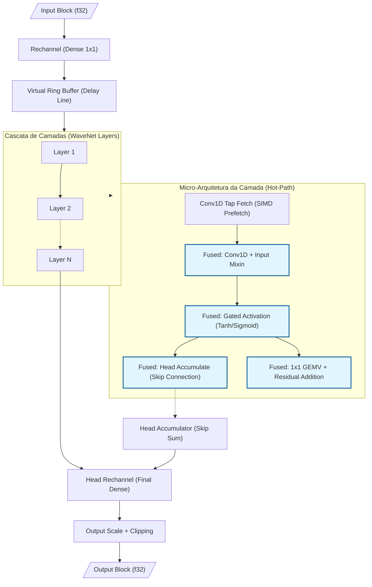
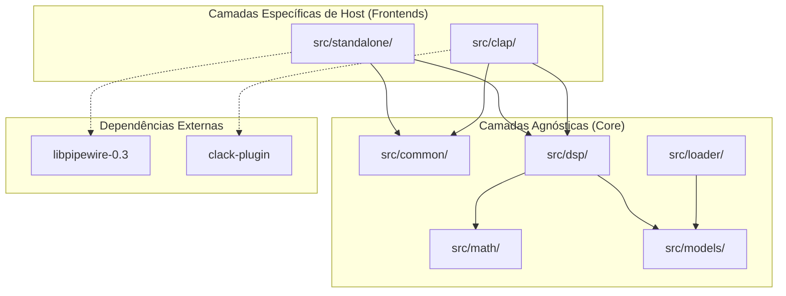

<!-- SPDX-License-Identifier: MIT OR Apache-2.0 -->
<!-- Copyright (c) 2026 Fábio Henrique de Lima Silva. -->

# Arquitetura NAM-rs: Cliente Standalone de Inferência Neural

A arquitetura do NAM-rs é projetada para processamento DSP de baixa latência e inferência neural focada em simulação de equipamentos de áudio (Neural Amp Modeler). Operando como cliente PipeWire standalone (Estável) ou como plugin CLAP (Staging) no Linux, utiliza Rust idiomático com foco em segurança RT (Real-Time).

## 1. Topologia PipeWire (Modo Standalone): Dual-Stream (Capture + Playback)

- **Virtual Sink (Audio/Sink):** O NAM-rs declara-se como saída de som padrão via `pw_stream`. Apps conectam-se automaticamente via WirePlumber.
- **Playback Stream (Stream/Output):** Uma segunda stream lê o áudio processado e o entrega ao hardware real, contornando limitações de monitor ports de sinks virtuais.
- **DspBridge (Lock-Free Double-Buffer):** Estrutura alinhada (128B) que isola as streams. O capture escreve no buffer inativo (Release); o playback lê do ativo (Acquire), sincronizado por `AtomicU64` (generation).
- **True Stereo e Bypass:** Inferência simétrica L/R. Se R for silêncio ou idêntico a L, o sistema pula a inferência de R (poupando ~50% de CPU).

> **Nota:** A topologia Dual-Stream é mantida em preferência ao `pw_filter` por garantir roteamento "plug-and-play" automático pelo WirePlumber e pela maturidade dos wrappers safe no crate `pipewire`.

## 2. Inferência & Microarquitetura (SIMD x86-64-v3/v4)

- **Multiversioning via Macro `dispatch_simd!`:** Despacho dinâmico no carregamento do modelo que seleciona a melhor v-table de kernels SIMD (`Avx2Math`, `Avx512Math`, etc.). O uso de macros para monomorfização garante que o compilador emita intrinsics nativos sem overhead de v-table no hot-path de inferência.
- **FastMath Activations & Gain LUT:** `simd_tanh` e `simd_sigmoid` usam polinômios Minimax de grau 7 com refinamento Newton-Raphson. Erro máximo < 2e-5, otimizado para o intervalo [-8, 8]. Inclui uma **Gain LUT (Look-Up Table)** interpolada para conversão ultra-rápida dB → Linear no RT, evitando chamadas caras a `powf`.
- **Gated Activation Fusion (WaveNet A2):** Unificação de `tanh` e `sigmoid` em um único kernel SIMD nativo, reduzindo a pressão de registradores e evitando passagens múltiplas sobre o vetor de ativação.
- **Dot Product ILP:** Implementação com múltiplos acumuladores independentes (`sum0..sum3` em AVX2, `acc0..acc7` em AVX-512) para saturar o throughput de portas FMA, quebrando cadeias de dependência.
- **Weight Compression F16C:** Pesos são armazenados em `f16` (Half-Precision) para reduzir o tráfego de memória L1/L2. A descompressão ocorre on-the-fly via `_mm256_cvtph_ps` ou `_mm512_cvtph_ps`.
- **Gate-Major Layout & Fused 4-Gate GEMV (LSTM):** Transposição de pesos para layout `[Gate][Input][Hidden]`. A inferência funde o cálculo das 4 portas em uma única passagem sobre o vetor de estado.
- **Layer Overlap Pipelining (LSTM 2-Layer):** Paralelismo de grão fino onde a Camada 2 processa o frame `N-1` simultaneamente ao frame `N` da Camada 1, aumentando a vazão em modelos multicamada.
- **BF16 Nativo (AVX-512 BF16):** Suporte a kernels nativos via `_mm512_dpbf16_ps` (VNNI-BF16) para CPUs Sapphire Rapids e posteriores. Inclui o kernel **Fused 4-Gate GEMV BF16** para LSTM, eliminando o custo de despacho escalar e dobrando o throughput de dot-products em relação ao AVX2.
- **Fused Conv1d+Mixin (WaveNet):** A soma do vetor de mixagem é fundida diretamente no acumulador da Conv1D.
- **Fused Tanh + Head Accumulate (WaveNet):** Unificação nativa das fases de ativação e skip-connection (head) em um único kernel SIMD (`tanh_and_accumulate_block`).
- **Fused Residual GEMV com Frame Tiling (WaveNet):** O cálculo do resíduo é fundido no GEMV da camada seguinte, utilizando **4-frame tiling (AVX2)** ou **8-frame tiling (AVX-512)** para maximizar o reuso de pesos nos registradores.
- **Conv1D Tiling:** Processamento de múltiplos canais em blocos para maximizar o reúso de dados nos registradores SIMD e reduzir latência de cache em modelos com dilatação profunda.

### Decisão Técnica: Precisão FastMath vs Performance

> **Decisão:** As funções de ativação `tanh` e `sigmoid` usam aproximações polinomiais SIMD
> (Minimax + Newton-Raphson duplo) em vez de chamadas à libm IEEE-754 compliant.
>
> **Consequência:** Erro máximo por ativação vs libm (range completo `[-8, 8]`):
>
> - **tanh**: **< 2e-5** (sweep de 32.768 pontos, T7.2-2026-05-08); pior ponto em x≈-4.34 (1.234e-5).
>   No range central `[-4, 4]` o erro cai para ~6e-8 (polinômio Minimax saturando o mantissa f32).
> - **sigmoid**: **< 5e-6** (sweep de 32.768 pontos, T7.2-2026-05-08); erro uniforme por todo o range.
>   O áudio resultante **não é bit-a-bit idêntico** ao motor C++ NeuralAmpModelerCore.
>   A divergência é **perceptualmente inaudível** (erro uma ordem de magnitude abaixo
>   do piso de quantização 16-bit PCM).
>
> **Justificativa:** O trade-off sacrifica ~4–5 casas decimais de precisão para ganhar
> ~10-20× de throughput (4-8 ciclos/ativação vs 20-60 ciclos/ativação no libm escalar).
> Para atingir paridade bit-a-bit seria necessário usar `exp()`/`tanh()` escalar via libm,
> eliminando todo o ganho SIMD que é a razão de existência do NAM-rs.
>
> **Impacto por modelo:**
>
> - **LSTM** (1 camada, 4 ativações/sample): SNR ~24.5 dB vs C++ (divergência mínima)
> - **WaveNet Standard** (20 camadas, ~60 ativações/sample): SNR ~10 dB vs C++ (acumulação sublinear √N)
>
> **Fontes de erro do `simd_sigmoid_avx2` (após NR duplo, range central):**
>
> 1. Polinômio Minimax D6 para `exp(f)`: erro ~1e-7 (fonte residual dominante)
> 2. `_mm256_rcp_ps` + 2× Newton-Raphson: precisão saturada a ~24 bits (~6e-8 relativo)
> 3. Range reduction via `_mm256_cvtps_epi32`: ~1 ULP em fronteiras
> 4. Composição multiplicativa `rcp(1 + exp(-x))`: erro pico ~6e-8 para |x| < 5
>
> **Validação:** Sweep determinístico de 32.768 pontos em `[-8, 8]` (`test_tanh_max_abs_error_sweep`,
> `test_sigmoid_max_abs_error_sweep`); proptest com 10.000 inputs aleatórios (`prop_simd_tanh_avx2_rmse`,
> `prop_simd_sigmoid_avx2_rmse`); golden vectors cross-C++ (4 modelos); regression goldens
> self-reference (7 modelos, MSE < 1e-6).
>
> **Referências:** `src/math/fastmath.rs` (docstring de `simd_tanh_avx2`),
> `tests/fixtures/README.md`, `tests/nam_infer_test.rs` (docstring de `test_golden_vectors_wavenet`)

### Formato Binário NAMB (Native Audio Model Binary)

O formato `.namb` é uma evolução otimizada do JSON original para uso em tempo-real.

- **NAMB v1:** Encapsula o JSON de metadados e os pesos em `f32` (Little-Endian) em um único bloco binário com CRC32.
- **NAMB v2 (Pre-Transposed):** Armazena os pesos diretamente no layout final do kernel (Gate-Major para LSTM ou Interleaved-4 para WaveNet).
  - Elimina a necessidade de transposição de memória durante o carregamento.
  - Reduz latência de swap de modelo de ~50ms para <1ms (cold-path de carregamento).
  - Identificado por flag no header `NambHeader::layout_type`.

### Fluxo de Dados WaveNet (Pipeline de Inferência)

O diagrama abaixo ilustra o fluxo de dados em um bloco de inferência WaveNet, destacando as operações fundidas (fused) que minimizam o tráfego de memória e maximizam o throughput SIMD:



## 3. Gestão e Isolação Temporais (Strict RT)

- **Thread DSP (SCHED_FIFO):** Afixada via Core Affinity (`select_optimal_cpu`) preferindo cores com menor carga de IRQs.
- **Zero-Allocation:** Proibição estrita de alocações heap, `Vec`, `Box` ou panics na thread DSP.
- **Isolamento de Jitter:**
  - `mlockall` para evitar page faults.
  - PM QoS Lock (`/dev/cpu_dma_latency`) para desabilitar C-States profundos **em todos os cores do sistema (global)**, garantindo latência de despertar zero.
  - Desabilitação de THP (Transparent Huge Pages) via `prctl` para evitar spikes de compactação do kernel.
- **Telemetria de Alta Precisão (RDTSC):** Substituição de `Instant::now()` (syscall vDSO) por leitura direta do TSC calibrado no callback RT. Garante precisão de ~1ns com overhead de ~1 ciclo de CPU, eliminando jitter induzido pelo kernel na medição de carga de DSP.
- **Canais SPSC (rtrb):** Comunicação lock-free entre CLI (async) e DSP (RT). Payload alinhado (128B) para evitar False Sharing.

## 4. Estrutura de Módulos (Organização Tripartida)

A partir da v1.5, o NAM-rs adota uma estrutura modular clara para suportar múltiplos hosts (Standalone/PipeWire e Plugin/CLAP) sem poluição de dependências:

| Camada                             | Sub-módulos                                   | Responsabilidade                                                                                                       |
|:---------------------------------- |:--------------------------------------------- |:---------------------------------------------------------------------------------------------------------------------- |
| **Common** (`src/common/`)         | `diagnostics`, `spsc`, `params`, `audio_host` | Infraestrutura compartilhada, comunicação inter-threads (SPSC) e abstrações agnósticas ao host.                        |
| **Standalone** (`src/standalone/`) | `pw_host`, `rt_setup`, `cli`, `colors`        | Backend nativo Linux. Gerencia o servidor PipeWire, setup de hardware (FIFO/Affinity) e interface de linha de comando. |
| **CLAP** (`src/clap/`)             | `mod.rs` (Stub)                               | Ponto de entrada para integração como plugin (v1.6+). Totalmente isolado das dependências do PipeWire.                 |
| **Math** (`src/math/`)             | `common/`, `activations/`, `gemm/`, `dsp/`... | Infraestrutura matemática modularizada por domínio, isolando kernels SIMD de baixo nível da lógica de despacho.        |
| **Core DSP** (`src/`)              | `dsp/`, `models/`, `loader/`                  | O "cérebro" do NAM-rs. Algoritmos de inferência neural e parsing de modelos.                                           |

### Diagrama de Camadas (Architecture Layers)



Essa separação garante que o build para CLAP não arraste dependências do PipeWire e facilita a portabilidade para outros sistemas operacionais no futuro.

## 4.1 Estratégia de Compilação Condicional (Feature Flags)

O NAM-rs utiliza *feature flags* para isolar backends e reduzir o footprint do binário final:

| Perfil de Build         | Comando de Compilação                                            | Artefato Gerado           | Dependências Principais            |
|:----------------------- |:---------------------------------------------------------------- |:------------------------- |:---------------------------------- |
| **Standalone** (padrão) | `cargo build --features standalone`                              | Binário Executável        | `pipewire`, `rtrb`, `clap` (CLI)   |
| **CLAP Plugin**         | `cargo build --no-default-features --features clap-plugin --lib` | Biblioteca `.so` (cdylib) | `clack-plugin`, `clack-extensions` |
| **DSP Lib (Pure)**      | `cargo build --no-default-features --lib`                        | Biblioteca Rust (`.rlib`) | Apenas Core DSP (no-std ready)     |

## 5. DSP & Resampling Nativo

O NAM-rs utiliza um **Resampler Sinc Polifásico de Fase Mínima** nativo, substituindo dependências externas.

- **Vantagens:** Elimina pré-ringing (energia concentrada no início), reduz latência algorítmica de ~1.5ms para ~0.1ms e oferece performance ~9x superior via convolução AVX2/AVX-512 dedicada.
- **Gate FSM:** Implementa histerese temporal e de amplitude (Schmitt Trigger) para evitar oscilações em níveis de ruído. Inclui rampa linear SIMD para transições suaves (fade-in/out), fundida em uma passagem stereo única para otimizar a localidade de cache.

### Fluxo DSP Bidirecional

```text
PipeWire Input (Nk Hz)
    ▼ Gate FSM: Detecção de Silêncio/Mono + Rampa de Ganho
    │
    ▼ Input Gain (SIMD)
    │
    ▼ NamResampler::process_input (Nk → 48 kHz)
    │
    ▼ NamModel::process (Inferência Neural @ 48 kHz)
    │
    ▼ NamResampler::process_output (48 kHz → Nk)
    │
    ▼ Output Gain (SIMD) + Clipping
    │
    ▼ DspBridge (Lock-Free Write) → Playback Stream (Read) → Hardware
```

## 6. Estratégia de Testes & Qualidade

A filosofia de testes do NAM-rs prioriza **qualidade sobre quantidade**: mantemos apenas as camadas que fornecem sinal de alta confiança, sem redundâncias circulares.

### Organização dos Testes

O projeto segue uma hierarquia rigorosa para garantir que a lógica interna e a API pública sejam validadas de forma eficiente:

1. **Testes Unitários:** Focados na lógica interna de cada módulo. Arquivos pequenos (< 300 linhas) mantêm testes `inline` via `mod tests`. Arquivos maiores (ex: `resampler.rs`, `lstm/mod.rs`) utilizam o sufixo `_test.rs` no mesmo diretório para manter a legibilidade.
2. **Testes de Integração:** Localizados em `tests/`, exercitam o pipeline completo, o carregamento de modelos e a estabilidade em tempo real.
3. **Benchmarks:** Localizados em `benches/`, utilizam `criterion` para monitorar regressões de performance em kernels críticos.

### Camadas Ativas

| Camada                        | Local                                                    | Força como Ground Truth         | O que captura                                                                                           |
|:----------------------------- |:-------------------------------------------------------- |:------------------------------- |:------------------------------------------------------------------------------------------------------- |
| **Golden Vectors**            | `tests/regression_goldens.rs`, `tests/nam_infer_test.rs` | ✅✅ Ancoragem externa ao C++   | Erros na composição de kernels, regressões end-to-end e paridade vs referência original.                |
| **PropTests (aleatórios)**    | `tests/proptest_math.rs`                                 | ✅ `f64` e `f32::tanh()` nativa | Erros numéricos SIMD (RMSE) e paridade SIMD vs Escalar em espaço amplo de entradas.                     |
| **Testes Unitários de Bit**   | `src/math/common/tests.rs`                               | ✅ Operação de bits direta      | Corretude de conversão f32↔bf16/f16, FMA e setup de hardware (DAZ/FTZ).                                 |
| **Compatibilidade A1/A2**     | `tests/loader_a2_compat.rs`                              | ✅ Especificação de Formato     | Garante que novos loaders aceitam modelos antigos (Regressão) e fazem fallback correto para A2.         |
| **Validação NAMB v2**         | `tests/namb_v2_validation.rs`                            | ✅ Especificação de Layout      | Valida a corretude do layout pré-transposto (Gate-Major/Interleaved) vs carregamento clássico.          |
| **Integração PipeWire**       | `tests/pw_integration_test.rs`                           | —                               | Inicialização do host em modo headless, processamento de buffers e teardown seguro.                     |
| **Zero-Allocation Guard**     | `tests/nam_infer_test.rs`                                | —                               | Garante que o hot-path não aloca heap via `CountingAllocator` (RT-Safety).                              |
| **Fuzz Testing (`proptest`)** | `tests/proptest_parsers.rs`                              | —                               | ~45.000 inputs adversários contra parsers JSON/.namb para evitar vulnerabilidades e panics.             |
| **Soak Test (Endurance)**     | `tests/soak_test.rs`                                     | —                               | Estabilidade numérica de longa duração (10M+ frames). `#[ignore]` no CI; via `bash utils/tests-long.sh` |

### Decisão de Arquitetura: Remoção dos Parity Tests com Inputs Fixos

Os testes que comparavam kernels AVX2/AVX-512 contra `ScalarRefMath` com entradas artificiais fixas foram **removidos intencionalmente**. O raciocínio:

1. **Circularidade:** Os testes unitários de `ScalarRefMath` validavam a struct contra valores calculados por ela mesma — sinal zero de corretude matemática.
2. **Redundância:** Os PropTests já cobrem o mesmo espaço (SIMD vs. escalar) com 10.000 entradas aleatórias e referências independentes (`f64`, `f32::tanh()` nativa), eliminando a dependência circular.
3. **Diagnóstico preservado:** Se um Golden Vector falhar, os PropTests narrowam o kernel quebrado sem necessidade dos parity tests fixos.

> **Referência:** `src/math/common/scalar_ref.rs` mantém as funções livres (`_fallback`) usadas em produção por `avx2_impl.rs` e `avx512_impl.rs` como delegates escalares. A struct `ScalarRefMath` foi removida após a eliminação dos testes que a consumiam.

### Benchmarks e Performance

- **Criterion Benches:** `benches/inference_bench.rs` mede a latência de inferência por modelo e arquitetura SIMD.
- **Long Run Benchmarks:** Grupo `Long_Run_*` em `benches/inference_bench.rs` ativado via feature `long_bench`, com blocos de 4096 amostras e `measurement_time(30s)` para medir throughput real em operação contínua. Ativado via `bash utils/tests-long.sh`.

## 7. Preparação para Arquitetura A2

O NAM-rs v1.4 introduz o scaffolding necessário para a próxima geração de modelos (A2), mantendo paridade absoluta com os modelos A1 existentes, mas sem implementação real. Apenas deixamos as coisas prontas para quando "chegar a hora".

- **Forward-Compatible Loader:** O dispatcher (`src/loader/dispatcher/wavenet.rs`) identifica modelos A2 via metadados de versão ou ativações não-Tanh, redirecionando-os para um `WavenetA2Placeholder`.
- **Extensibilidade de Ativações:** Suporte a 11 variantes de funções de ativação (HardTanh, SiLU, LeakyReLU, etc.) via trait `ActivationFn`, prontas para futura implementação SIMD.
- **Parametrização Flexível:** Inclusão de estruturas para FiLM, Gating dinâmico e Blending de ativações, permitindo que o parser aceite novos formatos de arquivo sem panics.

Estamos acompanhando a evolução do trabalho de [Steven Atkinson](https://github.com/sdatkinson) e faremos um porte completo a partir do [NeuralAmpModelerCore](https://github.com/sdatkinson/NeuralAmpModelerCore) quando estiver pronto.

## 8. Integração com DAWs (CLAP Integration)

A arquitetura do NAM-rs v1.5.0-alpha já suporta o desacoplamento necessário para execução como plugin CLAP (Clever Audio Plug-in), permitindo o uso em DAWs (Digital Audio Workstations).

- **Trait `AudioHost`:** Define a interface agnóstica de comunicação entre o motor DSP e o host. Localizado em `src/common/audio_host.rs`.
- **Feature Flags:** O build é controlado por flags (`standalone` vs `clap-plugin`), garantindo que dependências de sistema (como `pipewire`) sejam removidas no binário do plugin para máxima portabilidade.
- **Parâmetros Agnósticos:** `NamPluginParams` (em `src/common/params.rs`) centraliza o estado do plugin (`input_gain_db`, `output_gain_db`, `gate_threshold_db`, `model_path`), facilitando o mapeamento para automação de DAW e persistência de estado (save/load).

## 8.1 Decisões de Arquitetura

Este projeto utiliza um registro simplificado de decisões arquiteturais para manter a rastreabilidade técnica:

### Framework CLAP — `clack-plugin`

- **Decisão:** Crate `clack-plugin` (baseado em `clack`) como framework principal para integração CLAP.
- **Justificativa:** Oferece controle granular sobre o ciclo de vida do plugin, overhead zero de runtime e mapeamento direto ao spec CLAP sem forçar o uso de VST3 ou frameworks de GUI opinativos.
- **Alternativa rejeitada:** `nih-plug` — descartado por impor VST3 como dependência, incluir GUI embutida opinativa e introduzir abstrações incompatíveis com as restrições de RT (zero-alloc, zero-lock) do NAM-rs.

### Interface Gráfica — `egui` + `baseview`

- **Decisão:** A GUI será implementada usando `egui` (Immediate Mode GUI) renderizada sobre janelas nativas via `baseview`.
- **Justificativa:** Garantia de uma interface 100% Rust, sem dependências de C++ (como Qt/JUCE), facilitando o build determinístico e a integração nativa com o spec CLAP via extensões de janela.

### DAW Primária de Desenvolvimento — Bitwig Studio

- **Decisão:** Bitwig Studio 6.0.6 (Ubuntu Linux 25.10+) como plataforma primária de desenvolvimento e validação técnica.
- **Justificativa:** O Bitwig Studio oferece a implementação de referência do padrão CLAP (sendo co-autor do spec). Seu sistema de *Sandboxing* (isolamento de processos) e o suporte nativo a modulações sample-accurate são ideais para testar a robustez e o determinismo temporal do motor DSP do NAM-rs.
- **REAPER:** Validação secundária e suporte à comunidade de baixo custo. Excelente para depuração de buffers irregulares.
- **Studio One:** Validação de compatibilidade em hosts comerciais de grande escala.

### Matemática & SIMD — Reorganização Modular

- **Decisão:** Fragmentação da infraestrutura matemática monolítica em módulos por domínio (`activations/`, `gemm/`, `dsp/`, `lstm/`, `wavenet/`).
- **Justificativa:** Reduz o "noise" cognitivo em arquivos de 2000+ linhas, permite testes unitários isolados por kernel e facilita a auditoria de inlining pelo compilador.
- **Eliminação de Redundância (VNNI):** A struct `Avx2VnniMath` foi eliminada e substituída por um *type alias* para `Avx2Math` em `common/avx2_impl.rs`. A instrução `VPDPBUSD` (VNNI-Int8) não oferece ganhos para os kernels de ponto flutuante do NAM-rs.
- **Design Debt (Dual Dispatch):** O sistema utiliza uma estrutura de "Dual Dispatch" onde o `loader` despacha para o `model`, que por sua vez utiliza a trait `SimdMath`. Identificamos que a abstração de despacho em `math/common/dispatch.rs` é um ponto de dívida técnica que será unificado no Épico 8 (V-Table Unification).

## 9. Referências

Os seguintes repositórios e especificações são as principais referências para o NAM-rs:

- [NeuralAmpModelerCore](https://github.com/sdatkinson/NeuralAmpModelerCore) - Implementação de referência do NAM.
- [NeuralAudio](https://github.com/mikeoliphant/NeuralAudio) - Inspiração no suporte à arquitetura A1.
- [CLAP (CLever Audio Plug-in)](https://cleveraudio.org/) - Especificação do formato de plugin CLAP.
- [Clack Framework](https://github.com/prokopyl/clack) - Infraestrutura para implementação do plugin em Rust.
