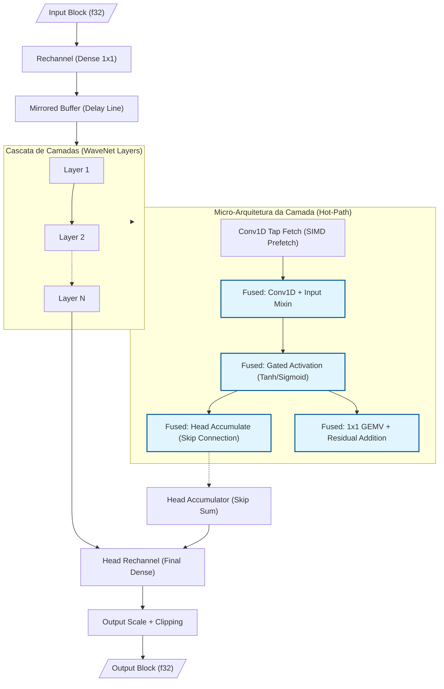
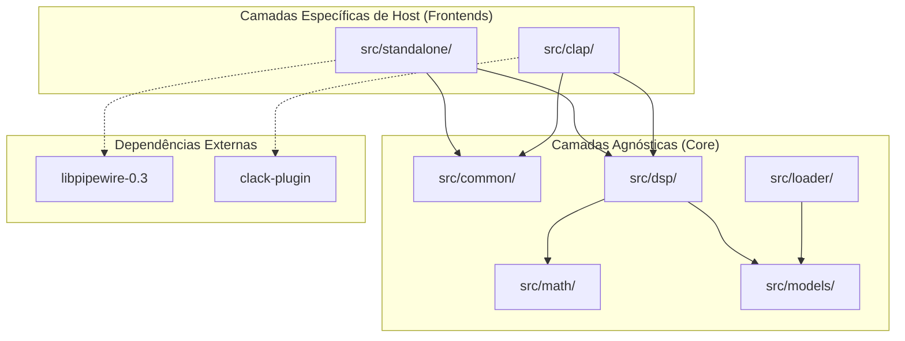
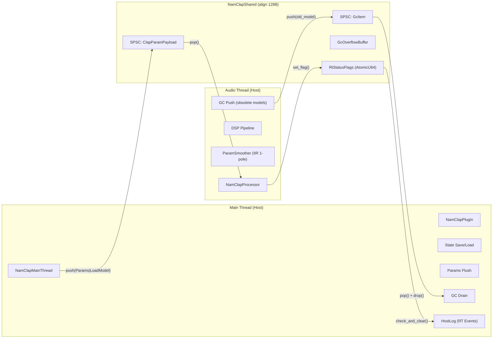

<!-- SPDX-License-Identifier: Apache-2.0 -->
<!-- Copyright (c) 2026 Fábio Henrique de Lima Silva (fhl.bsb@gmail.com) All rights reserved. -->

# Arquitetura NAM-rs: Cliente Standalone de Inferência Neural

A arquitetura do NAM-rs é projetada para processamento DSP de baixa latência e inferência neural focada em simulação de equipamentos de áudio (Neural Amp Modeler). Operando como cliente PipeWire standalone (Estável) ou como plugin CLAP (Staging) no Linux, utiliza Rust idiomático com foco em segurança RT (Real-Time).

## 1. Topologia PipeWire (Modo Standalone): Dual-Stream (Capture + Playback)

- **Virtual Sink (Audio/Sink):** O NAM-rs declara-se como saída de som padrão via `pw_stream`. Apps conectam-se automaticamente via WirePlumber.
- **Playback Stream (Stream/Output):** Uma segunda stream lê o áudio processado e o entrega ao hardware real, contornando limitações de monitor ports de sinks virtuais.
- **DspBridge (Lock-Free Double-Buffer):** Estrutura alinhada (128B) que isola as streams. O capture escreve no buffer inativo (Release); o playback lê do ativo (Acquire), sincronizado por `AtomicU64` (generation).
- **True Stereo e Bypass:** Inferência simétrica L/R no modo Standalone/Pipewire. Sendo o padrão NAM mono por definição, o funcionamento estéreo é uma conveniência implementada em standalone. Se R for silêncio ou idêntico a L, o sistema pula a inferência de R (poupando ~50% de CPU).

> **Nota:** A topologia Dual-Stream é mantida em preferência ao `pw_filter` por garantir roteamento "plug-and-play" automático pelo WirePlumber e pela maturidade dos wrappers safe no crate `pipewire`.

## 2. Inferência & Microarquitetura (SIMD x86-64-v3/v4)

- **Multiversioning via Macro `dispatch_simd!`:** Despacho dinâmico no carregamento do modelo que seleciona a melhor v-table de kernels SIMD (`Avx2Math`, `Avx512Math`, etc.). O uso de macros para monomorfização garante que o compilador emita intrinsics nativos sem overhead de v-table no hot-path de inferência.
- **FastMath Activations & Gain LUT:** `simd_tanh` e `simd_sigmoid` usam polinômios Minimax de grau 7 com refinamento Newton-Raphson. Erro máximo < 2e-5, otimizado para o intervalo [-8, 8]. Inclui uma **Gain LUT (Look-Up Table)** interpolada para conversão ultra-rápida dB → Linear no RT, evitando chamadas caras a `powf`.
- **Gated Activation Fusion (WaveNet A2):** Unificação de `tanh` e `sigmoid` em um único kernel SIMD nativo, reduzindo a pressão de registradores e evitando passagens múltiplas sobre o vetor de ativação.
- **Dot Product ILP:** Implementação com múltiplos acumuladores independentes (`sum0..sum3` em AVX2, `acc0..acc7` em AVX-512) para saturar o throughput de portas FMA, quebrando cadeias de dependência.
- **Weight Compression F16C:** Pesos são armazenados em `f16` (Half-Precision) para reduzir o tráfego de memória L1/L2. A descompressão ocorre on-the-fly via `_mm256_cvtph_ps` ou `_mm512_cvtph_ps`.
- **Gate-Major Layout & Fused 4-Gate GEMV (LSTM):** Transposição de pesos para layout `[Gate][Input][Hidden]`. A inferência funde o cálculo das 4 portas em uma única passagem sobre o vetor de estado.
- **Layer Overlap Pipelining (LSTM 2-Layer):** Paralelismo de grão fino onde a Camada 2 processa o frame `N-1` simultaneamente ao frame `N` da Camada 1, aumentando a vazão em modelos multicamada.
- **BF16 Nativo (AVX-512 BF16):** Suporte a kernels nativos via `_mm512_dpbf16_ps` (VNNI-BF16) para CPUs Sapphire Rapids e posteriores. Inclui o kernel **Fused 4-Gate GEMV BF16** para LSTM, eliminando o custo de despacho escalar e dobrando o throughput de dot-products em relação ao AVX2.
- **Fused Conv1d+Mixin (WaveNet):** A soma do vetor de mixagem é fundida diretamente no acumulador da Conv1D.
- **Fused Tanh + Head Accumulate (WaveNet):** Unificação nativa das fases de ativação e skip-connection (head) em um único kernel SIMD (`tanh_and_accumulate_block`).
- **Fused Residual GEMV com Frame Tiling (WaveNet):** O cálculo do resíduo é fundido no GEMV da camada seguinte, utilizando **4-frame tiling (AVX2)** ou **8-frame tiling (AVX-512)** para maximizar o reuso de pesos nos registradores.
- **Conv1D Tiling:** Processamento de múltiplos canais em blocos para maximizar o reúso de dados nos registradores SIMD e reduzir latência de cache em modelos com dilatação profunda.

### Decisão Técnica: Precisão FastMath vs Performance

> **Decisão:** As funções de ativação `tanh` e `sigmoid` usam aproximações polinomiais SIMD
> (Minimax + Newton-Raphson duplo) em vez de chamadas à libm IEEE-754 compliant.
>
> **Trade-off:** ~4–5 casas decimais de precisão por ~10-20× de throughput
> (4-8 ciclos/ativação vs 20-60 ciclos/ativação no libm escalar).
> Erro máximo: **tanh < 2e-5**, **sigmoid < 5e-6** (sweep 32.768 pontos em [-8, 8]).
> A divergência vs C++ é perceptualmente inaudível (abaixo do piso de quantização 16-bit PCM).
>
> **Validação:** Sweep determinístico, proptest (10k inputs), golden vectors cross-NeuralAmpModelerCore (7 modelos).
>
> **Referências:** `src/math/fastmath.rs` (docstring de `simd_tanh_avx2`),
> `tests/nam_infer_test.rs` (docstring de `test_golden_vectors_wavenet`)

### Decisão Técnica: Portabilidade e Alocação Virtual de `MirroredBuffer`

> **Decisão:** A estrutura `MirroredBuffer` realiza o espelhamento de memória virtual mapeando o mesmo bloco físico duas vezes consecutivas para evitar wrap-around lógico no hot-path DSP. O suporte principal é direcionado estritamente para o Linux, utilizando `memfd_create`. Para plataformas não-Linux, é fornecido um fallback (stub) que retorna um erro de incompatibilidade (`Unsupported`).
>
> **Trade-off:** O uso de `memfd_create` no Linux oferece uma maneira ideal de alocação de buffers espelhados sem criar arquivos no disco físico e sem requerer limpezas complexas no filesystem. Como o ecossistema de produção do NAM-rs é focado exclusivamente no Linux (Standalone PipeWire e plugin CLAP), a implementação de stubs para outras plataformas é suficiente para a portabilidade estática da compilação do crate, evitando complexidades de concorrência ou I/O adicionais no cold-path de carregamento.

### Formato Binário NAMB (Native Audio Model Binary)

O formato `.namb` é uma evolução otimizada do JSON original para uso em tempo-real.

- **NAMB v1:** Encapsula o JSON de metadados e os pesos em `f32` (Little-Endian) em um único bloco binário com CRC32.
- **NAMB v2 (Pre-Transposed):** Armazena os pesos diretamente no layout final do kernel (Gate-Major para LSTM ou Interleaved-4 para WaveNet).
  - Elimina a necessidade de transposição de memória durante o carregamento.
  - Reduz latência de swap de modelo de ~50ms para <1ms (cold-path de carregamento).
  - Identificado por flag no header `NambHeader::layout_type`.

### Fluxo de Dados WaveNet (Pipeline de Inferência)

O diagrama abaixo ilustra o fluxo de dados em um bloco de inferência WaveNet, destacando as operações fundidas (fused) que minimizam o tráfego de memória e maximizam o throughput SIMD:



## 3. Gestão e Isolação Temporais (Strict RT)

- **Thread DSP (SCHED_FIFO):** Afixada via Core Affinity (`select_optimal_cpu`) preferindo cores com menor carga de IRQs.
- **Zero-Allocation:** Proibição estrita de alocações heap, `Vec`, `Box` ou panics na thread DSP.
- **Isolamento de Jitter:**
  - `mlockall` para evitar page faults.
  - PM QoS Lock (`/dev/cpu_dma_latency`) para desabilitar C-States profundos **em todos os cores do sistema (global)**, garantindo latência de despertar zero.
  - Desabilitação de THP (Transparent Huge Pages) via `prctl` para evitar spikes de compactação do kernel.
- **Telemetria de Alta Precisão (RDTSC):** Substituição de `Instant::now()` (syscall vDSO) por leitura direta do TSC calibrado no callback RT. Garante precisão de ~1ns com overhead de ~1 ciclo de CPU, eliminando jitter induzido pelo kernel na medição de carga de DSP.
- **Canais SPSC (rtrb):** Comunicação lock-free entre CLI (async) e DSP (RT). Payload alinhado (128B) para evitar False Sharing.

## 4. Estrutura de Módulos (Organização Tripartida)

A partir da v1.4, o NAM-rs adota uma estrutura modular clara para suportar múltiplos hosts (Standalone/PipeWire e Plugin/CLAP) sem poluição de dependências:

| Camada                             | Sub-módulos                                            | Responsabilidade                                                                                                       |
|:---------------------------------- |:------------------------------------------------------ |:---------------------------------------------------------------------------------------------------------------------- |
| **Common** (`src/common/`)         | `diagnostics`, `spsc`, `params`, `audio_host`          | Infraestrutura compartilhada, comunicação inter-threads (SPSC) e abstrações agnósticas ao host.                        |
| **Standalone** (`src/standalone/`) | `pw_host`, `rt_setup`, `cli`, `colors`                 | Backend nativo Linux. Gerencia o servidor PipeWire, setup de hardware (FIFO/Affinity) e interface de linha de comando. |
| **CLAP** (`src/clap/`)             | `plugin`, `processor`, `param_smoother`, `extensions/` | Plugin CLAP completo com pipeline DSP, parâmetros, persistência e smoothing anti-zipper.                               |
| **Math** (`src/math/`)             | `common/`, `activations/`, `gemm/`, `dsp/`...          | Infraestrutura matemática modularizada por domínio, isolando kernels SIMD de baixo nível da lógica de despacho.        |
| **Core DSP** (`src/`)              | `dsp/`, `models/`, `loader/`                           | O "cérebro" do NAM-rs. Algoritmos de inferência neural e parsing de modelos.                                           |

### Diagrama de Camadas (Architecture Layers)



Essa separação garante que o build para CLAP não arraste dependências do PipeWire e facilita a portabilidade para outros sistemas operacionais no futuro.

## 4.1 Estratégia de Compilação Condicional (Feature Flags)

O NAM-rs utiliza *feature flags* para isolar backends e reduzir o footprint do binário final:

| Perfil de Build         | Comando de Compilação                                            | Artefato Gerado           | Dependências Principais                                |
|:----------------------- |:---------------------------------------------------------------- |:------------------------- |:------------------------------------------------------ |
| **Standalone** (padrão) | `cargo build --features standalone`                              | Binário Executável        | `pipewire`, `rtrb`, `clap` (CLI)                       |
| **CLAP Plugin**         | `cargo build --no-default-features --features clap-plugin --lib` | Biblioteca `.so` (cdylib) | `clack-plugin`, `clack-extensions`, `egui`, `baseview` |
| **DSP Lib (Pure)**      | `cargo build --no-default-features --lib`                        | Biblioteca Rust (`.rlib`) | Apenas Core DSP (no-std ready)                         |

## 5. DSP & Resampling Nativo

O NAM-rs utiliza um **Resampler Sinc Polifásico de Fase Mínima** nativo, substituindo dependências externas.

- **Vantagens:** Elimina pré-ringing (energia concentrada no início), reduz latência algorítmica de ~1.5ms para ~0.1ms e oferece performance ~9x superior via convolução AVX2/AVX-512 dedicada.
- **Gate FSM:** Implementa histerese temporal e de amplitude (Schmitt Trigger) para evitar oscilações em níveis de ruído. Inclui rampa linear SIMD para transições suaves (fade-in/out), fundida em uma passagem stereo única para otimizar a localidade de cache.

### Fluxo DSP Bidirecional

```text
PipeWire Input (Nk Hz)
    ▼ Gate FSM: Detecção de Silêncio/Mono + Rampa de Ganho
    │
    ▼ Input Gain (SIMD)
    │
    ▼ NamResampler::process_input (Nk → 48 kHz)
    │
    ▼ NamModel::process (Inferência Neural @ 48 kHz)
    │
    ▼ NamResampler::process_output (48 kHz → Nk)
    │
    ▼ Output Gain (SIMD) + Clipping
    │
    ▼ DspBridge (Lock-Free Write) → Playback Stream (Read) → Hardware
```

## 6. Estratégia de Testes & Qualidade

A filosofia de testes do NAM-rs prioriza **qualidade sobre quantidade**: mantemos apenas as camadas que fornecem sinal de alta confiança, sem redundâncias circulares.

### Organização dos Testes

O projeto segue uma hierarquia rigorosa para garantir que a lógica interna e a API pública sejam validadas de forma eficiente:

1. **Testes Unitários:** Focados na lógica interna de cada módulo. Arquivos pequenos (< 300 linhas) mantêm testes `inline` via `mod tests`. Arquivos maiores (ex: `resampler.rs`, `lstm/mod.rs`) utilizam o sufixo `_test.rs` no mesmo diretório para manter a legibilidade.
2. **Testes de Integração:** Localizados em `tests/`, exercitam o pipeline completo, o carregamento de modelos e a estabilidade em tempo real.
3. **Benchmarks:** Localizados em `benches/`, utilizam `criterion` para monitorar regressões de performance em kernels críticos.

### Camadas Ativas

| Camada                        | Local                                            | Força como Ground Truth         | O que captura                                                                                                   |
|:----------------------------- |:------------------------------------------------ |:------------------------------- |:--------------------------------------------------------------------------------------------------------------- |
| **Golden Vectors**            | `tests/nam_infer_test.rs`, `tests/cpp_parity.rs` | ✅✅ Ancoragem externa ao C++   | Erros na composição de kernels, regressões end-to-end e paridade vs referência canônica (NeuralAmpModelerCore). |
| **PropTests (aleatórios)**    | `tests/proptest_math.rs`                         | ✅ `f64` e `f32::tanh()` nativa | Erros numéricos SIMD (RMSE) e paridade SIMD vs Escalar em espaço amplo de entradas.                             |
| **Testes Unitários de Bit**   | `src/math/common/tests.rs`                       | ✅ Operação de bits direta      | Corretude de conversão f32↔bf16/f16, FMA e setup de hardware (DAZ/FTZ).                                         |
| **Compatibilidade A1/A2**     | `tests/loader_a2_compat.rs`                      | ✅ Especificação de Formato     | Garante que novos loaders aceitam modelos antigos (Regressão) e fazem fallback correto para A2.                 |
| **Validação NAMB v2**         | `tests/namb_v2_validation.rs`                    | ✅ Especificação de Layout      | Valida a corretude do layout pré-transposto (Gate-Major/Interleaved) vs carregamento clássico.                  |
| **Integração PipeWire**       | `tests/pw_integration_test.rs`                   | —                               | Inicialização do host PipeWire, processamento de buffers e teardown seguro.                                     |
| **Zero-Allocation Guard**     | `tests/nam_infer_test.rs`                        | —                               | Garante que o hot-path não aloca heap via `CountingAllocator` (RT-Safety).                                      |
| **Fuzz Testing (`proptest`)** | `tests/proptest_parsers.rs`                      | —                               | ~45.000 inputs adversários contra parsers JSON/.namb para evitar vulnerabilidades e panics.                     |
| **Soak Test (Endurance)**     | `tests/soak_test.rs`                             | —                               | Estabilidade numérica de longa duração (10M+ frames). `#[ignore]` no CI; via `bash utils/tests-long.sh`         |

### Decisão de Arquitetura: Remoção dos Parity Tests com Inputs Fixos e Goldens Autorreferenciais

> Testes que comparavam kernels SIMD contra `ScalarRefMath` com entradas fixas foram removidos — eram circulares (validação contra si mesmos) e redundantes com os PropTests (10k inputs aleatórios com referências independentes `f64`/`f32::tanh()`). A struct `ScalarRefMath` foi eliminada; as funções `_fallback` em `src/math/common/scalar_ref.rs` permanecem como delegates escalares.
>
> Os goldens autorreferenciais (NeuralAudio, `tests/regression_goldens.rs`, `tests/golden/`) foram substituídos por ancoragem externa ao [NeuralAmpModelerCore](https://github.com/sdatkinson/NeuralAmpModelerCore) (Steven Atkinson) — fonte canônica dos modelos `.nam`. Sete modelos de referência cobrem WaveNet (Standard/Feather/Nano/Micro) e LSTM (1×16/2×8/1×3), com 5 métricas de precisão (MSE, MAE, SNR, PSNR, bits equiv.) calculadas em single-pass fusion. Ver `tests/fixtures/golden_gen_build.sh` e `docs/dependencies.md §6`.

### Benchmarks e Performance

- **Criterion Benches:** `benches/inference_bench.rs` mede a latência de inferência por modelo e arquitetura SIMD.
- **Long Run Benchmarks:** Grupo `Long_Run_*` em `benches/inference_bench.rs` ativado via feature `long_bench`, com blocos de 4096 amostras e `measurement_time(30s)` para medir throughput real em operação contínua. Ativado via `bash utils/tests-long.sh`.

## 7. Preparação para Arquitetura A2

O NAM-rs v1.4 introduz o scaffolding necessário para a próxima geração de modelos (A2), mantendo paridade absoluta com os modelos A1 existentes, mas sem implementação real. Apenas deixamos as coisas prontas para quando "chegar a hora".

- **Forward-Compatible Loader:** O dispatcher (`src/loader/dispatcher/wavenet.rs`) identifica modelos A2 via metadados de versão ou ativações não-Tanh, redirecionando-os para um `WavenetA2Placeholder`.
- **Placeholder com Contrato de Detecção:** O `WavenetA2Placeholder` armazena o número de canais detectado (3 = nano, 8 = standard) e reporta essa informação via log de warning. A detecção usa duas vias independentes: `is_wavenet_a2()` (SemVer baseado em versão ≥ 0.6.0 ou ativações não-Tanh) e `is_a2_shape()` (verificação da assinatura arquitetural: 1 layer array, canais ∈ {3,8}, dilations idênticos a `a2_fast.h`). O placeholder não suporta inferência real — emite silêncio — mas mantém o contrato de detecção para evitar conflitos quando a implementação real de A2 for integrada.
- **Extensibilidade de Ativações:** Suporte a 11 variantes de funções de ativação (HardTanh, SiLU, LeakyReLU, etc.) via trait `ActivationFn`, prontas para futura implementação SIMD.
- **Parametrização Flexível:** Inclusão de estruturas para FiLM, Gating dinâmico e Blending de ativações, permitindo que o parser aceite novos formatos de arquivo sem panics.

Estamos acompanhando a evolução do trabalho de [Steven Atkinson](https://github.com/sdatkinson) e faremos um porte completo a partir do [NeuralAmpModelerCore](https://github.com/sdatkinson/NeuralAmpModelerCore) quando estiver pronto.

## 8. Integração com DAWs (CLAP Integration)

A arquitetura do NAM-rs suporta o desacoplamento necessário para execução como plugin CLAP (Clever Audio Plug-in), permitindo o uso em DAWs (Digital Audio Workstations).

- **Trait `AudioHost`:** Define a interface agnóstica de comunicação entre o motor DSP e o host. Localizado em `src/common/audio_host.rs`.
- **Feature Flags:** O build é controlado por flags (`standalone` vs `clap-plugin`), garantindo que dependências de sistema (como `pipewire`) sejam removidas no binário do plugin para máxima portabilidade.
- **Parâmetros Agnósticos:** `NamPluginParams` (em `src/common/params.rs`) centraliza o estado do plugin (`input_gain_db`, `output_gain_db`, `gate_threshold_db`, `model_path`), facilitando o mapeamento para automação de DAW e persistência de estado (save/load).

## 8.2 Decisões de Arquitetura

As decisões detalhadas sobre framework (`clack-plugin`), GUI (`egui` + `baseview`), e DAWs alvo estão documentadas em [docs/clap_integration.md](file:///home/fabio/nam-rs/docs/clap_integration.md).

## 8.1 Arquitetura CLAP: Threads e Ciclo de Vida

O modo CLAP é arquiteturalmente distinto do Standalone: o host controla o ciclo de vida e fornece buffers diretamente no `process()`, eliminando a necessidade do `DspBridge`.

### Modelo de Threads



### Decisão: Sem `DspBridge` no CLAP

O `DspBridge` (double-buffer lock-free) existe no modo Standalone para sincronizar duas streams PipeWire independentes (capture e playback). No modo CLAP, o host chama um único `process()` — input e output já são buffers do mesmo ciclo. Portanto, o CLAP **não usa `DspBridge`**. O `DspPipelineContext` é construído on-stack no `process()` com buffers pré-alocados e executado diretamente.

### Estratégia de GC (Garbage Collection)

A troca de modelos na audio thread é RT-safe:

1. A main thread carrega o modelo (cold-path com alocações) e envia via SPSC `param_tx`.
2. A audio thread substitui o modelo ativo e envia o antigo via `gc_tx` para drop fora do RT.
3. O `on_main_thread()` drena `gc_rx` e executa `drop()` dos modelos obsoletos.
4. Se o canal GC estiver cheio, usa `GcOverflowBuffer` (overwrite ring buffer com `AtomicPtr`).

### Extensões CLAP e Interface Gráfica

O plugin implementa 8 extensões CLAP: `audio_ports`, `params`, `state`, `latency`, `track_info`, `remote_controls`, `param_indication` e `gui`. O plugin opera estritamente em mono para acomodar os fluxos de trabalho padrão de DAW (mono-in/mono-out), enquanto a GUI utiliza `egui` + `baseview` sobre backend X11 puro (600×260px), com isolamento completo entre UI thread e audio thread via campos atômicos e SPSC.

Para detalhes de cada extensão, stack gráfico e estratégia de windowing, veja [docs/clap_integration.md](file:///home/fabio/nam-rs/docs/clap_integration.md).

### Matemática & SIMD — Reorganização Modular

- **Decisão:** Fragmentação da infraestrutura matemática monolítica em módulos por domínio (`activations/`, `gemm/`, `dsp/`, `lstm/`, `wavenet/`).
- **Justificativa:** Reduz o "noise" cognitivo em arquivos de 2000+ linhas, permite testes unitários isolados por kernel e facilita a auditoria de inlining pelo compilador.
- **Eliminação de Redundância (VNNI):** A struct `Avx2VnniMath` foi eliminada e substituída por um *type alias* para `Avx2Math` em `common/avx2_impl.rs`. A instrução `VPDPBUSD` (VNNI-Int8) não oferece ganhos para os kernels de ponto flutuante do NAM-rs.
- **Design Debt (Dual Dispatch):** O sistema utiliza uma estrutura de "Dual Dispatch" onde o `loader` despacha para o `model`, que por sua vez utiliza a trait `SimdMath`. Identificamos que a abstração de despacho em `math/common/dispatch.rs` é um ponto de dívida técnica que será unificado no Épico 8 (V-Table Unification).

## 9. Referências

Os seguintes repositórios e especificações são as principais referências para o NAM-rs:

- [NeuralAmpModelerCore](https://github.com/sdatkinson/NeuralAmpModelerCore) - Implementação de referência do NAM.
- [CLAP (CLever Audio Plug-in)](https://cleveraudio.org/) - Especificação do formato de plugin CLAP.
- [Clack Framework](https://github.com/prokopyl/clack) - Infraestrutura para implementação do plugin em Rust.
- [NeuralAudio](https://github.com/mikeoliphant/NeuralAudio) - Referência histórica; os golden vectors originais foram migrados para ancoragem no NeuralAmpModelerCore (ver ADR §6).
