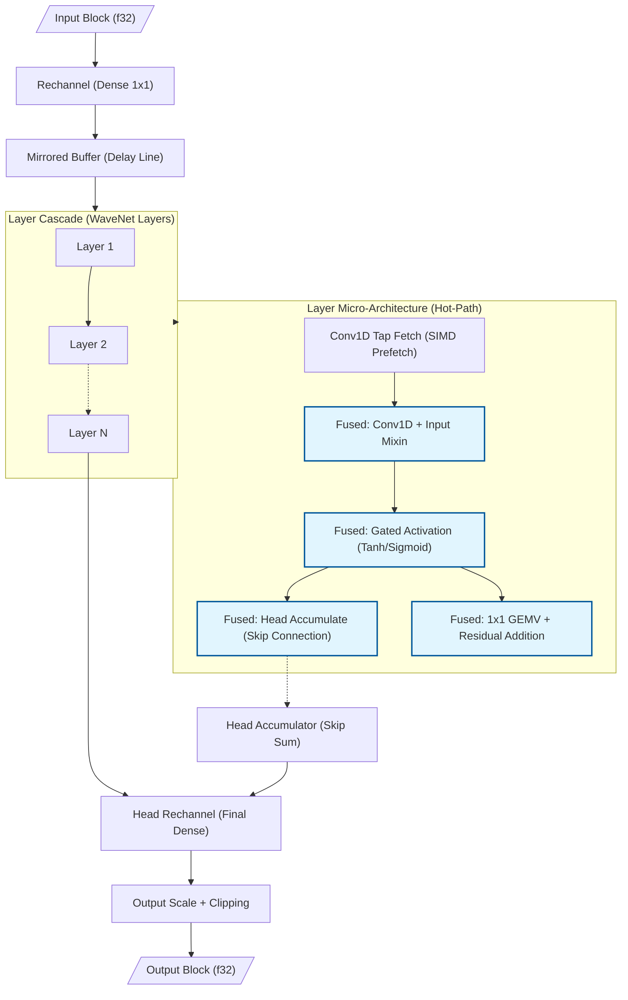
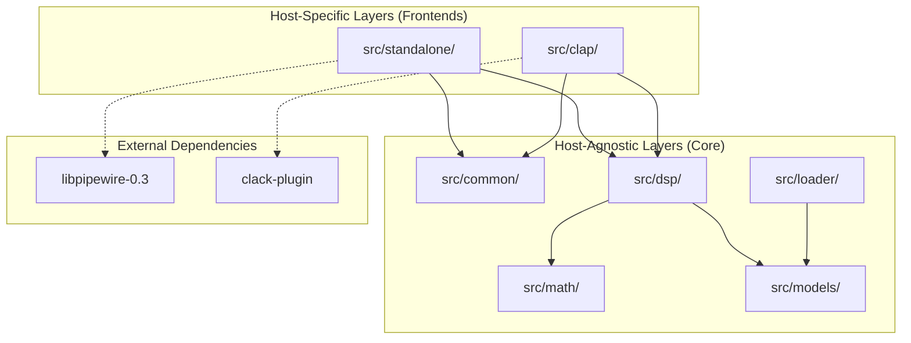
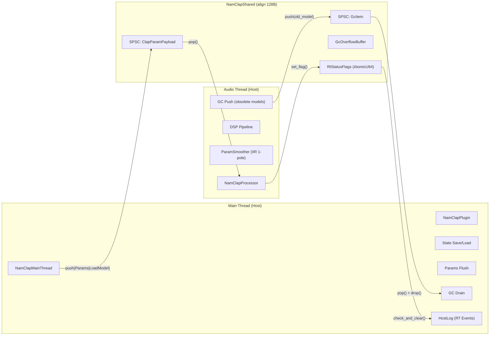

<!-- SPDX-License-Identifier: Apache-2.0 -->
<!-- Copyright (c) 2026 Fábio Henrique de Lima Silva (fhl.bsb@gmail.com) All rights reserved. -->

# NAM-rs Architecture: Standalone Neural Inference Client

The architecture of NAM-rs is designed for low-latency DSP processing and neural inference focused on audio equipment simulation (Neural Amp Modeler). Operating as a standalone PipeWire client (Stable) or as a CLAP plugin (Staging) on Linux, it utilizes idiomatic Rust with a focus on RT (Real-Time) safety.

## 1. PipeWire Topology (Standalone Mode): Dual-Stream (Capture + Playback)

- **Virtual Sink (Audio/Sink):** NAM-rs declares itself as the default sound output via `pw_stream`. Apps connect automatically via WirePlumber.
- **Playback Stream (Stream/Output):** A second stream reads the processed audio and delivers it to the physical hardware, bypassing the limitations of monitor ports on virtual sinks.
- **DspBridge (Lock-Free Double-Buffer):** An aligned structure (128B) that isolates the streams. Capture writes to the inactive buffer (Release); playback reads from the active one (Acquire), synchronized by `AtomicU64` (generation).
- **True Stereo and Bypass:** Symmetric L/R inference in Standalone/Pipewire mode. Since the NAM standard is mono by definition, stereo operation is a convenience feature implemented in standalone. If R is silent or identical to L, the system skips R inference (saving ~50% CPU).

> **Note:** The Dual-Stream topology is preferred over `pw_filter` because it guarantees automatic "plug-and-play" routing by WirePlumber and due to the maturity of the safe wrappers in the `pipewire` crate.

## 2. Inference & Microarchitecture (SIMD x86-64-v3/v4)

- **Multiversioning via `dispatch_simd!` Macro:** Dynamic dispatch at model load time that selects the best SIMD kernel v-table (`Avx2Math`, `Avx512Math`, etc.). The use of macros for monomorphization ensures that the compiler emits native intrinsics without v-table overhead in the inference hot-path.
- **FastMath Activations & Gain LUT:** `simd_tanh` uses a **Padé [5,4]** rational approximant with hardware `_mm256_div_ps`; `simd_sigmoid` uses a direct **Minimax degree-17** polynomial. Maximum error: tanh ~2.32e-3 on [-4, 4], sigmoid ~4.09e-4 on [-8, 8] (see `docs/fastmath-approximations.md`). Includes an interpolated **Gain LUT (Look-Up Table)** for ultra-fast dB → Linear conversion in RT, avoiding expensive calls to `powf`.
- **Gated Activation Fusion (WaveNet A2):** Unification of `tanh` and `sigmoid` into a single native SIMD kernel, reducing register pressure and avoiding multiple passes over the activation vector.
- **Dot Product ILP:** Implementation with multiple independent accumulators (`sum0..sum3` in AVX2, `acc0..acc7` in AVX-512) to saturate FMA port throughput, breaking dependency chains.
- **Weight Compression (F16C/BF16):** Weights are stored in `f16` (Half-Precision) or `bf16` (Bfloat16) to reduce L1/L2 memory traffic. Precision selection and the corresponding on-the-fly conversion/decompression (via `_mm256_cvtph_ps`/`_mm512_cvtph_ps` for F16, or corresponding bit-unpacking for BF16) occur at runtime via dynamic dispatch managed by `SimdMathConfig` (initialized by the dispatcher based on the CPU's supported instruction set, such as AVX2, AVX-512 F16/BF16).
- **Gate-Major Layout & Fused 4-Gate GEMV (LSTM):** Transposition of weights to a `[Gate][Input][Hidden]` layout. The inference fuses the calculation of the 4 gates in a single pass over the state vector.
- **Layer Overlap Pipelining (LSTM 2-Layer):** Fine-grained parallelism where Layer 2 processes frame `N-1` simultaneously with frame `N` of Layer 1, increasing throughput in multi-layer models.
- **Native BF16 (AVX-512 BF16):** Native kernel support via `_mm512_dpbf16_ps` (VNNI-BF16) for Sapphire Rapids and newer CPUs. Includes the **Fused 4-Gate GEMV BF16** kernel for LSTM, eliminating scalar dispatch cost and doubling dot-product throughput relative to AVX2.
- **Fused Conv1d+Mixin (WaveNet):** The sum of the mixin vector is fused directly into the Conv1D accumulator.
- **Fused Tanh + Head Accumulate (WaveNet):** Native unification of the activation and skip-connection (head) phases into a single SIMD kernel (`tanh_and_accumulate_block`).
- **Fused Residual GEMV with Frame Tiling (WaveNet):** The residual calculation is fused into the GEMV of the next layer, utilizing **4-frame tiling (AVX2)** or **8-frame tiling (AVX-512)** to maximize weight reuse in registers.
- **Conv1D Tiling:** Block processing of multiple channels to maximize data reuse in SIMD registers and reduce cache latency in deep dilation models.

### Technical Decision: FastMath Precision vs. Performance

> **Decision:** `tanh` uses a Padé [5,4] rational approximant (`_mm256_div_ps`); `sigmoid` uses a direct Minimax degree-17 polynomial — both replacing IEEE-754 `libm` in the hot-path.
>
> **Trade-off:** ~2–3 decimal places of precision for ~10–20× throughput vs. scalar `libm`.
> Maximum error: **tanh ~2.32e-3** on [-4, 4], **sigmoid ~4.09e-4** on [-8, 8].
> The divergence vs. C++ is perceptually inaudible (below the 16-bit PCM quantization floor).
>
> **Validation:** Deterministic sweep, proptest (10k inputs), golden vectors cross-validation against NeuralAmpModelerCore (7 models).
>
> **References:** `src/math/activations/tanh.rs`, `src/math/activations/sigmoid.rs`, `docs/fastmath-approximations.md`, `tests/nam_infer_test.rs`.

### Technical Decision: Portability and Virtual Allocation of `MirroredBuffer`

> **Decision:** The `MirroredBuffer` structure performs virtual memory mirroring by mapping the same physical block twice consecutively to avoid logical wrap-around in the DSP hot-path. Primary support is strictly targeted at Linux using `memfd_create`. For non-Linux platforms, a fallback (stub) is provided that returns an incompatibility error (`Unsupported`).
>
> **Trade-off:** Using `memfd_create` on Linux offers an ideal way to allocate mirrored buffers without creating files on physical disk and without requiring complex cleanup on the filesystem. Since the production ecosystem of NAM-rs is exclusively focused on Linux (Standalone PipeWire and CLAP plugin), the implementation of stubs for other platforms is sufficient for static compilation portability of the crate, avoiding additional concurrency or I/O complexity in the cold loading path.

### NAMB Binary Format (Native Audio Model Binary)

The `.namb` format is an optimized evolution of the original JSON for real-time use.

- **NAMB v1:** Encapsulates the metadata JSON and the weights in `f32` (Little-Endian) in a single binary block with CRC32.
- **NAMB v2 (Pre-Transposed):** Stores weights directly in the final kernel layout (Gate-Major for LSTM or Interleaved-4 for WaveNet).
  - Eliminates the need for memory transposition during loading.
  - Reduces model swap latency from ~50ms to <1ms (cold loading path).
  - Identified by the header flag `NambHeader::layout_type`.

### WaveNet Data Flow (Inference Pipeline)

The diagram below illustrates the data flow in a WaveNet inference block, highlighting the fused operations that minimize memory traffic and maximize SIMD throughput:



### 6.1 Mixed-Precision Selective

To optimize the trade-off between computational latency and tonal accuracy, NAM-rs uses selective mixed precision (E8.T08). While the WaveNet backbone (including Conv1D convolutions, input_mixin, and one_by_one) is computed with weights compressed in F16 or BF16 to save cache bandwidth, the final output projection layer (`head_rechannel`) and the final projection in LSTMs use full floating-point precision (`f32`). Head inference executes a native f32 scalar GEMV (`process_block_f32_native`), ensuring 24-bit fidelity in the analytically most sensitive stage of the output.

### 6.2 Numerical Stability (Kahan + Dither)

To prevent the accumulation of numerical drift and mathematical instabilities in long-duration runs:

- **Kahan Summation (E8.T06):** Employed in the outer accumulation loop of `conv1d.rs` convolutions and in the interleaved 4x scalar fallbacks. By maintaining an error compensation register for each channel, it reduces the relative accumulation error from $O(N \cdot \epsilon)$ to $O(\epsilon)$ in deep causal convolutions.
- **Deterministic Dither (E8.T05):** Injection of an inaudible deterministic DC offset of $-220\text{ dBFS}$ ($1.0 \times 10^{-11}$) at the input stage (`apply_input_stage` after gain) with corresponding compensatory subtraction at the output (`apply_output_stage`). Keeps neural activations (tanh/sigmoid) out of subnormal (denormal) ranges during fade-outs or absolute silence, preventing pops and CPU spikes.

## 3. Time Management and Isolation (Strict RT)

- **DSP Thread (SCHED_FIFO):** Pinned via Core Affinity (`select_optimal_cpu`) preferring cores with lower IRQ load.
- **Zero-Allocation:** Strict prohibition of heap allocations, `Vec`, `Box`, or panics in the DSP thread.
- **Jitter Isolation:**
  - `mlockall` to prevent page faults.
  - PM QoS Lock (`/dev/cpu_dma_latency`) to disable deep C-States **globally across all system cores**, ensuring zero wakeup latency.
  - Disabling THP (Transparent Huge Pages) via `prctl` to prevent kernel compaction spikes.
- **High-Precision Telemetry (RDTSC):** Replacement of `Instant::now()` (vDSO syscall) with direct reading of the calibrated TSC in the RT callback. Guarantees ~1ns precision with ~1 CPU cycle overhead, eliminating kernel-induced jitter in DSP load measurement.
- **SPSC Channels (rtrb):** Lock-free communication between CLI (async) and DSP (RT). Payload aligned (128B) to prevent False Sharing.

## 4. Module Structure (Tripartite Organization)

From v1.4 onwards, NAM-rs adopts a clear modular structure to support multiple hosts (Standalone/PipeWire and Plugin/CLAP) without dependency pollution:

| Layer                              | Sub-modules                                                    | Responsibility                                                                                                          |
|:---------------------------------- |:-------------------------------------------------------------- |:----------------------------------------------------------------------------------------------------------------------- |
| **Common** (`src/common/`)         | `diagnostics`, `spsc`, `params`, `audio_host`                  | Shared infrastructure, inter-thread communication (SPSC), and host-agnostic abstractions.                               |
| **Standalone** (`src/standalone/`) | `pw_host`, `rt_setup`, `cli`, `colors`                         | Native Linux backend. Manages the PipeWire server, hardware setup (FIFO/Affinity), and the command-line interface.      |
| **CLAP** (`src/clap/`)             | `plugin`, `processor`, `param_smoother`, `extensions/`, `gui/` | Full CLAP plugin with DSP pipeline, parameters, persistence, egui/baseview visual interface, and anti-zipper smoothing. |
| **Math** (`src/math/`)             | `common/`, `activations/`, `gemm/`, `dsp/`...                  | Mathematical infrastructure modularized by domain, isolating low-level SIMD kernels from dispatch logic.                |
| **Core DSP** (`src/`)              | `dsp/`, `models/`, `loader/`                                   | The "brain" of NAM-rs. Neural inference algorithms and model parsing.                                                   |

### Architecture Layers Diagram



This separation ensures that building for CLAP does not drag in PipeWire dependencies and facilitates future portability to other operating systems.

## 4.1 Conditional Compilation Strategy (Feature Flags)

NAM-rs uses *feature flags* to isolate backends and reduce the final binary footprint:

| Build Profile            | Compilation Command                                              | Generated Asset        | Main Dependencies                                      |
|:------------------------ |:---------------------------------------------------------------- |:---------------------- |:------------------------------------------------------ |
| **Standalone** (default) | `cargo build --features standalone`                              | Executable Binary      | `pipewire`, `rtrb`, `clap` (CLI)                       |
| **CLAP Plugin**          | `cargo build --no-default-features --features clap-plugin --lib` | `.so` Library (cdylib) | `clack-plugin`, `clack-extensions`, `egui`, `baseview` |
| **DSP Lib (Pure)**       | `cargo build --no-default-features --lib`                        | Rust Library (`.rlib`) | Core DSP only (no-std ready)                           |

## 5. DSP & Native Resampling

NAM-rs uses a native **Minimum-Phase Polyphase Sinc Resampler**, replacing external dependencies.

- **Advantages:** Eliminates pre-ringing (energy concentrated at the start), reduces algorithmic latency from ~1.5ms to ~0.1ms, and offers ~9x superior performance via dedicated AVX2/AVX-512 convolution.
- **Gate FSM:** Implements temporal and amplitude hysteresis (Schmitt Trigger) to prevent chattering at noise floor levels. Includes linear SIMD ramping for smooth transitions (fade-in/out), fused into a single stereo pass to optimize cache locality.

### Bidirectional DSP Flow

```text
PipeWire Input (Nk Hz)
    ▼ Gate FSM: Silence/Mono Detection + Gain Ramp
    │
    ▼ Input Gain (SIMD)
    │
    ▼ NamResampler::process_input (Nk → 48 kHz)
    │
    ▼ NamModel::process (Neural Inference @ 48 kHz)
    │
    ▼ NamResampler::process_output (48 kHz → Nk)
    │
    ▼ Output Gain (SIMD) + Clipping
    │
    ▼ DspBridge (Lock-Free Write) → Playback Stream (Read) → Hardware
```

## 6. Testing Strategy & Quality

The testing philosophy of NAM-rs prioritizes **quality over quantity**: we maintain only the layers that provide high-confidence signals, without circular redundancies.

### Test Organization

The project follows a strict hierarchy to ensure internal logic and the public API are validated efficiently:

1. **Unit Tests:** Focused on the internal logic of each module. Small files (< 300 lines) keep tests `inline` via `mod tests`. Larger files (e.g., `resampler.rs`, `lstm/mod.rs`) use the suffix `_test.rs` in the same directory to maintain readability.
2. **Integration Tests:** Located in `tests/`, they exercise the complete pipeline, model loading, and real-time stability.
3. **Benchmarks:** Located in `benches/`, they use `criterion` to monitor performance regressions in critical kernels.

### Active Layers

| Layer                         | Location                                         | Strength as Ground Truth          | What it captures                                                                                                 |
|:----------------------------- |:------------------------------------------------ |:--------------------------------- |:---------------------------------------------------------------------------------------------------------------- |
| **Golden Vectors**            | `tests/nam_infer_test.rs`, `tests/cpp_parity.rs` | ✅✅ External anchoring to C++    | Errors in kernel composition, end-to-end regressions, and parity vs. canonical reference (NeuralAmpModelerCore). |
| **PropTests (random)**        | `tests/proptest_math.rs`                         | ✅ native `f64` and `f32::tanh()` | SIMD numerical errors (RMSE) and SIMD vs. Scalar parity over a wide input space.                                 |
| **Bit Unit Tests**            | `src/math/common/tests.rs`                       | ✅ Direct bit operation           | Correctness of f32↔bf16/f16 conversion, FMA, and hardware setup (DAZ/FTZ).                                       |
| **A1/A2 Compatibility**       | `tests/loader_a2_compat.rs`                      | ✅ Format Specification           | Ensures new loaders accept old models (Regression) and perform correct fallback to A2.                           |
| **NAMB v2 Validation**        | `tests/namb_v2_validation.rs`                    | ✅ Layout Specification           | Validates correctness of the pre-transposed layout (Gate-Major/Interleaved) vs. classic loading.                 |
| **PipeWire Integration**      | `tests/pw_integration_test.rs`                   | —                                 | PipeWire host initialization, buffer processing, and safe teardown.                                              |
| **Zero-Allocation Guard**     | `tests/nam_infer_test.rs`                        | —                                 | Ensures the hot-path does not allocate heap via `CountingAllocator` (RT-Safety).                                 |
| **Fuzz Testing (`proptest`)** | `tests/proptest_parsers.rs`                      | —                                 | ~45,000 adversarial inputs against JSON/.namb parsers to prevent vulnerabilities and panics.                     |
| **Soak Test (Endurance)**     | `tests/soak_test.rs`                             | —                                 | Long-duration numerical stability (10M+ frames). `#[ignore]` in CI; run via `bash utils/tests-long.sh`           |

### Architecture Decision: Removal of Parity Tests with Fixed Inputs and Self-Referential Goldens

> Tests that compared SIMD kernels against `ScalarRefMath` with fixed inputs were removed — they were circular (validation against themselves) and redundant with PropTests (10k random inputs with independent `f64`/`f32::tanh()` references). The `ScalarRefMath` struct was eliminated; the `_fallback` functions in `src/math/common/scalar_ref.rs` remain as scalar delegates.
>
> The self-referential goldens (NeuralAudio, `tests/regression_goldens.rs`, `tests/golden/`) were replaced with external anchoring to [NeuralAmpModelerCore](https://github.com/sdatkinson/NeuralAmpModelerCore) (Steven Atkinson) — the canonical source of `.nam` models. Seven reference models cover WaveNet (Standard/Feather/Nano/Micro) and LSTM (1×16/2×8/1×3), with 5 accuracy metrics (MSE, MAE, SNR, PSNR, equiv. bits) calculated in a single-pass fusion. See `tests/fixtures/golden_gen_build.sh` and `docs/dependencies.md §6`.

### Benchmarks and Performance

- **Criterion Benches:** `benches/inference_bench.rs` measures inference latency per model and SIMD architecture.
- **Long Run Benchmarks:** `Long_Run_*` group in `benches/inference_bench.rs` activated via `long_bench` feature, with 4096-sample blocks and `measurement_time(30s)` to measure real throughput in continuous operation. Activated via `bash utils/tests-long.sh`.

## 7. Preparation for A2 Architecture

NAM-rs v1.4 introduces the scaffolding necessary for the next generation of models (A2), maintaining absolute parity with existing A1 models, but without real implementation. We just leave things ready for when "the time comes".

- **Forward-Compatible Loader:** The dispatcher (`src/loader/dispatcher/wavenet/mod.rs`) identifies A2 models via version metadata or non-Tanh activations, redirecting them to a `WavenetA2Placeholder`.
- **Placeholder with Detection Contract:** The `WavenetA2Placeholder` stores the detected number of channels (3 = nano, 8 = standard) and reports this information via a warning log. Detection uses two independent pathways: `is_wavenet_a2()` (SemVer based on version ≥ 0.6.0 or non-Tanh activations) and `is_a2_shape()` (verification of the architectural signature: 1 layer array, channels ∈ {3,8}, dilations identical to `a2_fast.h`). The placeholder does not support actual inference — it emits silence — but maintains the detection contract to prevent conflicts when actual A2 implementation is integrated.
- **Activation Extensibility:** Support for 11 variants of activation functions (HardTanh, SiLU, LeakyReLU, etc.) via the `ActivationFn` trait, ready for future SIMD implementation.
- **Flexible Parametrization:** Inclusion of structures for FiLM, dynamic Gating, and activation Blending, allowing the parser to accept new file formats without panics.

We are tracking the progress of [Steven Atkinson's](https://github.com/sdatkinson) work and will perform a full port from [NeuralAmpModelerCore](https://github.com/sdatkinson/NeuralAmpModelerCore) when it is ready.

## 8. DAW Integration (CLAP Integration)

The architecture of NAM-rs supports the decoupling necessary for execution as a CLAP (Clever Audio Plug-in) plugin, enabling use in DAWs (Digital Audio Workstations).

- **`AudioHost` Trait:** Defines the agnostic communication interface between the DSP engine and the host. Located in `src/common/audio_host.rs`.
- **Feature Flags:** Build is controlled by flags (`standalone` vs `clap-plugin`), ensuring system dependencies (such as `pipewire`) are removed in the plugin binary for maximum portability.
- **Agnostic Parameters:** `NamPluginParams` (in `src/common/params.rs`) centralizes plugin state (`input_gain_db`, `output_gain_db`, `gate_threshold_db`, `model_path`), facilitating mapping for DAW automation and state persistence (save/load).

## 8.1 CLAP Architecture: Threads and Lifecycle

CLAP mode is architecturally distinct from Standalone: the host controls the lifecycle and provides buffers directly in `process()`, eliminating the need for `DspBridge`.

### Thread Model



### Decision: No `DspBridge` in CLAP

The `DspBridge` (lock-free double-buffer) exists in Standalone mode to synchronize two independent PipeWire streams (capture and playback). In CLAP mode, the host calls a single `process()` — input and output are buffers of the same cycle. Therefore, CLAP **does not use `DspBridge`**. The `DspPipelineContext` is constructed on-stack in `process()` with pre-allocated buffers and executed directly.

### GC (Garbage Collection) Strategy

Model switching in the audio thread is RT-safe:

1. The main thread loads the model (cold-path with allocations) and sends it via SPSC `param_tx`.
2. The audio thread replaces the active model and sends the old one via `gc_tx` to be dropped outside the RT thread.
3. `on_main_thread()` drains `gc_rx` and executes `drop()` on obsolete models.
4. If the GC channel is full, it uses `GcOverflowBuffer` (overwrite ring buffer with `AtomicPtr`).

### CLAP Extensions and Graphical Interface

The plugin implements 8 CLAP extensions: `audio_ports`, `params`, `state`, `latency`, `track_info`, `remote_controls`, `param_indication`, and `gui`. The plugin operates strictly in mono to accommodate standard DAW workflows (mono-in/mono-out), while the GUI uses `egui` + `baseview` over a pure X11 backend (600×260px), with complete isolation between the UI thread and audio thread via atomic fields and SPSC.

For details on each extension, graphical stack, and windowing strategy, see [docs/clap_integration.md](docs/clap_integration.md).

## 8.2 Architectural Decisions

Detailed decisions regarding the framework (`clack-plugin`), GUI (`egui` + `baseview`), and target DAWs are documented in [docs/clap_integration.md](docs/clap_integration.md).

### 8.3 Graphical Interface and GUI Sub-modules (CLAP GUI)

The graphical interface was decomposed from its original monolithic state into a structure of readable and reusable modules located in `src/clap/gui/ui/`:

- **`mod.rs`:** Contains the main drawing orchestrator. The main `draw_ui` function was split into 5 specific zone functions (`draw_zone1_identity` for model loader/logo, `draw_zone2_controls` for control knobs, `draw_zone3_meters` for VU meters, `draw_zone4_bypass` for the bypass switch, and `draw_zone5_status_bar` for telemetry/CPU status bar).
- **`bypass.rs`:** Interactive design and behavior of the bypass switch.
- **`colors.rs`:** HSL definitions for the plugin color palette and aesthetic themes.
- **`knob.rs`:** Custom high-precision rotary control widgets with drag gesture and reset support.
- **`meter.rs`:** Rendering of input/output VU meters with smooth decay.
- **`state.rs`:** Management of local state and GUI telemetry.
- **`simd.rs`:** Visual component to display the active SIMD set.
- **`vsep.rs`:** Vertical separators in the layout.
- **`test.rs`:** Automated tests and egui interface mocks.

### Math & SIMD — Modular Reorganization

- **Decision:** Fragmentation of the monolithic mathematical infrastructure into domain-specific modules (`activations/`, `gemm/`, `dsp/`, `lstm/`, `wavenet/`).
- **Justification:** Reduces cognitive noise in files with 2000+ lines, allows isolated unit testing per kernel, and facilitates compiler inlining audits.
- **Elimination of Redundancy (VNNI):** The `Avx2VnniMath` struct was eliminated and replaced with a type alias for `Avx2Math` in `common/avx2_impl.rs`. The `VPDPBUSD` (VNNI-Int8) instruction offers no gains for the floating-point kernels of NAM-rs.
- **Design Debt (Dual Dispatch):** The system uses a "Dual Dispatch" structure where the `loader` dispatches to the `model`, which in turn uses the `SimdMath` trait. We identified that the dispatch abstraction in `math/common/dispatch.rs` is a design debt point that will be unified in Epic 8 (V-Table Unification).

## 9. Error Catalog (NamErrorCode)

Typed error codes for structured diagnostics. Defined in `src/common/diagnostics/error_codes.rs`.

| Range   | Category                   | Examples                                                  |
|:------- |:-------------------------- |:--------------------------------------------------------- |
| `E1xxx` | Model loading (I/O, parse) | `E1100` FILE_NOT_FOUND, `E1201` NAMB_CRC32_MISMATCH       |
| `E2xxx` | PipeWire / Audio           | `E2100` PIPEWIRE_INIT_FAILED, `E2300` SCHED_FIFO_DENIED   |
| `E3xxx` | SPSC / Communication       | `E3100` PARAM_CHANNEL_FULL, `E3101` GC_OVERFLOW           |
| `E4xxx` | Runtime / CLI              | `E4100` INVALID_GAIN_VALUE, `E4101` UNKNOWN_COMMAND       |
| `E5xxx` | System / Hardware          | *(reserved for future CPU/memory diagnostics)*            |

Each emitted diagnostic includes version, architecture, and timestamp to enable automated triage via the `diagnostico` workflow (see `.agents/workflows/diagnostico.md`).

## 10. References

The following repositories and specifications are the primary references for NAM-rs:

- [NeuralAmpModelerCore](https://github.com/sdatkinson/NeuralAmpModelerCore) - Reference implementation of NAM.
- [CLAP (CLever Audio Plug-in)](https://cleveraudio.org/) - Specification of the CLAP plugin format.
- [Clack Framework](https://github.com/prokopyl/clack) - Rust infrastructure for implementing CLAP plugins.
- [NeuralAudio](https://github.com/mikeoliphant/NeuralAudio) - Historical reference; original golden vectors migrated to anchor on NeuralAmpModelerCore (see §6).
