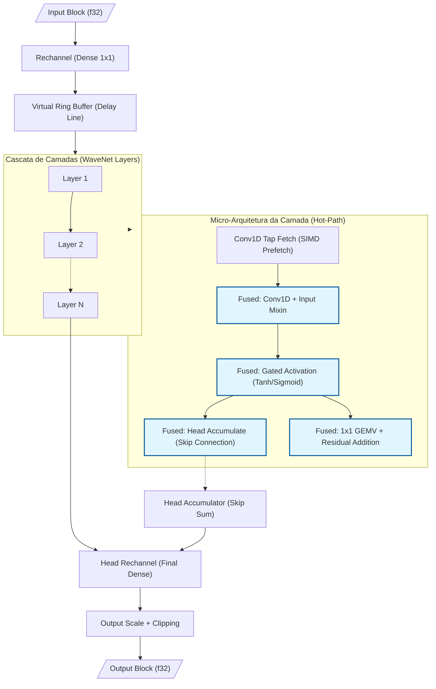

<!-- SPDX-License-Identifier: MIT OR Apache-2.0 -->
<!-- Copyright (c) 2026 Fábio Henrique de Lima Silva. -->

# Arquitetura NAM-rs: Cliente Standalone de Inferência Neural

A arquitetura do NAM-rs é projetada para processamento DSP de baixa latência e inferência neural focada em simulação de equipamentos de áudio (Neural Amp Modeler). Operando como cliente PipeWire standalone no Linux, utiliza Rust idiomático com foco em segurança RT (Real-Time).

## 1. Topologia PipeWire: Dual-Stream (Capture + Playback)

- **Virtual Sink (Audio/Sink):** O NAM-rs declara-se como saída de som padrão via `pw_stream`. Apps conectam-se automaticamente via WirePlumber.
- **Playback Stream (Stream/Output):** Uma segunda stream lê o áudio processado e o entrega ao hardware real, contornando limitações de monitor ports de sinks virtuais.
- **DspBridge (Lock-Free Double-Buffer):** Estrutura alinhada (128B) que isola as streams. O capture escreve no buffer inativo (Release); o playback lê do ativo (Acquire), sincronizado por `AtomicU64` (generation).
- **True Stereo e Bypass:** Inferência simétrica L/R. Se R for silêncio ou idêntico a L, o sistema pula a inferência de R (poupando ~50% de CPU).

> **Nota:** A topologia Dual-Stream é mantida em preferência ao `pw_filter` por garantir roteamento "plug-and-play" automático pelo WirePlumber e pela maturidade dos wrappers safe no crate `pipewire`.

## 2. Inferência & Microarquitetura (SIMD x86-64-v3/v4)

- **Multiversioning via Macro `dispatch_simd!`:** Despacho dinâmico no carregamento do modelo que seleciona a melhor v-table de kernels SIMD (`Avx2Math`, `Avx512Math`, etc.). O uso de macros para monomorfização garante que o compilador emita intrinsics nativos sem overhead de v-table no hot-path de inferência.
- **FastMath Activations & Gain LUT:** `simd_tanh` e `simd_sigmoid` usam polinômios Minimax de grau 7 com refinamento Newton-Raphson. Erro máximo < 2e-5, otimizado para o intervalo [-8, 8]. Inclui uma **Gain LUT (Look-Up Table)** interpolada para conversão ultra-rápida dB → Linear no RT, evitando chamadas caras a `powf`.
- **Gated Activation Fusion (WaveNet A2):** Unificação de `tanh` e `sigmoid` em um único kernel SIMD nativo, reduzindo a pressão de registradores e evitando passagens múltiplas sobre o vetor de ativação.
- **Dot Product ILP:** Implementação com 4 acumuladores independentes que saturam o throughput de portas FMA, quebrando cadeias de dependência.
- **Weight Compression F16C:** Pesos são armazenados em `f16` (Half-Precision) para maximizar o hit-rate da Cache L1. A descompressão ocorre on-the-fly via `_mm256_cvtph_ps`.
- **Gate-Major Layout & Fused 4-Gate GEMV (LSTM):** Transposição de pesos para layout `[Gate][Input][Hidden]`. A inferência funde o cálculo das 4 portas em uma única passagem sobre o vetor de estado.
- **Layer Overlap Pipelining (LSTM 2-Layer):** Paralelismo de grão fino onde a Camada 2 processa o frame `N-1` simultaneamente ao frame `N` da Camada 1, aumentando a vazão em modelos multicamada.
- **BF16 Nativo (AVX-512 BF16):** Suporte a kernels nativos via `_mm512_dpbf16_ps` para CPUs modernas, dobrando o throughput.
- **Fused Conv1d+Mixin (WaveNet):** A soma do vetor de mixagem é fundida diretamente no acumulador da Conv1D.
- **Fused Tanh + Head Accumulate (WaveNet):** Unificação nativa das fases de ativação e skip-connection (head) em um único kernel SIMD (`tanh_and_accumulate_block`).
- **Fused Residual GEMV com Frame Tiling (WaveNet):** O cálculo do resíduo é fundido no GEMV da camada seguinte, utilizando **4-frame tiling (AVX2)** ou **8-frame tiling (AVX-512)** para maximizar o reuso de pesos nos registradores.
- **Conv1D Tiling:** Processamento de múltiplos canais em blocos para maximizar o reúso de dados nos registradores SIMD e reduzir latência de cache em modelos com dilatação profunda.

### Decisão Técnica: Precisão FastMath vs Performance (ADR-001)

> **Decisão:** As funções de ativação `tanh` e `sigmoid` usam aproximações polinomiais SIMD
> (Minimax + Newton-Raphson duplo) em vez de chamadas à libm IEEE-754 compliant.
>
> **Consequência:** Erro máximo por ativação vs libm (range completo `[-8, 8]`):
> - **tanh**: **< 2e-5** (sweep de 32.768 pontos, T7.2-2026-05-08); pior ponto em x≈-4.34 (1.234e-5).
>   No range central `[-4, 4]` o erro cai para ~6e-8 (polinômio Minimax saturando o mantissa f32).
> - **sigmoid**: **< 5e-6** (sweep de 32.768 pontos, T7.2-2026-05-08); erro uniforme por todo o range.
> O áudio resultante **não é bit-a-bit idêntico** ao motor C++ NeuralAmpModelerCore.
> A divergência é **perceptualmente inaudível** (erro uma ordem de magnitude abaixo
> do piso de quantização 16-bit PCM).
>
> **Justificativa:** O trade-off sacrifica ~4–5 casas decimais de precisão para ganhar
> ~10-20× de throughput (4-8 ciclos/ativação vs 20-60 ciclos/ativação no libm escalar).
> Para atingir paridade bit-a-bit seria necessário usar `exp()`/`tanh()` escalar via libm,
> eliminando todo o ganho SIMD que é a razão de existência do NAM-rs.
>
> **Impacto por modelo:**
>
> - **LSTM** (1 camada, 4 ativações/sample): SNR ~24.5 dB vs C++ (divergência mínima)
> - **WaveNet Standard** (20 camadas, ~60 ativações/sample): SNR ~10 dB vs C++ (acumulação sublinear √N)
>
> **Fontes de erro do `simd_sigmoid_avx2` (após NR duplo, range central):**
>
> 1. Polinômio Minimax D6 para `exp(f)`: erro ~1e-7 (fonte residual dominante)
> 2. `_mm256_rcp_ps` + 2× Newton-Raphson: precisão saturada a ~24 bits (~6e-8 relativo)
> 3. Range reduction via `_mm256_cvtps_epi32`: ~1 ULP em fronteiras
> 4. Composição multiplicativa `rcp(1 + exp(-x))`: erro pico ~6e-8 para |x| < 5
>
> **Validação:** Sweep determinístico de 32.768 pontos em `[-8, 8]` (`test_tanh_max_abs_error_sweep`,
> `test_sigmoid_max_abs_error_sweep`); proptest com 10.000 inputs aleatórios (`prop_simd_tanh_avx2_rmse`,
> `prop_simd_sigmoid_avx2_rmse`); golden vectors cross-C++ (4 modelos); regression goldens
> self-reference (7 modelos, MSE < 1e-6).
>
> **Referências:** `src/math/fastmath.rs` (docstring de `simd_tanh_avx2`),
> `tests/fixtures/README.md`, `tests/nam_infer_test.rs` (docstring de `test_golden_vectors_wavenet`)

### Fluxo de Dados WaveNet (Pipeline de Inferência)

O diagrama abaixo ilustra o fluxo de dados em um bloco de inferência WaveNet, destacando as operações fundidas (fused) que minimizam o tráfego de memória e maximizam o throughput SIMD:



## 3. Gestão e Isolação Temporais (Strict RT)

- **Thread DSP (SCHED_FIFO):** Afixada via Core Affinity (`select_optimal_cpu`) preferindo cores com menor carga de IRQs.
- **Zero-Allocation:** Proibição estrita de alocações heap, `Vec`, `Box` ou panics na thread DSP.
- **Isolamento de Jitter:**
  - `mlockall` para evitar page faults.
  - PM QoS Lock (`/dev/cpu_dma_latency`) para desabilitar C-States profundos.
  - Desabilitação de THP (Transparent Huge Pages) via `prctl` para evitar spikes de compactação do kernel.
- **Telemetria de Alta Precisão (RDTSC):** Substituição de `Instant::now()` (syscall vDSO) por leitura direta do TSC calibrado no callback RT. Garante precisão de ~1ns com overhead de ~1 ciclo de CPU, eliminando jitter induzido pelo kernel na medição de carga de DSP.
- **Canais SPSC (rtrb):** Comunicação lock-free entre CLI (async) e DSP (RT). Payload alinhado (128B) para evitar False Sharing.

## 4. Estrutura de Módulos

| Módulo                 | Responsabilidade                                                                            |
|:---------------------- |:------------------------------------------------------------------------------------------- |
| `pw_host` / `rt_setup` | Orquestração PipeWire, afinidade, RT priority e isolamento.                                 |
| `models/`              | Implementações de inferência: `wavenet.rs` (Static), `wavenet_dyn.rs` (Dynamic), `lstm.rs`. |
| `models/activations`   | Enum `ActivationType` e implementações escalares de 11 funções de ativação.                 |
| `models/gating`        | Configurações de Noise Gate e Blending para WaveNet A2.                                     |
| `models/film`          | Suporte a camadas FiLM (Feature-wise Linear Modulation).                                    |
| `math/simd/`           | Abstração SIMD: `avx2.rs`, `avx512.rs`, `fallback.rs`, `ops.rs` e `traits.rs`.              |
| `math/fastmath`        | Implementações Minimax de `tanh`, `sigmoid` e exponenciais nativas.                         |
| `dsp/resampler`        | Resampler Sinc Polifásico nativo (Minimum Phase).                                           |
| `dsp/gate`             | FSM de Histerese Dinâmica e rampa linear SIMD.                                              |
| `loader/`              | Parsing de modelos `.nam` (JSON) e `.namb` (binário).                                       |
| `audio_host`           | Trait `AudioHost` para abstração de backend (PipeWire/CLAP).                                |
| `params`               | Parâmetros de plugin agnósticos ao host (`NamPluginParams`).                                |

## 5. DSP & Resampling Nativo

O NAM-rs utiliza um **Resampler Sinc Polifásico de Fase Mínima** nativo, substituindo dependências externas.

- **Vantagens:** Elimina pré-ringing (energia concentrada no início), reduz latência algorítmica de ~1.5ms para ~0.1ms e oferece performance ~9x superior via convolução AVX2/AVX-512 dedicada.
- **Gate FSM:** Implementa histerese temporal e de amplitude (Schmitt Trigger) para evitar oscilações em níveis de ruído. Inclui rampa linear SIMD para transições suaves (fade-in/out).

### Fluxo DSP Bidirecional

```text
PipeWire Input (Nk Hz)
    ▼ Gate FSM: Detecção de Silêncio/Mono + Rampa de Ganho
    │
    ▼ Input Gain (SIMD)
    │
    ▼ NamResampler::process_input (Nk → 48 kHz)
    │
    ▼ NamModel::process (Inferência Neural @ 48 kHz)
    │
    ▼ NamResampler::process_output (48 kHz → Nk)
    │
    ▼ Output Gain (SIMD) + Clipping
    │
    ▼ DspBridge (Lock-Free Write) → Playback Stream (Read) → Hardware
```

## 6. Estratégia de Testes & Qualidade

- **Unitários Inline:** Testes de lógica interna e matemática rápida.
- **Integração (`tests/`):** Validação de inferência E2E, parsing de modelos reais e paridade estático-dinâmico.
- **Zero-Allocation Guard:** Uso de um `CountingAllocator` customizado em testes para garantir rigorosamente que o hot-path não aloca heap.
- **Fuzz Testing (`proptest`):** ~45.000 inputs adversários para garantir robustez absoluta dos parsers contra dados malformados.
- **Golden Vectors:** Comparação bit-a-bit ou MSE contra referências C++ (NeuralAudio/NAMCore).
- **Soak Test (`tests/soak_test.rs`):** Suíte de estabilidade numérica de longa duração — executa 10M+ frames de silêncio/ruído em WaveNet e LSTM, 50M+ amostras no resampler e 100M+ ciclos no VirtualRingBuffer. Todos marcados com `#[ignore]` para exclusão do CI. Disparados via `bash utils/tests-long.sh`.
- **Long Run Benchmarks (`benches/inference_bench.rs`):** Grupo `Long_Run_*` ativado via feature `long_bench`, com blocos de 4096 amostras e `measurement_time(30s)` para medir throughput real em operação contínua, eliminando jitter de cache. Disparados via `bash utils/tests-long.sh`.

## 7. Preparação para Arquitetura A2 (v1.4 Staging)

O NAM-rs v1.4 introduz o scaffolding necessário para a próxima geração de modelos (A2), mantendo paridade absoluta com os modelos A1 existentes.

- **Forward-Compatible Loader:** O dispatcher (`src/loader/dispatcher/wavenet.rs`) identifica modelos A2 via metadados de versão ou ativações não-Tanh, redirecionando-os para um `WavenetA2Placeholder`.
- **Extensibilidade de Ativações:** Suporte a 11 variantes de funções de ativação (HardTanh, SiLU, LeakyReLU, etc.) via trait `ActivationFn`, prontas para futura implementação SIMD.
- **Parametrização Flexível:** Inclusão de estruturas para FiLM, Gating dinâmico e Blending de ativações, permitindo que o parser aceite novos formatos de arquivo sem panics.

## 8. Formato Binário NAMB (Native Audio Model Binary)

O formato `.namb` é uma evolução otimizada do JSON original para uso em tempo-real.

- **NAMB v1:** Encapsula o JSON de metadados e os pesos em `f32` (Little-Endian) em um único bloco binário com CRC32.
- **NAMB v2 (Pre-Transposed):** Armazena os pesos diretamente no layout final do kernel (Gate-Major para LSTM ou Interleaved-4 para WaveNet).
  - Elimina a necessidade de transposição de memória durante o carregamento.
  - Reduz latência de swap de modelo de ~50ms para <1ms (cold-path de carregamento).
  - Identificado por flag no header `NambHeader::layout_type`.

## 9. Referências

Os seguintes repositórios GitHub são a principal base de referência para a implementação do NAM-rs:

- [NeuralAmpModelerCore](https://github.com/sdatkinson/NeuralAmpModelerCore)
- [NeuralAudio](https://github.com/mikeoliphant/NeuralAudio)

## 10. Suporte a Plugins (CLAP Integration)

A arquitetura do NAM-rs v1.4.0 já suporta o desacoplamento necessário para execução como plugin CLAP (Clever Audio Plug-in), permitindo o uso em DAWs (Digital Audio Workstations).

- **Trait `AudioHost`:** Define a interface agnóstica de comunicação entre o motor DSP e o host.
- **Feature Flags:** O build é controlado por flags (`standalone` vs `clap-plugin`), garantindo que dependências de sistema (como `pipewire`) sejam removidas no binário do plugin para máxima portabilidade.
- **Parâmetros Agnósticos:** `NamPluginParams` centraliza o estado do plugin (`input_gain_db`, `output_gain_db`, `gate_threshold_db`, `model_path`), facilitando o mapeamento para automação de DAW e persistência de estado (save/load).
