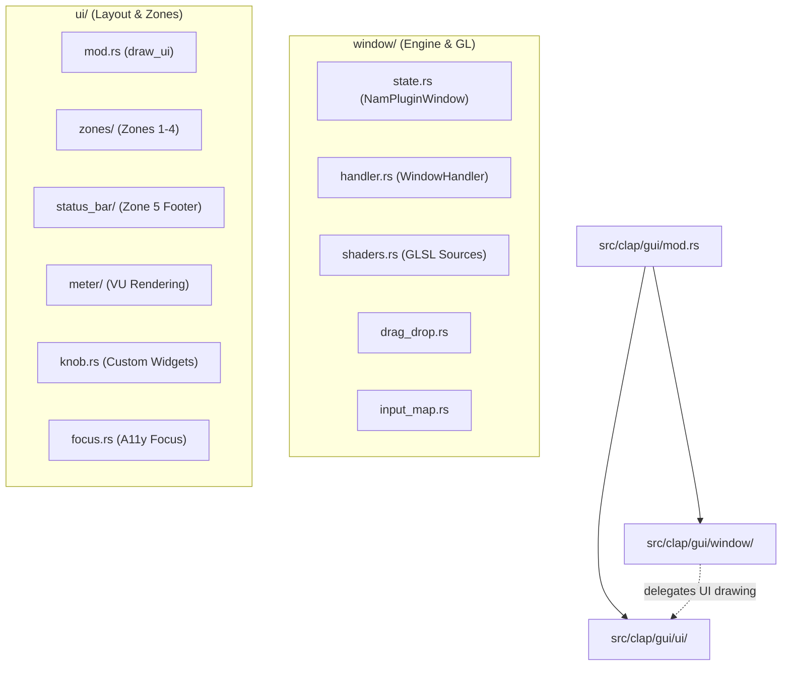
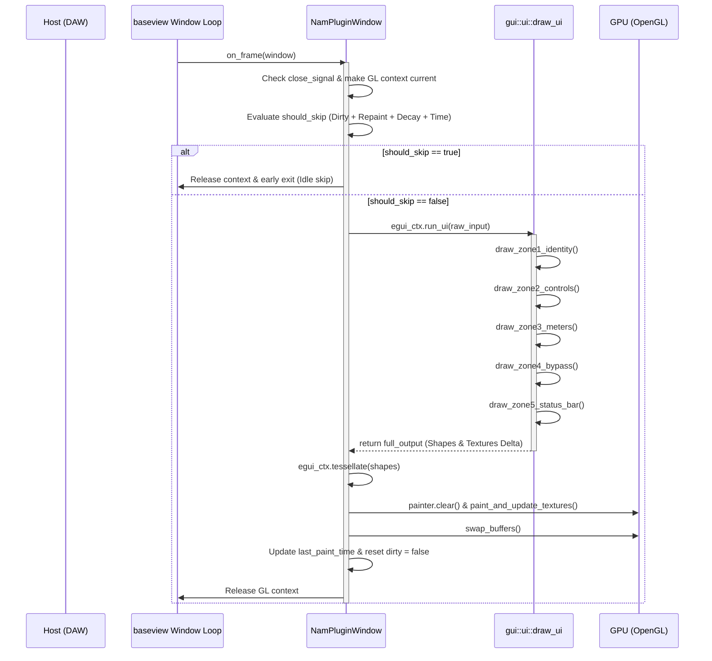

<!--
SPDX-License-Identifier: Apache-2.0
Copyright (c) 2026 Fábio Henrique de Lima Silva (fhl.bsb@gmail.com) All rights reserved.
-->

# NAM-rs GUI Architecture: Embedded egui + baseview Guide

This document describes the structure, lifecycle, rendering path, and synchronization mechanisms of the graphical user interface (GUI) of the NAM-rs CLAP plugin.

---

## 1. Directory and Module Organization

The GUI codebase is housed entirely in the [src/clap/gui/](../src/clap/gui/) directory. It is structured into two main sub-modules to separate platform-specific windowing and OpenGL integration from host-agnostic visual interface drawing logic:

- **`window/`**: Handles OS/host window management, OpenGL context mapping, event parsing, conditional paint loop scheduling, and raw shader management.
- **`ui/`**: Declares layout structure, styling, theme definitions, focus maps, custom widgets (like rotary knobs), and draws individual components.



### Module Roles and File Map

- [gui/mod.rs](../src/clap/gui/mod.rs): Main GUI entryway. Exposes the width (600px) and height (275px) constants and helper unsafe functions to safely extend host lifetimes across window lifecycle boundaries.
- [gui/window/state.rs](../src/clap/gui/window/state.rs): Declares `NamPluginWindow` and handles initialization of OpenGL contexts, `egui_glow` painter construction, GLSL program compilation, custom dark theme setup, and resource teardown.
- [gui/window/handler.rs](../src/clap/gui/window/handler.rs): Implements `baseview::WindowHandler` which manages the OS frame lifecycle (`on_frame`) and translates window system input events (mouse, keyboard, drag-and-drop) to `egui::RawInput` (`on_event`).
- [gui/window/shaders.rs](../src/clap/gui/window/shaders.rs): GLSL vertex and fragment shader sources for rendering the VU meter bar with dB gradient scales, distance field corners, and peak-hold indicators.
- [gui/ui/mod.rs](../src/clap/gui/ui/mod.rs): Directs the 5-zone layout placement. Coordinates horizontal alignment of Zones 1–4, appends Zone 5 as a footer, manages error toast timers, and processes model drag-and-drop overlays.
- [gui/ui/zones/](../src/clap/gui/ui/zones/):
  - `identity.rs` (Zone 1): Logo, versions, SIMD badges, and asynchronous model file picker button.
  - `controls.rs` (Zone 2): Renders custom interactive dials for Input Gain, Output Gain, and Gate Threshold.
  - `meters.rs` (Zone 3): Adapts VU meter layout dynamically to mono or stereo.
  - `bypass_zone.rs` (Zone 4): Large interactive bypass toggle.
- [gui/ui/status_bar/](../src/clap/gui/ui/status_bar/):
  - `orchestrator.rs`: Formats the status bar layout, displaying model name/metadata or warning toasts.
  - `telemetry.rs`: Translates real-time audio thread CPU performance, latency, and sample rate into human-readable strings.
  - `metadata.rs`: Extracts and aligns model metadata records.
- [gui/ui/meter/](../src/clap/gui/ui/meter/):
  - `orchestrator.rs`: Dispatches drawing to GPU shader path, CPU fallback, and peak text readouts.
  - `glow.rs`: Formats parameters and injects paint callbacks into `egui::Shape` for execution inside OpenGL paint runs.
  - `cpu.rs`: Secondary CPU layout fallback rendering flat rectangles if OpenGL fails.
  - `readout.rs`: Formats numeric peak values on top and bottom.

---

## 2. Frame Lifecycle and Rendering Pipeline

The plugin interface is written as an immediate-mode layout using `egui`. Instead of retaining persistent widget references, layout definitions are executed sequentially on every paint cycle. The lifecycle is driven by baseview's OS event loop callbacks:



1. **`on_frame` Trigger**: Baseview schedules frame updates (typically tied to VSync or timer ticks).
2. **Context Setup**: `NamPluginWindow` hooks the OS GL reference and calls `make_current` to expose OpenGL drivers to the current OS thread.
3. **Conditional Execution (`should_skip`)**: The window evaluates optimization rules (see Section 4). If no changes occurred and limits are respected, the thread releases the context and exits immediately, saving CPU.
4. **UI Construction (`run_ui`)**: The engine launches `draw_ui`, evaluating the horizontal layout of Zones 1–4 and stacking the Zone 5 footer below.
5. **Geometry Tessellation**: `egui` compiles immediate layout descriptions into raw triangle meshes (vertices and indices) and updates texture atlases.
6. **Rasterization & Page Swap**: `egui_glow` feeds vertices to the OpenGL pipeline, executes user-defined GLSL shader operations, clears buffers, swaps the window buffers via host graphics API, and marks `last_paint_time`.

---

## 3. UI ↔ RT Lock-Free Synchronization Protocol

Due to strict RT-Safety requirements, the audio processing thread must never be blocked by GUI activities (such as mouse drags, file picks, or rendering runs). All interaction occurs via lock-free primitives mapped inside [src/clap/plugin/shared.rs](../src/clap/plugin/shared.rs) through `NamClapShared`.

To eliminate CPU cache line invalidation conflicts (cache bouncing) between threads, the shared structure divides fields into isolated structures, padded to 128 bytes (`#[repr(align(128))]`):

```text
  ┌─────────────────────────────────────────────────────────────┐
  │                        NamClapShared                        │
  └─────────────────────────────────────────────────────────────┘
          │                      │                       │
          ▼                      ▼                       ▼
   ┌───────────────┐      ┌───────────────┐      ┌───────────────┐
   │    RtToUi     │      │    UiToRt     │      │  ColdShared   │
   │ (align 128B)  │      │ (align 128B)  │      │ (align 128B)  │
   └───────────────┘      └───────────────┘      └───────────────┘
    RT writes,             UI writes,             Low-frequency,
    UI reads               RT reads               queues & diagnostics
```

### 3.1 Parameter Updates (UI → RT)

- When knobs are dragged or buttons are pressed, the UI thread writes the new parameter values directly to the corresponding atomic fields in `UiToRt` (`param_input_gain`, `param_output_gain`, `param_gate_thresh`, `param_bypass`, `param_adaptive_compute`).
- Simultaneously, it sets the corresponding modification status in `gesture_flags` (so the processor can report them back to the host DAW) and bumps `gui_param_generation` using `Release` ordering.
- During processing inside `PluginAudioProcessor::process()`, the RT thread reads `gui_param_generation` with an `Acquire` load. If it matches its cached local generation, the RT thread skips checking all parameters. If it changed, it reads the new values using `Relaxed` loads, updating local DSP targets smoothly via [ParamSmoother](../src/dsp/smoother.rs).

### 3.2 Telemetry and VU Peak Updates (RT → UI)

- Every process block, the RT thread measures peak amplitudes. It uses `Relaxed` stores to write these values into the atomic variables inside `RtToUi` (`ui_peak_l`, `ui_peak_r`).
- To ensure correct rendering, the UI thread uses `swap` (resetting them to zero) to fetch peak levels. This ensures that peak values are reset on each UI read, letting the UI decay envelope reflect silence correctly when no audio processing occurs.
- The RT thread also publishes `current_latency` and `active_channel_count` to `RtToUi`, which the UI checks to adapt layouts or update text readouts.

### 3.3 Model Loading and Garbage Collection

- Disk I/O, format checks, and neural weights parsing are heavy allocation operations. These are handled outside the audio thread.
- **Model Loading SPSC Channel**: The UI thread spawns a file dialog thread. On file select, the path is locked in `ui_pending_model` and the UI requests a host callback. The host schedules a main thread callback. The main thread loads the model, constructs a new `NamResampler`, packages them into a `ClapParamPayload::LoadModel` payload, and pushes it into the `param_tx` SPSC queue (contained in `ColdShared`). The RT thread drains `param_rx` non-blockingly, swaps active pointers, and pushes old instances to the `gc_tx` queue.
- **GC SPSC Channel**: The main thread periodically drains the `gc_rx` SPSC channel and drops the obsolete model instances, safely freeing heap memory outside the real-time context.

---

## 4. Conditional Rendering Strategy (Idle Optimization)

Continuous rendering at 60 FPS under idle conditions consumes system resources, which is unacceptable when multiple plugin instances are loaded. `NAM-rs` implements a conditional rendering strategy within `WindowHandler::on_frame()`:

```rust
let should_skip = !self.dirty
    && !has_short_repaint
    && !hold_changed
    && time_since_paint < std::time::Duration::from_millis(22);
```

### Skip Logic Rules

1. **`!self.dirty`**: Prevents rendering if no mouse movements, keyboard presses, or window resizing events occurred since the last frame. Input events set `dirty = true` instantly.
2. **`!has_short_repaint`**: egui dictates how fast repaint cycles should happen via `repaint_delay`. If a toast animation, warning timeout, or loading spinner is active, egui schedules short repaint delays (< 50ms). If `has_short_repaint` is true, skip is bypassed to keep animations fluid.
3. **`!hold_changed`**: To keep VU peak-hold decays smooth, the handler snapshots `peak_l_hold` and `peak_r_hold` before running the UI. If a decay transition occurs, skip is bypassed. Once hold levels settle to zero (idle state), they stop forcing repaints.
4. **Throttle (22ms)**: Caps the update rate at ~45 FPS when active, balancing fluid animations with low UI CPU overhead.

---

## 5. GPU VU Meter Shaders and Fallback

The VU meter is drawn using a hardware-accelerated OpenGL path via `egui_glow` if available, falling back to CPU drawing on system failure.

### 5.1 Shader Pipeline

- **Vertex Shader**: Programmed in [src/clap/gui/window/shaders.rs](../src/clap/gui/window/shaders.rs#L12). It generates a quad using `gl_VertexID` without requiring VBO vertex buffers. NDC positions are calculated dynamically by transforming raw pixel boundaries (`u_meter_rect`) against the egui viewport size (`u_viewport`).
- **Fragment Shader**: Declared in [src/clap/gui/window/shaders.rs](../src/clap/gui/window/shaders.rs#L65). It calculates a three-color gradient based on standard VU dB ranges:
  - **Green**: Up to $-12\text{ dBFS}$ (fraction: $48/66$ of height)
  - **Yellow**: $-12\text{ dBFS}$ to $-3\text{ dBFS}$ (fraction: $57/66$ of height)
  - **Red**: $-3\text{ dBFS}$ to $+6\text{ dBFS}$ (full scale)
- **Rounded Corners**: Calculated using a distance-field formula inside the fragment shader, discard-clipping pixels outside a $1.5\text{px}$ radius.
- **Peak Hold Indicator**: Renders a thin ($1.5\text{px}$) horizontal line at the peak fraction. It changes color based on range: green, yellow, or red.

### 5.2 CPU Fallback

- If shaders fail to compile or context features are missing, `draw_vertical_meter()` receives a `None` shader program.
- In this case, rendering falls back to [gui/ui/meter/cpu.rs](../src/clap/gui/ui/meter/cpu.rs), which draws flat colored boxes directly onto the `egui::Ui` painter mesh, ensuring the interface remains usable.

---

## 6. Toast and Diagnostics Flow

### 6.1 Asynchronous File Dialog

- Clicking "📂 Load Model" spawns a background thread via `spawn_file_dialog()` in [gui/ui/zones/identity.rs](../src/clap/gui/ui/zones/identity.rs#L18) using the `rfd` library.
- This background thread runs in X11 space to prevent freezing the main DAW UI.
- While the dialog is open, `ui_loading` is set to true, displaying a loading message.
- If the user selects a file, the path is stored in `ui_pending_model` and `host.request_callback()` is triggered.

### 6.2 Error Handling and Hover Toasts

- If model loading fails in the housekeeping run on the main thread, the error message is stored in `ui_load_error_msg` and `ui_load_error` is set to true.
- On the next UI frame, the GUI thread checks `ui_load_error`. It sets `error_expiration = Instant::now() + Duration::from_secs(3)` and copies the error message into local state.
- The model text box displays `⚠ Load failed` in red, and hovering over it displays the detailed error message as a tooltip.

---

## 7. Accessibility and Focus Rules

To allow keyboard-only navigation in the plugin UI, NAM-rs maps keyboard events to a cyclical focus system.

### Tab Navigation Cycle

Focus cycles through interactive controls in the following order:

```text
┌────────────────────────────────────────────────────────────────────────┐
│                                                                        │
▼                                                                        │
[Input Gain Knob] ➔ [Output Gain Knob] ➔ [Gate Knob] ➔ [Bypass] ➔ [Load Button]
```

- **Navigation mapping**: Keyboard focus cycling is implemented in [gui/ui/focus.rs](../src/clap/gui/ui/focus.rs). Tab moves forward; Shift+Tab moves backward.
- **Visual Highlight**: Active controls display a distinct colored ring (using the current accent color) outside their borders.
- **Keyboard Triggers**: Space and Enter keys are mapped to activate the Load button and the Bypass toggle when they are focused.
