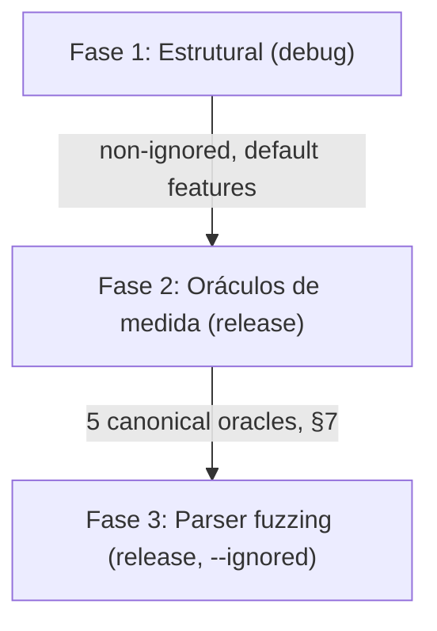

<!--
SPDX-License-Identifier: Apache-2.0
Copyright (c) 2026 Fábio Henrique de Lima Silva (fhl.bsb@gmail.com) All rights reserved.
-->

# Test Coverage Inventory by Feature Configuration

This document tracks and categorizes the test suite of `nam-rs` according to its required Cargo features and execution phases. By using targeted feature gating and specific test runners, the project ensures **100% regression coverage** and **strict RT-safety validation** while minimizing compilation and execution overhead.

---

## 1. Crate Features Taxonomy

The `nam-rs` crate defines several features in `Cargo.toml` to customize build targets and test capabilities:

| Feature Name      | Description                   | Active Dependencies / Modules                | Gated Scope                                                |
|:----------------- |:----------------------------- |:-------------------------------------------- |:---------------------------------------------------------- |
| **`standalone`**  | Native CLI + PipeWire host    | `pipewire`, `stereo`                         | `src/standalone/`, `src/main.rs`, `pw_integration_test.rs` |
| **`testing`**     | Test utilities & generators   | Gated test modules                           | `src/testing/`, `gen_stress.rs`, `wav_to_golden.rs`        |
| **`stereo`**      | Enable stereo DSP processing  | DSP input/output buffers                     | `src/dsp/pipeline/stages/input.rs` (Stereo variants)       |
| **`clap-plugin`** | CLAP format plugin + GUI      | `clack-*`, `egui`, `glow`, `baseview`, `rfd` | `src/clap/`, `clap_lifecycle_test.rs`, etc.                |
| **`heap-audit`**  | Memory watchdog tracking      | Global `CountingAllocator` interceptor       | `src/common/alloc_audit.rs`, CLAP processor heap check     |
| **`long_bench`**  | Extended criterion benchmarks | `inference_bench`                            | Benchmark cycles >30s                                      |

---

## 2. Test Execution Phase Architecture — Two-Axis Model

Test placement is governed by **two orthogonal axes**, not by a single "fast vs.
slow" heuristic:

- **Axis A — Rigor (encoded via `#[ignore]`):** non-ignored = first line of
  defense (runs every sprint, several times a day); `#[ignore]` = long/rigorous
  (runs ~1×/day via `--ignored`). This is the *rigorosidade* axis.
- **Axis B — Float path (encoded via debug vs. `--release`):** structural tests
  (logic, parsers, FSM, bitwise determinism) run in **debug** (cheap, with
  `debug-assertions` ON, where float codegen is irrelevant); measurement oracles
  (anything comparing floats against a reference) run in **`--release`** (the
  codegen path users actually execute). Measuring in debug guards a "phantom" —
  codegen without `-O`, without FMA contraction, without auto-vectorization.

The quick suite ([tests-quick.sh](file:///home/fabio/nam-rs/utils/tests-quick.sh))
has three phases that respect both axes:



### Fase 1 — Structural (debug, default features)

- **Goal:** logic, parsers, FSM transitions, loaders, SPSC, bitwise determinism.
- **Scope:** `cargo test --lib` (unit, auto-discovered) + an explicit list of
  deterministic integration binaries (`STRUCTURAL_TESTS` in the script). The list
  is explicit because `--skip` by name collides (e.g. `test_oracle` would hit
  `threshold_calibration`; `asr_` would hit unit tests in `src/testing`).
- **Excluded by design:**
  - The 5 measurement oracles (→ Fase 2, release): `golden_vectors`,
    `cpp_parity`, `reference_oracle_f64`, `isa_parity`, `spectral_fidelity`.
  - `rt_deadline` / `rt_jitter` (timing characterization → long Phase 6,
    release-only; asserting deadlines in debug is meaningless).
  - `proptest_parsers` (parser fuzzing → Fase 3, release `--ignored`).
- **Redundancy safe:** does not compile the GUI/CLAP dependency graph.

### Fase 2 — Measurement Oracles (release, gate of production floats)

- **Goal:** the 5 canonical oracles of §7 measure the float path that ships.
- **Scope (combined into one `cargo test` per dependency branch to avoid
  recompiling `nam-rs` once per test):**
  - Always: `reference_oracle_f64` + `spectral_fidelity` + `linear_fft_test`
    (deps committed; linear_fft_test's mathematical oracle tests always run,
    C++ golden tests skip gracefully when goldens absent).
  - With committed goldens: `golden_vectors` (v1) + `isa_parity` (v2, requires
    `--test-threads=1` per §7; the others tolerate single-threading).
  - With `NeuralAmpModelerCore`: `cpp_parity quick_parity` (separate invocation —
    the `quick_parity` name filter would suppress the other oracles if combined).
- **Prerequisites:** gracefully skipped if goldens/NAMCore are absent.

### Fase 3 — Parser Fuzzing (release, `--ignored`, capped)

- **Goal:** Tier 1 parser robustness/security.
- **Scope:** `proptest_parsers` with `PROPTEST_CASES=1000` (override via
  `NAM_QUICK_PROPTEST_CASES`). The long suite runs the full case counts.

### CLAP & RT-Safety Heap Audits — delegated to the long suite

- CLAP build, heap-audit integration tests, `clap_lifecycle_test`,
  `clap_state_migration`, `diagnostic_bundle` heap variant, `clap_multi_instance`,
  and `clap-validator` all run in `tests-long.sh` Phase 3–4 in **release** (a
  strict superset of the former debug build). They are out of the quick loop.

### Golden Vector Supply Chain — a critical, rarely-executed dependency

Fase 2's `golden_vectors` (v1) and `isa_parity` (v2), and the long suite's `cpp_parity`
full matrix and `golden_vectors` v2 multi-SR, do **not** measure against a live C++
build on every run. They compare against pre-committed `.bin` golden files rendered
once by [`tests/fixtures/golden_gen_build.sh`](file:///home/fabio/nam-rs/tests/fixtures/golden_gen_build.sh)
against a pinned `NeuralAmpModelerCore`/`NeuralAmpModelerPlugin` commit (pinned
versions defined in [`/variables.env`](../variables.env)) — a script
intended to run *rarely*, only when a new reference model or architecture is added
(see `tests/fixtures/README.md` for the full regeneration walkthrough and the current
model↔golden catalog).

This makes the golden-generation pipeline a **supply-chain dependency** of Fase 2 and
of the long suite, not merely a one-off developer convenience script — if it cannot
reproduce a golden a test depends on, that test is permanently `#[ignore]`d or skips
gracefully with no real coverage, silently. An audit of this pipeline
(`TODO-findings.md`, Épicos A–F) found and tracked several concrete gaps that readers
of this table should be aware of when interpreting "coverage":

- **A2 dynamic/FiLM v2 multi-SR gap:** `golden_gen_build.sh` auto-generates v1 goldens
  (48000 Hz) for `golden_a2_dynamic_{gated_ch8,blended_ch3}.bin` and
  `golden_wavenet_a2_film_{full,lite}.bin`. v2 multi-SR goldens are intentionally skipped
  (`v2_scope=none`) — see the CATALOG rationale comment in
  `tests/fixtures/golden_gen_build.sh` for the full technical explanation.
- **Linear FFT goldens.** `golden_gen_build.sh` generates
  `golden_linear_fft_rf{320,2048,4096,8192}.bin` for 4 Linear FFT models at 48 kHz
  (CATALOG entries with `v2_scope=none`). `tests/linear_fft_test.rs` runs in
  Fase 2 (release, Eixo B) — mathematical oracle tests always execute; C++ golden
  cross-reference tests skip gracefully when goldens absent.
- **Freshness is blocking in quick suite (Épico E).** `golden_gen_build.sh` commits a
  versioned `.golden_manifest.sha256` freshness manifest checked by `utils/tests-quick.sh`
  Fase 2 — a `sha256sum`-based gate that hard-fails when a `.nam` model has been modified
  without regenerating the corresponding golden, preventing stale references from silently
  passing validation.

---

## 3. Test Coverage Matrix

The following table maps every test suite, target, or binary to the features it requires and the verification phase where it is executed:

| Test Target                         | Type        | Primary Feature Gates       | Quick Fase 1 (debug)      | Quick Fase 2 (release)   | Quick Fase 3 (release, ignored) | Long suite                           | Verification Goal                                                                                                                                  |
|:----------------------------------- |:----------- |:--------------------------- |:-------------------------:|:------------------------:|:-------------------------------:|:------------------------------------:|:-------------------------------------------------------------------------------------------------------------------------------------------------- |
| **`src/` (Core)**                   | Unit Tests  | *None*                      | **Yes**                   | No                       | No                              | No                                   | Core math, DSP kernels, model loaders (`loader::`), linear/wavenet/lstm logic                                                                      |
| **`src/standalone/`**               | Unit Tests  | `standalone`                | **Yes**                   | No                       | No                              | No                                   | CLI argument parser, PipeWire host bridge, RT setup / affinity scheduling                                                                          |
| **`src/clap/`**                     | Unit Tests  | `clap-plugin`               | No                        | No                       | No                              | **Yes** (Phase 4)                    | GUI UI, window state, CLAP plugin preset extraction and parameter modulation                                                                       |
| **`src/clap/` (Heap)**              | Unit Tests  | `clap-plugin`, `heap-audit` | No                        | No                       | No                              | **Yes** (Phase 4)                    | RT-safety validation of memory-watchdog triggers and SPSC swap operations                                                                          |
| **`a2_loader`**                     | Integration | *None*                      | **Yes**                   | No                       | No                              | No                                   | Model verification for A2-Lite and A2-Full shapes and parameters                                                                                   |
| **`activation_precision`**          | Integration | *None*                      | **Yes**                   | No                       | No                              | No                                   | Precision verification of WaveNet activation gain and scaling                                                                                      |
| **`adaptive_fsm_proptest`**         | Integration | *None*                      | **Yes** *(ignored)*       | No                       | No                              | **Yes** (Phase 3)                    | FSM state transitions under varying load and jitter scenarios                                                                                      |
| **`cabsim_cpp_parity`**             | Integration | *None*                      | No                        | No                       | No                              | **Yes** (Phase 3)                    | Parity validation of CabSim convolution against C++ reference implementation                                                                       |
| **`cabsim_golden`**                 | Integration | *None*                      | **Yes**                   | No                       | No                              | No                                   | Bitwise determinism of impulse response cab simulation                                                                                             |
| **`concurrency_stress`**            | Integration | *None*                      | **Yes** *(ignored)*       | No                       | No                              | **Yes** (Phase 4)                    | SPSC queues, multi-reader lock-free param smoothing under heavy contention                                                                         |
| **`container_slimmable`**           | Integration | *None*                      | **Yes**                   | No                       | No                              | No                                   | Seamless 32ms crossfading during container submodel swaps                                                                                          |
| **`cpp_parity`**                    | Integration | *None*                      | No                        | **Yes** (`quick_parity`) | No                              | **Yes** (Phase 3, ignored)           | Live parity checking of WaveNet (A1/A2) and LSTM models against C++ counterpart. Quick subset in Fase 2; full matrix in long.                      |
| **`diagnostic_bundle`**             | Integration | *None* (Default)            | **Yes**                   | No                       | No                              | No                                   | Capture and formatting of system diagnostics and telemetry                                                                                         |
| **`diagnostic_bundle` (Heap)**      | Integration | `heap-audit`                | No                        | No                       | No                              | **Yes** (Phase 4)                    | Zero-alloc verification of diagnostic and telemetry operations                                                                                     |
| **`ebu_lufs_compliance`**           | Integration | *None*                      | **Yes**                   | No                       | No                              | No                                   | EBU R128 / ITU BS.1770 loudness compliance verification                                                                                            |
| **`gate_fsm_proptest`**             | Integration | *None*                      | No                        | No                       | No                              | **Yes** (Phase 3)                    | Property-based tests verifying the Gate finite state machine under load                                                                            |
| **`fixture_b1_2_smoke`**            | Integration | *None*                      | **Yes**                   | No                       | No                              | No                                   | Smoke test for Sprint B.1.2 synthetic fixture model generation and integrity                                                                       |
| **`golden_vectors`**                | Integration | *None*                      | No                        | **Yes** (v1)             | No                              | **Yes** (Phase 3, v2 ignored)        | Golden vector cross-validation of static and dynamic models against C++ reference. v1 (2048 samples) in Fase 2; v2 multi-SR in long.               |
| **`linear_golden`**                 | Integration | *None*                      | **Yes** *(ignored)*       | No                       | No                              | **Yes** (Phase 3)                    | Bitwise output testing of linear (simplified) models                                                                                               |
| **`linear_fft_test`**               | Integration | *None*                      | No                        | **Yes**                  | No                              | No                                   | Partitioned convolution cross-validation (Linear FFT). Mathematical oracle tests always run; C++ golden tests skip gracefully when goldens absent. |
| **`lstm_activation_precision`**     | Integration | *None*                      | **Yes**                   | No                       | No                              | No                                   | Precision verification of LSTM activation gain and scaling                                                                                         |
| **`meta_coherence`**                | Integration | *None*                      | No                        | No                       | No                              | On demand                            | Meta-test asserting golden-catalog ↔ ignored-test model coherence. Guards against silent drift.                                                    |
| **`lstm_model_dyn_validation`**     | Integration | *None*                      | **Yes** *(ignored)*       | No                       | No                              | **Yes** (Phase 2)                    | Parity validation of LstmModelDyn: SIMD vs scalar, determinism, block-size invariance, zero-input edge cases, quantized head                       |
| **`lstm_gate_bf16_parity`**         | Integration | *None*                      | No                        | No                       | No                              | **Yes** (Phase 2)                    | Parity verification of vectorized gemv 4-gate bf16 operations                                                                                      |
| **`lstm_scalar_bf16_parity`**       | Integration | *None*                      | No                        | No                       | No                              | **Yes** (Phase 2)                    | Parity validation of scalar vs SIMD implementation for LSTM cells                                                                                  |
| **`mirror_buf_fault_injection`**    | Integration | *None*                      | **Yes**                   | No                       | No                              | No                                   | Verification of mmap mirror buffer error recovery and fault tolerance                                                                              |
| **`nam_infer_test`**                | Integration | *None*                      | **Yes**                   | No                       | No                              | No                                   | Computational stability of core models with variable block sizes                                                                                   |
| **`nondist_validation`**            | Integration | *None*                      | **Yes**                   | No                       | No                              | No                                   | Non-distributable model validation battery (parsing, determinism, block invariance, denormal silence)                                              |
| **`namb_v2_roundtrip`**             | Integration | *None*                      | **Yes**                   | No                       | No                              | No                                   | Serialization and deserialization roundtrip testing of binary NAMB v2 files                                                                        |
| **`namb_v2_validation`**            | Integration | *None*                      | **Yes**                   | No                       | No                              | No                                   | Formatting and structure compliance validation of binary models                                                                                    |
| **`oversampling_characterization`** | Integration | *None*                      | No                        | No                       | No                              | On demand                            | Empirical ASR/ESR/MR-STFT measurements of LSTM models under 2×/4× oversampling. All tests `#[ignore]` (require model files).                       |
| **`parity_primitives`**             | Integration | *None*                      | **Yes**                   | No                       | No                              | No                                   | Parity verification of DSP primitives (tanh, sigmoid, convolution, dot product)                                                                    |
| **`pipeline_soak`**                 | Integration | `standalone`                | No                        | No                       | No                              | **Yes** (Phase 1)                    | Multi-block pipeline soak testing under standalone audio threads                                                                                   |
| **`proptest_math`**                 | Integration | *None*                      | **Yes** (1 test)          | No                       | No                              | **Yes** (Phase 2, ignored)           | Mathematical invariants testing for AVX2/AVX512 SIMD functions                                                                                     |
| **`proptest_parsers`**              | Integration | *None*                      | No                        | No                       | **Yes** (capped 1000)           | **Yes** (Phase 2, full)              | Robustness/fuzz testing of JSON and binary model parsers                                                                                           |
| **`pw_integration_test`**           | Integration | `standalone`                | No                        | No                       | No                              | **Yes** (Phase 2)                    | Integration testing of standalone runner connected to PipeWire daemon                                                                              |
| **`prewarm_test`**                  | Integration | *None*                      | **Yes**                   | No                       | No                              | No                                   | Verification of WaveNet/LSTM prewarm buffer correctness and zero-alloc guarantees                                                                  |
| **`reference_oracle_f64`**          | Integration | *None*                      | No                        | **Yes**                  | No                              | No                                   | f64 oracle decomposition — absolute precision vs mathematical ideal (§7, §8)                                                                       |
| **`isa_parity`**                    | Integration | *None*                      | No                        | **Yes** (AVX2)           | No                              | **Yes** (Phase 2, AVX-512 ignored)   | ISA determinism: AVX2 self-consistency in Fase 2; full cross-ISA matrix in long.                                                                   |
| **`spectral_fidelity`**             | Integration | *None*                      | No                        | **Yes**                  | No                              | **Yes** (Phase 3, baselines ignored) | Spectral quality: ASR, Farina FR+THD, THD+N, IMD. Synthetic in Fase 2; per-model baselines in long.                                                |
| **`rt_deadline`**                   | Integration | *None*                      | No                        | No                       | No                              | **Yes** (Phase 6, release)           | RT deadline gate — asserts p99 < 1.33 ms (release-only; meaningless in debug).                                                                     |
| **`rt_jitter`**                     | Integration | *None*                      | No                        | No                       | No                              | **Yes** (Phase 6, ignored)           | RT jitter characterization under CPU contention (release-only; all tests `#[ignore]`).                                                             |
| **`self_consistency`**              | Integration | *None*                      | **Yes**                   | No                       | No                              | No                                   | Verification that models produce identical output across reset operations                                                                          |
| **`soak_test`**                     | Integration | *None*                      | **Yes** *(1 non-ignored)* | No                       | No                              | **Yes** (Phase 1, ignored)           | Long-duration soak testing (10M+ frames). One decomposition test stays non-ignored; the rest run in long.                                          |
| **`spsc_pipeline`**                 | Integration | *None*                      | **Yes**                   | No                       | No                              | No                                   | End-to-end testing of the lock-free SPSC pipeline model swapping                                                                                   |
| **`threshold_calibration`**         | Integration | *None*                      | **Yes**                   | No                       | No                              | No                                   | Verification of calibrated noise/gate thresholds for reference models                                                                              |
| **`wavenet_lite_block_invariance`** | Integration | *None*                      | **Yes**                   | No                       | No                              | No                                   | Block-size invariance of WaveNet-lite output (determinism)                                                                                         |
| **`wavenet_prewarm_edge`**          | Integration | *None*                      | **Yes**                   | No                       | No                              | No                                   | Edge-case verification of WaveNet pre-warm and receptive field samples                                                                             |
| **`zero_alloc_infer`**              | Integration | *None* (TLS Mode)           | **Yes**                   | No                       | No                              | No                                   | Proving zero-alloc of WaveNet, LSTM, and container transitions in TLS mode                                                                         |
| **`a2_heap_audit`**                 | Integration | `heap-audit`                | No                        | No                       | No                              | **Yes** (Phase 3)                    | Zero-alloc verification of WaveNet A2-Full/A2-Lite under CDYLIB                                                                                    |
| **`cabsim_heap_audit`**             | Integration | `heap-audit`                | No                        | No                       | No                              | **Yes** (Phase 3)                    | Zero-alloc verification of partition convolution under CDYLIB                                                                                      |
| **`resampler_heap_audit`**          | Integration | `heap-audit`                | No                        | No                       | No                              | **Yes** (Phase 3)                    | Zero-alloc verification of sinc-interpolation sample rate converters                                                                               |
| **`clap_lifecycle_test`**           | Integration | `clap-plugin`               | No                        | No                       | No                              | **Yes** (Phase 4)                    | Life-cycle tracking of CLAP host instantiation, activation, and destruction                                                                        |
| **`clap_state_migration`**          | Integration | `clap-plugin`               | No                        | No                       | No                              | **Yes** (Phase 4)                    | Robustness of loading v0 legacy states and migration to v1 json schemas                                                                            |
| **`clap_multi_instance`**           | Integration | `clap-plugin`               | No                        | No                       | No                              | **Yes** (Phase 4)                    | Multi-instance safety, proving host parameters and state do not bleed                                                                              |
| **`clap-validator`**                | External    | CLAP dynamic plugin         | No                        | No                       | No                              | **Yes** (Phase 4)                    | Strict validation of the `.so` binary against official CLAP interface rules                                                                        |

---

## 4. Summary of Decoupled Sprints (Long Audits)

Certain tests are marked as `#[ignore]` in the standard suite to keep execution times fast (~2 minutes). The most critical of these — C++ parity, parser fuzzing, and SIMD precision — are exercised in Phase 2 of the unified QA suite. The remaining ignored tests are deferred to the nightly/pre-release auditing script ([tests-long.sh](file:///home/fabio/nam-rs/utils/tests-long.sh)) and run in 7 phases:

1. **Soak Testing**: Long endurance runs (1+ hours) of DSP/model inference under continuous feed to identify leaks or buffer drifts (`tests/soak_test.rs`, `tests/pipeline_soak.rs`).
2. **PipeWire Integration**: Live PipeWire daemon integration test (`tests/pw_integration_test.rs`, requires `standalone` feature and a running PipeWire session).
3. **Property-Based and FSM Sweeps**: Extensive proptests, FSM transition validations, and fuzzing checks (`tests/proptest_parsers.rs`, `tests/proptest_math.rs`, `tests/lstm_gate_bf16_parity.rs`, `tests/lstm_scalar_bf16_parity.rs`, `tests/gate_fsm_proptest.rs`, `tests/adaptive_fsm_proptest.rs`, `src/dsp/pipeline/pipeline_block_test.rs`). Plus full C++ parity and golden validation: `tests/cpp_parity.rs` (full matrix), `tests/cabsim_cpp_parity.rs`, `tests/golden_vectors.rs` (v2 multi-SR).
4. **Heap-Audit (release)**: Zero-alloc verification under the `heap-audit` global allocator — resampler, cabsim, A2, and the `diagnostic_bundle` heap variant.
5. **Release-Mode CLAP Auditing & Concurrency**: Build the release `.so`, SONAME/symbol audit, `clap-validator` strict, `clap_lifecycle_test`, `clap_state_migration`, `clap_multi_instance` (ignored stress), `processor_gc_stress` (1000 swaps), `concurrency_stress`, and `cargo test --lib` mono-mode.
6. **Criterion Performance Benchmarks**: Measurement of DSP block runtime budgets and throughput limits (`benches/`).
7. **RT Deadline Gate & Jitter Stress**: `rt_deadline` (release, deadline assertion) + `rt_jitter` (release, `--ignored` — all jitter tests).

---

## 5. Ignored Tests Mapping Matrix

The following table documents all ignored tests in the repository, explaining why they are gated from standard CI, where they run, and their execution frequency:

| Test/Suite Target                             | Ignored Tests / Scope                                                                                                  | Reason for `#[ignore]`                                                                                                                                | Suite Execution                                           | Frequency             |
|:--------------------------------------------- |:---------------------------------------------------------------------------------------------------------------------- |:----------------------------------------------------------------------------------------------------------------------------------------------------- |:--------------------------------------------------------- |:--------------------- |
| **`tests/soak_test.rs`**                      | `test_*_soak`, `test_*_endurance`                                                                                      | Extended duration execution (>1 hour) to find memory leaks or buffer drift.                                                                           | Long Suite (Phase 1)                                      | Pre-release / Nightly |
| **`tests/pipeline_soak.rs`**                  | `test_pipeline_soak_*`                                                                                                 | Endurance testing of full audio thread capture-DSP-bridge-playback pipeline.                                                                          | Long Suite (Phase 1)                                      | Pre-release / Nightly |
| **`tests/proptest_parsers.rs`**               | `prop_fuzz_*` (all 14, incl. `prop_fuzz_nam_json_arbitrary_bytes`)                                                     | Adversarial fuzz testing of JSON and binary model parsers with up to 100k test cases.                                                                 | Quick Fase 3 (capped 1000), Long Suite (Phase 2, full)    | Per-commit, Nightly   |
| **`tests/proptest_math.rs`**                  | `prop_*` (3 ignored; 1 non-ignored `prop_simd_tanh_avx2_rmse`)                                                         | Mathematical invariant fuzz testing for AVX2/AVX512 SIMD kernels. The non-ignored runs in Fase 1; the ignored in long.                                | Quick Fase 1 (1 test), Long Suite (Phase 2, ignored)      | Per-commit, Nightly   |
| **`src/math/activations/tanh/`**              | `test_tanh_poly_nr*_vs_div_*`, `test_sigmoid_poly_*_sweep`, `test_pade_nr*_*`, `test_pade_nr1_dual_vs_production_avx2` | Relative consistency only (approx vs approx, no ground truth). f64 Oracle provides absolute correctness (T-CR2).                                      | Long Suite (Phase 2)                                      | Nightly               |
| **`tests/lstm_gate_bf16_parity.rs`**          | `prop_*`                                                                                                               | Fuzz testing of SIMD gate bf16 calculations.                                                                                                          | Long Suite (Phase 2)                                      | Pre-release / Nightly |
| **`tests/lstm_scalar_bf16_parity.rs`**        | `prop_*`                                                                                                               | Fuzz testing of scalar vs SIMD bf16 calculations.                                                                                                     | Long Suite (Phase 2)                                      | Pre-release / Nightly |
| **`tests/gate_fsm_proptest.rs`**              | `prop_*`                                                                                                               | Fuzz testing of Gate FSM states under varying loads and jitter.                                                                                       | Long Suite (Phase 2)                                      | Pre-release / Nightly |
| **`tests/adaptive_fsm_proptest.rs`**          | `test_adaptive_fsm_*`                                                                                                  | Property-based sweeps verifying the Adaptive Compute FSM transitions under jitter and overload.                                                       | Long Suite (Phase 2)                                      | Pre-release / Nightly |
| **`src/dsp/pipeline/pipeline_block_test.rs`** | `test_random_block_sizes_proptest`                                                                                     | Proptest sweeping random buffer block sizes to find potential out-of-bounds/resampling issues.                                                        | Long Suite (Phase 2)                                      | Pre-release / Nightly |
| **`tests/cpp_parity.rs`**                     | `live_cross_validation_*` (full matrix)                                                                                | Compiles and runs live comparisons against C++ toolchain (requires C++ compiler). The `quick_parity` subset (3 models) runs in Fase 2.                | Quick Fase 2 (`quick_parity`), Long Suite (Phase 3, full) | Per-commit, Nightly   |
| **`tests/cpp_parity.rs`**                     | `live_cross_validation_*_lite`                                                                                         | **Ignored**: requires non-distributable community model `EVH-5150-Lite.nam` (CH=12, SNR ≥ 105 dB).                                                    | None                                                      | On-demand             |
| **`tests/cabsim_cpp_parity.rs`**              | `test_cabsim_golden_*`                                                                                                 | Live convolution validation against NeuralAmpModelerCore C++ convolution engine.                                                                      | Long Suite (Phase 3)                                      | Pre-release / Nightly |
| **`tests/golden_vectors.rs`**                 | `test_golden_vectors_v2_*` (except lite)                                                                               | Long 5-second multi-SR golden comparison files (up to 960k samples per test).                                                                         | Long Suite (Phase 3)                                      | Pre-release / Nightly |
| **`tests/golden_vectors.rs`**                 | `test_golden_vectors_wavenet_lite`                                                                                     | Non-ignored; runs in Fase 2 (v1 golden). Conditioned on presence of `golden_wavenet_lite.bin` (generated from non-distributable `EVH-5150-Lite.nam`). | **Yes** (Fase 2)                                          | Per-commit            |
| **`tests/golden_vectors.rs`**                 | `test_golden_vectors_v2_wavenet_lite`                                                                                  | **Ignored**: requires non-distributable community model `EVH-5150-Lite.nam` + multi-SR golden files (5 s × 5 SR).                                     | None                                                      | On-demand             |
| **`tests/clap_multi_instance.rs`**            | `test_multi_instance_stress`                                                                                           | Concurrency swap stress test to ensure parallel instances don't corrupt SPSC state.                                                                   | Long Suite (Phase 4)                                      | Pre-release / Nightly |
| **`src/clap/processor_test.rs`**              | `test_gc_stress_1000_swaps`                                                                                            | Heavy GC swap test (1000 iterations) exceeding standard SPSC channel limits.                                                                          | Long Suite (Phase 4)                                      | Pre-release / Nightly |
| **`tests/concurrency_stress.rs`**             | `test_*_concurrent_*`, `test_t6_3_*`                                                                                   | Heavy multi-reader lock-free param contention sweeps.                                                                                                 | Long Suite (Phase 4)                                      | Pre-release / Nightly |
| **`tests/rt_jitter.rs`**                      | `test_jitter_*` (all 4 — baseline, stress-1/2, saturate)                                                               | RT jitter characterization under CPU contention; timing is meaningful only in release.                                                                | Long Suite (Phase 6, `--ignored`)                         | Pre-release / Nightly |
| **`tests/pw_integration_test.rs`**            | `test_pipewire_host_loop`                                                                                              | Requires a running PipeWire daemon environment (session/system level).                                                                                | Long Suite (Phase 6)                                      | Pre-release / Nightly |

---

## 6. Fail-Fast vs. Complete View Policy

To align test execution with developer workflows and integration schedules, the test suites implement two different error-handling strategies:

### 6.1. Fail-Fast (Standard QA Suite)

- **Script**: [tests-quick.sh](file:///home/fabio/nam-rs/utils/tests-quick.sh)
- **Goal**: Minimize the feedback loop during local iterations and pre-commit checks.
- **Behavior**: If any test target compilation, test execution, or validation step fails, the script immediately terminates. It does not attempt to execute subsequent phases or steps.
- **Configuration**: Managed using `set -e` in the bash runner. Cargo commands execute default target-level fail-fast behavior.

### 6.2. Complete View (Long-Duration Audit Suite)

- **Script**: [tests-long.sh](file:///home/fabio/nam-rs/utils/tests-long.sh)
- **Goal**: Provide a complete, comprehensive report of all test, parity, and performance outcomes for nightlies or release gates.
- **Behavior**: Even if a test command or phase fails, execution continues. All phases are executed, and all logs are collected.
- **Configuration**:
  - Phase wrappers execute with `|| true` to prevent shell-level aborts.
  - Cargo test targets within a phase run with `--no-fail-fast` to guarantee that all test targets run regardless of individual failure.
  - Sub-commands are chained using a custom tracking variable (`status=0; cmd1 || status=1; cmd2 || status=1; [ $status -eq 0 ]`) to capture failures without aborting the sequence early.
  - A beautiful audit summary table is compiled and printed at the end.
  - If any phase failed, the script exits with a non-zero code (`1`) at the very end.

---

## 7. Measurement & Perceptual Validation Framework

The project includes a comprehensive measurement framework for audio fidelity
assessment, documented in detail in [perceptual_validation.md](perceptual_validation.md).

### Measurement Integration with the Test Suite

| Test Target                 | Metrics Used                                           |
|:--------------------------- |:------------------------------------------------------ |
| **`cpp_parity`**            | ESR, SNR, PSNR, Fidelity Report (MSE, MAE, anchor SNR) |
| **`golden_vectors`**        | ESR (per-model calibrated thresholds), MSE, SNR        |
| **`isa_parity`**            | ESR cross-ISA budgets, self-consistency MSE=0          |
| **`spectral_fidelity`**     | ASR, Farina FR+THD, THD+N (AES17), IMD (SMPTE)         |
| **`reference_oracle_f64`**  | ESR (f64 vs f32, decomposition by error source)        |
| **`threshold_calibration`** | Per-model ESR/SNR thresholds, Fidelity Margin          |

### Key Concepts

- **Two references:** Parity (C++ NAMCore f32) measures implementation agreement;
  absolute (f64 Oracle) measures intrinsic quality loss from f32 approximations.
- **ESR as primary gate:** Normalizes error by reference energy — invariant to
  linear scale mismatch, unlike absolute MSE.
- **ISA parity:** End-to-end cross-ISA determinism via `TEST_ISA_OVERRIDE`.
  Self-consistency (same ISA) asserts bit-exact output; cross-ISA asserts ESR
  within calibrated per-architecture budgets.
- **MR-STFT dual gate:** Hard gate at 44.1/48 kHz (`mrstft_max` calibrated per model in
  `get_calibrated_threshold()`); soft informational gate at 88.2/96/192 kHz while LSTM
  SR-sensitivity is characterized. ASR is informational/diagnostic only.
- **MR-STFT sensitivity caveat:** Spectrally sparse signals (many near-zero bins, e.g.,
  `wavenet_condition_dsp`) can exhibit elevated MR-STFT even with near-perfect ESR. ESR
  is the decisive gate; `mrstft_max` for such models is calibrated loosely. See
  [`perceptual_validation.md`](perceptual_validation.md) "MR-STFT Sensitivity Caveat".
- **RT-safety:** All metrics run off-RT. True-peak with 48-tap polyphase FIR
  is QA/telemetry only. RT hot-path uses sample-peak only.

### Two-Axis Placement Principle

Measurement oracles are **always run in `--release`** (Axis B — the float path
that ships). Running them in debug would measure a "phantom" codegen: no `-O`,
no FMA contraction, no auto-vectorization. The `#[ignore]` attribute (Axis A)
separates the agile first-line subset from the long-suite full matrix — it does
**not** separate debug from release. See §2 for the full two-axis model.

### Running Measurement Tests

```sh
# Quick suite — agile first-line (release). Multiple --test in ONE command
# compiles nam-rs once, not once per test (a prior form recompiled ~5×).
cargo test --release --test reference_oracle_f64 --test spectral_fidelity \
    --test golden_vectors --test isa_parity -- --test-threads=1 --nocapture

# C++ live parity — separate invocation (quick_parity filter would suppress
# the oracles above if combined).
cargo test --release --test cpp_parity -- quick_parity --nocapture

# Full ISA matrix (requires AVX-512 + VNNI-BF16 hardware) — long suite
cargo test --release --test isa_parity -- --ignored --test-threads=1 --nocapture
```

---

## 8. Test Value Hierarchy

This section establishes which categories of tests provide genuine quality guarantees
versus which serve as regression locators or consistency checks — guiding decisions on
CI placement (`tests-quick.sh` Fase 1–3) versus long-suite deferral.

### Three Independent Oracles

The suite maintains three reference systems that answer **complementary, insubstitutable** questions:

| Oracle                | Source                         | Question answered                                                        | Status                                                                       |
|:--------------------- |:------------------------------ |:------------------------------------------------------------------------ |:---------------------------------------------------------------------------- |
| **NAMCore f32**       | `cpp_parity`, `golden_vectors` | Does our output match the reference player? (interop)                    | ✅ Complete                                                                  |
| **f64 Oracle**        | `reference_oracle_f64`         | How far from mathematical ideal, and which source dominates? (precision) | ✅ Structurally correct — LSTM/WaveNet/A2 functional; f16c residual expected |
| **ISA Parity Matrix** | `isa_parity`                   | Do all CPU ISAs produce consistent results? (determinism)                | ✅ CI: AVX2 self-consistency; long-suite: cross-ISA                          |

These oracles cannot be collapsed: passing NAMCore parity does not imply low absolute error;
low absolute error does not imply cross-ISA determinism.

### Tier Classification

| Tier    | Category                                                      | Tests           | Guarantee                                                  | CI placement            |
|:-------:|:------------------------------------------------------------- |:--------------- |:---------------------------------------------------------- |:----------------------- |
| **1🔴** | NAMCore parity (golden_vectors + cpp_parity)                  | ~70 non-ignored | Interop with the NAM ecosystem                             | Fase 2 + Long           |
| **1🔴** | RT-safety (heap-audit, zero-alloc)                            | ~20             | No heap allocation on the audio thread                     | Long (Phase 3–4)        |
| **1🔴** | Parser robustness (namb/nam_json fuzz, CRC)                   | ~60             | Security and format integrity                              | Fase 3 + Fase 1         |
| **2🟠** | Spectral quality (ASR, Farina FR+THD, THD+N AES17, IMD SMPTE) | ~30             | Aliasing and distortion fingerprint                        | Fase 2                  |
| **2🟠** | Activation correctness (vs `f32::tanh` / `f64::tanh`)         | ~15             | Approximation within specification                         | Fase 1                  |
| **2🟠** | f64 Oracle, ISA parity, RT deadline                           | ~35             | Absolute precision + cross-ISA + latency budget            | Fase 2 + Long (Phase 6) |
| **3🟡** | Kernel `avx2_vs_scalar` (dot, GEMV, conv)                     | ~60             | Regression **locators** — narrow down where failures occur | Fase 1                  |
| **3🟡** | Approx-vs-approx (`nr1_vs_div`, `nr2_vs_nr1`, etc.)           | ~10             | **Relative consistency only** — not correctness            | Long-suite (Phase 2)    |
| **3🟡** | Proptests (mathematical invariants, FSM sweeps)               | ~25             | Stochastic exploration of edge cases                       | Fase 1 + Long-suite     |

### Critical Distinction: Correctness vs. Consistency

**Tier 2 (keep in CI):** tests comparing against a mathematical ground truth —
`f32::tanh`, `f64::tanh`, or analytically derived expected values. These answer
"is the approximation correct?"

**Tier 3 / long-suite:** tests comparing two approximations against each other —
`Padé+NR1 vs Padé+div`, `nr2_vs_nr1`, `dual_vs_production`. They verify that two
approximate paths agree, but neither may be the ground truth. With the f64 Oracle
providing absolute precision, these are redundant as quality gates; they run in the
long-suite for regression detection only.

### Consolidated Approx-vs-Approx Tests (Tier 3 → Long-Suite, via Tarefa 4.4)

After the f64 Oracle became structurally complete for WaveNet/A2 (T-CR2), the following
tests were migrated to `#[ignore]` with the reason
`"consistency-only: oráculo f64 fornece correção absoluta; roda em long-suite"`:

- `math::activations::tanh::high_fidelity::*::test_tanh_poly_nr1_vs_div_*` (AVX2 + AVX-512)
- `math::activations::tanh::high_fidelity::*::test_tanh_poly_nr2_vs_div_*` (AVX2 + AVX-512)
- `math::activations::tanh::high_fidelity::*::test_sigmoid_poly_avx{2,512}_sweep`
- `math::activations::tanh::reference::reference_test::test_pade_nr{1,2}_vs_{div,nr1}_*`
- `math::activations::tanh::reference::reference_test::test_pade_nr1_dual_vs_production_avx2`

**Remain in CI (Tier 2):** All `*_vs_f32_tanh*`, `*_vs_f64*`, and sweep tests with
analytically expected error values — these compare against mathematical ground truth.
