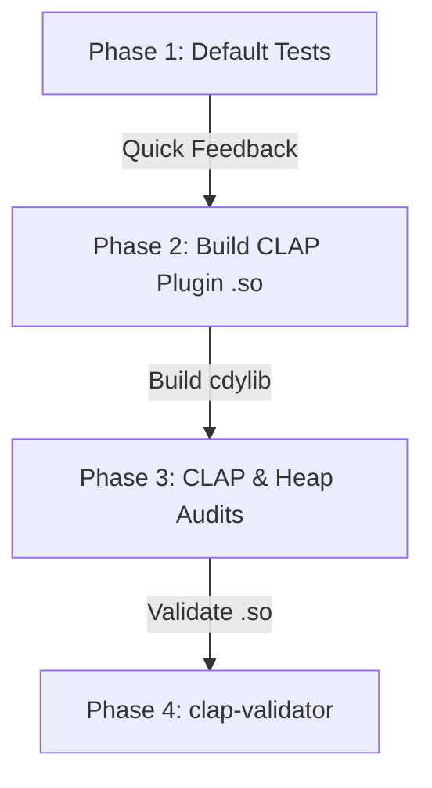

<!--
SPDX-License-Identifier: Apache-2.0
Copyright (c) 2026 Fábio Henrique de Lima Silva (fhl.bsb@gmail.com) All rights reserved.
-->

# Test Coverage Inventory by Feature Configuration

This document tracks and categorizes the test suite of `nam-rs` according to its required Cargo features and execution phases. By using targeted feature gating and specific test runners, the project ensures **100% regression coverage** and **strict RT-safety validation** while minimizing compilation and execution overhead.

---

## 1. Crate Features Taxonomy

The `nam-rs` crate defines several features in `Cargo.toml` to customize build targets and test capabilities:

| Feature Name      | Description                   | Active Dependencies / Modules                | Gated Scope                                                |
|:----------------- |:----------------------------- |:-------------------------------------------- |:---------------------------------------------------------- |
| **`standalone`**  | Native CLI + PipeWire host    | `pipewire`, `stereo`                         | `src/standalone/`, `src/main.rs`, `pw_integration_test.rs` |
| **`testing`**     | Test utilities & generators   | Gated test modules                           | `src/testing/`, `gen_stress.rs`, `wav_to_golden.rs`        |
| **`stereo`**      | Enable stereo DSP processing  | DSP input/output buffers                     | `src/dsp/pipeline/stages/input.rs` (Stereo variants)       |
| **`clap-plugin`** | CLAP format plugin + GUI      | `clack-*`, `egui`, `glow`, `baseview`, `rfd` | `src/clap/`, `clap_lifecycle_test.rs`, etc.                |
| **`heap-audit`**  | Memory watchdog tracking      | Global `CountingAllocator` interceptor       | `src/common/alloc_audit.rs`, CLAP processor heap check     |
| **`long_bench`**  | Extended criterion benchmarks | `inference_bench`                            | Benchmark cycles >30s                                      |

---

## 2. Test Execution Phase Architecture

The standard test runner script ([tests-cargo.sh](file:///home/fabio/nam-rs/utils/tests-cargo.sh)) splits test execution into four distinct phases to avoid redundant compiling and running:

### Phase 1: Core Library & Standalone (default features)

- **Active Features**: `standalone`, `testing`, `stereo` (via default features in `Cargo.toml`).
- **Goal**: Verify mathematical, DSP, and model parser correctness.
- **Redundancy Safe**: Does not compile the massive GUI/CLAP dependency graph. All core tests run in parallel.
- **Auditing**: Runs `zero_alloc_infer` integration tests using a local TLS-based fallback allocator (zero CLAP overhead).

### Phase 2 & 3: CLAP & RT-Safety Heap Audits

- **Active Features**: `clap-plugin`, `heap-audit` (along with `standalone`, `testing`).
- **Goal**: Verify thread-safe real-time constraints and CLAP plugin integration.
- **Redundancy Safe**:
  - Restricts Phase 3 unit tests to the `clap::` module to avoid re-running 400+ numeric tests.
  - Targets only CLAP/Heap-Audit integration tests (`--test a2_heap_audit`, etc.), skipping non-gated integration tests.
- **Auditing**: Delegates `TrackingGuard` and `CountingAllocator` to the compiled CLAP `.so` binary to monitor heap allocations inside the plugin.

---

## 3. Test Coverage Matrix

The following table maps every test suite, target, or binary to the features it requires and the verification phase where it is executed:

| Test Target                      | Type        | Primary Feature Gates       | Runs in Phase 1?    | Runs in Phase 3?  | Verification Goal                                                                                                                                                                             |
|:-------------------------------- |:----------- |:--------------------------- |:-------------------:|:-----------------:|:--------------------------------------------------------------------------------------------------------------------------------------------------------------------------------------------- |
| **`src/` (Core)**                | Unit Tests  | *None*                      | **Yes**             | No                | Core math, DSP kernels, model loaders (`loader::`), linear/wavenet/lstm logic                                                                                                                 |
| **`src/standalone/`**            | Unit Tests  | `standalone`                | **Yes**             | No                | CLI argument parser, PipeWire host bridge, RT setup / affinity scheduling                                                                                                                     |
| **`src/clap/`**                  | Unit Tests  | `clap-plugin`               | No                  | **Yes**           | GUI UI, window state, CLAP plugin preset extraction and parameter modulation                                                                                                                  |
| **`src/clap/` (Heap)**           | Unit Tests  | `clap-plugin`, `heap-audit` | No                  | **Yes**           | RT-safety validation of memory-watchdog triggers and SPSC swap operations                                                                                                                     |
| **`a2_loader`**                  | Integration | *None*                      | **Yes**             | No                | Model verification for A2-Lite and A2-Full shapes and parameters                                                                                                                              |
| **`adaptive_fsm_proptest`**      | Integration | *None*                      | **Yes**             | No                | FSM state transitions under varying load and jitter scenarios                                                                                                                                 |
| **`cabsim_cpp_parity`**          | Integration | *None*                      | **Yes**             | No                | Parity validation of CabSim convolution against C++ reference implementation                                                                                                                  |
| **`cabsim_golden`**              | Integration | *None*                      | **Yes**             | No                | Bitwise determinism of impulse response cab simulation                                                                                                                                        |
| **`concurrency_stress`**         | Integration | *None*                      | **Yes**             | No                | SPSC queues, multi-reader lock-free param smoothing under heavy contention                                                                                                                    |
| **`container_slimmable`**        | Integration | *None*                      | **Yes**             | No                | Seamless 32ms crossfading during container submodel swaps                                                                                                                                     |
| **`cpp_parity`**                 | Integration | *None*                      | **Yes**             | No                | Live parity checking of WaveNet (A1/A2) and LSTM models against C++ counterpart. LstmDyn, WaveNetA2Dyn, and ConvNet parity planned for upcoming épicos.                                       |
| **`diagnostic_bundle`**          | Integration | *None* (Default)            | **Yes**             | No                | Capture and formatting of system diagnostics and telemetry                                                                                                                                    |
| **`diagnostic_bundle` (Heap)**   | Integration | `heap-audit`                | No                  | **Yes**           | Zero-alloc verification of diagnostic and telemetry operations                                                                                                                                |
| **`gate_fsm_proptest`**          | Integration | *None*                      | **Yes**             | No                | Property-based tests verifying the Gate finite state machine under load                                                                                                                       |
| **`golden_vectors`**             | Integration | *None*                      | **Yes**             | No                | Golden vector cross-validation of static and dynamic models (WaveNetDyn, WaveNetA2Dyn, Condition DSP) against C++ reference. ConvNet golden validation planned for upcoming épicos.           |
| **`linear_golden`**              | Integration | *None*                      | **Yes**             | No                | Bitwise output testing of linear (simplified) models                                                                                                                                          |
| **`lstm_activation_precision`**  | Integration | *None*                      | **Yes**             | No                | Precision verification of LSTM activation gain and scaling                                                                                                                                    |
| **`lstm_model_dyn_validation`**  | Integration | *None*                      | **Yes**             | No                | Parity validation of LstmModelDyn: SIMD vs scalar, determinism, block-size invariance, zero-input edge cases, quantized head                                                                  |
| **`lstm_gate_bf16_parity`**      | Integration | *None*                      | **Yes**             | No                | Parity verification of vectorized gemv 4-gate bf16 operations                                                                                                                                 |
| **`lstm_scalar_bf16_parity`**    | Integration | *None*                      | **Yes**             | No                | Parity validation of scalar vs SIMD implementation for LSTM cells                                                                                                                             |
| **`mirror_buf_fault_injection`** | Integration | *None*                      | **Yes**             | No                | Verification of mmap mirror buffer error recovery and fault tolerance                                                                                                                         |
| **`nam_infer_test`**             | Integration | *None*                      | **Yes**             | No                | Computational stability of core models with variable block sizes                                                                                                                              |
| **`namb_v2_roundtrip`**          | Integration | *None*                      | **Yes**             | No                | Serialization and deserialization roundtrip testing of binary NAMB v2 files                                                                                                                   |
| **`namb_v2_validation`**         | Integration | *None*                      | **Yes**             | No                | Formatting and structure compliance validation of binary models                                                                                                                               |
| **`pipeline_soak`**              | Integration | `standalone`                | **Yes**             | No                | Multi-block pipeline soak testing under standalone audio threads                                                                                                                              |
| **`proptest_math`**              | Integration | *None*                      | **Yes**             | No                | Mathematical invariants testing for AVX2/AVX512 SIMD functions                                                                                                                                |
| **`proptest_parsers`**           | Integration | *None*                      | **Yes**             | No                | Robustness/fuzz testing of JSON and binary model parsers                                                                                                                                      |
| **`pw_integration_test`**        | Integration | `standalone`                | **Yes** *(Ignored)* | No                | Integration testing of standalone runner connected to PipeWire daemon                                                                                                                         |
| **`self_consistency`**           | Integration | *None*                      | **Yes**             | No                | Verification that models produce identical output across reset operations                                                                                                                     |
| **`soak_test`**                  | Integration | *None*                      | **Yes** *(Ignored)* | No                | Long-duration soak testing (10M+ frames) of static models under varying input signals. Dynamic engine (WaveNetDyn, LstmDyn, WaveNetA2Dyn) and ConvNet soak tests planned for upcoming épicos. |
| **`spsc_pipeline`**              | Integration | *None*                      | **Yes**             | No                | End-to-end testing of the lock-free SPSC pipeline model swapping                                                                                                                              |
| **`threshold_calibration`**      | Integration | *None*                      | **Yes**             | No                | Verification of calibrated noise/gate thresholds for reference models                                                                                                                         |
| **`wavenet_prewarm_edge`**       | Integration | *None*                      | **Yes**             | No                | Edge-case verification of WaveNet pre-warm and receptive field samples                                                                                                                        |
| **`zero_alloc_infer`**           | Integration | *None* (TLS Mode)           | **Yes**             | No                | Proving zero-alloc of WaveNet, LSTM, and container transitions in TLS mode                                                                                                                    |
| **`a2_heap_audit`**              | Integration | `heap-audit`                | No                  | **Yes**           | Zero-alloc verification of WaveNet A2-Full/A2-Lite under CDYLIB                                                                                                                               |
| **`cabsim_heap_audit`**          | Integration | `heap-audit`                | No                  | **Yes**           | Zero-alloc verification of partition convolution under CDYLIB                                                                                                                                 |
| **`resampler_heap_audit`**       | Integration | `heap-audit`                | No                  | **Yes**           | Zero-alloc verification of sinc-interpolation sample rate converters                                                                                                                          |
| **`clap_lifecycle_test`**        | Integration | `clap-plugin`               | No                  | **Yes**           | Life-cycle tracking of CLAP host instantiation, activation, and destruction                                                                                                                   |
| **`clap_state_migration`**       | Integration | `clap-plugin`               | No                  | **Yes**           | Robustness of loading v0 legacy states and migration to v1 json schemas                                                                                                                       |
| **`clap_multi_instance`**        | Integration | `clap-plugin`               | No                  | **Yes**           | Multi-instance safety, proving host parameters and state do not bleed                                                                                                                         |
| **`clap-validator`**             | External    | CLAP dynamic plugin         | No                  | **Yes** (Phase 4) | Strict validation of the `.so` binary against official CLAP interface rules                                                                                                                   |

---

## 4. Summary of Decoupled Sprints (Long Audits)

Certain tests are marked as `#[ignore]` in the standard suite to keep execution times fast (under 1.5 minutes). These tests are deferred to the nightly/pre-release auditing script ([tests-long.sh](file:///home/fabio/nam-rs/utils/tests-long.sh)) and run in 6 phases:

1. **Soak Testing**: Long endurance runs (1+ hours) of DSP/model inference under continuous feed to identify leaks or buffer drifts (`tests/soak_test.rs`, `tests/pipeline_soak.rs`).
2. **Property-Based and FSM Sweeps**: Extensive proptests, FSM transition validations, and fuzzing checks (`tests/proptest_parsers.rs`, `tests/proptest_math.rs`, `tests/lstm_gate_bf16_parity.rs`, `tests/lstm_scalar_bf16_parity.rs`, `tests/gate_fsm_proptest.rs`, `tests/adaptive_fsm_proptest.rs`, `src/dsp/pipeline/pipeline_block_test.rs`).
3. **C++ Parity and Golden Validation**: Detailed comparison sweeps against official C++ NAM binaries and long v2 multi-SR golden comparison files (`tests/cpp_parity.rs`, `tests/cabsim_cpp_parity.rs`, `tests/golden_vectors.rs`).
4. **Release-Mode CLAP Auditing & Concurrency**: Validator audits and heavy concurrency/swap stress testing on the final highly-optimized release `.so` plugin (`tests/clap_multi_instance.rs`, `src/clap/processor_test.rs`, `tests/concurrency_stress.rs`).
5. **Criterion Performance Benchmarks**: Measurement of DSP block runtime budgets and throughput limits (`benches/`).
6. **PipeWire Integration Test**: Live integration testing of the standalone host running against a PipeWire daemon (`tests/pw_integration_test.rs`).

---

## 5. Ignored Tests Mapping Matrix

The following table documents all ignored tests in the repository, explaining why they are gated from standard CI, where they run, and their execution frequency:

| Test/Suite Target                             | Ignored Tests / Scope                                                     | Reason for `#[ignore]`                                                                            | Suite Execution      | Frequency             |
|:--------------------------------------------- |:------------------------------------------------------------------------- |:------------------------------------------------------------------------------------------------- |:-------------------- |:--------------------- |
| **`tests/soak_test.rs`**                      | `test_*_soak`, `test_*_endurance`                                         | Extended duration execution (>1 hour) to find memory leaks or buffer drift.                       | Long Suite (Phase 1) | Pre-release / Nightly |
| **`tests/pipeline_soak.rs`**                  | `test_pipeline_soak_*`                                                    | Endurance testing of full audio thread capture-DSP-bridge-playback pipeline.                      | Long Suite (Phase 1) | Pre-release / Nightly |
| **`tests/proptest_parsers.rs`**               | `prop_fuzz_*`                                                             | Adversarial fuzz testing of JSON and binary model parsers with up to 100k test cases.             | Long Suite (Phase 2) | Pre-release / Nightly |
| **`tests/proptest_math.rs`**                  | `prop_*`                                                                  | Mathematical invariant fuzz testing for AVX2/AVX512 SIMD kernels.                                 | Long Suite (Phase 2) | Pre-release / Nightly |
| **`tests/lstm_gate_bf16_parity.rs`**          | `prop_*`                                                                  | Fuzz testing of SIMD gate bf16 calculations.                                                      | Long Suite (Phase 2) | Pre-release / Nightly |
| **`tests/lstm_scalar_bf16_parity.rs`**        | `prop_*`                                                                  | Fuzz testing of scalar vs SIMD bf16 calculations.                                                 | Long Suite (Phase 2) | Pre-release / Nightly |
| **`tests/gate_fsm_proptest.rs`**              | `prop_*`                                                                  | Fuzz testing of Gate FSM states under varying loads and jitter.                                   | Long Suite (Phase 2) | Pre-release / Nightly |
| **`tests/adaptive_fsm_proptest.rs`**          | `test_adaptive_fsm_*`                                                     | Property-based sweeps verifying the Adaptive Compute FSM transitions under jitter and overload.   | Long Suite (Phase 2) | Pre-release / Nightly |
| **`src/dsp/pipeline/pipeline_block_test.rs`** | `test_random_block_sizes_proptest`                                        | Proptest sweeping random buffer block sizes to find potential out-of-bounds/resampling issues.    | Long Suite (Phase 2) | Pre-release / Nightly |
| **`tests/cpp_parity.rs`**                     | `live_cross_validation_*` (except lite)                                   | Compiles and runs live comparisons against C++ toolchain (requires C++ compiler).                 | Long Suite (Phase 3) | Pre-release / Nightly |
| **`tests/cpp_parity.rs`**                     | `live_cross_validation_*_lite`                                            | **Skipped (Known Divergent)**: WaveNet Lite (CH=12) exhibits numerical drift against C++.         | Skipped              | Defer to T2.2.1       |
| **`tests/cabsim_cpp_parity.rs`**              | `test_cabsim_golden_*`                                                    | Live convolution validation against NeuralAmpModelerCore C++ convolution engine.                  | Long Suite (Phase 3) | Pre-release / Nightly |
| **`tests/golden_vectors.rs`**                 | `test_golden_vectors_v2_*` (except lite)                                  | Long 5-second multi-SR golden comparison files (up to 960k samples per test).                     | Long Suite (Phase 3) | Pre-release / Nightly |
| **`tests/golden_vectors.rs`**                 | `test_golden_vectors_wavenet_lite`, `test_golden_vectors_v2_wavenet_lite` | **Ignored (Known Divergent)**: A1 WaveNet Lite (CH=12) exhibits drift (SNR = 0.9 dB) against C++. | None                 | Defer to T2.2.1       |
| **`tests/clap_multi_instance.rs`**            | `test_multi_instance_stress`                                              | Concurrency swap stress test to ensure parallel instances don't corrupt SPSC state.               | Long Suite (Phase 4) | Pre-release / Nightly |
| **`src/clap/processor_test.rs`**              | `test_gc_stress_1000_swaps`                                               | Heavy GC swap test (1000 iterations) exceeding standard SPSC channel limits.                      | Long Suite (Phase 4) | Pre-release / Nightly |
| **`tests/concurrency_stress.rs`**             | `test_*_concurrent_*`, `test_t6_3_*`                                      | Heavy multi-reader lock-free param contention sweeps.                                             | Long Suite (Phase 4) | Pre-release / Nightly |
| **`tests/pw_integration_test.rs`**            | `test_pipewire_host_loop`                                                 | Requires a running PipeWire daemon environment (session/system level).                            | Long Suite (Phase 6) | Pre-release / Nightly |

---

## 6. Fail-Fast vs. Complete View Policy

To align test execution with developer workflows and integration schedules, the test suites implement two different error-handling strategies:

### 6.1. Fail-Fast (Standard QA Suite)

- **Script**: [tests-cargo.sh](file:///home/fabio/nam-rs/utils/tests-cargo.sh)
- **Goal**: Minimize the feedback loop during local iterations and pre-commit checks.
- **Behavior**: If any test target compilation, test execution, or validation step fails, the script immediately terminates. It does not attempt to execute subsequent phases or steps.
- **Configuration**: Managed using `set -e` in the bash runner. Cargo commands execute default target-level fail-fast behavior.

### 6.2. Complete View (Long-Duration Audit Suite)

- **Script**: [tests-long.sh](file:///home/fabio/nam-rs/utils/tests-long.sh)
- **Goal**: Provide a complete, comprehensive report of all test, parity, and performance outcomes for nightlies or release gates.
- **Behavior**: Even if a test command or phase fails, execution continues. All phases are executed, and all logs are collected.
- **Configuration**:
  - Phase wrappers execute with `|| true` to prevent shell-level aborts.
  - Cargo test targets within a phase run with `--no-fail-fast` to guarantee that all test targets run regardless of individual failure.
  - Sub-commands are chained using a custom tracking variable (`status=0; cmd1 || status=1; cmd2 || status=1; [ $status -eq 0 ]`) to capture failures without aborting the sequence early.
  - A beautiful audit summary table is compiled and printed at the end.
  - If any phase failed, the script exits with a non-zero code (`1`) at the very end.
