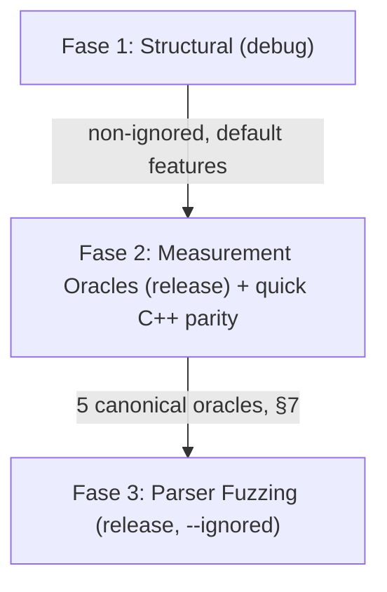

<!--
SPDX-License-Identifier: Apache-2.0
Copyright (c) 2026 Fábio Henrique de Lima Silva (fhl.bsb@gmail.com) All rights reserved.
-->

# Test Coverage Inventory by Feature Configuration

This document tracks and categorizes the test suite of `nam-rs` according to its required Cargo features and execution phases. By using targeted feature gating and specific test runners, the project ensures **100% regression coverage** and **strict RT-safety validation** while minimizing compilation and execution overhead.

> [!NOTE]
> **Document scope.** This document covers the *functional/correctness* `cargo test` architecture: [utils/tests-quick.sh](../utils/tests-quick.sh) (agile first line) and [utils/tests-long.sh](../utils/tests-long.sh) (nightly/pre-release audit). Static analysis ([utils/lints.sh](../utils/lints.sh)) and performance benchmarking are out of scope here:
>
> - [utils/tests-performance-regression.sh](../utils/tests-performance-regression.sh) is the canonical, baseline-gated performance-regression wall. Its full rationale, workflow, and troubleshooting live in [benchmarks.md](benchmarks.md) ("Regression Gate" section).
> - [utils/tests-long.sh](../utils/tests-long.sh) Phase 6 (§4 below) additionally runs the full Criterion bench suite for the record, with no baseline gating of its own.

---

## 1. Crate Features Taxonomy

The `nam-rs` crate defines several features in [Cargo.toml](../Cargo.toml) to customize build targets and test capabilities:

| Feature Name         | Description                      | Active Dependencies / Modules                | Gated Scope                                                                                                                                               |
|:-------------------- |:-------------------------------- |:-------------------------------------------- |:--------------------------------------------------------------------------------------------------------------------------------------------------------- |
| **`standalone`**     | Native CLI + PipeWire host       | `pipewire`, `stereo`                         | [src/standalone/](../src/standalone/), [src/main.rs](../src/main.rs), [tests/perf_soak/pw_integration_test.rs](../tests/perf_soak/pw_integration_test.rs) |
| **`testing`**        | Test utilities & generators      | Gated test modules & binary tools            | [src/testing/](../src/testing/), `gen_stress`, `wav_to_golden`, `pgo_profiling_workload`                                                                  |
| **`stereo`**         | Enable stereo DSP processing     | DSP input/output buffers                     | [src/dsp/pipeline/stages/input.rs](../src/dsp/pipeline/stages/input.rs) (Stereo variants)                                                                 |
| **`clap-plugin`**    | CLAP format plugin + egui GUI    | `clack-*`, `egui`, `glow`, `baseview`, `rfd` | [src/clap/](../src/clap/), [tests/clap/](../tests/clap/)                                                                                                  |
| **`heap-audit`**     | Memory watchdog tracking         | Global `CountingAllocator` interceptor       | [src/common/alloc_audit.rs](../src/common/alloc_audit.rs), [tests/rt_constraints/](../tests/rt_constraints/) heap checks                                  |
| **`long_bench`**     | Extended criterion benchmarks    | `long_inference_bench`                       | [benches/long_inference_bench.rs](../benches/long_inference_bench.rs) (benchmark cycles >30s)                                                             |
| **`pgo`**            | Profile-Guided Optimization flag | Compiler flags switcher                      | [utils/build-release.sh](../utils/build-release.sh), `pgo_profiling_workload`                                                                             |
| **`dynamic-engine`** | A2 dynamic engine runtime        | A2 dynamic compute submodules                | [src/dsp/engine/](../src/dsp/engine/)                                                                                                                     |

---

## 2. Test Execution Phase Architecture — Two-Axis Model

Test placement is governed by **two orthogonal axes**, not by a single "fast vs. slow" heuristic:

- **Axis A — Rigor (encoded via `#[ignore]`):** non-ignored = first line of defense (runs every sprint, several times a day); `#[ignore]` = long/rigorous (runs ~1×/day via `--ignored`). This is the *rigor* axis.
- **Axis B — Codegen Path (encoded via debug vs. `--release`):** structural tests (logic, parsers, FSM, bitwise determinism) run in **debug** (cheap, with `debug-assertions` ON, where float codegen is irrelevant); measurement oracles (anything comparing floats against a reference) run in **`--release`** (the codegen path users actually execute). Measuring in debug guards a "phantom" — codegen without `-O3`, without FMA contraction, without auto-vectorization.

The quick suite ([utils/tests-quick.sh](../utils/tests-quick.sh)) has three phases that respect both axes:



### Phase 1 — Structural (debug, default features)

- **Goal:** logic, parsers, FSM transitions, loaders, SPSC, bitwise determinism.
- **Scope:** `cargo test --lib` (unit, auto-discovered) + the 5 integration entry-points ([tests/models.rs](../tests/models.rs), [tests/perf_soak.rs](../tests/perf_soak.rs), [tests/parity.rs](../tests/parity.rs), [tests/rt_constraints.rs](../tests/rt_constraints.rs), and conditionally [tests/clap.rs](../tests/clap.rs)).
- **Excluded by design** (via `--skip <module>::` module-prefix filters — exact module matches):
  - The measurement-oracle modules (→ Phase 2, release): `golden_vectors`, `cpp_parity`, `reference_oracle_f64`, `isa_parity`, `spectral_fidelity`, `linear_fft_test`. Running them in debug would both duplicate Phase 2 and measure a codegen "phantom" (Axis B, §7).
  - `rt_deadline` / `rt_jitter` (timing characterization → long Phase 7, release-only; asserting deadlines in debug is meaningless).
  - `proptest_parsers` (parser fuzzing → Phase 3, release `--ignored`).
- **Parallel execution safety:** Integration tests run in parallel by default (`--test-threads > 1`). Process-wide mutable state (such as activation mode precision in `src/math/activations/mod.rs`) is guarded by atomic state wrappers (`AtomicUsize`) and thread guards (`PrecisionGuard`, `REPORT_LOCK`).

### Phase 2 — Measurement Oracles (release, gate of production floats)

- **Goal:** the 5 canonical oracles of §7 measure the float path that ships.
- **Scope (combined into a single `cargo test` invocation per dependency branch to avoid recompiling `nam-rs` multiple times):**
  - Always: `reference_oracle_f64` + `spectral_fidelity` + `linear_fft_test` (committed dependencies; mathematical oracle tests always run, C++ golden tests skip gracefully when goldens absent).
  - With committed goldens: `golden_vectors` (v1) + `isa_parity` (v2, requires `--test-threads=1` per §7; the others tolerate parallel execution).
  - With `NeuralAmpModelerCore`: `cpp_parity quick_parity` (separate invocation — the `quick_parity` filter would suppress other oracles if combined). Covers LSTM 1×16 (Fast + HF), WaveNet CH16 (Fast + HF), A2-Full, and ConvNet (note: ConvNet skips at runtime as C++ NAMCore render expects standard layout).
- **Prerequisites:** gracefully skipped if goldens or NAMCore dependencies are absent.

### Phase 3 — Parser Fuzzing (release, `--ignored`, capped)

- **Goal:** Tier 1 parser robustness and security verification.
- **Scope:** `proptest_parsers` with `PROPTEST_CASES=1000` (configurable via `NAM_QUICK_PROPTEST_CASES`). The long suite runs the full case counts (up to 100,000 cases).

### CLAP & RT-Safety Heap Audits — delegated to the long suite

- CLAP build, heap-audit integration tests, `clap_lifecycle_test`, `clap_state_migration`, `clap_multi_instance`, `tail_semantics`, `diagnostic_bundle` heap variant, and `clap-validator` all run in [utils/tests-long.sh](../utils/tests-long.sh) Phase 4–5 in **release**. They are out of the quick loop.

### Golden Vector Supply Chain

Phase 2's `golden_vectors` (v1) and `isa_parity` (v2), and the long suite's `cpp_parity` full matrix and `golden_vectors` v2 multi-SR, compare against pre-committed `.bin` golden files rendered off-line by [tests/fixtures/golden_gen_build.sh](../tests/fixtures/golden_gen_build.sh) against pinned reference versions defined in [variables.env](../variables.env).

- **Golden Freshness Manifest:** [tests/fixtures/golden_gen_build.sh](../tests/fixtures/golden_gen_build.sh) commits a versioned `.golden_manifest.sha256` freshness manifest checked automatically by [utils/tests-quick.sh](../utils/tests-quick.sh) Phase 2. A `sha256sum`-based gate hard-fails if a `.nam` model is modified without regenerating the corresponding golden vector.

---

## 3. Test Coverage Matrix

The following table maps every test module across the 5 integration entry points ([models](../tests/models.rs), [parity](../tests/parity.rs), [perf_soak](../tests/perf_soak.rs), [rt_constraints](../tests/rt_constraints.rs), [clap](../tests/clap.rs)) and standalone test files:

| Test Module Target                                                                    | Entry Point      | Type        | Required Features           | Quick Phase 1 (debug)     | Quick Phase 2 (release)  | Quick Phase 3 (release, ignored) | Long Suite                           | Verification Goal                                                                                                                          |
|:------------------------------------------------------------------------------------- |:---------------- |:----------- |:--------------------------- |:-------------------------:|:------------------------:|:--------------------------------:|:------------------------------------:|:------------------------------------------------------------------------------------------------------------------------------------------ |
| **`src/` (Core)**                                                                     | Core Lib         | Unit        | *None*                      | **Yes**                   | No                       | No                               | No                                   | Core math, DSP kernels, model loaders (`loader::`), linear/wavenet/lstm logic                                                              |
| **`src/standalone/`**                                                                 | Core Lib         | Unit        | `standalone`                | **Yes**                   | No                       | No                               | No                                   | CLI argument parser, PipeWire host bridge, RT setup / affinity scheduling                                                                  |
| **`src/clap/`**                                                                       | Core Lib         | Unit        | `clap-plugin`               | No                        | No                       | No                               | **Yes** (Phase 5)                    | Plugin GUI UI, window state, CLAP plugin preset extraction and parameter modulation                                                        |
| **`src/clap/` (Heap)**                                                                | Core Lib         | Unit        | `clap-plugin`, `heap-audit` | No                        | No                       | No                               | **Yes** (Phase 5)                    | RT-safety validation of memory-watchdog triggers and SPSC swap operations                                                                  |
| **[a2_loader](../tests/models/a2_loader.rs)**                                         | `models`         | Integration | *None*                      | **Yes**                   | No                       | No                               | No                                   | Model verification for A2-Lite and A2-Full shapes and parameters                                                                           |
| **[activation_precision](../tests/models/activation_precision.rs)**                   | `models`         | Integration | *None*                      | **Yes**                   | No                       | No                               | No                                   | Precision verification of WaveNet activation gain and scaling                                                                              |
| **[adaptive_fsm_proptest](../tests/models/adaptive_fsm_proptest.rs)**                 | `models`         | Integration | *None*                      | **Yes** *(ignored)*       | No                       | No                               | **Yes** (Phase 3)                    | FSM state transitions under varying load and jitter scenarios                                                                              |
| **[cabsim_cpp_parity](../tests/parity/cabsim_cpp_parity.rs)**                         | `parity`         | Integration | *None*                      | No                        | No                       | No                               | **Yes** (Phase 3)                    | Parity validation of CabSim convolution against C++ reference implementation                                                               |
| **[cabsim_golden](../tests/models/cabsim_golden.rs)**                                 | `models`         | Integration | *None*                      | **Yes** *(ignored)*       | No                       | No                               | No                                   | Bitwise determinism of impulse response cab simulation                                                                                     |
| **[concurrency_stress](../tests/perf_soak/concurrency_stress.rs)**                    | `perf_soak`      | Integration | *None*                      | **Yes** *(ignored)*       | No                       | No                               | **Yes** (Phase 5)                    | SPSC queues, multi-reader lock-free param smoothing under heavy contention                                                                 |
| **[container_slimmable](../tests/models/container_slimmable.rs)**                     | `models`         | Integration | *None*                      | **Yes**                   | No                       | No                               | No                                   | Seamless 32ms crossfading during container submodel swaps                                                                                  |
| **[cpp_parity](../tests/parity/cpp_parity.rs)**                                       | `parity`         | Integration | *None*                      | No                        | **Yes** (`quick_parity`) | No                               | **Yes** (Phase 3, ignored)           | Live parity checking of WaveNet (A1/A2) and LSTM models against C++ counterpart. Quick subset (6 tests/4 models) in Phase 2; full in long. |
| **[diagnostic_bundle](../tests/models/diagnostic_bundle.rs)**                         | `models`         | Integration | *None*                      | **Yes**                   | No                       | No                               | No                                   | Capture and formatting of system diagnostics and telemetry                                                                                 |
| **[diagnostic_bundle](../tests/models/diagnostic_bundle.rs) (Heap)**                  | `models`         | Integration | `heap-audit`                | No                        | No                       | No                               | **Yes** (Phase 4)                    | Zero-alloc verification of diagnostic and telemetry operations                                                                             |
| **[ebu_lufs_compliance](../tests/models/ebu_lufs_compliance.rs)**                     | `models`         | Integration | *None*                      | **Yes**                   | No                       | No                               | No                                   | EBU R128 / ITU BS.1770 loudness compliance verification                                                                                    |
| **[fixture_b1_2_smoke](../tests/models/fixture_b1_2_smoke.rs)**                       | `models`         | Integration | *None*                      | **Yes**                   | No                       | No                               | No                                   | Smoke test for synthetic fixture model generation and integrity                                                                            |
| **[gate_fsm_proptest](../tests/models/gate_fsm_proptest.rs)**                         | `models`         | Integration | *None*                      | No                        | No                       | No                               | **Yes** (Phase 3)                    | Property-based tests verifying the Gate finite state machine under load                                                                    |
| **[golden_vectors](../tests/models/golden_vectors.rs)**                               | `models`         | Integration | *None*                      | No                        | **Yes** (v1)             | No                               | **Yes** (Phase 3, v2 ignored)        | Golden vector cross-validation of static and dynamic models against C++ reference. v1 (2048 samples) in Phase 2; v2 multi-SR in long.      |
| **[linear_golden](../tests/models/linear_golden.rs)**                                 | `models`         | Integration | *None*                      | **Yes** *(ignored)*       | No                       | No                               | **Yes** (Phase 3)                    | Bitwise output testing of linear (simplified) models                                                                                       |
| **[linear_fft_test](../tests/models/linear_fft_test.rs)**                             | `models`         | Integration | *None*                      | No                        | **Yes**                  | No                               | No                                   | Partitioned convolution cross-validation (Linear FFT). Math oracle tests always run; C++ golden tests skip when goldens absent.            |
| **[loom_tests](../tests/loom_tests.rs)**                                              | Standalone       | Integration | `loom` (cfg)                | No                        | No                       | No                               | On demand                            | Model-checking verification for lock-free concurrency primitives using `loom`                                                              |
| **[lstm_activation_precision](../tests/models/lstm_activation_precision.rs)**         | `models`         | Integration | *None*                      | **Yes**                   | No                       | No                               | No                                   | Precision verification of LSTM activation gain and scaling                                                                                 |
| **[lstm_model_dyn_validation](../tests/models/lstm_model_dyn_validation.rs)**         | `models`         | Integration | *None*                      | **Yes** *(ignored)*       | No                       | No                               | **Yes** (Phase 3)                    | Parity validation of LstmModelDyn: SIMD vs scalar, determinism, block-size invariance, zero-input edge cases, quantized head               |
| **[lstm_gate_bf16_parity](../tests/parity/lstm_gate_bf16_parity.rs)**                 | `parity`         | Integration | *None*                      | No                        | No                       | No                               | **Yes** (Phase 3)                    | Parity verification of vectorized gemv 4-gate bf16 operations                                                                              |
| **[lstm_scalar_bf16_parity](../tests/parity/lstm_scalar_bf16_parity.rs)**             | `parity`         | Integration | *None*                      | No                        | No                       | No                               | **Yes** (Phase 3)                    | Parity validation of scalar vs SIMD implementation for LSTM cells                                                                          |
| **[meta_coherence](../tests/models/meta_coherence.rs)**                               | `models`         | Integration | *None*                      | **Yes**                   | No                       | No                               | **Yes** (Pre-flight, blocking)       | Meta-test asserting golden-catalog ↔ ignored-test model coherence before Phase 1 long suite execution                                      |
| **[mirror_buf_fault_injection](../tests/models/mirror_buf_fault_injection.rs)**       | `models`         | Integration | *None*                      | **Yes**                   | No                       | No                               | No                                   | Verification of mmap mirror buffer error recovery and fault tolerance                                                                      |
| **[nam_infer_test](../tests/models/nam_infer_test.rs)**                               | `models`         | Integration | *None*                      | **Yes**                   | No                       | No                               | No                                   | Computational stability of core models with variable block sizes                                                                           |
| **[namb_v2_roundtrip](../tests/models/namb_v2_roundtrip.rs)**                         | `models`         | Integration | *None*                      | **Yes**                   | No                       | No                               | No                                   | Serialization and deserialization roundtrip testing of binary NAMB v2 files                                                                |
| **[namb_v2_validation](../tests/models/namb_v2_validation.rs)**                       | `models`         | Integration | *None*                      | **Yes**                   | No                       | No                               | No                                   | Formatting and structure compliance validation of binary models                                                                            |
| **[nondist_validation](../tests/models/nondist_validation.rs)**                       | `models`         | Integration | *None*                      | **Yes**                   | No                       | No                               | No                                   | Non-distributable model validation battery (parsing, determinism, block invariance, denormal silence)                                      |
| **[oversampling_characterization](../tests/models/oversampling_characterization.rs)** | `models`         | Integration | *None*                      | No                        | No                       | No                               | On demand                            | Empirical ASR/ESR/MR-STFT measurements of LSTM models under 2×/4× oversampling. All tests `#[ignore]` (require model files).               |
| **[parity_primitives](../tests/parity/parity_primitives.rs)**                         | `parity`         | Integration | *None*                      | **Yes**                   | No                       | No                               | No                                   | Parity verification of DSP primitives (tanh, sigmoid, convolution, dot product)                                                            |
| **[pipeline_soak](../tests/perf_soak/pipeline_soak.rs)**                              | `perf_soak`      | Integration | `standalone`                | No                        | No                       | No                               | **Yes** (Phase 1)                    | Multi-block pipeline soak testing under standalone audio threads                                                                           |
| **[prewarm_test](../tests/models/prewarm_test.rs)**                                   | `models`         | Integration | *None*                      | **Yes**                   | No                       | No                               | No                                   | Verification of WaveNet/LSTM prewarm buffer correctness and zero-alloc guarantees                                                          |
| **[proptest_math](../tests/models/proptest_math.rs)**                                 | `models`         | Integration | *None*                      | **Yes** (1 test)          | No                       | No                               | **Yes** (Phase 3, ignored)           | Mathematical invariants testing for AVX2/AVX512 SIMD functions                                                                             |
| **[proptest_parsers](../tests/models/proptest_parsers.rs)**                           | `models`         | Integration | *None*                      | No                        | No                       | **Yes** (capped 1000)            | **Yes** (Phase 3, full)              | Robustness/fuzz testing of JSON and binary model parsers                                                                                   |
| **[pw_integration_test](../tests/perf_soak/pw_integration_test.rs)**                  | `perf_soak`      | Integration | `standalone`                | No                        | No                       | No                               | **Yes** (Phase 2)                    | Integration testing of standalone runner connected to PipeWire daemon (skips if daemon unreachable)                                        |
| **[reference_oracle_f64](../tests/parity/reference_oracle_f64.rs)**                   | `parity`         | Integration | *None*                      | No                        | **Yes**                  | No                               | No                                   | f64 oracle decomposition — absolute precision vs mathematical ideal (§7, §8)                                                               |
| **[isa_parity](../tests/parity/isa_parity.rs)**                                       | `parity`         | Integration | *None*                      | No                        | **Yes** (AVX2)           | No                               | **Yes** (Phase 3, AVX-512 ignored)   | ISA determinism: AVX2 self-consistency in Phase 2; full cross-ISA matrix in long.                                                          |
| **[spectral_fidelity](../tests/models/spectral_fidelity.rs)**                         | `models`         | Integration | *None*                      | No                        | **Yes**                  | No                               | **Yes** (Phase 3, baselines ignored) | Spectral quality: ASR, Farina FR+THD, THD+N, IMD. Synthetic in Phase 2; per-model baselines in long.                                       |
| **[rt_deadline](../tests/rt_constraints/rt_deadline.rs)**                             | `rt_constraints` | Integration | *None*                      | No                        | No                       | No                               | **Yes** (Phase 7, release)           | RT deadline gate — asserts p99 < 1.33 ms (release-only; meaningless in debug).                                                             |
| **[rt_jitter](../tests/rt_constraints/rt_jitter.rs)**                                 | `rt_constraints` | Integration | *None*                      | No                        | No                       | No                               | **Yes** (Phase 7, ignored)           | RT jitter characterization under CPU contention (release-only; all tests `#[ignore]`).                                                     |
| **[self_consistency](../tests/models/self_consistency.rs)**                           | `models`         | Integration | *None*                      | **Yes**                   | No                       | No                               | No                                   | Verification that models produce identical output across reset operations                                                                  |
| **[soak_test](../tests/perf_soak/soak_test.rs)**                                      | `perf_soak`      | Integration | *None*                      | **Yes** *(1 non-ignored)* | No                       | No                               | **Yes** (Phase 1, ignored)           | Long-duration soak testing (10M+ frames). One decomposition test stays non-ignored; the rest run in long.                                  |
| **[spsc_pipeline](../tests/perf_soak/spsc_pipeline.rs)**                              | `perf_soak`      | Integration | *None*                      | **Yes**                   | No                       | No                               | No                                   | End-to-end testing of the lock-free SPSC pipeline model swapping                                                                           |
| **[thp_coherence](../tests/models/thp_coherence.rs)**                                 | `models`         | Integration | *None*                      | **Yes**                   | No                       | No                               | No                                   | Transparent Huge Pages (THP) prctl configuration & system memory alignment coherence                                                       |
| **[threshold_calibration](../tests/models/threshold_calibration.rs)**                 | `models`         | Integration | *None*                      | **Yes**                   | No                       | No                               | No                                   | Verification of calibrated noise/gate thresholds for reference models                                                                      |
| **[wavenet_lite_block_invariance](../tests/models/wavenet_lite_block_invariance.rs)** | `models`         | Integration | *None*                      | **Yes**                   | No                       | No                               | No                                   | Block-size invariance of WaveNet-lite output (determinism)                                                                                 |
| **[wavenet_prewarm_edge](../tests/models/wavenet_prewarm_edge.rs)**                   | `models`         | Integration | *None*                      | **Yes**                   | No                       | No                               | No                                   | Edge-case verification of WaveNet pre-warm and receptive field samples                                                                     |
| **[zero_alloc_infer](../tests/models/zero_alloc_infer.rs)**                           | `models`         | Integration | *None* (TLS Mode)           | **Yes**                   | No                       | No                               | No                                   | Proving zero-alloc of WaveNet, LSTM, and container transitions in TLS mode                                                                 |
| **[a2_heap_audit](../tests/rt_constraints/a2_heap_audit.rs)**                         | `rt_constraints` | Integration | `heap-audit`                | No                        | No                       | No                               | **Yes** (Phase 4)                    | Zero-alloc verification of WaveNet A2-Full/A2-Lite under CDYLIB                                                                            |
| **[cabsim_heap_audit](../tests/rt_constraints/cabsim_heap_audit.rs)**                 | `rt_constraints` | Integration | `heap-audit`                | No                        | No                       | No                               | **Yes** (Phase 4)                    | Zero-alloc verification of partition convolution under CDYLIB                                                                              |
| **[resampler_heap_audit](../tests/rt_constraints/resampler_heap_audit.rs)**           | `rt_constraints` | Integration | `heap-audit`                | No                        | No                       | No                               | **Yes** (Phase 4)                    | Zero-alloc verification of sinc-interpolation sample rate converters                                                                       |
| **[clap_lifecycle_test](../tests/clap/clap_lifecycle_test.rs)**                       | `clap`           | Integration | `clap-plugin`               | No                        | No                       | No                               | **Yes** (Phase 5)                    | Life-cycle tracking of CLAP host instantiation, activation, and destruction                                                                |
| **[clap_state_migration](../tests/clap/clap_state_migration.rs)**                     | `clap`           | Integration | `clap-plugin`               | No                        | No                       | No                               | **Yes** (Phase 5)                    | Robustness of loading legacy v0 states and migration to v1 JSON schemas                                                                    |
| **[clap_multi_instance](../tests/clap/clap_multi_instance.rs)**                       | `clap`           | Integration | `clap-plugin`               | No                        | No                       | No                               | **Yes** (Phase 5)                    | Multi-instance safety, proving host parameters and state do not bleed between instances                                                    |
| **[tail_semantics](../tests/clap/tail_semantics.rs)**                                 | `clap`           | Integration | `clap-plugin`               | No                        | No                       | No                               | **Yes** (Phase 5)                    | CLAP tail flush semantics & sample decay verification                                                                                      |
| **[clap_parity_multi_sr](../tests/clap/clap_parity_multi_sr.rs)**                     | `clap`           | Integration | `clap-plugin`               | **Yes** (smoke)           | No                       | No                               | **Yes** (Phase 5, ignored)           | End-to-end CLAP `.so` parity against NAMCore C++ oracle at multiple sample rates with irregular buffers (smoke test runs without NAMCore)  |
| **[artifact_validator](../tests/clap/artifact_validator.rs)**                         | `clap`           | Integration | `clap-plugin`               | **Yes**                   | No                       | No                               | No                                   | Resolves freshly-built `.so` artifact path and validates SHA256 integrity (S8-E8-T02)                                                      |
| **[doc_inventory](../tests/models/doc_inventory.rs)**                                 | `models`         | Integration | *None*                      | **Yes**                   | No                       | No                               | **Yes** (Pre-flight, blocking)       | Meta-test scanning docs/ and utils/ for script references, feature flags, and source paths coherence (S8-E8-T03)                           |
| **`src/clap/host_harness.rs`**                                                        | `clap`           | Unit (lib)  | `clap-plugin`               | **Yes**                   | No                       | No                               | No                                   | Complete CLAP host simulation harness with thread-check, restart, latency/tail/preset-load tracking (S8-E8-T01)                            |
| **`src/clap/processor_gui_test.rs` (headless)**                                       | `clap`           | Unit (lib)  | `clap-plugin`               | No                        | No                       | No                               | **Yes** (Phase 5, Xvfb required)     | Headless GUI lifecycle (floating window create → set_transient → destroy) and X11 clipboard round-trip under Xvfb (S8-E8-T05)              |
| **`clap-validator`**                                                                  | External Host    | External    | CLAP dynamic plugin         | No                        | No                       | No                               | **Yes** (Phase 5)                    | Strict validation of the `.so` binary against official CLAP interface rules                                                                |

> **Expected validator noise:** `clap-validator`'s `state-invalid` test intentionally loads an empty state buffer and asserts the plugin returns `false`. The `[CLAP_PLUGIN_ERROR] Empty state buffer` line this produces in the validator output is emitted by the validator host-side logger reacting to that `false`. Seeing this line with the `state-invalid` sub-test `PASSED` is expected.

---

## 4. Summary of Decoupled Audits (Long QA Suite)

Certain tests are marked as `#[ignore]` in the standard suite to keep execution times fast (~2 minutes). The core C++ parity, parser fuzzing, and SIMD precision gates run in Phase 2/3 of the quick QA suite. The remaining ignored tests are deferred to the nightly/pre-release auditing script ([utils/tests-long.sh](../utils/tests-long.sh)).

Before any timed phase, a **blocking pre-flight gate** runs [tests/models/meta_coherence.rs](../tests/models/meta_coherence.rs) — a fast check asserting that every `.nam` model referenced by an `#[ignore]`d golden test is registered in [tests/fixtures/golden_gen_build.sh](../tests/fixtures/golden_gen_build.sh)'s CATALOG.

The battery itself runs in 7 sequential phases:

1. **Soak Testing**: Long endurance runs (10M+ frames) of DSP/model inference under continuous feed to identify leaks or buffer drifts ([tests/perf_soak/soak_test.rs](../tests/perf_soak/soak_test.rs), [tests/perf_soak/pipeline_soak.rs](../tests/perf_soak/pipeline_soak.rs)).
2. **PipeWire Integration**: Live PipeWire daemon integration test ([tests/perf_soak/pw_integration_test.rs](../tests/perf_soak/pw_integration_test.rs), requires `standalone` feature and a running PipeWire session; skips gracefully if no daemon is reachable).
3. **Property-Based, FSM, Parity, Golden Vectors & Cross-ISA**: Full-count proptests and fuzzing ([tests/models/proptest_parsers.rs](../tests/models/proptest_parsers.rs), [tests/models/proptest_math.rs](../tests/models/proptest_math.rs), [tests/parity/lstm_gate_bf16_parity.rs](../tests/parity/lstm_gate_bf16_parity.rs), [tests/parity/lstm_scalar_bf16_parity.rs](../tests/parity/lstm_scalar_bf16_parity.rs), [tests/models/gate_fsm_proptest.rs](../tests/models/gate_fsm_proptest.rs), [tests/models/adaptive_fsm_proptest.rs](../tests/models/adaptive_fsm_proptest.rs), [tests/models/lstm_model_dyn_validation.rs](../tests/models/lstm_model_dyn_validation.rs)); full C++ parity and golden validation ([tests/parity/cpp_parity.rs](../tests/parity/cpp_parity.rs) full matrix, [tests/parity/cabsim_cpp_parity.rs](../tests/parity/cabsim_cpp_parity.rs), [tests/models/golden_vectors.rs](../tests/models/golden_vectors.rs) v2 multi-SR, [tests/models/linear_golden.rs](../tests/models/linear_golden.rs)); full cross-ISA matrix ([tests/parity/isa_parity.rs](../tests/parity/isa_parity.rs), AVX-512/VNNI-BF16, self-skipping per model when unsupported); per-model spectral fidelity baselines ([tests/models/spectral_fidelity.rs](../tests/models/spectral_fidelity.rs)); and Tier-3 approx-vs-approx consistency checks.
4. **Heap-Audit (release)**: Zero-alloc verification under the `heap-audit` global allocator — resampler, cabsim, A2, and the `diagnostic_bundle` heap variant.
5. **Release-Mode CLAP Auditing & Concurrency**: Build release `.so`, SONAME/symbol audit, `clap-validator` strict, artifact SHA256 validation, [clap_lifecycle_test](../tests/clap/clap_lifecycle_test.rs), [clap_state_migration](../tests/clap/clap_state_migration.rs), [clap_multi_instance](../tests/clap/clap_multi_instance.rs), [tail_semantics](../tests/clap/tail_semantics.rs), [clap_parity_multi_sr](../tests/clap/clap_parity_multi_sr.rs) (ignored, requires NAMCore), `processor_gc_stress` (1000 swaps), headless GUI lifecycle + clipboard (Xvfb), [concurrency_stress](../tests/perf_soak/concurrency_stress.rs), and `cargo test --lib` mono-mode.
6. **Criterion Performance Benchmarks**: Measurement of DSP block runtime budgets and throughput limits ([benches/](../benches/)), recorded for the nightly archive (no baseline gating — see [utils/tests-performance-regression.sh](../utils/tests-performance-regression.sh) for the per-push gate).
7. **RT Deadline Gate & Jitter Stress**: [rt_deadline](../tests/rt_constraints/rt_deadline.rs) (release, deadline assertion) + [rt_jitter](../tests/rt_constraints/rt_jitter.rs) (release, `--ignored`).

> [!NOTE]
> `dsp::oversample::oversample_test::test_x2_aliasing_rejection` ([src/dsp/oversample_test.rs](../src/dsp/oversample_test.rs)) previously experienced symbol shadowing under shared library linkage where a local libm fallback interposition occurred. This was resolved via a linker version script (`.cargo/hide-libm-shadow.map` + `build.rs`) isolating standard C math symbols to `local` binding. The test runs as part of standard `--lib` passes. For details, see [docs/postmortem-libm-symbol-interposition.md](postmortem-libm-symbol-interposition.md).

---

## 5. Ignored Tests Mapping Matrix

The following table documents all ignored tests in the repository, explaining why they are gated from standard CI, where they run, and their execution frequency:

| Test/Suite Target                                                                | Ignored Tests / Scope                                                                                                  | Reason for `#[ignore]`                                                                                                            | Suite Execution                                            | Frequency             |
|:-------------------------------------------------------------------------------- |:---------------------------------------------------------------------------------------------------------------------- |:--------------------------------------------------------------------------------------------------------------------------------- |:---------------------------------------------------------- |:--------------------- |
| **[soak_test.rs](../tests/perf_soak/soak_test.rs)**                              | `test_*_soak`, `test_*_endurance`                                                                                      | Extended duration execution (>1 hour) to find memory leaks or buffer drift.                                                       | Long Suite (Phase 1)                                       | Pre-release / Nightly |
| **[pipeline_soak.rs](../tests/perf_soak/pipeline_soak.rs)**                      | `test_pipeline_soak_*`                                                                                                 | Endurance testing of full audio thread capture-DSP-bridge-playback pipeline.                                                      | Long Suite (Phase 1)                                       | Pre-release / Nightly |
| **[pw_integration_test.rs](../tests/perf_soak/pw_integration_test.rs)**          | `test_pipewire_host_loop`                                                                                              | Requires a running PipeWire daemon environment (session/system level).                                                            | Long Suite (Phase 2)                                       | Pre-release / Nightly |
| **[proptest_parsers.rs](../tests/models/proptest_parsers.rs)**                   | `prop_fuzz_*` (all 14, incl. `prop_fuzz_nam_json_arbitrary_bytes`)                                                     | Adversarial fuzz testing of JSON and binary model parsers with up to 100k test cases.                                             | Quick Phase 3 (capped 1000), Long Suite (Phase 3, full)    | Per-commit, Nightly   |
| **[proptest_math.rs](../tests/models/proptest_math.rs)**                         | `prop_*` (3 ignored; 1 non-ignored `prop_simd_tanh_avx2_rmse`)                                                         | Mathematical invariant fuzz testing for AVX2/AVX512 SIMD kernels. Non-ignored test runs in Phase 1; ignored in long.              | Quick Phase 1 (1 test), Long Suite (Phase 3, ignored)      | Per-commit, Nightly   |
| **`src/math/activations/{tanh,sigmoid}/`**                                       | `test_tanh_poly_nr*_vs_div_*`, `test_sigmoid_poly_*_sweep`, `test_pade_nr*_*`, `test_pade_nr1_dual_vs_production_avx2` | Relative consistency only (approx vs approx, no ground truth). f64 Oracle provides absolute correctness.                          | Long Suite (Phase 3)                                       | Nightly               |
| **`src/dsp/gate_test.rs`**                                                       | `gate_envelope_continuity_on_reversal`                                                                                 | 10,000-case proptest of the DynamicHysteresis FadingOut/FadingIn reversal edge case — too slow for daily loop at full case count. | Long Suite (Phase 3)                                       | Nightly               |
| **[lstm_gate_bf16_parity.rs](../tests/parity/lstm_gate_bf16_parity.rs)**         | `prop_*`                                                                                                               | Fuzz testing of SIMD gate bf16 calculations.                                                                                      | Long Suite (Phase 3)                                       | Pre-release / Nightly |
| **[lstm_scalar_bf16_parity.rs](../tests/parity/lstm_scalar_bf16_parity.rs)**     | `prop_*`                                                                                                               | Fuzz testing of scalar vs SIMD bf16 calculations.                                                                                 | Long Suite (Phase 3)                                       | Pre-release / Nightly |
| **[gate_fsm_proptest.rs](../tests/models/gate_fsm_proptest.rs)**                 | `prop_*`                                                                                                               | Fuzz testing of Gate FSM states under varying loads and jitter.                                                                   | Long Suite (Phase 3)                                       | Pre-release / Nightly |
| **[adaptive_fsm_proptest.rs](../tests/models/adaptive_fsm_proptest.rs)**         | `test_adaptive_fsm_*`                                                                                                  | Property-based sweeps verifying the Adaptive Compute FSM transitions under jitter and overload.                                   | Long Suite (Phase 3)                                       | Pre-release / Nightly |
| **[lstm_model_dyn_validation.rs](../tests/models/lstm_model_dyn_validation.rs)** | `test_model_dyn_proptest_scalar_simd_parity`, `test_model_dyn_proptest_quantized_head_parity`                          | Proptest of arbitrary (layers × hidden-size) topologies — too slow for daily loop; non-ignored tests cover fixed-shape cases.     | Long Suite (Phase 3)                                       | Pre-release / Nightly |
| **`src/dsp/pipeline/pipeline_block_test.rs`**                                    | `test_random_block_sizes_proptest`                                                                                     | Proptest sweeping random buffer block sizes to find potential out-of-bounds/resampling issues.                                    | Long Suite (Phase 3)                                       | Pre-release / Nightly |
| **[cpp_parity.rs](../tests/parity/cpp_parity.rs)**                               | `live_cross_validation_*` (full matrix)                                                                                | Compiles and runs live comparisons against C++ toolchain. The `quick_parity` subset (6 tests/4 models) runs in Phase 2.           | Quick Phase 2 (`quick_parity`), Long Suite (Phase 3, full) | Per-commit, Nightly   |
| **[cpp_parity.rs](../tests/parity/cpp_parity.rs)**                               | `live_cross_validation_*_lite`                                                                                         | Requires non-distributable community model `EVH-5150-Lite.nam` (CH=12, SNR ≥ 105 dB).                                             | None                                                       | On-demand             |
| **[cabsim_cpp_parity.rs](../tests/parity/cabsim_cpp_parity.rs)**                 | `cross_validate_cabsim_cpp_*`                                                                                          | Live convolution validation against NeuralAmpModelerCore C++ convolution engine.                                                  | Long Suite (Phase 3)                                       | Pre-release / Nightly |
| **[cabsim_golden.rs](../tests/models/cabsim_golden.rs)**                         | `test_cabsim_golden_long`, `test_cabsim_golden_stress`                                                                 | Heavy IR golden parity tests — too slow for daily loop at full length.                                                            | Long Suite (Phase 3)                                       | Pre-release / Nightly |
| **[reference_oracle_f64.rs](../tests/parity/reference_oracle_f64.rs)**           | `test_*_a2_generic`, `t33_diagnostic_recurrent_drift_lstm_1x16`                                                        | Model disabled or diagnostic drift check.                                                                                         | None                                                       | On-demand             |
| **[golden_vectors.rs](../tests/models/golden_vectors.rs)**                       | `test_golden_vectors_v2_*` (except lite)                                                                               | Long 5-second multi-SR golden comparison files (up to 960k samples per test).                                                     | Long Suite (Phase 3)                                       | Pre-release / Nightly |
| **[golden_vectors.rs](../tests/models/golden_vectors.rs)**                       | `test_golden_vectors_wavenet_lite`                                                                                     | Non-ignored; runs in Phase 2 (v1 golden). Conditioned on presence of `golden_wavenet_lite.bin`.                                   | **Yes** (Phase 2)                                          | Per-commit            |
| **[golden_vectors.rs](../tests/models/golden_vectors.rs)**                       | `test_golden_vectors_v2_wavenet_lite`                                                                                  | Requires non-distributable community model `EVH-5150-Lite.nam` + multi-SR golden files (5 s × 5 SR).                              | None                                                       | On-demand             |
| **[linear_golden.rs](../tests/models/linear_golden.rs)**                         | `test_linear_golden_long`, `test_linear_golden_stress`                                                                 | Heavy receptive-field (128/512-tap) golden regression — too slow for daily loop at full size.                                     | Long Suite (Phase 3)                                       | Pre-release / Nightly |
| **[isa_parity.rs](../tests/parity/isa_parity.rs)**                               | `isa_parity_*_avx2_vs_avx512`, `isa_parity_*_avx2_vs_vnnibf16`, `isa_parity_hf_*` (12 total)                           | Requires AVX-512 / VNNI+BF16 hardware; self-skips per model via `is_x86_feature_detected!` when unsupported.                      | Long Suite (Phase 3)                                       | Pre-release / Nightly |
| **[spectral_fidelity.rs](../tests/models/spectral_fidelity.rs)**                 | `model_baselines::baseline_*` (12 models)                                                                              | Per-model ASR/THD+N/IMD/Farina comparison against committed fixture — full model battery too slow for daily loop.                 | Long Suite (Phase 3)                                       | Pre-release / Nightly |
| **[spectral_fidelity.rs](../tests/models/spectral_fidelity.rs)**                 | `generate_spectral_fidelity_baseline`                                                                                  | Regenerates committed baseline fixture. Manual execution only — excluded from Phase 3 via `baseline_` name filter.                | None                                                       | On-demand             |
| **[clap_multi_instance.rs](../tests/clap/clap_multi_instance.rs)**               | `test_multi_instance_stress`                                                                                           | Concurrency swap stress test to ensure parallel instances don't corrupt SPSC state.                                               | Long Suite (Phase 5)                                       | Pre-release / Nightly |
| **`src/clap/processor_gc_stress_test.rs`**                                       | `test_gc_stress_1000_swaps`                                                                                            | Heavy GC swap test (1000 iterations) exceeding standard SPSC channel limits.                                                      | Long Suite (Phase 5)                                       | Pre-release / Nightly |
| **[concurrency_stress.rs](../tests/perf_soak/concurrency_stress.rs)**            | `test_*_concurrent_*`, `test_t6_3_*`                                                                                   | Heavy multi-reader lock-free param contention sweeps.                                                                             | Long Suite (Phase 5)                                       | Pre-release / Nightly |
| **[rt_jitter.rs](../tests/rt_constraints/rt_jitter.rs)**                         | `test_jitter_*` (all 4 — baseline, stress-1/2, saturate)                                                               | RT jitter characterization under CPU contention; timing meaningful only in release.                                               | Long Suite (Phase 7, `--ignored`)                          | Pre-release / Nightly |

---

## 6. Fail-Fast vs. Complete View Policy

To align test execution with developer workflows and integration schedules, the test suites implement two different error-handling strategies:

### 6.1. Fail-Fast (Standard QA Suite)

- **Script**: [utils/tests-quick.sh](../utils/tests-quick.sh)
- **Goal**: Minimize the feedback loop during local iterations and pre-commit checks.
- **Behavior**: If any test target compilation, test execution, or validation step fails, execution immediately terminates (`set -e`).
- **Configuration**: Standard bash fail-fast behavior with error traps reporting line number and failing command.

### 6.2. Complete View (Long-Duration Audit Suite)

- **Script**: [utils/tests-long.sh](../utils/tests-long.sh)
- **Goal**: Provide a complete, comprehensive report of all test, parity, and performance outcomes for nightlies or release gates.
- **Behavior**: Execution continues across all phases even if individual targets fail. Logs are collected and a final status summary table is generated.
- **Configuration**: Phase wrappers use error isolation (`|| true`) and cargo invocations pass `--no-fail-fast`. Script exits with status `1` at the end if any phase logged an error.

---

## 7. Measurement & Perceptual Validation Framework

The project includes a comprehensive measurement framework for audio fidelity assessment, documented in detail in [perceptual_validation.md](perceptual_validation.md).

### Measurement Integration with the Test Suite

| Test Target                 | Metrics Used                                           |
|:--------------------------- |:------------------------------------------------------ |
| **`cpp_parity`**            | ESR, SNR, PSNR, Fidelity Report (MSE, MAE, anchor SNR) |
| **`golden_vectors`**        | ESR (per-model calibrated thresholds), MSE, SNR        |
| **`isa_parity`**            | ESR cross-ISA budgets, self-consistency MSE=0          |
| **`spectral_fidelity`**     | ASR, Farina FR+THD, THD+N (AES17), IMD (SMPTE)         |
| **`reference_oracle_f64`**  | ESR (f64 vs f32, decomposition by error source)        |
| **`threshold_calibration`** | Per-model ESR/SNR thresholds, Fidelity Margin          |

### Key Concepts

- **Two references:** Parity (C++ NAMCore f32) measures implementation agreement; absolute (f64 Oracle) measures intrinsic quality loss from f32 approximations.
- **ESR as primary gate:** Normalizes error by reference energy — invariant to linear scale mismatch.
- **ISA parity:** End-to-end cross-ISA determinism via `TEST_ISA_OVERRIDE`. Self-consistency asserts bit-exact output; cross-ISA asserts ESR within calibrated budgets.
- **MR-STFT dual gate:** Hard gate at 44.1/48 kHz (`mrstft_max` calibrated per model); soft informational gate at higher sample rates (88.2–192 kHz).
- **RT-safety:** All metrics run off-RT. Hot-path audio processing uses sample-peak detection only.

---

## 8. Test Value Hierarchy

This section establishes which categories of tests provide genuine quality guarantees versus which serve as regression locators or consistency checks.

### Three Independent Oracles

The suite maintains three reference systems that answer complementary questions:

| Oracle                | Source                         | Question Answered                                                        | Status                                                                       |
|:--------------------- |:------------------------------ |:------------------------------------------------------------------------ |:---------------------------------------------------------------------------- |
| **NAMCore f32**       | `cpp_parity`, `golden_vectors` | Does our output match the reference player? (interop)                    | ✅ Complete                                                                  |
| **f64 Oracle**        | `reference_oracle_f64`         | How far from mathematical ideal, and which source dominates? (precision) | ✅ Structurally correct — LSTM/WaveNet/A2 functional; f16c residual expected |
| **ISA Parity Matrix** | `isa_parity`                   | Do all CPU ISAs produce consistent results? (determinism)                | ✅ CI: AVX2 self-consistency; long-suite: cross-ISA                          |

### Tier Classification

| Tier    | Category                                                      | Tests           | Guarantee                                                  | CI Placement                |
|:-------:|:------------------------------------------------------------- |:--------------- |:---------------------------------------------------------- |:--------------------------- |
| **1🔴** | NAMCore parity (`golden_vectors` + `cpp_parity`)              | ~70 non-ignored | Interop with the NAM ecosystem                             | Phase 2 + Long              |
| **1🔴** | RT-safety (heap-audit, zero-alloc)                            | ~20             | No heap allocation on the audio thread                     | Long (Phase 4–5)            |
| **1🔴** | Parser robustness (`namb`/`nam_json` fuzz, CRC)               | ~60             | Security and format integrity                              | Phase 3 + Phase 1           |
| **2🟠** | Spectral quality (ASR, Farina FR+THD, THD+N AES17, IMD SMPTE) | ~30             | Aliasing and distortion fingerprint                        | Phase 2                     |
| **2🟠** | Activation correctness (vs `f32::tanh` / `f64::tanh`)         | ~15             | Approximation within specification                         | Phase 1                     |
| **2🟠** | f64 Oracle, ISA parity, RT deadline                           | ~35             | Absolute precision + cross-ISA + latency budget            | Phase 2 + Long (Phase 3, 7) |
| **3🟡** | Kernel `avx2_vs_scalar` (dot, GEMV, conv)                     | ~60             | Regression **locators** — narrow down where failures occur | Phase 1                     |
| **3🟡** | Approx-vs-approx (`nr1_vs_div`, `nr2_vs_nr1`, etc.)           | ~10             | **Relative consistency only** — not correctness            | Long Suite (Phase 3)        |
| **3🟡** | Proptests (mathematical invariants, FSM sweeps)               | ~25             | Stochastic exploration of edge cases                       | Phase 1 + Long Suite        |

### Correctness vs. Consistency

- **Tier 2 (CI gate):** Tests comparing against a mathematical ground truth (`f32::tanh`, `f64::tanh`, analytical values) answer "is the approximation correct?".
- **Tier 3 (Long suite):** Tests comparing two approximations against each other (`Padé+NR1 vs Padé+div`, `nr2_vs_nr1`) verify agreement between approximations. With the f64 Oracle providing absolute precision, these run in the long suite for regression location.

---

## 9. Quality Contract (Contrato de Qualidade)

The **Quality Contract** establishes an immutable baseline freezing quality and performance targets to prevent silent regressions.

### 9.1. Architecture

The contract is enforced by [utils/quality-dashboard.sh](../utils/quality-dashboard.sh):

| Mode                | Command                                          | Function                                                                             |
|:------------------- |:------------------------------------------------ |:------------------------------------------------------------------------------------ |
| **Dashboard**       | `./utils/quality-dashboard.sh`                   | Executes all fidelity and performance phases and displays the interactive dashboard. |
| **Save (baseline)** | `./utils/quality-dashboard.sh --save <arquivo>`  | Saves plain-text dashboard results as the official baseline.                         |
| **Check (verify)**  | `./utils/quality-dashboard.sh --check <arquivo>` | Executes phases and compares current results against baseline, reporting violations. |

The official baseline resides in [docs/quality-contract.txt](quality-contract.txt).

### 9.2. Tolerance Margins

The `--check` mode applies statistical margins to separate measurement noise from actual regressions:

| Metric                         | Failure Criterion                     | Justification                                                |
|:------------------------------ |:------------------------------------- |:------------------------------------------------------------ |
| **Fidelity — ESR**             | `new_esr > contract_esr × 10.0`       | Absorbs ISA variation and f32/f64 codegen paths.             |
| **Fidelity — SNR (dB)**        | `new_snr < contract_snr − 6.0`        | 6 dB margin covering quantization and scheduling noise.      |
| **Fidelity — MR-STFT**         | `new_mrstft > contract_mrstft × 10.0` | Floating-point variance margin.                              |
| **Performance — Latency (µs)** | `new_lat > contract_lat × 1.10`       | 10% margin over median latency; smaller shifts are OS noise. |

> [!NOTE]
> Fields with value `N/A` in the contract file are skipped during check.
>
> [!IMPORTANT]
> [utils/tests-performance-regression.sh](../utils/tests-performance-regression.sh) remains the **primary statistical authority** for performance regressions (two-sample t-test vs Criterion baseline, p < 0.05). The quality contract serves as a fast second line of defense.

### 9.3. Daily Workflow

```sh
# Run full quality check against baseline contract
./utils/quality-dashboard.sh --check docs/quality-contract.txt

# Run primary performance regression wall
./utils/tests-performance-regression.sh --check
```

### 9.4. Baseline Renewal Procedure

Baseline renewal is a deliberate action requiring explicit justification:

1. **Pre-conditions:** All validation gates must pass (`utils/lints.sh`, `utils/tests-quick.sh`, `utils/tests-performance-regression.sh --check`).
2. **Regenerate baseline:** `./utils/quality-dashboard.sh --save docs/quality-contract.txt`
3. **Verify:** `./utils/quality-dashboard.sh --check docs/quality-contract.txt`
4. **Commit:** Commit message must document the technical reason for updating the baseline and the measured impact.
